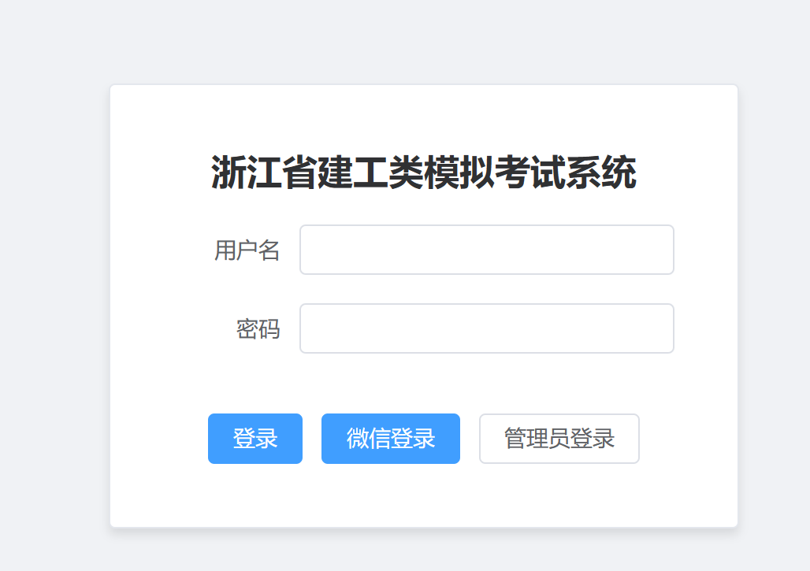
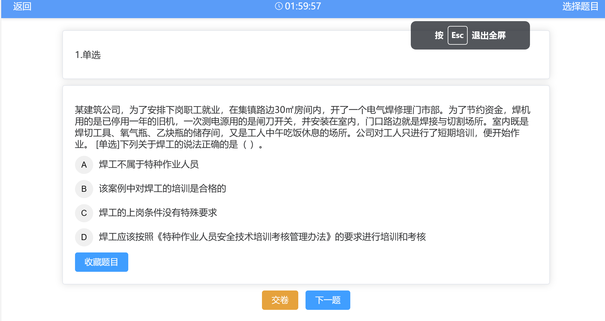
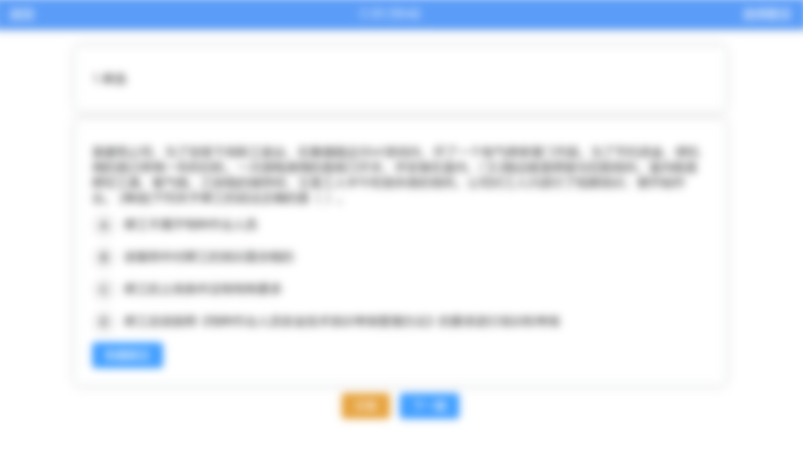

# 商单6-全栈-模拟考试系统

## 介绍

网页（PC+手机）+ 后端 + 后台

1. springboot + vue
2. 必须绑定微信登录
3. 后台需开通账户，设置时限等
4. 考试错题，收藏，历史记录
5. 随机考题

## 难点
1. 微信登录
   1. 微信公众号设置
   2. 微信公众号和服务器之间首次沟通的鉴权api
   3. base_api和userinfo_api
2. 随机考题时采用了水库抽样，固定了数量，每个被保留的概率都相同
3. 页面防截图，复制（使用了NoPrint.js）

## 图片

