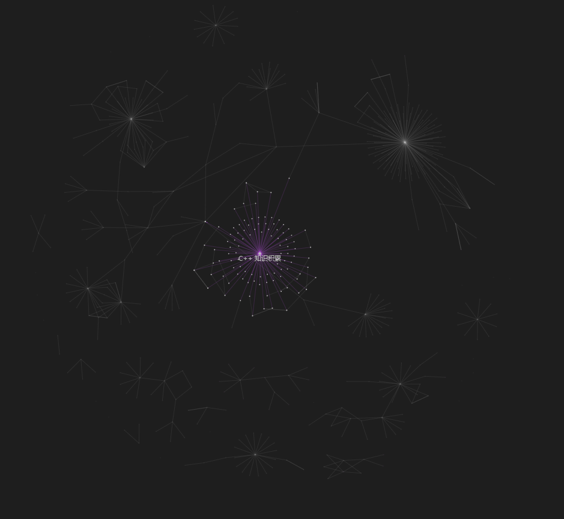

# README

Learning Tree

This is my notes blog. It includes:

1. Reading notes
2. Compuer
    1. self meditation
    2. Compiler
    3. server & internet
       1. Computer Network
       2. domain, website and http(s)
       3. AZURE
       4. Tencent
       5. Cloud server knowlege accumulation
    4. Agent System
    5. computer language
        1. Hypertext
           1. css
           2. html
           3. sass
        2. Bash
           1. linux Bash
           2. git
           3. npm
           4. windows command
        3. C++
        4. CSharp
        5. Java
        6. JavaScript and TypeScript
        7. Markdown
        8. Programming language
           1. ada & smalltalk
           2. haskell & prolog
        9. Python
    6. build model
    7. front end
       1. Tree of front-learning route
       2. Vue
       3. nodejs
    8. back end
       1. SpringBoot
    9. AI
       1. Building Environment
       2. Computer Vision
          1. class recognize
          2. pose detection
       3. AI algorithm
    10. database
        1.  SQL
            1.  relational database
            2.  sql
            3.  mysql
        2.  NoSQL
            1.  NDB (Nonrelational Database)
                1.  graph database - Neo4j
                2.  key-value database - Redis
            2.  ANDB (Advanced Nonrelational Database)
                1.  BigTable
                2.  Hadoop
        3.  Data warehouse
            1.  basic info
            2.  multidimensional mode
            3.  tabular mode
    11. Algorithm
    12. small knowlege accumulation
    13. Game
    14. Blog
    15. CTF
    16. Docker
    17. Leetcode
    18. plugin development
    19. PS
    20. Personal thinking
3.  Other subjects
    1.  Digital Technology in Business Communication
    2.  English
    3.  Maths
    4.  Physics
    5.  Statistics
4. Some idea of Game Design