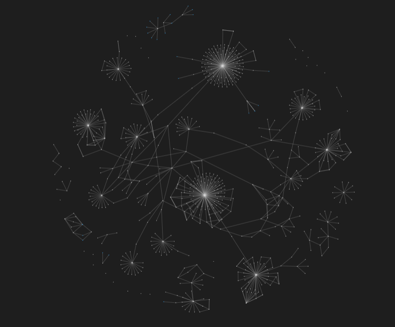

# README

Transfer to [https://liuyifei.tech/share/notes](https://liuyifei.tech/share/notes)

----------------------------------------------------

Learning Tree Graph

This is my notes blog. It includes:

1. Reading notes
2. Compuer
    1. self meditation
    2. Computer Theory and Operating System
    3. Compiler
    4. server & internet
       1. Computer Network
       2. Network attack and defense
       3. domain, website and http(s)
       4. AZURE
       5. Tencent
       6. Cloud server operation knowlege accumulation
       7. Server
          1. Nginx
          2. Server knowlege accumulation
    5. computer language
        1. CLT
           1. linux Bash
           2. windows command
        2. C
        3. C++
        4. CSharp
        5. Hypertext
           1. css
           2. html
           3. sass
        6. Java
        7. JavaScript and TypeScript
        8. Markdown
        9. Programming language
           1. ada & smalltalk
           2. haskell & prolog
        10. Python
        11. R
        12. Lua
        13. Go
        14. PHP
    6. Git
    7. 3D Modeling
    8. front end
       1. Tree of front-learning route
       2. Vue
       3. nodejs
    9. back end
       1. SpringBoot
       2. deployment
       3. mvn
       4. Swagger
       5. lombok
       6. Architecture
       7. Performance Test and Monitor
    10. desktop application development
       1.  QT
       2.  WPF
    11. AI
       1. Building Environment
       2. Computer Vision
          1. class recognize
          2. pose detection
       3. AI algorithm
       4. Python
    12. database
        1.  SQL
            1.  relational database
            2.  sql
            3.  mysql
        2.  NoSQL
            1.  NDB (Nonrelational Database)
                1.  graph database - Neo4j
                2.  key-value database - Redis
            2.  ANDB (Advanced Nonrelational Database)
                1.  BigTable
                2.  Hadoop
                3.  Hive
        3.  Data warehouse
            1.  basic info
            2.  multidimensional mode
            3.  tabular mode
    13. Big Data
        1.  Hadoop Advanced
        2.  Spark
    14. Algorithm
    15. small knowlege accumulation
    16. Game
        1.  Unity
        2.  UE
        3.  Game Design
        4.  VFX
    17. 计算机图形学
    18. Blog
    19. Docker
    20. InternetServiceArchitecture
    21. Web3
    22. Agent System
       1. Theory learning
       2. Jade
    23. Distributed Processing and Multi-threading
    24. Large-scale Enterprise Application
    25. Network Programming
        1.  API
            1.  RESTful
            2.  GraphQL
        2. socket
    26. Leetcode
    27. plugin development
        1.  VSCode
    28. PS
    29. Prompt Engineering
    30. Personal thinking
3.  Other subjects
    1.  Digital Technology in Business Communication
    2.  English
    3.  Maths
    4.  Physics
    5.  Statistics
4. Some idea of Game Design
