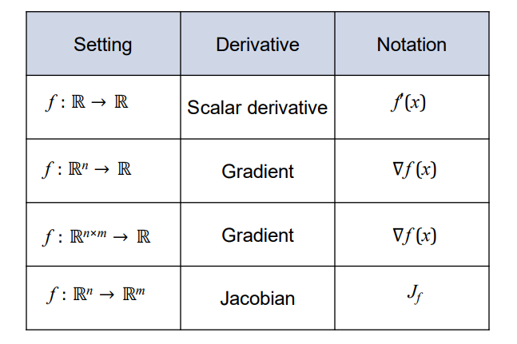
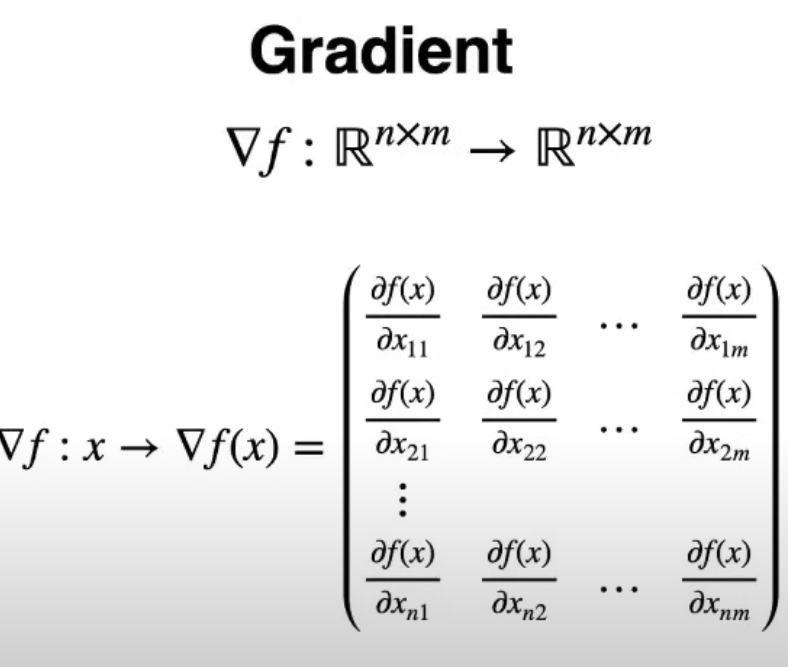
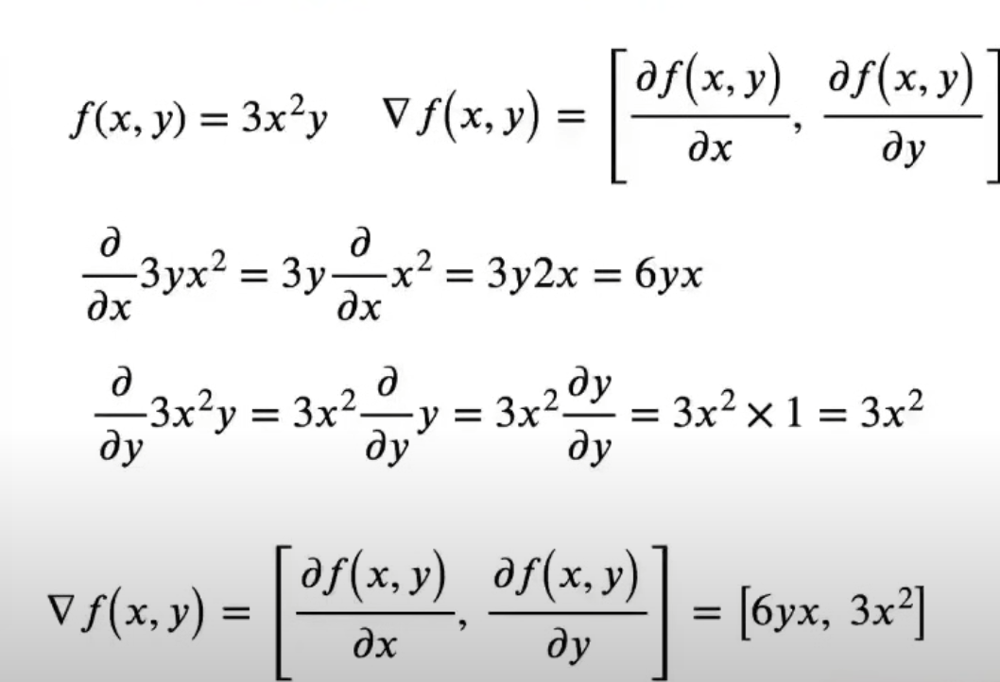
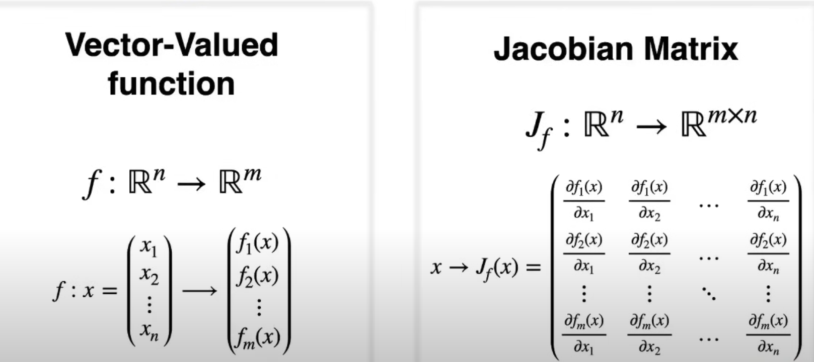
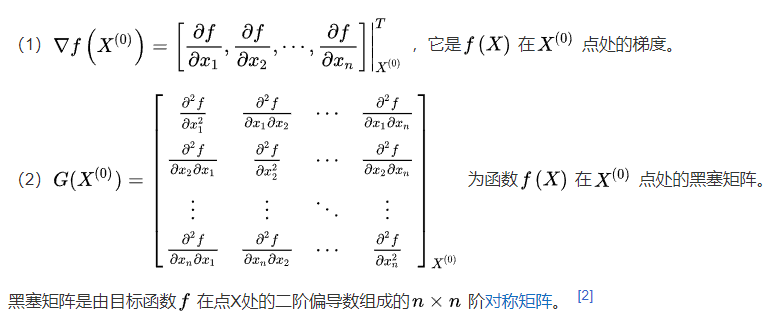

# 标量求导_梯度_Jacobian_Hessian_散度

## 1. 标量对向量求导

$$f(x) = x^2$$

$$f'(x) = 2x$$

## 2. 向量函数的梯度

即[标量方程对向量的导数](矩阵求导.md#标量方程对向量的导数)

## 3. 矩阵到标量函数的梯度
即对每个元素求导

$$f(X) = tr(X) = \sum_{i=1}^n\sum_{j=1}^m x_{ij}$$

$(\nabla f(X))_{ij} = \frac{\partial f}{\partial x_{ij}} = 1$

## 4. 雅可比

即[矩阵求导](矩阵求导.md)

## 5. 海森矩阵

其实就是二阶导数

## 6. 散度

divergence: $div f = \sum_{i=1}^n \frac{\partial f_i}{\partial x_i}$

