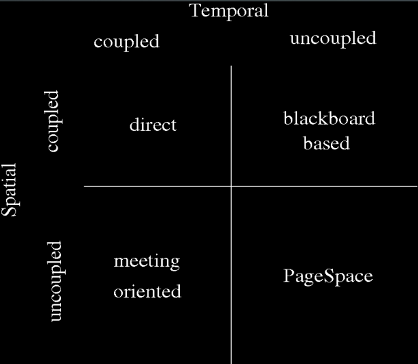

# Agent System

1. [agent definition](#agent-definition)
   1. [Popular definition](#popular-definition)
   2. [Generalized definition 广义定义](#generalized-definition-广义定义)
2. [unique properties of agents](#unique-properties-of-agents)
   1. [Agent action](#agent-action)
3. [definition of intelligence and how it is being achieved](#definition-of-intelligence-and-how-it-is-being-achieved)
4. [common properties of agents](#common-properties-of-agents)
5. [generic agent architecture](#generic-agent-architecture)
6. [statefull agent architecture](#statefull-agent-architecture)
7. [agent internal models](#agent-internal-models)
8. [internal architectures of agents: BDI, reactive, layered](#internal-architectures-of-agents-bdi-reactive-layered)
   1. [1. based on formal logic (BDI Belief Desire Intention)](#1-based-on-formal-logic-bdi-belief-desire-intention)
      1. [Pros and Cons](#pros-and-cons)
      2. [Example: BDI - Belief Desire Intention](#example-bdi---belief-desire-intention)
   2. [2. Reactive decision making](#2-reactive-decision-making)
      1. [Architektura mikrotez (subsumption) 微型论文架构（包容） microthesis](#architektura-mikrotez-subsumption-微型论文架构包容-microthesis)
   3. [3. Layered Architectures (hybrid approach)](#3-layered-architectures-hybrid-approach)
      1. [Vertical architecture](#vertical-architecture)
         1. [Single-pass:](#single-pass)
         2. [double-pass (dwuprzebiegowa)](#double-pass-dwuprzebiegowa)
      2. [Horizontal Architecture](#horizontal-architecture)
9. [comparison of BDI and reactive approaches](#comparison-of-bdi-and-reactive-approaches)
10. [structure of an agent application](#structure-of-an-agent-application)
11. [taxonomy (分类法) of agent environments](#taxonomy-分类法-of-agent-environments)
12. [representation of environment percepts](#representation-of-environment-percepts)
13. [多代理系统 - 代理间交互协议](#多代理系统---代理间交互协议)
    1. [协议的定义](#协议的定义)
14. [communication, coordination and cooperation](#communication-coordination-and-cooperation)
15. [cooperation strategies](#cooperation-strategies)
    1. [cooperation protocal application](#cooperation-protocal-application)
    2. [任务分配机制](#任务分配机制)
16. [decomposition strategies](#decomposition-strategies)
17. [contract net](#contract-net)
    1. [Proponent's perspective (manager) 提议人视角 (管理者)](#proponents-perspective-manager-提议人视角-管理者)
    2. [The bidder's perspective (contractor) 投标人视角 (承包商)](#the-bidders-perspective-contractor-投标人视角-承包商)
    3. [其他](#其他)
18. [blackboard 董事会](#blackboard-董事会)
    1. [特点：](#特点)
19. [negotiations and negotiation sets](#negotiations-and-negotiation-sets)
    1. [过程](#过程)
    2. [谈判的基本特点](#谈判的基本特点)
20. [properties of ideal negotiations](#properties-of-ideal-negotiations)
21. [negotiations stability](#negotiations-stability)
    1. [negotiation sets](#negotiation-sets)
22. [taxonomy of coordination models](#taxonomy-of-coordination-models)
    1. [Direct](#direct)
    2. [Meeting oriented](#meeting-oriented)
    3. [Blackboard](#blackboard)
    4. [PageSpace](#pagespace)


## agent definition
### Popular definition
A computational entity (program, robot) that can be seen as capable of perceiving the state of its environment and influencing that environment, while being autonomous in the sense that at least some of its behavior is dependent on its experience ( knowledge).
一种计算实体（程序、机器人），可以被视为能够感知其环境状态并影响该环境，同时在至少某些行为取决于其经验（知识）的意义上是自主的。

### Generalized definition 广义定义
An intelligent agent is an IT system (program, robot) embedded in the environment, capable of autonomous and make intelligent decisions about your actions within this environment in order to fulfill its purpose mission.
智能代理是嵌入环境中的 IT 系统（程序、机器人），能够自主地对您在此环境中的行为做出智能决策，以完成其目的任务。

## unique properties of agents
### Agent action
It is assumed that the agent's actions are characterized by:
Intelligence (in the sense of rationality and flexibility)

Rationality and flexibility are achieved by：
* Inference 推理 （deduction）
* Planning 规划
* Learning 学习
* Trouble shooting 故障排除 (problem solving)
* Making decisions 决策

## definition of intelligence and how it is being achieved
Intelligence (in terms of rationality and elasticity) is achieved by having following behaviours:

这个不如上面那条，上面是原文，下面这个以防遇见选择题：
* Learning
* Conclusions from experience
* Planning
* Problem solving and Decision making

## common properties of agents
1. Autonomy 自治（自力更生）
2. Proactivity 主动性（发起行动的能力）
3. Mobility 移动性（改变位置的能力——在使用移动代理的系统中）(usually but not always) 注意：代理不是病毒 -- 移动性需要执行环境的支持。

## generic agent architecture

```
observation  <- percepty
decision
action       -> effectors
```

## statefull agent architecture


## agent internal models
? 和下面不一样吗

## internal architectures of agents: BDI, reactive, layered
### 1. based on formal logic (BDI Belief Desire Intention)
* The first, most traditional approach

* It assumes that it is possible to obtain the agent's intelligent behavior by presenting the characteristics of its environment and the principles of the desired behavior in a symbolic form (logical formulas), and then performing syntactical manipulations of this representation (deduction, proving).
  它假设可以通过以符号形式（逻辑公式）呈现其环境特征和期望行为的原则，然后对该表示进行句法操作（演绎、证明）来获得智能体的智能行为。

#### Pros and Cons
Pros：
It is a very elegant solution.

Cons：
1. Not practical solution - useless for real complex environments
2. Lacking the guarantee of 
   1. proper reaction
   2. reaction on time
3. It is hard to find a mapping from percepts to language of formal logic.
   in other words: Very difficult to map real world to percepts.

#### Example: BDI - Belief Desire Intention
It is worth using in very simple environments.


### 2. Reactive decision making
An antidote to the imperfection of using formal logic 使用形式逻辑的不完美之处的解毒剂 (It is opposing to the formal logic architecture):
* Resignation from environment representation
* Resignation from agent behaviour in symbolic representation
* Resignation from syntactical manipulations
* Assumption that intelligent behaviour is a result of interaction with an environment, cannot be created from void
* Assumption that intelligent behaviour is a result of interaction of many simple behaviours and actions

* 放弃环境表征 
* 放弃符号表示中的代理行为 
* 放弃句法操作 
* 智能行为是与环境交互的结果，不能从空虚中创建 
* 假设智能行为是许多简单交互的结果 行为和行动

#### Architektura mikrotez (subsumption) 微型论文架构（包容） microthesis
两大特点：
1. Implementation of the agent's decision-making process in the form of a set of behaviors focused on the implementation of a specific action - functions that process percepts continuously and signal the possibility of performing actions associated with them
   以一系列行为的形式实施代理人的决策过程，这些行为侧重于特定行动的实施 - 处理连续感知并发出执行与其相关联的行动的可能性的功能
2. The possibility of simultaneously signaling the possibility of performing a behavior by many functions requires the implementation of the mechanism → prioritization of behaviors.
   通过许多功能同时发出执行行为的可能性的可能性需要实施机制 → 对行为进行优先级排序。

### 3. Layered Architectures (hybrid approach)
* 尝试将决策过程分解为专门的子系统 specialized subsystems
* 子系统组织成层次结构层，它们之间有相互作用 interacting
* 至少两层
  * Reactive layer 反应性
  * Proactive layer 自主性

#### Vertical architecture
Each layer is connected with each other.
##### Single-pass:
It’s similar to big corporation decision making scheme. Decisions on each layer are made based on summed data from previous layers. There is no way of correcting a decision that the higher layer made (from lower layer).
它类似于大公司的决策方案。 每一层的决策都是基于前几层的汇总数据做出的。 没有办法纠正更高层（从较低层）做出的决定。


##### double-pass (dwuprzebiegowa)
It’s similar to a military decision making scheme. Information is represented to next layers in more and more synthetic form. Two-pass gives a way of correcting a decision made in the lower layer based on the information from the higher level.
这类似于军事决策方案。 信息以越来越多的合成形式呈现给下一层。  Two-pass 给出了一种根据来自较高层的信息来纠正较低层做出的决定的方法。


#### Horizontal Architecture
Layers are placed independently - when the data goes through a layer it goes directly to the decision module that decides on a reaction, so it needs to be very fast.
层是独立放置的——当数据通过一个层时，它会直接进入决定反应的决策模块，因此它需要非常快。


## comparison of BDI and reactive approaches
Formal logic:
* very elegant approach, looks good in literature
* worth for very simple cases (not very complex environments)
* Lacking the guarantee of 
   1. proper reaction
   2. reaction on time
* Not practical solution - useless for real complex environments
* It is hard to find a mapping from percepts to language of formal logic.

Reactive:
It is an antidote to the imperfection of using formal logic
* instead of complex reasoning, the stimulus→response model 
* simple implementation (even for very complex environments)
* combining percepts with appropriate reactions is not a problem
* the possibility of a very large decomposition of the decision-making process - a guarantee of making a decision on time, but...
* ... the decision does not always have to be optimal (something for something)
* if many decisions can be made at the same time (e.g. microthesis) - necessity using an algorithm that prioritizes them


## structure of an agent application


## taxonomy (分类法) of agent environments
1. **Available - unavailable**：（可访问性）accessible
   Accessibility is defined as ability to sense the whole, complete and precise state of the whole environment. Most environments will be inaccessible by this definition. 
  可用（不可用）——可访问性被定义为感知整个环境的整体、完整和精确状态的能力。 根据此定义，大多数环境将无法访问。人类世界和互联网就是不可访问的例子。
2. **Deterministic – non-deterministic**: （确定性）
   One action will result in only one (and always the same) way.
    当代理采取的给定操作总是带来相同结果且重复任意次数时，环境是确定性的 - 对于代理执行的操作所达到的环境状态没有不确定性。（人类世界具有很强的不确定性）
3. **Contextual - non-contextual**: （语义性）
   Actions made are related to previous actions.
   当代理采取的每个动作都与之前执行的动作无关时，环境是上下文无关的（情节）。 智能体仅根据环境的当前状态（要执行的任务）选择要执行的动作，而不考虑与先前或未来动作（及其结果）的可能交互。
4. **Static - dynamic**: （静态，动态）
   There are no changes on environment other than caused by an agent.
   除了代理引起的，环境没有变化。
5. **Discrete - continuous**：（离散，连续）
   In a discrete environment, there is a fixed, finite number of possible states assumed by the environment (perceived by the agent) and a finite number of different actions (and their resulting states) that can be performed by the agent.
   在离散环境中，存在固定的、有限数量的环境假定的可能状态（由代理感知）和有限数量的可以由代理执行的不同动作（及其结果状态）。
   （比如棋盘游戏）

最复杂的环境将是不可访问的unavailable、不确定的non-deterministic、上下文相关的Contextual、动态dynamic的、连续的continuous。
需要注意的是，对于大多数真实环境，环境的确定性并不是问题的显着简化，因为它的不可用性将在智能体对环境的感知中起决定性作用。

## representation of environment percepts

```
observation  <- percepty
decision
action       -> effectors
```
percepts - the methods by which an agent can receive the environment.
efectors - the methods by which agent can influence the environment

## 多代理系统 - 代理间交互协议
1. communication
2. coordination 协调
3. cooperation
4. Contract net
5. Blackboard system 董事会

### 协议的定义
1. Formalized message sequences  形式化的消息序列
2. Where agents have divergent goals, protocols aim to maximize the utility of the agents. 当代理人有不同的目标时，协议旨在最大化代理人的效用。
3. For agents with converging (cooperative) goals or solving a common problem, protocols are used to ensure global coordination of the system without interfering with the agent's autonomy.对于具有收敛（合作）目标或解决共同问题的代理，协议用于确保系统的全局协调而不干扰代理的自治。

通用语言和世界描述（实体、概念）：Ontology

## communication, coordination and cooperation
见negotiation sets


## cooperation strategies
The basic strategy shared by most collaboration protocols is to **decompose** a task into **subtasks**. The divide-and-conquer approach may allow the use of simpler, less powerful agents. There is a problem of place and type of decomposition:
大多数协作协议共享的基本策略是将任务分解为子任务。 分而治之的方法可能允许使用更简单、功能更弱的代理。 

见下一条 decomposition strategies

### cooperation protocal application
Main goals and desirable properties of cooperation protocols:
* Setting a common goal
* Establishing a common task
* Avoiding conflict situations
* Maintaining common knowledge, state, etc.
* 设定共同目标
* 建立共同任务
* 避免冲突情况
* 维护共同知识、状态等。

### 任务分配机制
1. Market mechanisms (tasks are matched to agents by general agreement or mutual selection) 市场机制（任务通过一般协议或相互选择与代理匹配
2. Contract network
3. Agent planning (schedule)
4. Organizational structure (permanent task assignment)

## decomposition strategies

存在分解的位置和类型的问题：
1. Designer ↔ Online execution (decomposition and hierarchical planning) 设计器 ↔ 在线执行（分解和分层规划）
2. Spatial (according to the distribution and availability of resources and decision points) ↔ functional (according to agents' capabilities). 空间（根据资源和决策点的分布和可用性）↔ 功能（根据代理的能力）。

分解后，可以根据以下标准分配任务：

* Avoiding overloading of important resources 
* Agent capabilities 
* State of the art (an agent with a 'broad view' assigns tasks to other agents) 
* Task overlaps 
* Semantic or spatial distance (communication and synchronization costs) 
* Task prioritization (and possibly dynamic task reassignment)

* 避免重要资源超载
* 代理能力
* 最先进的技术（具有“广阔视野”的代理人将任务分配给其他代理人）
* 任务重叠
* 语义或空间距离（通信和同步成本）
* 任务优先级（以及可能的动态任务重新分配）

## contract net
Protocol of cooperative interaction focused on solving problems/tasks. Modeled according to the process used by companies (analogy to public procurement). The agent submitting the problem to be solved is called the proponent (in lit. manager) and the agent offering the solution is called the bidder (contractor)
专注于解决问题/任务的合作交互协议。 根据公司使用的流程建模（类似于公共采购）。 提交要解决的问题的代理人称为提议者（即经理），提供解决方案的代理人称为投标人（承包商）

### Proponent's perspective (manager) 提议人视角 (管理者)
* Announce the problem to be solved  公布待解决的问题
* Receiving and evaluating submitted proposals  接收和评估提交的提案
* Conclusion of a contract with the best bidder  与最佳投标人签订合同
* Receipt and use of results  成绩的接收和使用

### The bidder's perspective (contractor) 投标人视角 (承包商)
* Receiving a problem broadcast 收到问题广播
* Evaluate your own ability to solve the problem 评估自己解决问题的能力
* Response (resign or bid) 回应（辞职或竞标）
* Complete the task if a contract has been assigned 如果已分配合同，则完成任务
* Sending back the results 发回结果

### 其他
* 投标人和提议人的角色事先未知，也不是固定的
* 任务进一步分解的可能性：收到执行复杂任务合同的投标人可以将其分解并成为分包商提案的支持者
* 确保系统顺利下降（通过寻找其他承包商或分解）


## blackboard 董事会
比喻：“一群专家聚集在一块空黑板周围。 当有人在黑板上写下问题和初始数据时，问题解决就开始了。 专家会看板，当他们有什么可以提供的时候，他们会把它写在板上。这种额外的贡献可能允许另一位专家添加另一部分解决方案。 重复该过程，直到问题得到解决。”

### 特点：
1. Independence of expert knowledge
   1. Specialists are autonomous and operate independently of the configuration of other experts gathered at the board (sources of knowledge)
   2. 专家是自主的，独立于委员会中聚集的其他专家的配置（知识来源）
2. Variety of implementations - internal details of expert implementations are hidden. 多种实现 - 隐藏了专家实现的内部细节。
3. No restrictions on the form of entries on the board 板子上的条目形式没有限制
4. (but) A common language for presenting knowledge on the board. The choice between generality and precision. （但是）在白板上展示知识的通用语言。通用性和精确性之间的选择。
5. Event-oriented system
   1. Board events： Adding, deleting, changing the record
   2. External events： Experts write on the board the occurrence of events that they recognized / interpreted 专家在黑板上写下他们识别/解释的事件的发生
6. The need to stay in control
   1. a specialized component (a type of moderator allowing subsequent experts to speak)
   2. 一个专门的组件（一种允许后续专家发言的主持人）
7. Incremental development of solutions 解决方案的增量开发


## negotiations and negotiation sets
The situation where in agent systems individual agents have different goals often leads to a class of interactions called negotiations.
在代理系统中，各个代理具有不同目标的情况通常会导致一类称为协商的交互。

Negotiation is a process in which agents - each with an individual goal or task - work out a joint decision.
谈判是一个过程，在这个过程中，代理人——每个人都有自己的目标或任务——做出共同的决定。

In the negotiation process, agents first communicate their positions, which may be divergent.
They then try to reach an agreement by making concessions or looking for alternatives.
在谈判过程中，代理人首先传达自己的立场，可能会出现分歧。
然后他们试图通过做出让步或寻找替代方案来达成协议。

### 过程
1. Each agent broadcasts the names of the documents it needs.
2. Documents identified as common are assigned to one of the agents (for example, toss a coin). 
3. Each agent retrieves his documents by paying for them.
4. Agents share common documents with each other

1. 各agent广播自己需要的文件名。
2. 被识别为公共的文件被分配给其中一个代理人（例如，掷硬币） 
3. 每个代理人通过支付来检索他的文件。
4. 代理之间共享共同文件

### 谈判的基本特点
1. negotiation language
2. message exchange protocol
3. the agent's decision-making process, determining his position, possible concessions and criteria for the agreement 
   代理人的决策过程，确定他的立场，可能的让步和协议标准

## properties of ideal negotiations
1. Eefficiency (Performance)： the agent should not waste resources in reaching an agreement
2. Stability：the agreement reached should be binding on the agents. The adopted strategy should not encourage departure from the agreement. 达成的协议应对代理人具有约束力。 所采用的战略不应鼓励背离协议。
3. Simplicity: the negotiation mechanism should have low demand (calculations, bandwidth).
4. Dispersion 分散 (Distribution): decision-making should not be centralized
5. Symmetry 对称: not favoring any agent. 不偏袒任何代理人。

## negotiations stability
There are three domains in which the issue of negotiation stability occurs：谈判稳定性问题发生在三个领域：
* Profit domain 利润域
* Common state domain 公共状态域，
* Task domain 任务域。
已经讨论过的下载多个文件时的分工问题属于任务域。

任务域（面向任务）发生在代理有一组任务要执行时，执行任务所需的所有资源都可用，并且**代理可以独立执行任务**，而无需其他代理的帮助或阻碍。**但是，座席可以从共享任务中受益。**（在考虑联合文档检索算法的稳定性时，应考虑代理的策略。）
在所讨论的案例中，代理行为的最优策略是公布所需的真实文档集，而不管其他代理在此事中采用的策略以及其他代理所需的文档。 由于没有偏离此声明（以及由此产生的义务）的动机，因此**该算法是稳定的**。
针对特定案例（应用程序）和代理操作环境制定协商策略。
“最佳策略”没有通用的处方。 但是，有两种通用方法。
1. 第一种方法适用于使用形式逻辑表达的言语行为的逻辑代理
2. 第二种方法的基础是代理人的经济理性假设。 此外，代理人的集合必须很小，代理人必须使用共同的语言、共同的抽象规则（问题描述）并且必须制定出共同的解决方案（交易）。
   常见的解决方案是以满足所有代理人目标的行动计划的形式出现。解决方案对代理人的效用（利润）是代理人的目标价值与实现目标的成本之间的差值。 每个代理人都试图最大化他的利润
   `<T, A, C>`, task, agents, cost_function 
   `Uk(d) = c(Tk) – c(dk)`

### negotiation sets
上面提到 代理人的经济理性假设 时，
The basis of the second approach is the assumption of economic rationality of agents. In addition, the set of agents must be small, the agents must use a common language, common rules of abstraction (problem description) and must work out a common solution (deal).

agent k, protocal d
`Uk(d) = c(Tk) – c(dk)`

当代理人无法达成协议时，就会出现冲突协议 D。
当 d > D 时，协议 d 是个体理性的。当没有协议 d' > d 时，协议 d 是帕累托最优(pareto optimal)的。
**所有个体理性和帕累托最优协议的集合构成谈判集 NS**。 三种情况是可能的：
The set of all individually rational and pareto-optimal agreements constitutes the set of negotiations NS. 3 possibility:
1. Conflict: NS is empty.
2. Compromise: individually, the agent prefers to do the task himself, but because he is 'not alone' (participates in negotiations) he implements the worked out agreement. 妥协：作为个体，代理人更愿意自己完成任务，但因为他“并不孤单”（参与谈判），所以他会执行制定好的协议。
3. Cooperation: when all elements of the NS set are preferred by each of the agents for joint execution. 合作：当 NS 集合的所有元素都被每个代理首选联合执行时。

## taxonomy of coordination models


### Direct
Not practical for set of agents
* Communication (usually) point-to-point
* Explicitly named recipients
* Mutual agreement on:
  * Communication protocol
  * Data formats
* It usually implies temporal coupling - communication is synchronized 它通常意味着时间耦合——通信是同步的
* Not very good at extensive web applications 不太擅长广泛的网络应用程序

### Meeting oriented
* Interact within a meeting without explicitly naming partners
* Known a priori meeting points 已知的先验交汇点
* Meeting points open permanently or as needed 会面点永久开放或根据需要开放
  * Meeting points can be treated as 'synchronizing objects' and communication can be compared to the 'event generator / listener' model
  * 会面点可以被视为“同步对象”，通信可以与“事件生成器/侦听器”模型进行比较
* Agents must at least have a common knowledge of rendezvous point names 代理人必须至少对会合点名称有共同的了解

### Blackboard
* Shared data spaces used as message repositories (read/write)
* Time is not coupled
* Because the agents must agree on common message IDs, the communication is spatially coupled
* Most often the tables are local to the environment node (avoiding scalability issues)

### PageSpace
sth like tuplespace: 不同agent询问同一个模板tuple，可能得到的结果不一样，虽然模板都回答存在。
Extension of blackboard based
More than one board in different places synchronised with each other

1. Tuple spaces (repositories).
2. Access via associative mechanisms (incomplete pattern match) 通过关联机制访问（不完整的模式匹配）
3. Development of the array model
4. Full temporal and spatial separation
