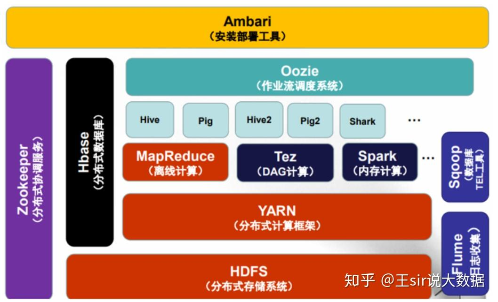
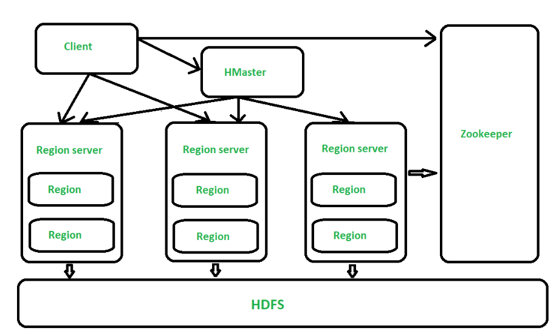

# HadoopHiveHBaseZookeeper关系

## 结构

## Quara解释初步了解
Hadoop - 是一种处理大数据的技术/方法/框架。

HBase - 是一个建立在 HDFS（hadoop 分布式文件系统，Hadoop 的文件系统和核心组件）之上的 NoSQL 数据库。需要Zookeeper管理。

Hive - 是 Hadoop 的一个生态系统/组件，类似于 SQL 来处理大部分结构化数据。

Pig - 是 Hadoop 的一个生态系统/组件，它是一种脚本语言。

Zookeeper - 是 Hadoop 的生态系统/网络组件，集成了 Hadoop 中的所有生态系统/组件。

查询：使用 Hadoop 从数据库 SQL Server/Db2 中的员工表中找出员工的最高工资。

解决方案： 处理步骤如下：

1.使用Hive查询语言创建Hive表，类似于DB2中的员工表。

2. 将数据从DB2导入到Hive表（数据驻留在HDFS中）。

3. 编写 Pig 脚本或 Hive 查询，从可用的 hive 表中找出最高工资。

## HBase
