# Hadoop_VSCodeEnvvironment

1. [Link to remote server](#link-to-remote-server)
2. [Edit and compile a hadoop project](#edit-and-compile-a-hadoop-project)
   1. [Remider in pom.xml](#remider-in-pomxml)
3. [Additional plugin](#additional-plugin)
4. [Let's compile one to see](#lets-compile-one-to-see)


## Link to remote server

Prerequisite: you have ssh cmd in your PC. I think most of us already have it. Otherwise you can download [here](https://code.visualstudio.com/docs/remote/troubleshooting#_installing-a-supported-ssh-client).

**Plugin: Remote - SSH**
1. Download plugin

  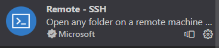

2. Click add->Input cmd->Enter->Select ssh conf file

    copy tip:
    ```
    ssh ladaXX@lada.eti.pg.gda.pl -A
    ```
    
    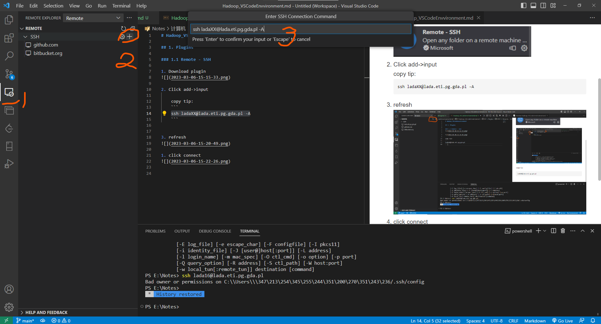

    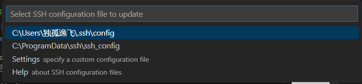

    If your path has non-English letters, you can create a config file in any place of your PC then choose `Settings specify a custom configuration file`. Then give the path of the config file. 
    
    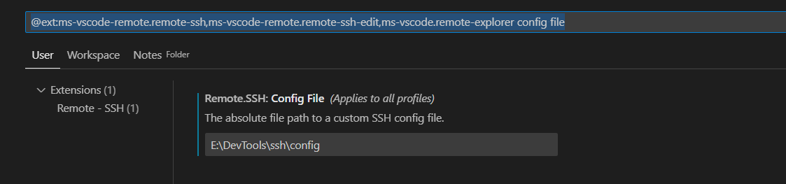

    After settings, if you open file, you will see this:

    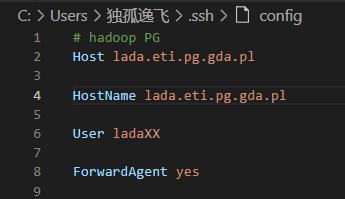

3. refresh

  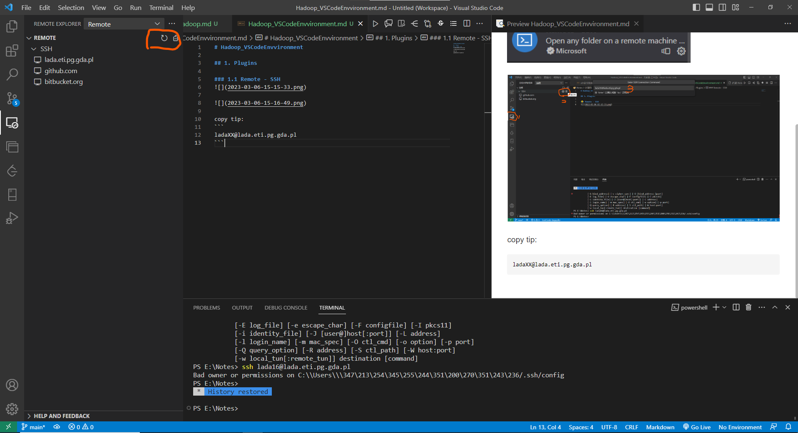

4. click connect

  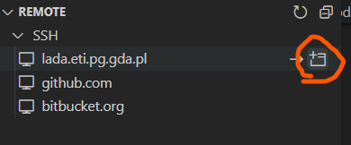

5. select linux

  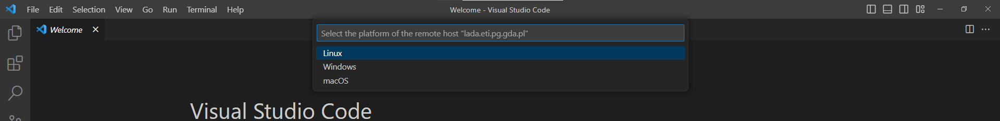

6. Enter password

  copy tip:
  ```
  PBigData
  ```

7. Waiting sometime until

  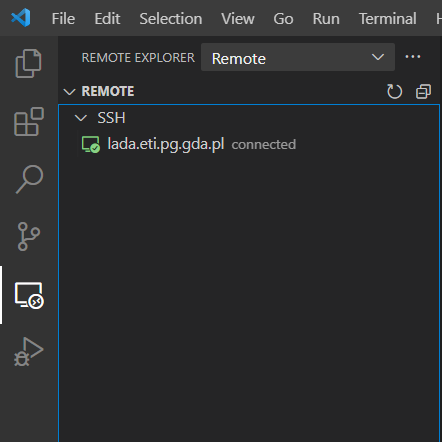

8. You can open folders by one of these two ways:
  - 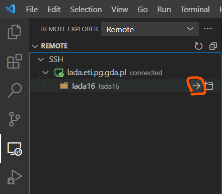
  - 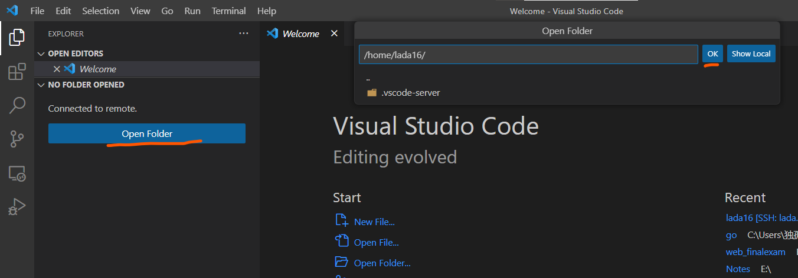
  - It will ask you to input password again. password: `PBigData`


OK, now you can see files and terminals. You can also create file or folder as you usually did in vscode.
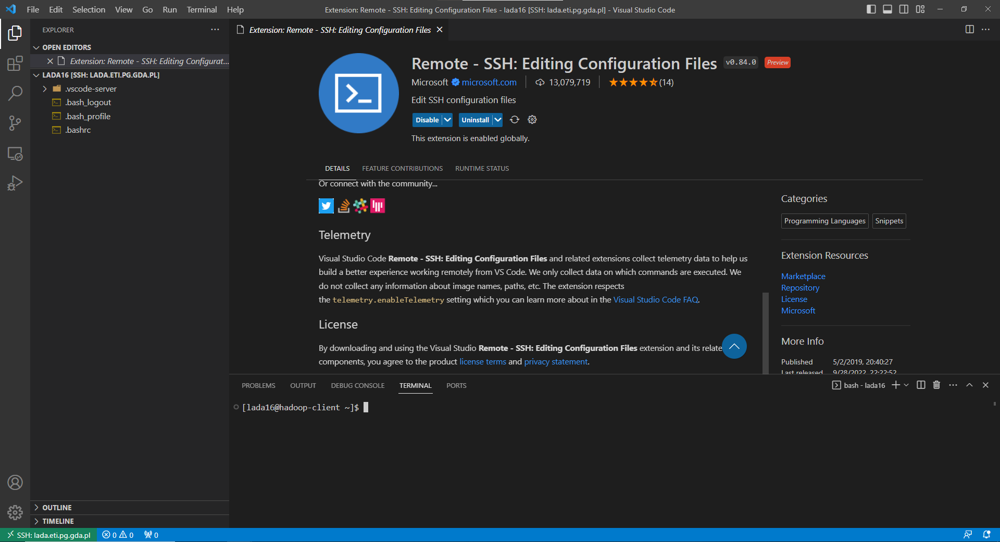

## Edit and compile a hadoop project

1. create Maven project by terminal (Here the name of project is `workcount` which specified by `-DartifactId=wordcount`)
    ```bash
    mkdir tutorial
    cd tutorial

    # create project
    mvn archetype:generate -DgroupId=mapreduce -DartifactId=wordcount -DarchetypeArtifactId=maven-archetype-quickstart -DinteractiveMode=false
    ```

    Now, the structure of folder looks like this:

    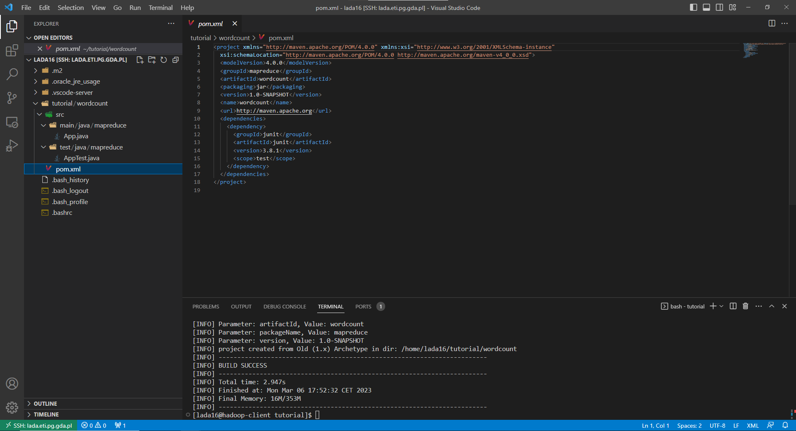

2. Other action of mvn is same as the following tutorial in dropbox:
   [Create a Maven project.doc](https://www.dropbox.com/sh/7pmhwa52zb1ddja/AADTRIQezsTSs5gMnyPXx9C0a/Labs/Lab1%262/Create%20a%20Maven%20project.doc?dl=0)


### Remider in pom.xml
1. This is the dependency of hadoop client
    ```
    <dependency>
        <groupId>org.apache.hadoop</groupId> 
        <artifactId>hadoop-client</artifactId> 
        <version>2.7.3</version> 
    </dependency>
    ```
2. You need specified the java version in `build`.
    1. Check the java version of our hadoop cluster
        ```bash
        java --version

        # my output is 1.8
        ```
    2. So you need this in your pom.xml
        ```xml
        <build>
            <plugins>
              <plugin>
                <groupId>org.apache.maven.plugins</groupId>
                <artifactId>maven-compiler-plugin</artifactId>
                <version>3.8.1</version>
                <configuration>
                  <source>1.8</source>
                  <target>1.8</target>
                </configuration>
              </plugin>
            </plugins>
        </build>
        ```
3. Whole version of pom.xml:
    ```xml
    <project xmlns="http://maven.apache.org/POM/4.0.0" xmlns:xsi="http://www.w3.org/2001/XMLSchema-instance"
      xsi:schemaLocation="http://maven.apache.org/POM/4.0.0 http://maven.apache.org/maven-v4_0_0.xsd">
      <modelVersion>4.0.0</modelVersion>
      <groupId>mapreduce</groupId>
      <artifactId>wordcount</artifactId>
      <packaging>jar</packaging>
      <version>1.0-SNAPSHOT</version>
      <name>wordcount</name>
      <url>http://maven.apache.org</url>
      <dependencies>
        <dependency>
          <groupId>org.apache.hadoop</groupId> 
          <artifactId>hadoop-client</artifactId> 
          <version>2.7.3</version> 
        </dependency>
        <dependency>
          <groupId>junit</groupId>
          <artifactId>junit</artifactId>
          <version>3.8.1</version>
          <scope>test</scope>
        </dependency>
      </dependencies>
      <build>
        <plugins>
          <plugin>
            <groupId>org.apache.maven.plugins</groupId>
            <artifactId>maven-compiler-plugin</artifactId>
            <version>3.8.1</version>
            <configuration>
              <source>1.8</source>
              <target>1.8</target>
            </configuration>
          </plugin>
        </plugins>
      </build>
    </project>
    ```

## Additional plugin
Now you may find you cannot have code hints. If you want to code locally then upload to remote, you can skip here. But if you want to code remotely, you can download plugins of java in remote server.

For example, I download this one:

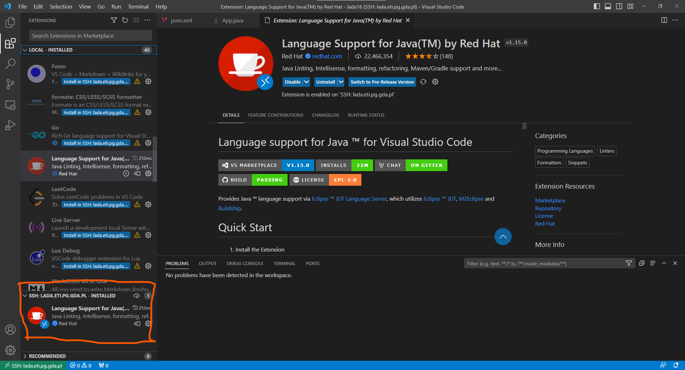

You can click `install in SSH:XXX` to install it in remote server.

Now, you have all. You can have code hints or ctrl + click to open any package to see details.

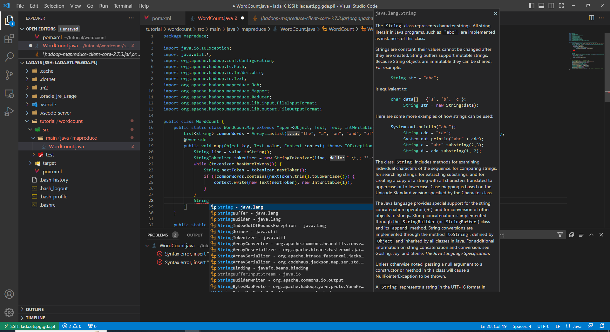

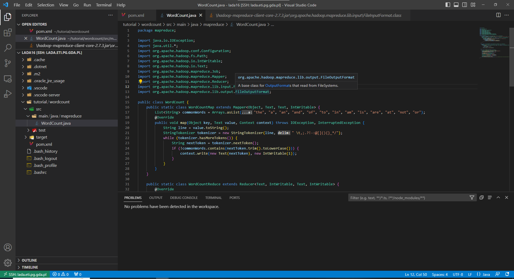

## Let's compile one to see
```bash
mvn clean package -Dmaven.test.skip=true
```

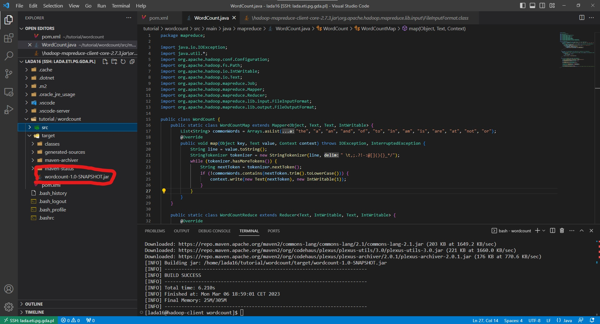

```bash
hadoop jar ./target/wordcount-1.0-SNAPSHOT.jar mapreduce.WordCount /user/Liu/132.txt /user/lada16/out

hdfs dfs -cat /user/lada16/out/part*
```
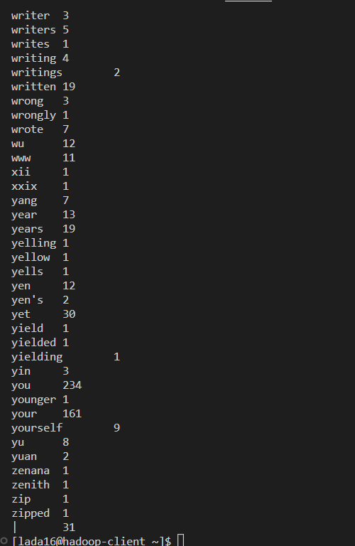


