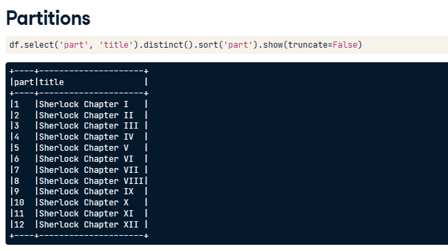
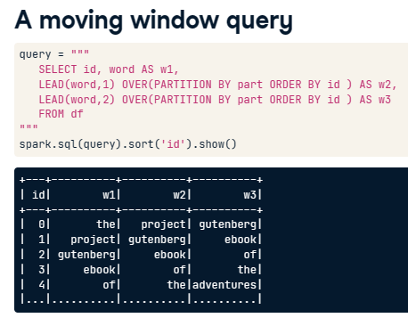
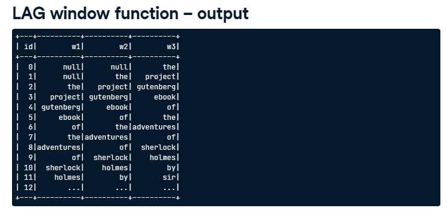
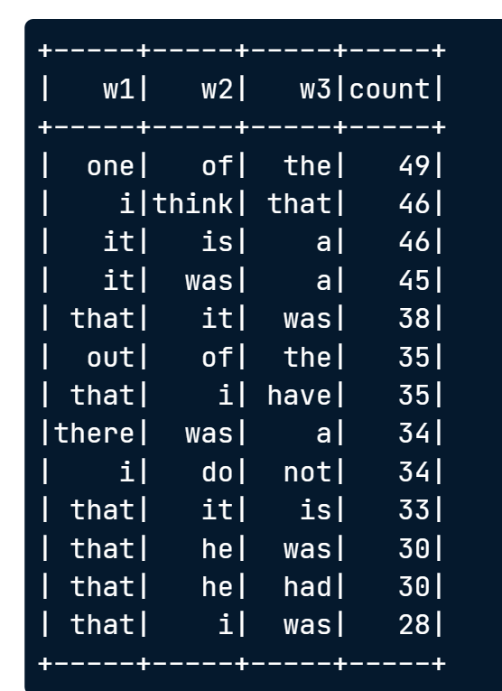

# MovingWindowAnalysis

## see paritions
```python
df.select('part', 'titie').distinct().sort('part').show(truncate=False)
```



## moving window query

```python
query = """
	SELECT id, 
	word AS w1,
	LEAD(word, 1) OVER(PARTITION BY part ORDER BY id) AS w2,
	LEAD(word, 2) OVER(PARTITION BY part ORDER BY id) AS w3,
	FROM df
"""
spark.sql(query).sort('id').show()
```



## LAG window function

lead是向后，lag是向前

```python
lag_query = """
	SELECT id, 
	LAG(word, 2) OVER(PARTITION BY part ORDER BY id) AS w1,
	LAG(word, 1) OVER(PARTITION BY part ORDER BY id) AS w2,
	word AS w3,
	FROM df
	ORDER BY id
"""

spark.sql(lag_query).show()
```



```python
lag_query = """
	SELECT id, 
	LAG(word, 2) OVER(PARTITION BY part ORDER BY id) AS w1,
	LAG(word, 1) OVER(PARTITION BY part ORDER BY id) AS w2,
	word AS w3,
	FROM df
	WHERE part=2
```

## Repartition
repartition()

## Window function sql as subquery

```python
query3agg = """
SELECT w1,w2,w3,COUNT(*) as count FROM (
	SELECT
	word AS w1,
	LEAD(word, 1) OVER(PARTITION BY part ORDER BY id) AS w2,
	LEAD(word, 2) OVER(PARTITION BY part ORDER BY id) AS w3,
	FROM df
)
GROUP BY w1,w2,w3
ORDER BY count DESC
"""
spark.sql(query3agg).show()
```




找出最长的3-tuples
```python
query3agg = """
SELECT w1,w2,w3,length(w1) + length(w2) + length(w3) as length FROM (
	SELECT
	word AS w1,
	LEAD(word, 1) OVER(PARTITION BY part ORDER BY id) AS w2,
	LEAD(word, 2) OVER(PARTITION BY part ORDER BY id) AS w3,
	FROM df
	WHERE part <> 0 and part <> 13
)
GROUP BY w1,w2,w3
ORDER BY length DESC
"""
spark.sql(query3agg).show()
```