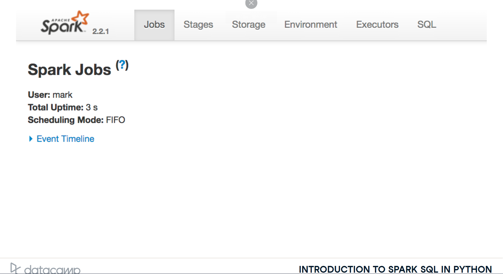
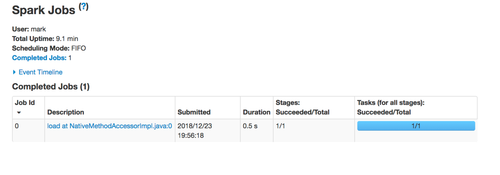
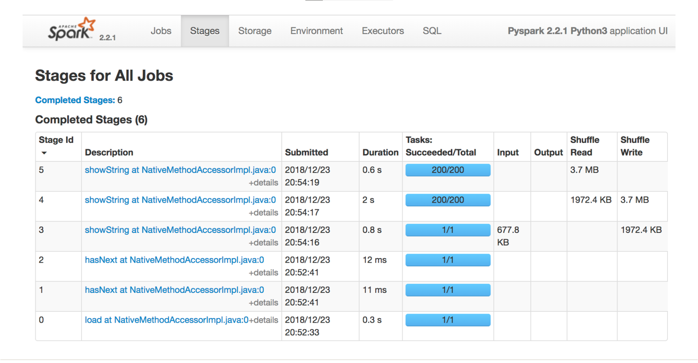
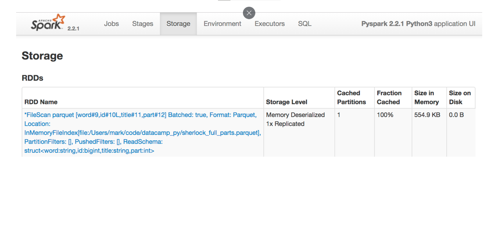
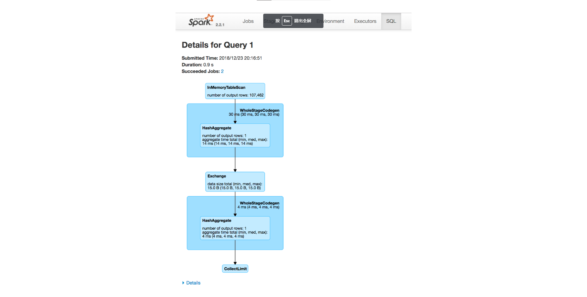

# SparkUI

## Use the Spark UI inspect execution
* **Spark Task** is a unit of execution that runs on a single cpu
* **Spark Stage** a group of tasks that perform the same computation in parallel, each task typically running on a different subset of data
* **Spark Job** is a computation triggered by an action, sliced into one or more stages.

## Jobs tab

## Stage tab

比如一个sqlquery用到了多个stage，就会在这里显示出多个stage。

## Storage tab

Shows where data partitions exist
* in memory
* or on disk
* across the cluster
* at a snapshot in time

## SQL tab
