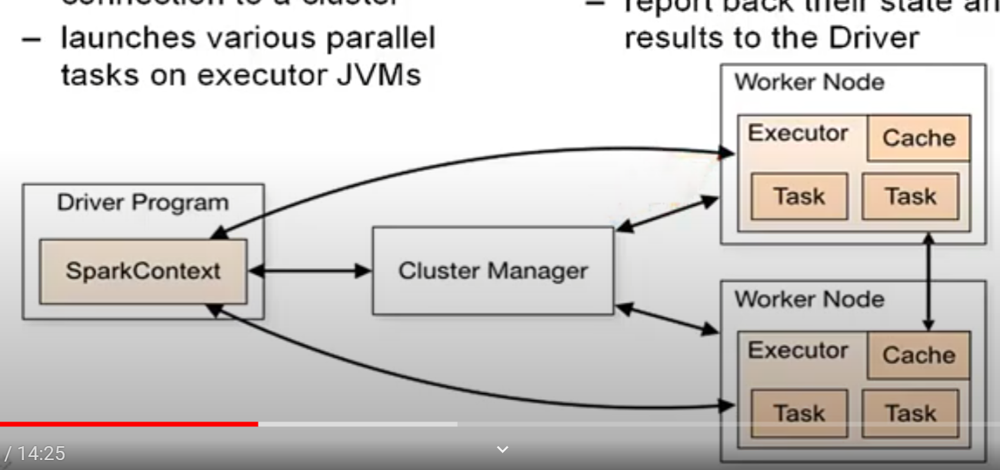

# Spark

## 结构

## 系统介绍-老师lecture
1. [Spark简介](Spark简介.md)

## 系统学习
注意教程里案例的spark变量其实SparkSession的实例。系统学习2里有提过。
1. [pyspark基础](pyspark基础.md)
2. [MovingWindowAnalysis](MovingWindowAnalysis.md)
3. [Caching](Caching.md)
4. [SparkUI](SparkUI.md)
5. [Spark_catalog_operations](Spark_catalog_operations.md)
6. [Logging](Logging.md)
7. [QueryPlans](QueryPlans.md)
8. [ExtractTransformSelect](ExtractTransformSelect.md)
9. [Creating feature data for classification](CreatingFeatureDataForClassification.md)
10. [Text classification](TextClassification.md)

## 系统学习2

### Getting to know PySpark
1. [SparkContext连接cluster](连接cluster.md)
2. [DataFrame—pandas-structure](DataFrame.md)
3. [read其他结构的数据](read其他结构的数据.md)

### Manipulation data
1. [创建列](创建列.md)
2. [filter数据](filter数据.md)
3. [select](select.md)
4. [groupBy和agg](groupBy和agg.md)
5. [join](join.md)

### Machine Learning Pipelines
1. [Transformers and Estimators](Transformers_Estimators.md)
2. [数据类型_cast](数据类型_cast.md)
3. [string的处理_one-hot-vector](string的处理_one-hot-vector.md)
4. [VectorAssembler](VectorAssembler.md)
5. [Pipeline](Pipeline.md)
6. [使用pipeline来Transform数据](使用pipeline来Transform数据.md)

### model tuning and selection
1. [Logistic Regression](Spark_LogisticRegression.md)
2. [Cross validation](CrossValidation.md)
3. [Evauator](Evaluator.md)
4. [grid](grid.md)
5. [fit](fit.md)
6. [预测_transform和评估模型_evaluate](预测_transform和评估模型_evaluate.md)

## 系统学习3
1. [训练和预测](过时的pyspark_mllib.md)
2. [classification](classification.md)
3. [cluster](kmeans.md)

## 系统学习4-数据清理
1. [schema_StructType_StructField](schema_StructType_StructField.md)
2. [不可变性和惰性处理](不可变性和惰性处理.md)
3. [parquet](parquet.md)
4. [DataFrame](DataFrame.md)
5. [分区和ID和惰性处理](分区和ID和惰性处理.md)
6. [拆分对象和提高导入性能](拆分对象和提高导入性能.md)
7. [配置spark_conf_get()](配置spark_conf_get.md)
8. [性能优化](性能优化.md)
9. [pipeline流水线](pipeline流水线.md)

## 系统学习5
1. [模型](模型.md)

## 系统学习6-机器学习
1. [DesicionTree](DesicionTree.md)
2. [LogisticRegression](LogisticRegression.md)
3. [Bucketizer](Bucketizer.md)
4. [Regularization](Regularization.md)

## 系统学习7-推荐引擎
1. [什么是推荐引擎](什么是推荐引擎.md)
2. [推荐引擎类型和评分类型](推荐引擎类型和评分类型.md)
3. [ALS算法](ALS算法.md)

## databrick notebook 系统学习spark
1. [dbc_spark_tutorial](./dbc_spark_tutorial.html)
2. [dbc_word_count](./dbc_word_count.html)

## 案例
[rdd案例_创建_MapReduceCombineSort](rdd案例_创建_MapReduceCombineSort.md)

## 积累
1. [%在query中的使用](%在query中的使用.md)
2. [ListTables](ListTables.md)
3. [registerTempTable](registerTempTable.md)
4. [first](first.md)
5. [array_contains](array_contains.md)
6. [withColoumn](withColoumn.md)
7. [drop](drop.md)
8. [where函数的参数](where函数的参数.md)
9. [lit](lit.md)
10. [toPandas()](toPandas.md)
11. [sparksession.table()](sparksession_table.md)
12. [alias](alias.md)
13. [withColumnRenamed](withColumnRenamed.md)
14. [udf](udf.md)
15. [randomwSplit](randomwSplit.md)
16. [sc.parallelize](parallelize.md)
17. [sc.textFile](sc_textFile.md)
18. [getNumPartitions](getNumPartitions.md)
19. [map](map.md)
20. [flatMap](flatMap.md)
21. [map和flatMap直观对比](map和flatMap直观对比.md)
22. [collect](collect.md)
23. [take](take.md)
24. [reduceByKey](reduceByKey.md)
25. [sortByKey](sortByKey.md)
26. [countByKey_items](countByKey_items.md)
27. [createDataFrame](createDataFrame.md)
28. [dropDuplicates](dropDuplicates.md)
29. [printSchema](printSchema.md)
30. [describe基础统计](describe基础统计.md)
31. [过时的pyspark.mllib](过时的pyspark_mllib.md)
32. [Classification](Classification.md)
33. [HashingTF](HashingTF.md)
34. [kmeans](kmeans.md)
35. [提交pyspark任务](提交pyspark任务.md)
36. [字符串](字符串.md)
37. [ArrayType](ArrayType.md)
38. [WhenOtherwise](WhenOtherwise.md)
39. [monotonically_increasing_id()](monotonically_increasing_id.md)
40. [orderBy](orderBy.md)
41. [写为json](写为json.md)
42. [corr()](corr().md)
43. [RDD](RDD.md)