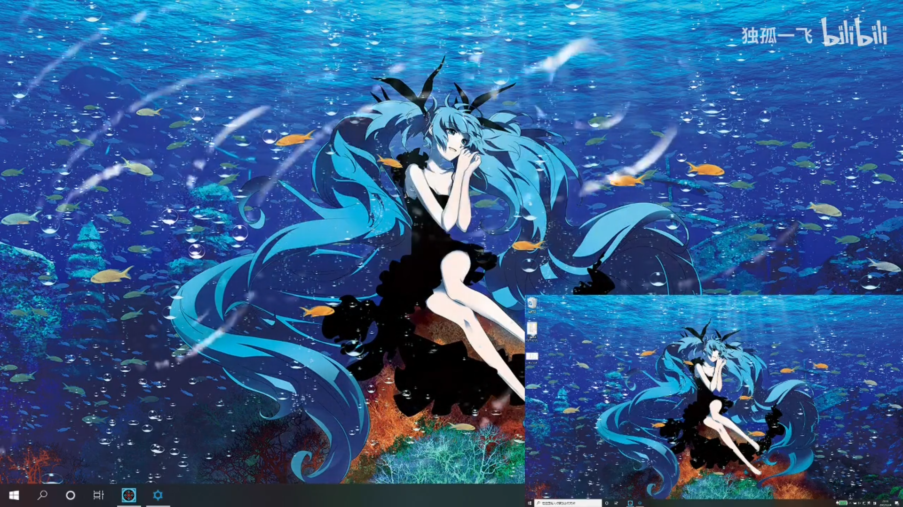

# catalog
1. 图像识别 Robomaster 风车能量靶识别
2. dice monster game
3. presentation by make a pixel game
4. wallpaper engine
5. webkit browser (wenkit.Net)
6. webkit chrome browswer (cefsharp)
7. Sokoban (SDL)
8. Vue Music Player (front project)

# 图像识别 Robomaster 风车能量靶识别

use opencv and some algorithm inside opencv.

代码：https://github.com/DuGuYifei/Robomaster_WIndWheelTargetDetect
视频：https://www.bilibili.com/video/BV1tW4y1y7Zy/

# dice monster game

A dice monster chess game.

代码：https://github.com/DuGuYifei/MonsterDuelDice
视频：https://www.bilibili.com/video/BV1mq4y1o7ww?p=1&vd_source=6beebf17d5aa6fb3d9fb4b629d0b319a

# presentation by make a pixel game

Make a unity escaping room game to make class presentation.

First time try to build pixel model by myself.

代码：https://github.com/DuGuYifei/HobbyPresentation_Unity
视频：https://www.bilibili.com/video/BV1Dq4y1r7av/

# wallpaper engine

It support html, web site, picture (use windows command which make result same with using windows settings), animation picture, exe (including some web apps).

代码：https://github.com/DuGuYifei/WallPaperEngine

视频：https://www.bilibili.com/video/BV1gR4y157pz/?vd_source=6beebf17d5aa6fb3d9fb4b629d0b319a

# webkit browser (wenkit.Net)
Webkit core browser based on wenkit.Net which is an old tech

代码：https://github.com/DuGuYifei/WebkitCoreBrowser

It's build for wallpaper engine, so delete a lot of function. 

I abandon it because it is a too old package.

# webkit chrome browswer (cefsharp)
Webkit chrome browser based on cefsharp

代码：https://github.com/DuGuYifei/WebkitChrome

It's build for wallpaper engine, so delete a lot of function. 

# Sokoban

Use sokoban and simulate the idea of Unity Engine.

代码：https://github.com/DuGuYifei/Sokoban_SDL
视频：https://www.bilibili.com/video/BV1UG411879L/

# Vue Music Player (front project)

A Vue project of music player.
代码：https://github.com/DuGuYifei/Vue_MusicPlayer_Demo