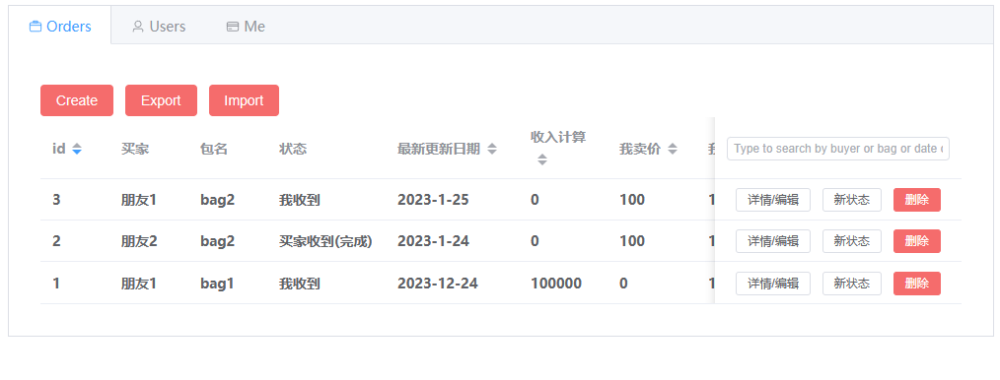

## intro

link: [Bag Pack](https://www.liuyifei.tech/BagPack/)

This is an app based on **indexedDB** which is used for merchant to record orders, customers with their pre-paid money and calculate benefit and balance.

This project is created for my customer who don't want back-end and want to use it in ipad, so it is designed by indexedDB. Then it support **export and import json file**.

## Tech:
* vue
* prop: the value transfer between components
* indexedDB
* read(import), write(export) file
* Element plus