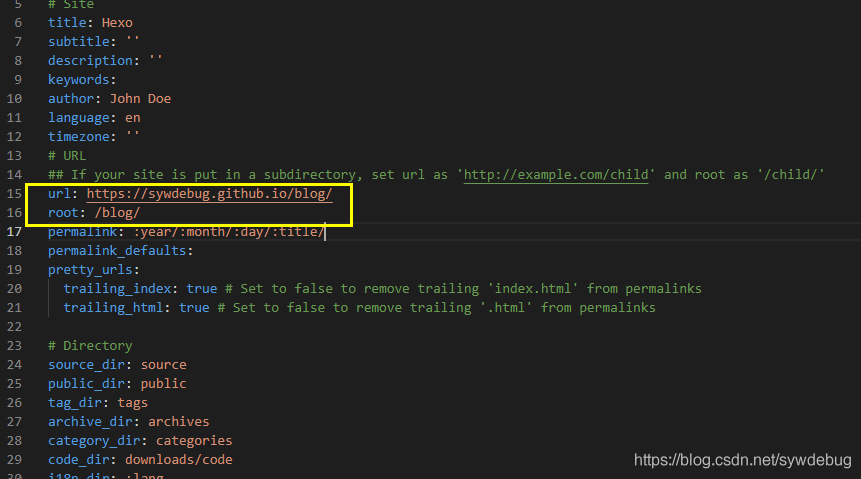

# 目标
解析到 'blog.liuyifei.tech`

放弃这样做，由于hexo的结构经过长时间维护已经很混乱，对于不同的url解读代码太过分散，修改太浪费精力了，以后有时间自己写。

# 无法加载资源的问题
用编辑器打开目录中的 _config.yml 文件

**关于root的深入理解 以及 解决自定义url后出现的无法加载资源问题**
如果是靠 liuyifei.tech/blog 连接就不会出问题，如果单独设置了一个CNAME连接比如'blog.liuyifei.tech'，并将root设置为 `/blog` 那么发送请求就变成了 blog.liuyifei.tech/blog/ 就不对了，
我们需要**blog.liuyifei.tech**，所以这时候只需要将root设置为`../`即可。

# CNAME文件
将CNAME文件直接放在source下即可，不要放进_posts

# DNS解析

