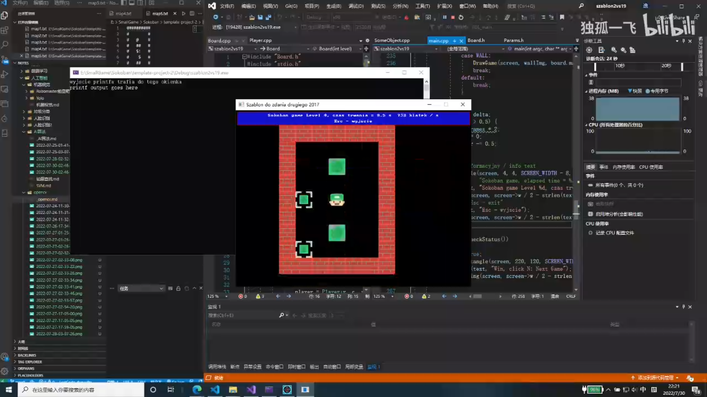

# Robot Unicorn Attack

A RobotUnicornAttack game remake using SDL2. This was my first game, which I made during my first semester of learning programming. It included pixel collision checking, but at the time, I didn't realize the complexity of the algorithm.

代码：https://github.com/DuGuYifei/SDL2_Game_RobotUnicornAttack