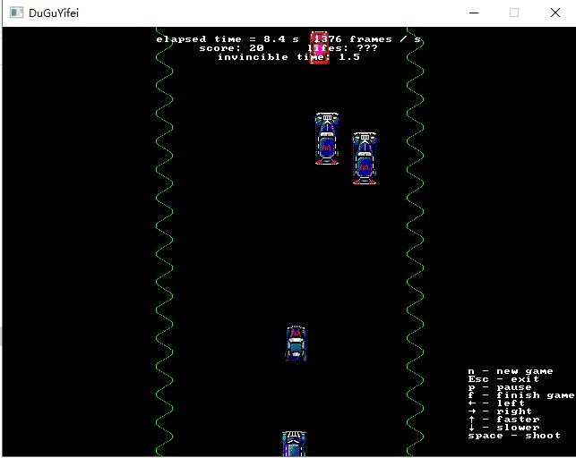

# Spy Hunter

代码：https://github.com/DuGuYifei/SDL2_SpyHunter

Spy Hunter is a classic 1983 vehicular combat arcade game where you play as a spy behind the wheels of an armed sports car.

Player control the car. There are normal cars which can be attacked but shouldn't be attacked. There are enemies can be attacked. There are enemies can attack player.

Use sin() function draw road.

Use object pool to decrease the memory used.

Design the structure similar as Unity, in game logically main control function, it will update each object position (GUI) in one loop.

Store points in file, and it can be ranked by score or time in menu.