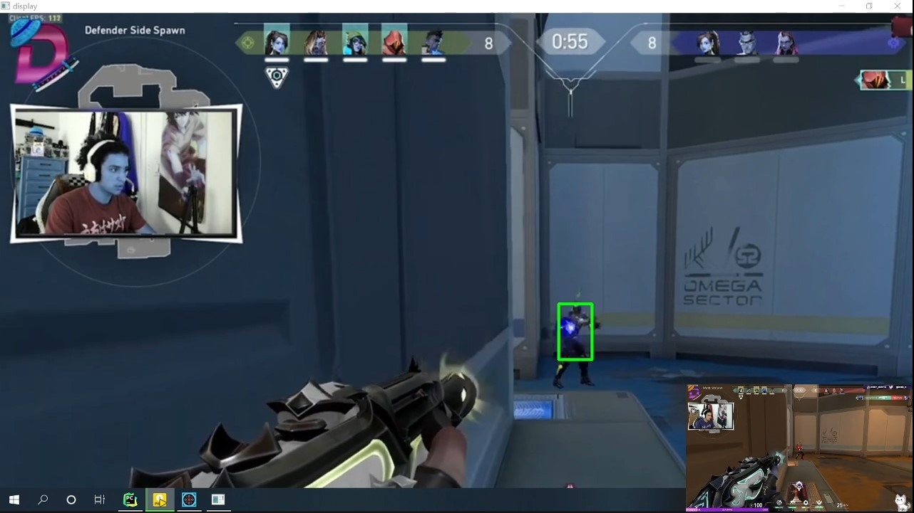

# 使用Yolov5对fps游戏AI挂的原理研究项目

[yolov5_valorant项目网址](https://github.com/DuGuYifei/Yolov5_FPS_AICheatPrinciple)


# 流程设计
1. 中键开关挂
2. 左键按下时检测（即非自动开火模式）
3. 抓取屏幕
4. yolo检测
5. 鼠标控制模拟

# 屏幕抓取
```py
from PIL import ImageGrab
im = ImageGrab.grab(bbox=rect)
img0 = np.array(im)
```

# yolov5的检测关键代码提取
```py
import win32api
import win32con
from PIL import ImageGrab
import numpy as np
import torch
import cv2

from utils.augmentations import letterbox
from utils.general import (non_max_suppression, scale_coords)
from models.experimental import attempt_load

# pt_path = 'valorant-v12.pt'
pt_path = 'valorant-bot.pt'

def run():
    rect = (0, 0, 1920, 1080)
    mid_screen_x = (rect[2] - rect[0]) >> 1
    mid_screen_y = (rect[3] - rect[1]) >> 1
    mid_screen = mid_screen_x + mid_screen_y
    aims = []
    device = 'cuda' if torch.cuda.is_available() else 'cpu'
    half = device != 'cpu'
    conf_thres = 0.4
    iou_thres = 0.05

    model = attempt_load(pt_path, device=device, inplace=True, fuse=True)
    stride = max(int(model.stride.max()), 32)  # model stride
    model.half()

    open_helper = False

    while True:
        if ((win32api.GetAsyncKeyState(0x01) & 0x8000) > 0 or (
                win32api.GetAsyncKeyState(0x02) & 0x8000) > 0) and open_helper:
            im = ImageGrab.grab(bbox=rect)
            img0 = np.array(im)
            img = letterbox(img0, stride=stride)[0]
            img = np.ascontiguousarray(img)
            img = torch.from_numpy(img).to(device)
            img = img.half() if half else img.float()
            img /= 255  # 0 - 255 to 0.0 - 1.0
            if len(img.shape) == 3:
                img = img[None]  # 压缩数据维度

            img = img.permute(0, 3, 1, 2)
            pred = model(img, augment=False, visualize=False)[0]
            pred = non_max_suppression(pred, conf_thres, iou_thres)

            # Process predictions (based on source code of yolo)
            for i, det in enumerate(pred):  # per image
                if len(det):
                    # Rescale boxes from img_size to im0 size
                    det[:, :4] = scale_coords(img.shape[2:], det[:, :4], img0.shape).round()
                    # Write results
                    for *xyxy, conf, cls in reversed(det):
                        aims.append(((xyxy[0] + xyxy[2]) / 2, (xyxy[3] - xyxy[1]) / 5 + xyxy[1]))

                if len(aims):
                    min_dis = 100000
                    target_x = 960
                    target_y = 540
                    for a, b in aims:
                        dis = a + b - mid_screen
                        if dis < min_dis:
                            target_x = a
                            target_y = b
                            min_dis = dis
                    print(f"{target_x}, {target_y}")
                    aims = []

if __name__ == "__main__":
    run()
```

# 鼠标的操控和窗口句柄问题
[鼠标](https://github.com/DuGuYifei/Notes/blob/main/%E8%AE%A1%E7%AE%97%E6%9C%BA/%E8%AE%A1%E7%AE%97%E6%9C%BA%E8%AF%AD%E8%A8%80/Python/Python%E7%9F%A5%E8%AF%86%E7%A7%AF%E7%B4%AF/%E9%BC%A0%E6%A0%87%E8%BE%93%E5%85%A5%E4%BA%8B%E4%BB%B6.md)
[窗口句柄](https://github.com/DuGuYifei/Notes/blob/main/%E8%AE%A1%E7%AE%97%E6%9C%BA/%E8%AE%A1%E7%AE%97%E6%9C%BA%E8%AF%AD%E8%A8%80/Python/Python%E7%9F%A5%E8%AF%86%E7%A7%AF%E7%B4%AF/%E7%AA%97%E5%8F%A3%E5%8F%A5%E6%9F%84.md)