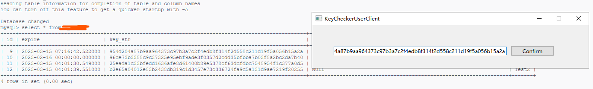
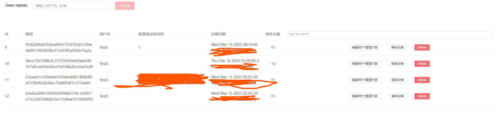

## Intro

[Github link](https://github.com/DuGuYifei/KeyChecker)

Prepare a "coat" for other programs which user can use a time-limited key to log in. Their machines are bound.

The wrapper framework use `mysql` and contains back-end (`Springboot`), back-end supervise interface (`vue`) and user client (`Qt c++`).

Also display a wrappee example by `pyhon` to use the shared memory or message pipe.

## Tech stack
1.  Springboot - java
2.  Vue.js - javascript, html, css
3.  Qt desktop - C++
4.  Python script
5.  Database - MySQL

*  Http request
*  WinAPI - C++, python
*  Multi-processes communication - Shared Memory, Message Pipe
*  Multithread in Qt C++
*  Test by Docker

## TODO
1. Give log-in func in back-end supervise interface
2. Use JWT token in no.1 of todo list
