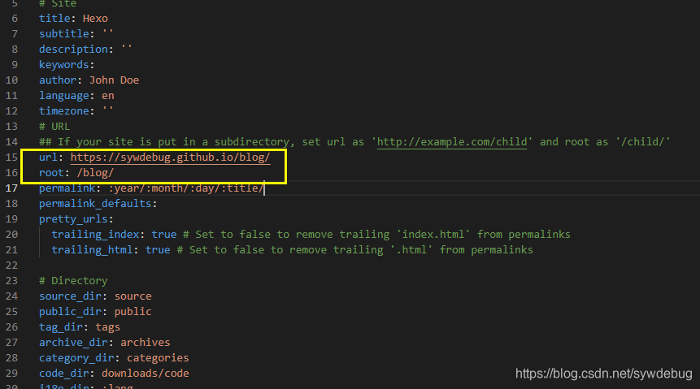
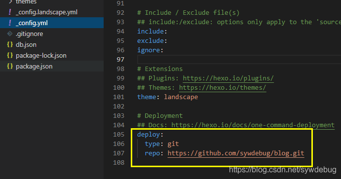

# Blog

[CSDN博客_github hexo](https://blog.csdn.net/sywdebug/article/details/113942047?fbclid=IwAR3CZC9vs8qEObbcHqdRKS4vsWZvNt39yiAOetyvj8hdPv3aKkRKcNFsqRg)


## 创建
```bash
npm install hexo-cli -g
hexo init blog
cd blog
hexo server   # hexo s
```

## 主题修改

git clone 主题到themes下即可

比如`next`主题
```
git clone https://github.com/next-theme/hexo-theme-next.git themes/next
```

下载后config里的参数可以参考最上面的链接，但其实config里都有详细注释

### 添加搜索功能

下载：`npm install hexo-generator-searchdb --save`

修改主题config
```
local_search:
  enable: true
  trigger: auto
  top_n_per_article: 1
  unescape: false
  preload: false
```

写进根目录config
```
# Search
search:
  path: search.xml
  field: post
  format: html
  limit: 10000
```

## github.io
下载插件到根目录
```bash
npm install hexo-deployer-git --save
```

用编辑器打开目录中的 _config.yml 文件
先上面的 url 和 root 补充完整，不然会没有 css 样式和 js 脚本


也可以加上 branch:[自定义分支名称] 和 massage:[自定义提交消息]  


保存后执行 hexo generate 更新本地代码或执行hexo clean删除本地代码
执行 hexo deploy 生成本地代码并推送到 github 库

```bash
hexo clean # 清除已生成文件及缓存
hexo generate # 生成静态页面，简写做hexo g
hexo deploy #推送到github库，简写做hexo d
hexo server # 启动本地WEB服务器，简写做hexo s
```

### 不一定是github.io仓库
github只要是`gh-pages`的branch都可以同过`github.io/project`来访问，所以可以看上图中的deploy的url并不是io仓库

## 创建新blog
```bash
hexo new "My New Post"
```