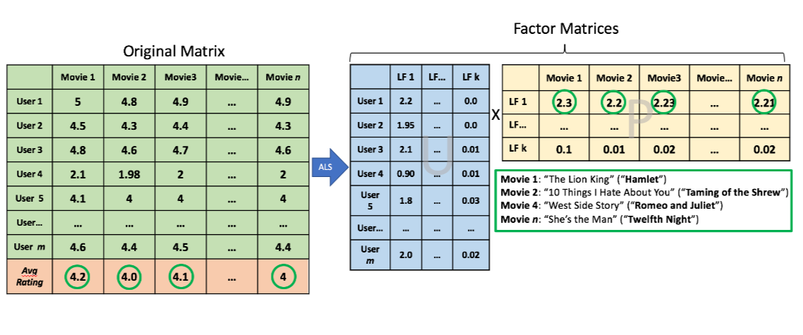
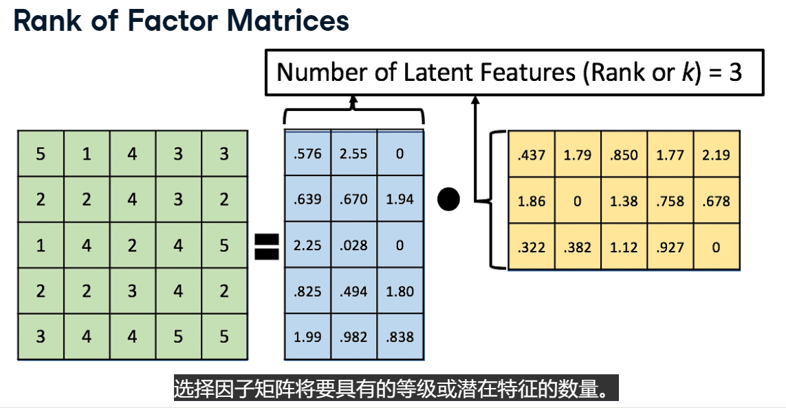
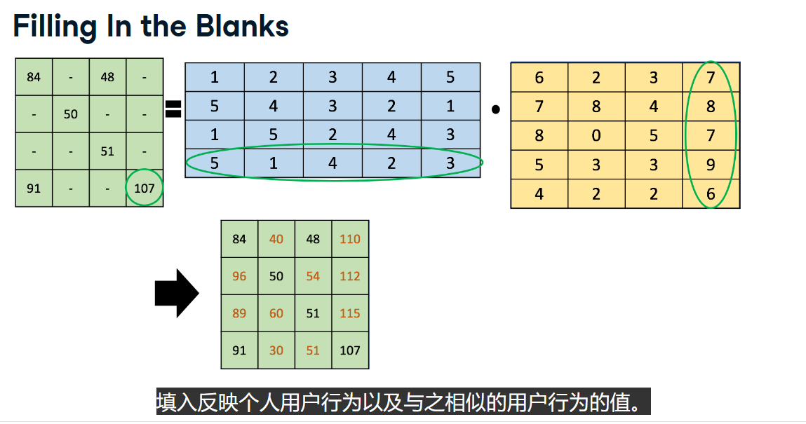
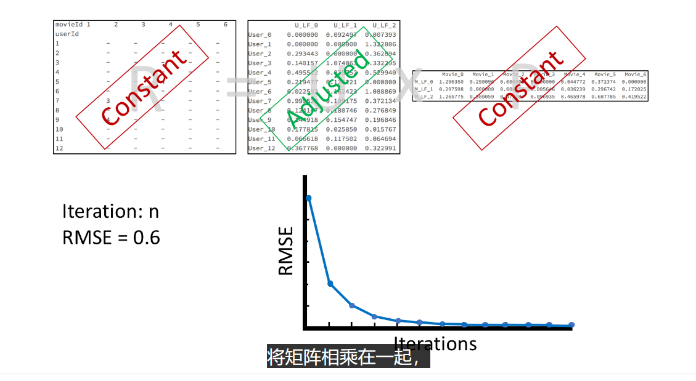
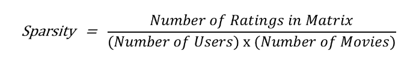
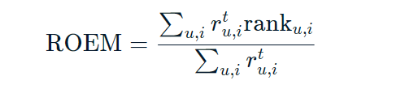

# ALS算法

## ALS算法

全称: Alternating Least Squares 即 交替最小二乘法

ALS算法是一种协同过滤算法，它使用隐性评分来预测用户对物品的评分。它使用迭代方法来将用户和物品分组，以便在每次迭代中，用户和物品都可以被重新分组，以便在下一次迭代中，用户和物品都可以被重新分组。这种迭代方法将继续进行，直到算法收敛为止。收敛意味着用户和物品的分组不再改变，因此算法已经找到了最佳分组。在这种情况下，最佳分组是指，用户和物品的分组使得算法能够预测用户对物品的评分，而这些预测评分与实际评分的差异最小。



## 矩阵分解

矩阵分解概述：介绍了矩阵分解与矩阵乘法的区别，矩阵分解将一个矩阵分解为两个或多个矩阵，并生成原始矩阵的**近似值**。

矩阵分解：进一步解释了矩阵分解的概念，介绍了不同的数学方法和应用。在协同过滤中常使用的是**非负矩阵分解**。

矩阵分解：说明了在因式分解中可能出现负值的问题，而在预测用户对项目的评分时负值没有意义，因此所使用的 ALS 版本要求因式分解仅返回正值。

矩阵分解：展示了一个样本评级矩阵的分解示例，称为 **LU 分解**。指出其中出现负数值的问题。

矩阵分解：展示了另一个分解示例，其中所有值都是正数，更接近实际需求。解释了因子矩阵的维度与原始矩阵的关系，并介绍了**因子矩阵的秩或潜在特征数量**。



填空：展示了一个包含空白单元格的矩阵，并说明了**即使存在空白单元格，仍然可以对矩阵进行分解**。强调因**子矩阵是完全填满的**，并解释了如何基于已有模式填充空白单元格。

填空：进一步解释了如何使用因子矩阵进行预测，**对空白单元格进行填充，以反映用户行为和类似用户行为的值**。**这就相当于协同过滤算法在预测一部分人**。



### 分解算法
LU（Lower-Upper）分解和WH分解是两种常见的矩阵分解方法。

LU分解（Lower-Upper Decomposition）：
LU分解是将一个矩阵分解为一个下三角矩阵（Lower triangular matrix）和一个上三角矩阵（Upper triangular matrix）的乘积的过程。LU分解常用于解线性方程组、计算矩阵的行列式以及求逆矩阵等操作。通过LU分解，可以简化这些运算的过程。
例如，对于一个矩阵A，可以将其进行LU分解，得到两个矩阵L和U，使得A = LU。其中，L是下三角矩阵，U是上三角矩阵。LU分解可以通过高斯消元法或其他方法来计算。

WH分解（Non-negative Matrix Factorization，NMF）：
WH分解是一种因式分解的方法，用于将一个非负矩阵分解为两个非负矩阵的乘积的形式。这种分解通常用于数据降维、特征提取和聚类等应用。
给定一个非负矩阵V，WH分解将其分解为两个非负矩阵W和H，使得V ≈ WH。其中，W是一个非负矩阵，包含了V的基础特征，H是一个非负矩阵，包含了W的系数。WH分解通常使用迭代算法，例如乘法更新规则或梯度下降法等，来逐步优化W和H的值，以使得V的近似误差最小化。

WH分解在许多领域中有广泛的应用，例如图像处理、文本挖掘、推荐系统等，用于发现数据的潜在结构和特征表示。

## ALS迭代

`R -> U*P` 交替U和P哪个作为constant，哪个作为variable，然后不停交替迭代，使得ASL的乘积尽可能接近R，比如根据RMSE来衡量。

(User, Product)



## ALS使用

```python
als_model = ALS(
	userCol="userId", itemCol="movieId", ratingCol="rating", 
	rank=25, maxIter=100, regParam=0.05, alpha=40,
	nonnegative=True, 
	coldStartStrategy="drop", 
	implicitPrefs=False
	)
```

- rank: 潜在特征数量
- maxIter: 迭代次数
- regParam: Lambda，即和其他许多机器学习算法中的正则化参数相同，用来控制模型的收敛速度太快而过拟合情况
- alpha: 只用于隐式评级，不用于显式评级，用于控制偏好矩阵中的置信度偏差，值越高，置信度偏差越大
- nonnegative: 是否使用非负矩阵分解
- coldStartStrategy: 用于处理冷启动问题，即在训练过程中出现的用户或项目，而在训练集中没有出现的用户或项目。默认值为“drop”，表示删除这些用户或项目。还可以设置为“nan”，表示将这些用户或项目的预测评级设置为NaN。
- implicitPrefs: True表示使用隐式评级，False表示使用显式评级

### 创建模型

```python
# Split the ratings dataframe into training and test data
(training_data, test_data) = ratings.randomSplit([0.8, 0.2], seed=42)

# Set the ALS hyperparameters
from pyspark.ml.recommendation import ALS
als = ALS(userCol="userId", itemCol="movieId", ratingCol="rating", rank = 10, maxIter = 15, regParam = .1,
          coldStartStrategy="drop", nonnegative = True, implicitPrefs = False)

# Fit the mdoel to the training_data
model = als.fit(training_data)

# Generate predictions on the test_data
test_predictions = model.transform(test_data)
test_predictions.show()
```

### 评估模型

```python
# Import RegressionEvaluator
from pyspark.ml.evaluation import RegressionEvaluator

# Complete the evaluator code
evaluator = RegressionEvaluator(metricName="rmse", labelCol="rating", predictionCol="prediction")

# Extract the 3 parameters
print(evaluator.getMetricName())
print(evaluator.getLabelCol())
print(evaluator.getPredictionCol())

# Evaluate the "predictions" dataframe
RMSE = evaluator.evaluate(test_predictions)

# Print the RMSE
print (RMSE)
```

## 稀疏度



空白的百分比

## ROEM

rank ordering error metrix 排序错误矩阵

用于隐式评级



## 二进制隐式评级

二进制隐式评级是 0 或 1，比如表示用户是否对项目感兴趣。