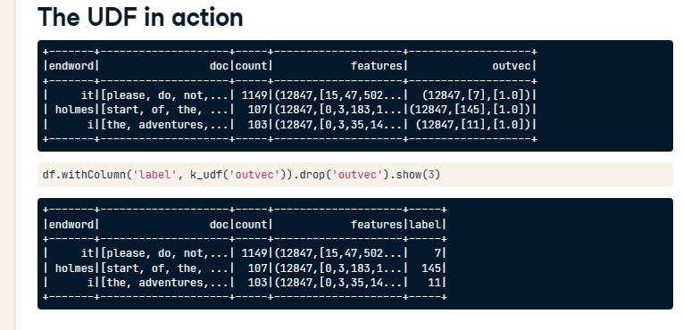
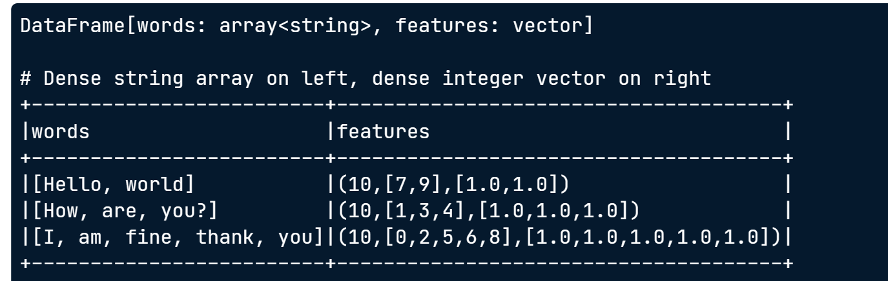

# CreatingFeatureDataForClassification

## transforing a dense array

* extract first item from this array and convert it to an integer

```python
from pyspark.sql.functions import udf
from pyspark.sql.types import IntegerType

bad_udf = udf(lambda x: int(x.indices[0])
						if (x and hasattr(x, 'toArray') and x.numNonzeros())
						else 0,
						IntegerType())
```


## CountVecotrizer

* CountVecotrizer is typically used as Feature **Extractor**
* its input is **an array of strings**
* its outpus is **a sparse vector**

### fit
```python
from pyspark.ml.feature import CountVectorizer

cv = CountVecotrizer(inputCol='words', outputCol='features')

model = cv.fit(df)
result = model.transform(df)
print(result)
```


* 10 代表有10个tokens在vacabulary（所有words的行加起来10个单词），
* 中间`[...]`是index
* 最后`[...]`是出现的次数
