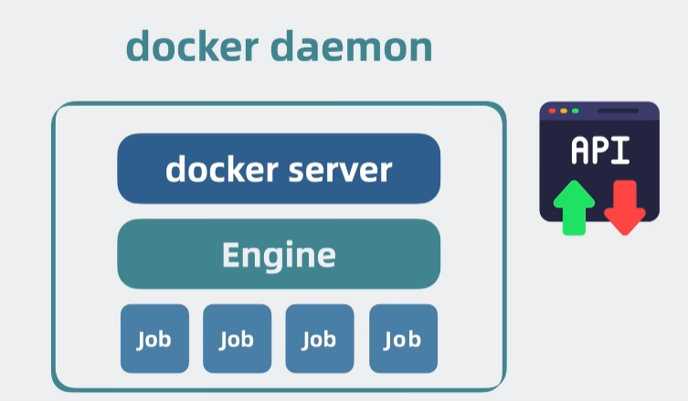

# docker是什么

[docker是什么？和kubernetes(k8s)是什么关系？](https://www.bilibili.com/video/BV1aA4m1w7Ew/)

## client server架构

docker-cli: 解析命令，发送http请求到docker-daemon
docker-daemon: 接收请求，创建job

## docker compose - swarm - k8s
- docker: 一个容器的部署
- docker compose: 多个容器组成一整套服务的部署
- docker swarm: 这一整套服务在多个服务器上集群部署
- k8s： docker swarm的竞品
  - pod里的container: docker
  - pod: docker-compose
  - k8s: docker swarm