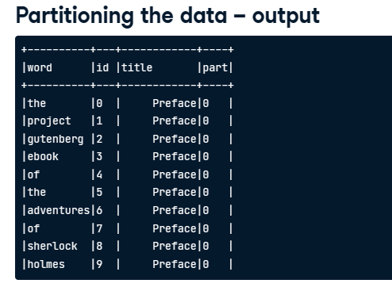
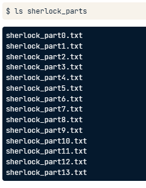

# pyspark

1. [什么是pyspark](#什么是pyspark)
2. [读取数据](#读取数据)
3. [创建表和查询](#创建表和查询)
4. [检查表结构](#检查表结构)
5. [窗口函数](#窗口函数)
	1. [WindowSpec](#windowspec)
6. [dot notation (col, alias, withColumnRenamed, withColumn, agg, orderBy, limit, lead, groupBy)](#dot-notation-col-alias-withcolumnrenamed-withcolumn-agg-orderby-limit-lead-groupby)
7. [groupBy](#groupby)
8. [Loading text](#loading-text)
	1. [parquet](#parquet)
	2. [truncate](#truncate)
9. [lowercase](#lowercase)
10. [replacing text](#replacing-text)
11. [Tokenizing text (split)](#tokenizing-text-split)
	 1. [split characters are discarded](#split-characters-are-discarded)
	 2. [explode 拆分为行](#explode-拆分为行)
	 3. [移除空行，筛选行 where](#移除空行筛选行-where)
	 4. [添加行id monotonically\_increasing\_id](#添加行id-monotonically_increasing_id)
12. [partitioning 数据](#partitioning-数据)
	 1. [when来加列](#when来加列)
	 2. [repartition](#repartition)
		 1. [RDD（Resilient Distributed Datasets）](#rddresilient-distributed-datasets)


## 什么是pyspark
Pyspark是Apache Spark的Python API。Apache Spark是一个大数据处理框架，可以处理大规模数据，包括数据的存储、处理和分析。Pyspark提供了Python编程语言的接口，使得使用Python的开发人员可以方便地使用Apache Spark进行大数据处理。

## 读取数据

```python
from pyspark.sql import SparkSession
spark = SparkSession.builder.appName('appName').getOrCreate()
df = spark.read.csv('data.csv', header=True, inferSchema=True) 
# 读取txt也是一样的，默认是按照逗号分隔的

df = spark.read.csv(filename)
df = spark.read.csv(filename, header=True)
```

## 创建表和查询

```python
df.createOrReplaceTempView('table_name')
df = spark.sql('select * from table_name')
	.show()
```

## 检查表结构

```python
result = spark.sql('describe table_name')
result = spark.sql('SHOW COLUMNS FROM table_name')
result = spark.sql('select * from table_name limit 0')
result.show()
print(result.columns)
```

## 窗口函数
[WindowFunction](../../%E6%95%B0%E6%8D%AE%E5%BA%93/SQL/WindowFunction.md)

### WindowSpec
在Spark中，WindowSpec是用于定义窗口函数（Window Function）的类。窗口函数是一种特殊类型的聚合函数，它在分组数据上执行，但不会将结果缩减为单个行。相反，它将聚合计算应用于定义的窗口中的每一行，并返回结果作为新的列。

WindowSpec定义了窗口函数要应用的窗口范围，它包括以下组成部分：

1. 分区（Partition）：指定要分组计算的列，所有具有相同分区键值的行将被分组在一起。
2. 排序（Ordering）：指定窗口函数的排序方式，可以按照一个或多个列进行排序
3. 窗口范围（Window Frame）：指定要在分组数据上计算的行的范围。

```python
window = Window.partitionBy('train_id').orderBy('time')
dfx = df.withColumn('id', lead('time', 1).over(window))

type(window) # pyspark.sql.window.WindowSpec
```

## dot notation (col, alias, withColumnRenamed, withColumn, agg, orderBy, limit, lead, groupBy)

```python
from pyspark.sql.functions import col
df.select('train_id', 'station')
df.select(df.train_id, df.station)
df.select(col('train_id'), col('station'))

df.select('train_id', 'station').withColumnRenamed('train_id', 'train').show(5)
df.select(col('train_id').alias('train'), 'station').limit(5).show()
spark.sql('SELECT train_id AS train, station FROM schedule LIMIT 5').show()
```

```python
query = """
SELECT * ，
ROW_NUMBER() OVER (PARTITION BY train_id ORDER BY time) AS id
FROM schedule
"""
spark.sql(query).show(11)


from spark.sql import Window
from spark.sql.functions import row_number
df.withColumn("id", row_number().over(
			Window.partitionBy("train_id").orderBy("time")
		)
	)
```

## groupBy

```python
# Give the identical result in each command
spark.sql('SELECT train_id, MIN(time) AS start FROM schedule GROUP BY train_id').show()
df.groupBy('train_id').agg({'time':'min'}).withColumnRenamed('min(time)', 'start').show()

# Print the second column of the result
spark.sql('SELECT train_id, MIN(time), MAX(time) FROM schedule GROUP BY train_id').show()
result = df.groupBy('train_id').agg({'time':'min', 'time':'max'})
result.show()
print(result.columns[1])
```

## Loading text

```python
df = spark.read.text('data.txt')
print(df.first())
print(df.first().value)
print(df.count())
```

如果是一个文件夹也可以,比如下面的[repartition](#repartition)

```python
df = spark.read.text('data')
```

### parquet

```python
df1 = spark.read.load('data.parquet')
# df1 = spark.read.parquet('data.parquet') 应该也行
df1.show(15, truncate=False)
```

### truncate
当truncate参数的值为True时（默认情况下），如果某一列的字符串长度超过了指定的宽度，PySpark将截断该字符串，并在结尾处添加省略号(...)以表示截断。当truncate参数的值为False时，则不对字符串进行截断，而是将完整的字符串显示出来。

还可以用数字

## lowercase

```python
df = df1.select(lower(col('value')))
print(df.first())
df.columns # ['lower(value)']

df = df1.select(lower(col('value')).alias('v')
df.columns # ['v']
```

## replacing text

```python
df = df1.select(regexp_replace('value', 'Mr\.', 'Mr').alias('v')) # Mr. -> Mr
df = df1.select(regexp_replace('value', 'don\'t', 'do not').alias('v')) # don't -> do not
```

## Tokenizing text (split)

```python
df = df2.select(split('v', '[ ]').alias('words')) # split by space
df.show(truncate=False)

# ['I', 'am', 'a', 'student']
```

### split characters are discarded

```python
punctuations = '_|.\?\!\",\'\[\]\*()'
df3 = df2.select(split('v', '[ %s]' % punctuations).alias('words')) # split by 空格+ punctuations, 这里把punctuations替换进 %s
```

### explode 拆分为行
```python
df4 = df3.select(explode('words').alias('word'))
df4.show()
```

方便统计个数

```python
print(df3.count())
print(df4.count())
```

### 移除空行，筛选行 where

```python	
nonblank_df = df.where(length('word') > 0))
```

### 添加行id monotonically_increasing_id

```python
df2 = df.select('word', monotonically_increasing_id().alias('id'))
```

## partitioning 数据

### when来加列
```python
df2 = df.withColumn('title', when(df.id < 25000, 'Preface')
							.when(df.id < 50000, 'Chapter 1')
							.when(df.id < 75000, 'Chapter 2')
							.otherwise('Chapter 3'))

df2 = df2.withColumn('part', when(df2.id < 25000, 0)
							.when(df2.id < 50000, 1)
							.when(df2.id < 75000, 2)
							.otherwise(3))
							.show()
```


### repartition

```python
df2 = df.repartition(4, 'part')
print(df2.rdd.getNumPartitions()) # 4
```

会生成多个文件
```bash
ls sherlocl_parts
```


```python
df_parts = spark.read.text('sherlock_parts')
```

#### RDD（Resilient Distributed Datasets）
上面函数可以从 DataFrame 对应的 RDD（弹性分布式数据集）中获取分区数。

