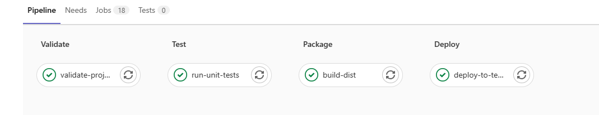

# CI_CD

CI_CD: Continuous Integration and Continuous Delivery

## Gitlab
[使用docker做gitlab-runner](../Docker/gitlab-runner.md)



`.gitlab-ci.yml`: 用于配置gitlab的CI/CD，直接存到仓库里，点击`Add CI/CD configuration`之后commit就行了
```yml
image: maven:3.3.9-jdk-8

stages:
  - validate
  - test
  - package
  - deploy

variables:
  MAVEN_CLI_OPTS: "--batch-mode --errors --fail-at-end --show-version"

validate-project:
  stage: validate
  script:
    - 'mvn $MAVEN_CLI_OPTS compile'
  artifacts:
    paths:
      - target
    expire_in: 30 minutes

run-unit-tests:
  stage: test
  script:
    - 'mvn $MAVEN_CLI_OPTS -Dmaven.main.skip=true test'

build-dist:
  stage: package
  script:
    - 'mvn $MAVEN_CLI_OPTS -Dmaven.main.skip=true -Dmaven.test.skip=true package'
  artifacts:
    paths:
      - target/*.jar

deploy-to-test-server:
  stage: deploy
  script:
    - 'true'
    
deploy-to-production:
  stage: deploy
  script:
    - 'true'
  only:
    - master
```

Linux系统上：
```bash
# Download the binary for your system
sudo curl -L --output /usr/local/bin/gitlab-runner https://gitlab-runner-downloads.s3.amazonaws.com/latest/binaries/gitlab-runner-linux-amd64

# Give it permissions to execute
sudo chmod +x /usr/local/bin/gitlab-runner

# Create a GitLab CI user
sudo useradd --comment 'GitLab Runner' --create-home gitlab-runner --shell /bin/bash

# Install and run as service
sudo gitlab-runner install --user=gitlab-runner --working-directory=/home/gitlab-runner
sudo gitlab-runner start

# 注册
sudo gitlab-runner register --url https://git.pg.edu.pl/ --registration-token $REGISTRATION_TOKEN

# 查看状态
sudo gitlab-runner status
```
