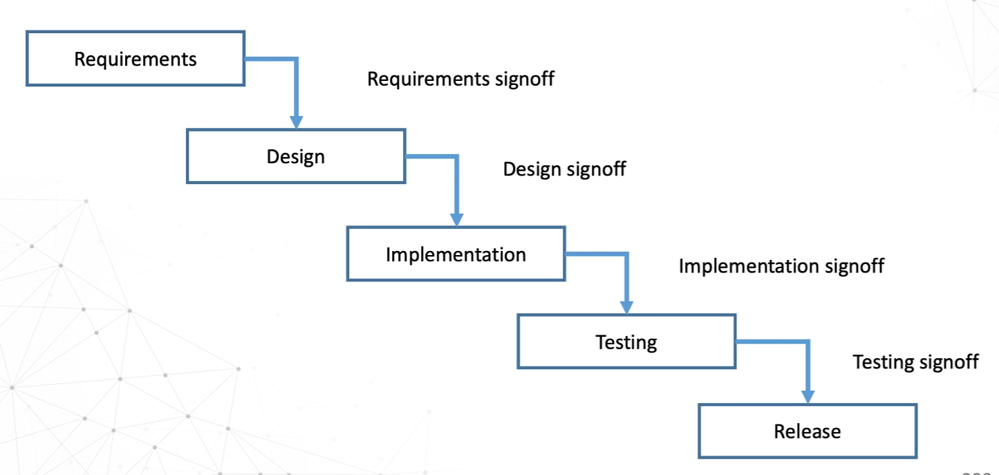
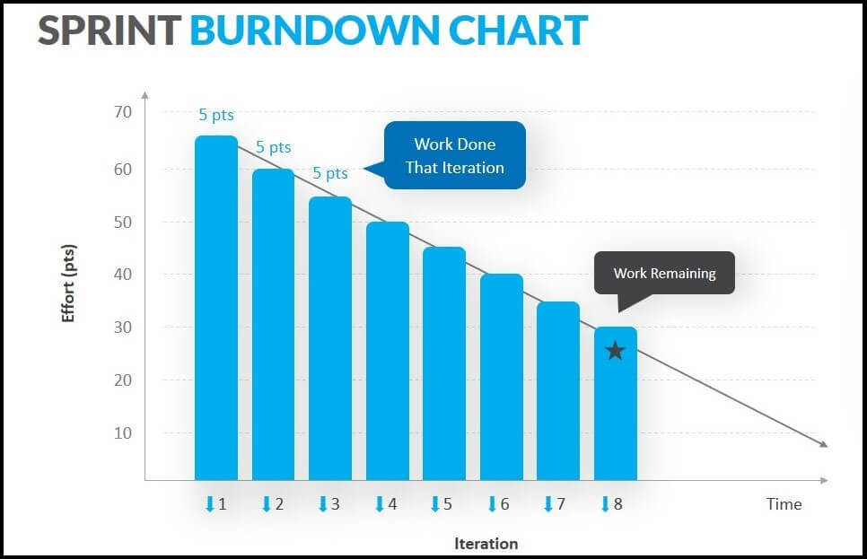

# SoftwareDevelopmentMethodologies

1. [1. Waterfall Model](#1-waterfall-model)
	1. [1.1. Advantages](#11-advantages)
	2. [1.2. Disadvantages](#12-disadvantages)
2. [2. Agile framework - Scrum](#2-agile-framework---scrum)
	1. [2.1. Scrum 关键词](#21-scrum-关键词)
3. [Agile 的一种实现方式 - Extreme Programming (XP)](#agile-的一种实现方式---extreme-programming-xp)
4. [Agile现在的特点](#agile现在的特点)

## 1. Waterfall Model

All the phases are completed one after another. Once a phase is completed, the process goes to the next phase and there is no turning back. The phases do not overlap.

1. Requirements: need documented. Approval is required. 
2. Design: need reviewed and validated.

### 1.1. Advantages

1. Simple and easy to understand and use.
2. Easy to manage due to the rigidity of the model – each phase has specific deliverables and a review process.
3. Phases are processed and completed one at a time.
4. Works well for smaller projects where requirements are very well understood.

### 1.2. Disadvantages

1. Not a good model for complex and object-oriented projects.
2. Poor model for long and ongoing projects.
3. Not suitable for the projects where requirements are at a moderate to high risk of changing. So, risk and uncertainty is high with this process model.
4. It is difficult to measure progress within stages.
5. Cannot accommodate changing requirements.
6. Adjusting scope during the life cycle can end a project.

## 2. Agile framework - Scrum

Srunm 是 Agile 敏捷开发的一种框架。

### 2.1. Scrum 关键词
1. Product Owner: 产品负责人，负责产品的需求，优先级，发布计划。
2. Team: 开发团队，负责开发工作。
3. Scrum Master: 敏捷教练，负责协调开发团队和产品负责人。
4. Sprint: 一个迭代周期，一般为 2-4 周。
5. Burndown: 燃尽图，用于跟踪开发进度。
	

## Agile 的一种实现方式 - Extreme Programming (XP)

Not a popular way of developing, because:
1. Learning curve is steep.
2. Underline pair programming: Navigator-Driver. Navigator is the one who is thinking about the big picture, and the Driver is the one who is typing the code.
3. Lack of documentation.
4. Scale and complexity of the project.

## Agile现在的特点

1. Distributed teams
   1. Teams are distributed in time, space
   2. Online tools, shared folders, documentation...
   3. Online discussions (including video conferencing)
   4. More work for the Scrum Master (Because Scum Master need contact, coordinate, increase communication, productivity, and efficiency)
2. Code reviews
3. Bug tracking
4. more issues...