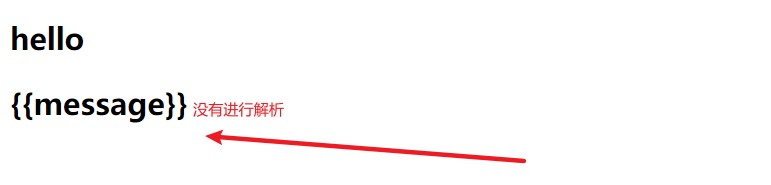

# 插值的操作

[Vue-插值的操作_Jamie Chyi的博客-CSDN博客](https://blog.csdn.net/qijing19991210/article/details/119831132)


1. [Mustache语法基本使用](#mustache语法基本使用)
2. [v-once](#v-once)
3. [v-html](#v-html)
4. [v-test](#v-test)
5. [v-pre](#v-pre)
6. [v-cloak](#v-cloak)

## Mustache语法基本使用
  <h1>{{message}}</h1>
  <!--不仅可以写变量，也可以写简单的表达式-->
  <h1>{{firstName + '  ' + lastName}}</h1>
  <h1>{{firstName}} {{lastName}}</h1>
  <h1>{{weight * 2}}</h1>
</div>
<script src="../js/vue.js"></script>
<script>
  const app = new Vue({
    el: '#app',
    data: {
      message: 'hello',
      firstName: 'qi',
      lastName: 'lili',
      weight: 20
    }
  })
</script>

## v-once
**定义的表达式或者组件只会渲染一次，首次渲染后，不再随着数据的改变而再次渲染**

```javascript
<div id="app" >
  <h2>{{message}}</h2>
  <h2 v-once>{{message}}</h2>
</div>
<script src="../js/vue.js"></script>
<script>
  const app = new Vue({
    el: '#app',
    data: {
      message: 'hello'
    }
  })
</script>
```


修改了值，虽然有新的一行出现，但是原来的值也还在

## v-html
**当我们想要被渲染的东西以html的形式展示时**，就用到了这个指令
```javascript
<div id="app">
  <h1 v-html="url"></h1>
</div>
<script src="../js/vue.js"></script>
<script>
  const app = new Vue({
    el: '#app',
    data: {
      message: 'hello',
      url:'<a href="https://www.baidu.com">百度一下</a>'
    }
  })
</script>
```


## v-test
**这个指令也是渲染数据的，不加{{}}，与直接写在标签体内{{变量名}}不同的是，它会直接替换标签中间的内容，而{{变量名}}的形式可以追加**

```javascript
<div id="app">
  <h2>{{message}},齐菁菁</h2>
  <h2 v-text="message">,齐菁菁</h2>
</div>
<script src="../js/vue.js"></script>
<script>
  const app = new Vue({
    el: '#app',
    data: {
      message: 'hello'
    }
  })
</script>
```


注意第二行表示标签中间的内容并没有显示，被**替换**了

## v-pre

**当你想输出不被解析的纯文本时**

```javascript
<div id="app">
  <h2>{{message}}</h2>
  <h2 v-pre>{{message}}</h2>
</div>
<script src="../js/vue.js"></script>
<script>
  const app = new Vue({
    el: '#app',
    data: {
      message: 'hello'
    }
  })
</script>
```



## v-cloak
**当网络较慢，网页还在加载 Vue.js ，而导致 Vue 来不及渲染，这时页面就会显示出 Vue 源代码。我们可以使用 v-cloak 指令来解决这一问题。**

```javascript
<style>
  [v-cloak]{
    display: none;
  }
</style>
<div id="app" v-cloak>{{message}}</div>
<script src="../js/vue.js"></script>
<script>
  /*延迟1s*/
  setTimeout(function (){
    const app = new Vue({
      el: '#app',
      data: {
        message: 'hello'
      }
    })
  },1000)
</script>
```