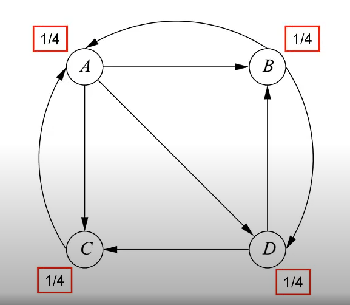
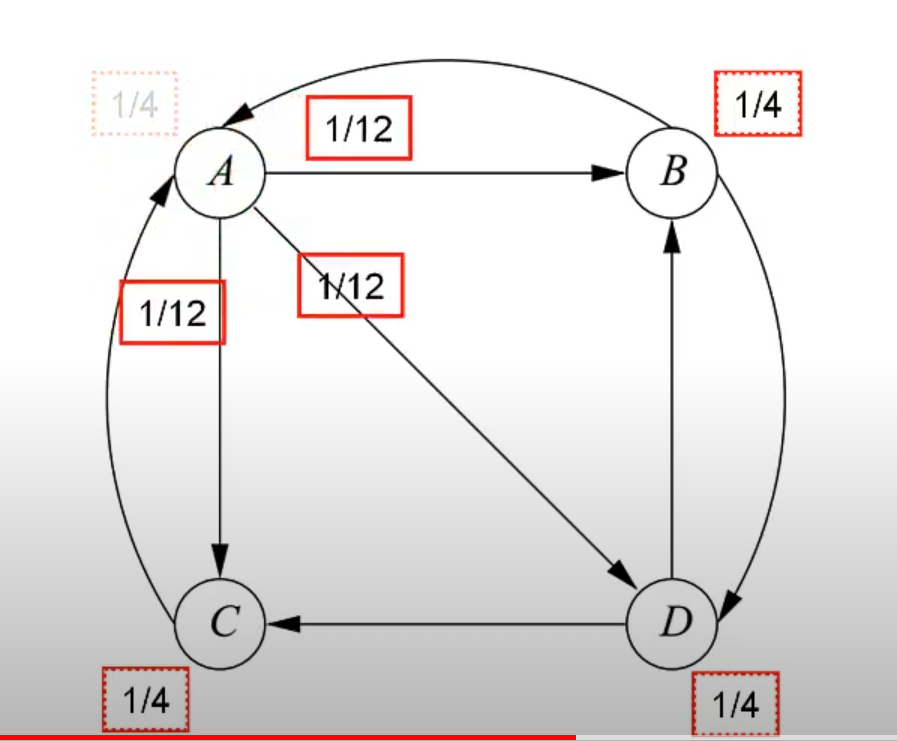
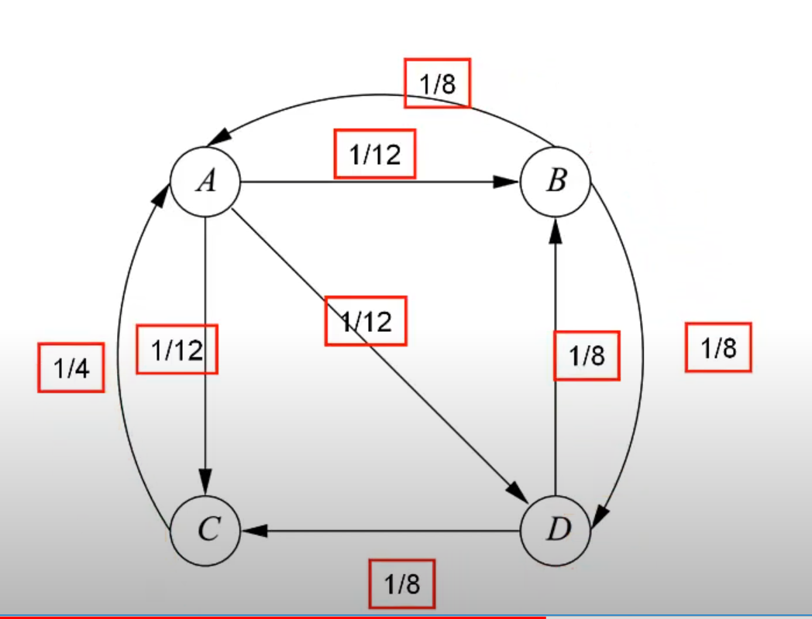
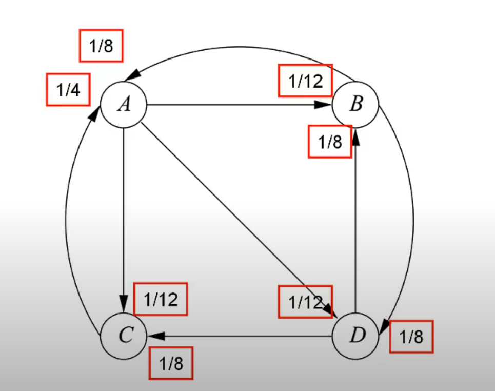
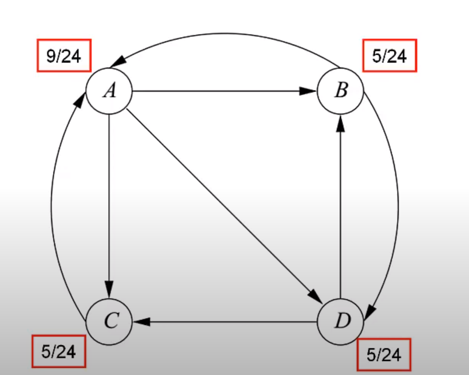
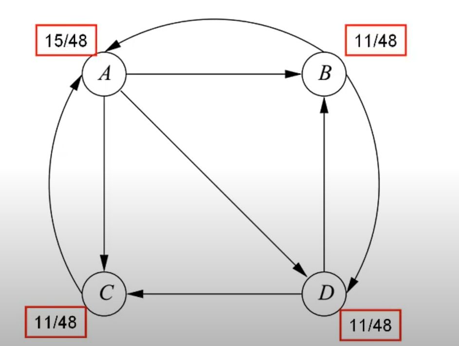

# PageRank

## algorithm
The PageRank value for any page u can be expressed as:

$$PR(u) = \sum_{v \in B} \frac{PR(v)}{L(v)}$$

即页面 u 的 PageRank 值取决于包含在集合 B（包含链接到页面 u 的所有页面的集合）的每个页面 v 中的 PageRank 值除以来自页面 v 的链接数 L(v)。

**然后iteration，直到收敛。**

## example

## propagation

## aggregation

## 2nd iteration

## convergence 收敛
