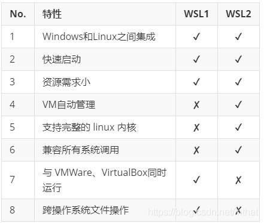

# 【WSL】Windows下Linux子系统

## WSL1 和 WSL2

注：
1. 不是说wsl2就不能和windows互通文件。WSL 2 不能与 windows 跨操作系统文件操作(Windows 访问 WSL2 的方法为进行 WSL2 环境键入 “cd ~” 进入主目录后，再键入"explorer.exe ."可在windows 文件管理器中访问 WSL 2 文件，此外还可以通过虚拟机的方法互通文件，如网络，文件共享等)，**而 WSL 1 则与 windows 在同一文件系统中**。
2. WSL1 和 WSL2 都可以实现在 windows 中带来 linux 操作体验；
3. 启动速度都不慢；
4. 内存消耗都比较小；
5. WSL 1 没有使用的 VM，WSL 2 使用了一个自动维护的 VM；
6. WSL 1 不支持，**WSL2 支持可以运行例如 Docker 等程序**；
7. WSL 2 支持完整的 linux 内核调用，而 WSL 1 不行；

## Windows 和 WSL2 文件夹相互访问路径
1. 讲解1
[Windows 和 WSL2 文件夹相互访问路径_ed_xc的博客-CSDN博客_访问wsl2文件](https://blog.csdn.net/fangxiaochao123/article/details/122458800?spm=1001.2101.3001.6661.1&utm_medium=distribute.pc_relevant_t0.none-task-blog-2%7Edefault%7ECTRLIST%7ERate-1-122458800-blog-125866128.pc_relevant_default&depth_1-utm_source=distribute.pc_relevant_t0.none-task-blog-2%7Edefault%7ECTRLIST%7ERate-1-122458800-blog-125866128.pc_relevant_default&utm_relevant_index=1)

2. 讲解2
WSL 2 不能与 windows 跨操作系统文件操作(Windows 访问 WSL2 的方法为进行 WSL2 环境键入 “cd ~” 进入主目录后，再键入"explorer.exe ."可在windows 文件管理器中访问 WSL 2 文件，此外还可以通过虚拟机的方法互通文件，如网络，文件共享等)

windows访问WSL2: 在文件资源管理器输入`\\wsl$`

## 查看WSL版本（ubuntu正在使用的WSL版本）以及修改版本
[IOS 中启用虚拟化问题_AD_钙的博客-CSDN博客_win10家庭版wsl2](https://blog.csdn.net/weixin_44121966/article/details/122815547)

cmd下
```bash
wsl --list --verbose
```

## 下载WSL2设为默认版本等问题
[旧版 WSL 的手动安装步骤](https://learn.microsoft.com/zh-cn/windows/wsl/install-manual#step-4---download-the-linux-kernel-update-package)
如果希望将新的 Linux 安装设置为 WSL 1，就不用将其设为默认版本。

悟：在Microsoft store下载ubuntu时，有根据wsl有不同的版本。

## 公用git
```bash
ln -s /mnt/c/Users/yourusername/.gitconfig ~/.gitconfig
```