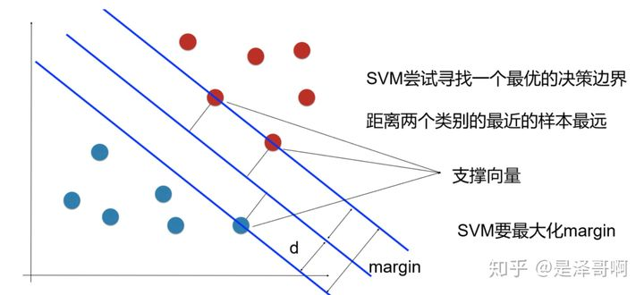
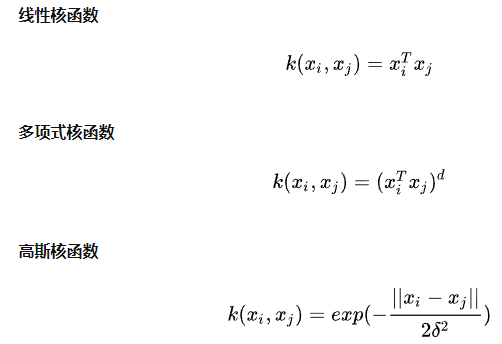
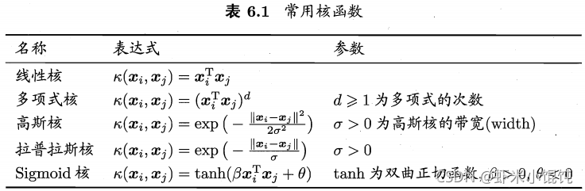
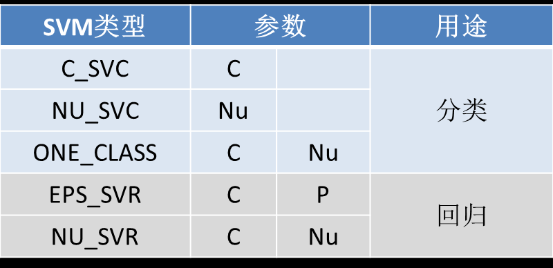
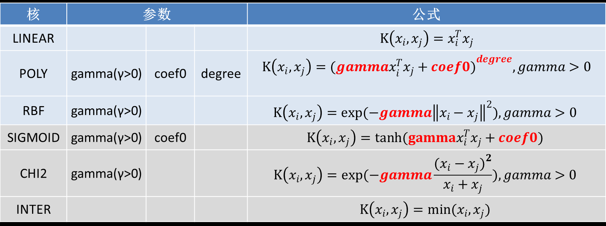

# SVM

[学习SVM，这篇文章就够了！（附详细代码）](https://www.jiqizhixin.com/articles/2018-10-17-20)

[【机器学习】支持向量机 SVM（非常详细）](https://zhuanlan.zhihu.com/p/77750026)
[Python机器学习笔记：SVM（1）——SVM概述 - 战争热诚 - 博客园](https://www.cnblogs.com/wj-1314/p/12899598.html)
[Python机器学习笔记：SVM（2）——SVM核函数 - 战争热诚 - 博客园](https://www.cnblogs.com/wj-1314/p/12931799.html)


[openCV的使用](../opencv/SVM.md)

- 二分类

- 寻找距离**支持向量**最远的分类超平面
  

- 一般选择线性核函数，效果不好上高斯核函数，高斯核函数可以映射到无限维空间

- 核函数(Kernel function)
    1. 线性核函数

    2. 多项式核函数

    3. 高斯核函数
    

    

    

    

    这三个常用的核函数中只有高斯核函数是需要调参的。

    这里简单说一下核函数与其他参数的作用（后面会详细学习关于使用Sklearn学习SVM）：

    - kernel='linear' 时，C越大分类效果越好，但有可能会过拟合（default C=1）
    - kernel='rbf'时，为高斯核，gamma值越小，分类界面越连续；gamma值越大，分类界面越“散”，分类效果越好，但有可能  会过拟合。

## 总结：
1. 求最大值
2. 在约束条件下求最大值用的是拉格朗日函数。其中用了拉格朗日函数的对偶`minmax`转化为`maxmin`。
   要满足条件：
   * 优化问题是凸优化问题
   * 满足KKT条件
3. 利用SMO算法解拉格朗日算法的结果转化里的最优α。（SMO算法就是不停选择α，找到满足KKT条件的点）

综合以上讨论，我们可以得到**线性支持向量机学习算法**如下：

**输入** ：训练数据集 ![[公式]](https://www.zhihu.com/equation?tex=+T%3D%5Cleft%5C%7B+%5Cleft%28+%5Cboldsymbol%7Bx%7D_1%2Cy_1+%5Cright%29+%2C%5Cleft%28+%5Cboldsymbol%7Bx%7D_1%2Cy_1+%5Cright%29+%2C...%2C%5Cleft%28+%5Cboldsymbol%7Bx%7D_N%2Cy_N+%5Cright%29+%5Cright%5C%7D) 其中，![[公式]](https://www.zhihu.com/equation?tex=+%5Cboldsymbol%7Bx%7D_i%5Cin+%5Cmathbb%7BR%7D%5En+)， ![[公式]](https://www.zhihu.com/equation?tex=+y_i%5Cin+%5Cleft%5C%7B+%2B1%2C-1+%5Cright%5C%7D+%2Ci%3D1%2C2%2C...N) ；

**输出** ：分离超平面和分类决策函数

（1）选择惩罚参数 ![[公式]](https://www.zhihu.com/equation?tex=+C%3E0+) ，构造并求解凸二次规划问题

![[公式]](https://www.zhihu.com/equation?tex=+%5Cunderset%7B%5Cboldsymbol%7B%5Calpha+%7D%7D%7B%5Cmin%7D%5C+%5Cfrac%7B1%7D%7B2%7D%5Csum_%7Bi%3D1%7D%5EN%7B%5Csum_%7Bj%3D1%7D%5EN%7B%5Calpha+_i%5Calpha+_jy_iy_j%5Cleft%28+%5Cboldsymbol%7Bx%7D_%7B%5Cboldsymbol%7Bi%7D%7D%5Ccdot+%5Cboldsymbol%7Bx%7D_%7B%5Cboldsymbol%7Bj%7D%7D+%5Cright%29%7D%7D-%5Csum_%7Bi%3D1%7D%5EN%7B%5Calpha+_i%7D)

![[公式]](https://www.zhihu.com/equation?tex=+s.t.%5C+%5C+%5C+%5C+%5Csum_%7Bi%3D1%7D%5EN%7B%5Calpha+_iy_i%7D%3D0)

![[公式]](https://www.zhihu.com/equation?tex=+%5C+%5C+%5C+%5C+%5C+%5C+%5C+0%5Cle+%5Calpha+_i%5Cle+C%2C%5C+i%3D1%2C2%2C...%2CN)

得到最优解 ![[公式]](https://www.zhihu.com/equation?tex=+%5Cboldsymbol%7B%5Calpha+%7D%5E%2A%3D%5Cleft%28+%5Calpha+_%7B1%7D%5E%7B%2A%7D%2C%5Calpha+_%7B2%7D%5E%7B%2A%7D%2C...%2C%5Calpha+_%7BN%7D%5E%7B%2A%7D+%5Cright%29+%5ET+)

（2）计算

![[公式]](https://www.zhihu.com/equation?tex=+%5Cboldsymbol%7Bw%7D%5E%2A%3D%5Csum_%7Bi%3D1%7D%5EN%7B%5Calpha+_%7Bi%7D%5E%7B%2A%7Dy_i%5Cboldsymbol%7Bx%7D_i%7D+)

选择 ![[公式]](https://www.zhihu.com/equation?tex=%5Cboldsymbol%7B%5Calpha+%7D%5E%2A+) 的一个分量 ![[公式]](https://www.zhihu.com/equation?tex=+%5Calpha+_%7Bj%7D%5E%7B%2A%7D+) 满足条件 ![[公式]](https://www.zhihu.com/equation?tex=+0%3C%5Calpha+_%7Bj%7D%5E%7B%2A%7D%3CC+) ，计算

![[公式]](https://www.zhihu.com/equation?tex=b%5E%2A%3Dy_j-%5Csum_%7Bi%3D1%7D%5EN%7B%5Calpha+_%7Bi%7D%5E%7B%2A%7Dy_i%5Cleft%28+%5Cboldsymbol%7Bx%7D_%7B%5Cboldsymbol%7Bi%7D%7D%5Ccdot+%5Cboldsymbol%7Bx%7D_%7B%5Cboldsymbol%7Bj%7D%7D+%5Cright%29%7D)

```matlab%%
% * svm 简单算法设计
%
%% 加载数据
% * 最终data格式：m*n，m样本数，n维度
% * label:m*1  标签必须为-1与1这两类
clc
clear
close all
data = load('data_test2.mat');
data = data.data;
train_data = data(1:end-1,:)';
label = data(end,:)';
[num_data,d] = size(train_data);
data = train_data;
%% 定义向量机=参数=
alphas = zeros(num_data,1);
% 系数
b = 0;
% 松弛变量影响因子
C = 0.6;
iter = 0;
max_iter = 40;
%%
while iter < max_iter
    alpha_change = 0;
    for i = 1:num_data
        %输出目标值
        pre_Li = (alphas.*label)'*(data*data(i,:)') + b;
        %样本i误差
        Ei = pre_Li - label(i);
        % 满足KKT条件
        if (label(i)*Ei<-0.001 && alphas(i)<C)||(label(i)*Ei>0.001 && alphas(i)>0)
           % 选择一个和 i 不相同的待改变的alpha(2)--alpha(j)
            j = randi(num_data,1);  
            if j == i
                temp = 1;
                while temp
                    j = randi(num_data,1);
                    if j ~= i
                        temp = 0;
                    end
                end
            end
            % 样本j的输出值
            pre_Lj = (alphas.*label)'*(data*data(j,:)') + b;
            %样本j误差
            Ej = pre_Lj - label(j);
            %更新上下限
            if label(i) ~= label(j) %类标签相同
                L = max(0,alphas(j) - alphas(i));
                H = min(C,C + alphas(j) - alphas(i));
            else
                L = max(0,alphas(j) + alphas(i) -C);
                H = min(C,alphas(j) + alphas(i));
            end
            if L==H  %上下限一样结束本次循环
                continue;end
            %计算eta
            eta = 2*data(i,:)*data(j,:)'- data(i,:)*data(i,:)' - ...
                data(j,:)*data(j,:)';
            %保存旧值
            alphasI_old = alphas(i);
            alphasJ_old = alphas(j);
            %更新alpha(2)，也就是alpha(j)
            alphas(j) = alphas(j) - label(j)*(Ei-Ej)/eta;
            %限制范围
            if alphas(j) > H
                alphas(j) = H;
            elseif alphas(j) < L
                    alphas(j) = L;
            end
            %如果alpha(j)没怎么改变，结束本次循环
            if abs(alphas(j) - alphasJ_old)<1e-4
                continue;end
            %更新alpha(1)，也就是alpha(i)
            alphas(i) = alphas(i) + label(i)*label(j)*(alphasJ_old-alphas(j));
            %更新系数b
            b1 = b - Ei - label(i)*(alphas(i)-alphasI_old)*data(i,:)*data(i,:)'-...
                label(j)*(alphas(j)-alphasJ_old)*data(i,:)*data(j,:)';
            b2 = b - Ej - label(i)*(alphas(i)-alphasI_old)*data(i,:)*data(j,:)'-...
                label(j)*(alphas(j)-alphasJ_old)*data(j,:)*data(j,:)';
            %b的几种选择机制
            if alphas(i)>0 && alphas(i)<C
                b = b1;
            elseif alphas(j)>0 && alphas(j)<C
                b = b2;
            else
                b = (b1+b2)/2;
            end
            %确定更新了，记录一次
            alpha_change = alpha_change + 1;
        end
    end
    % 没有实行alpha交换，迭代加1
    if alpha_change == 0
        iter = iter + 1;
    %实行了交换，迭代清0
    else
        iter = 0;
    end
    disp(['iter ================== ',num2str(iter)]);
end
%% 计算权值W
W = (alphas.*label)'*data;
%记录支持向量位置
index_sup = find(alphas ~= 0);
%计算预测结果
predict = (alphas.*label)'*(data*data') + b;
predict = sign(predict);
%% 显示结果
figure;
index1 = find(predict==-1);
data1 = (data(index1,:))';
plot(data1(1,:),data1(2,:),'+r');
hold on
index2 = find(predict==1);
data2 = (data(index2,:))';
plot(data2(1,:),data2(2,:),'*');
hold on
dataw = (data(index_sup,:))';
plot(dataw(1,:),dataw(2,:),'og','LineWidth',2);
% 画出分界面，以及b上下正负1的分界面
hold on
k = -W(1)/W(2);
x = 1:0.1:5;
y = k*x + b;
plot(x,y,x,y-1,'r--',x,y+1,'r--');
title(['松弛变量范围C = ',num2str(C)]);
```

其中的子函数，一个是计算误差函数，一个是选择函数如下：

```
function Ek = calEk(data,alphas,label,b,k)
pre_Li = (alphas.*label)&#39;*(data*data(k,:)&#39;) + b;
Ek = pre_Li - label(k);
```

```
function [J,Ej] = select(i,data,num_data,alphas,label,b,C,Ei,choose)
maxDeltaE = 0;maxJ = -1;
if choose == 1 %全遍历---随机选择alphas
    j = randi(num_data ,1);
    if j == i
        temp = 1;
        while temp
            j = randi(num_data,1);
            if j ~= i
                temp = 0;
            end
        end
    end
    J = j;
    Ej = calEk(data,alphas,label,b,J);
else %部分遍历--启发式的选择alphas
    index = find(alphas&gt;0 &amp; alphas &lt; C);
    for k = 1:length(index)
        if i == index(k)
            continue;
        end
        temp_e = calEk(data,alphas,label,b,k);
        deltaE = abs(Ei - temp_e); %选择与Ei误差最大的alphas
        if deltaE &gt; maxDeltaE
            maxJ = k;
            maxDeltaE = deltaE;
            Ej = temp_e;
        end
    end
    J = maxJ;
end
```


