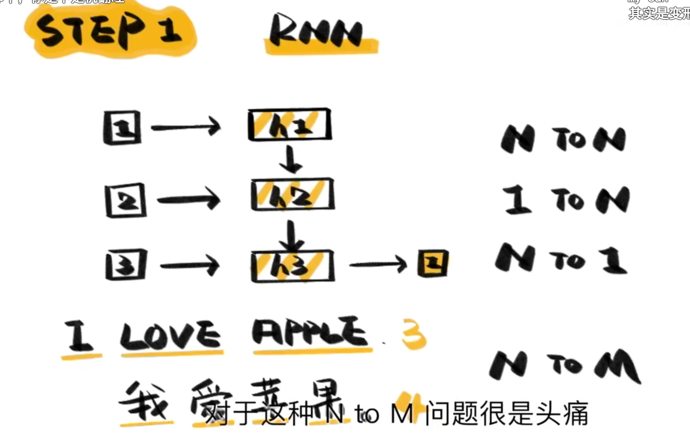
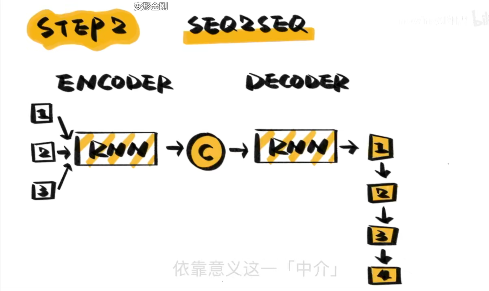
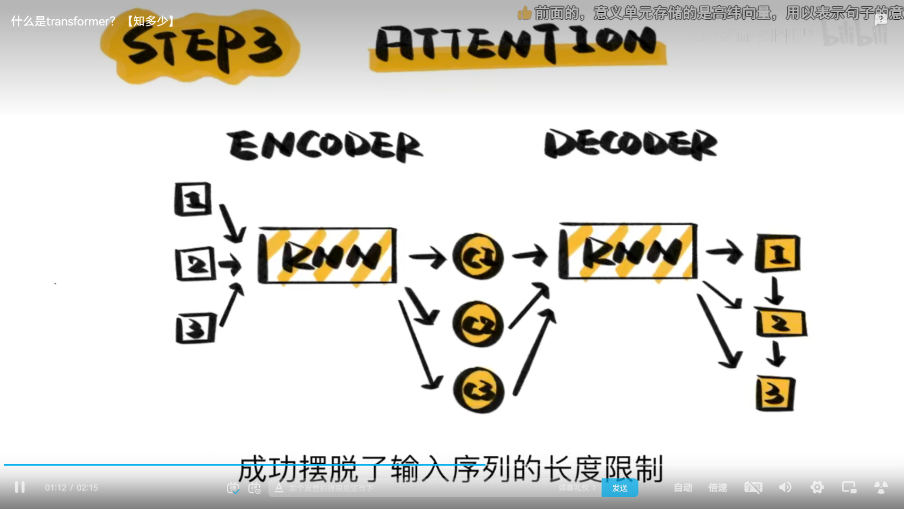
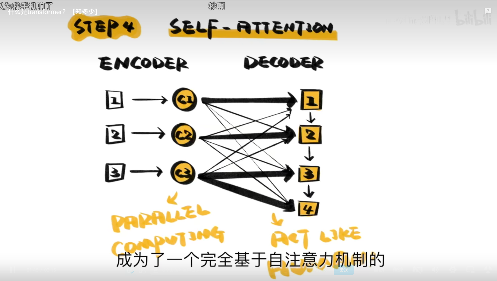

# Transform

## 历史
[什么是transformer？【知多少】](https://www.bilibili.com/video/BV1Zz4y127h1/)
1. RNN
   1. 处理机器翻译任务时，首先是经典的RNN模型，但是句子翻译不是一一对应的。RNN 可以解决 NToN,1ToN,NTo1，但是这是NToM问题。
   2. 
2. SEQ2SEQ
   1. Encoder-Decoder
   2. 
   3. 但是图中C即意义单元能存储的信息是有限的，句子长翻译精度会下降
3. ATTENTION
   1. Sequence to sequence 基础上加上注意力机制
   2. 
   3. 太慢了
4. SELF-ATTENTION
   1. 自注意力机制
   2. 提取每个单词意义，在根据生成顺序生成句子
   3. 接近人类
   4. 

第四步已经是transformer的机制了。

decoder化为BERT，encoder化为GPT。

