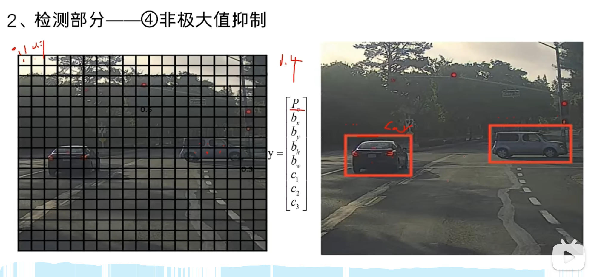

## 简介

### 如何检测

1. 将图片划分为很多个小网格
2. 对每个网格预测物体的中心点是否落在该格子里，在格子里的哪个地方，比如0.2，0.3，就是在该小格的x轴0.2，y轴0.3。它是 (x, y) 预测偏移量，使用sigmoid函数约束，所以小于1。
3. 同时预测宽高(w,h)，宽高是相对于整个图片的比率。（不一定，看版本）

\(P_c\) 置信度

\(b_x\)… 矩形中心，宽高

\(c_1\)… 每个标签的可能性

总的概率就是\(P_c * c_1\)

### 神经网络