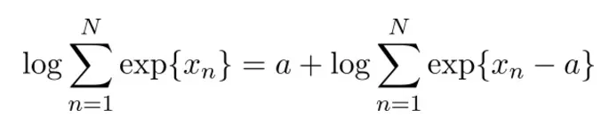
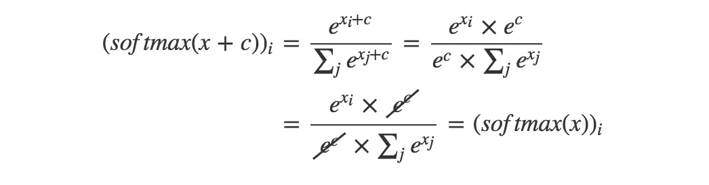

# softmax函数计算时候为什么要减去一个最大值

[softmax函数计算时候为什么要减去一个最大值？](https://zhuanlan.zhihu.com/p/29376573?from_voters_page=true)

举个例子，对于`[3,1,-3]`，直接计算是可行的，我们可以得到`(0.88,0.12,0)`。

但对于`[1000,1000,1000]`，却并不可行，我们会得到inf(这也是深度学习训练过程常见的一个错误，看了本文之后，以后出现inf的时候，至少可以考虑softmax运算的上溢和下溢)；对于`[-1000,-999,-1000]`，还是不行，我们会得到-inf。

softmax(x)=softmax(x+c)

