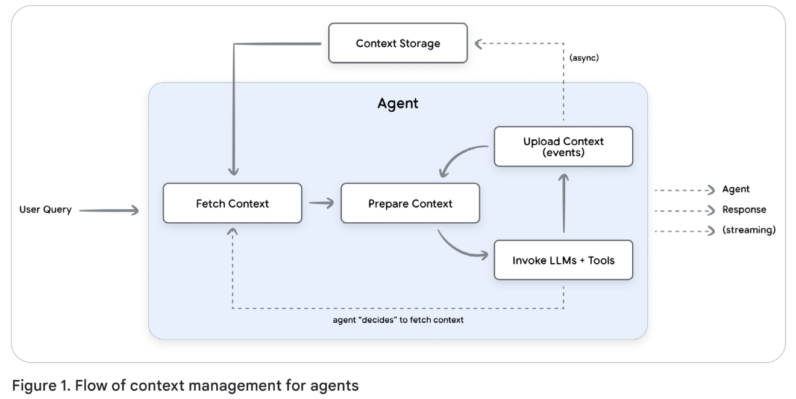
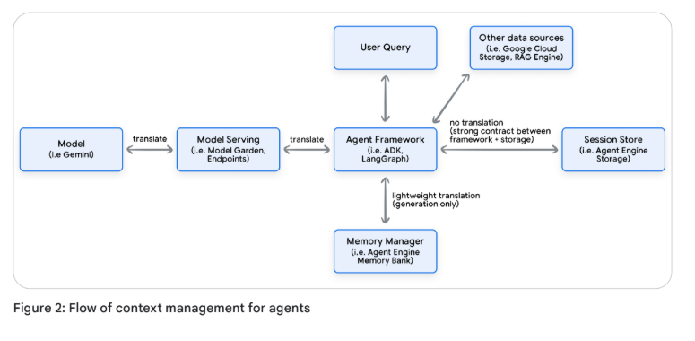
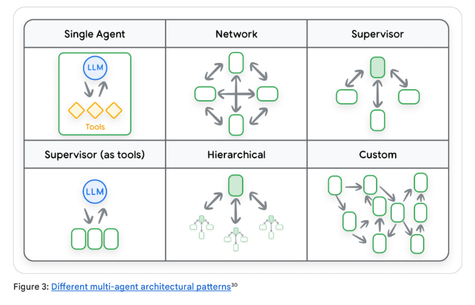
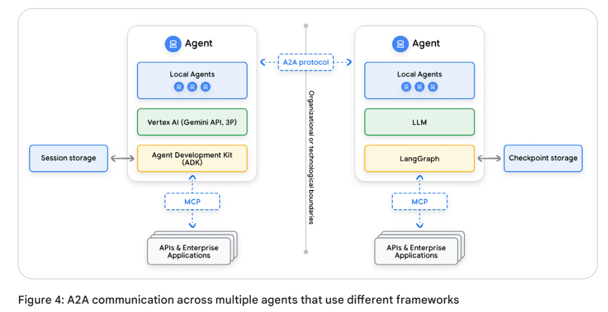
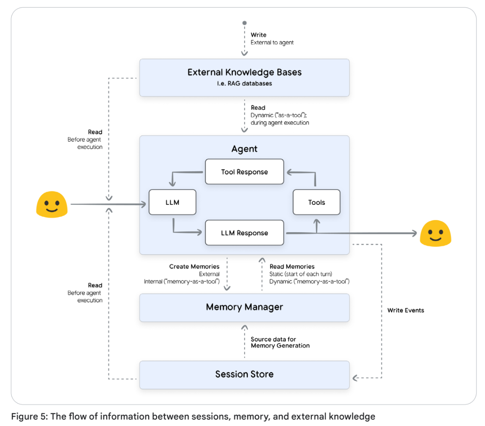

# Context Engineering: Sessions & Memory 白皮书

[Context Enginnering: Sessions, Memory](https://drive.google.com/file/d/1JW6Q_wwvBjMz9xzOtTldFfPiF7BrdEeQ/view)

Stateful and personal AI begins with Context Engineering. // 有状态和个性化的人工智能始于情境工程。

- [Introduction](#introduction)
- [上下文工程（Context Engineering）](#上下文工程context-engineering)
- [会话 (Sessions)](#会话-sessions)
  - [不同框架和模型之间的差异](#不同框架和模型之间的差异)
  - [多智能体系统的会话](#多智能体系统的会话)
    - [跨多个智能体框架的互操作性](#跨多个智能体框架的互操作性)
  - [会话在生产环境中的考虑因素 (Production Considerations for Sessions)](#会话在生产环境中的考虑因素-production-considerations-for-sessions)
    - [安全性与隐私 (Security and Privacy)](#安全性与隐私-security-and-privacy)
    - [数据完整性与生命周期管理 (Data Integrity and Lifecycle Management)](#数据完整性与生命周期管理-data-integrity-and-lifecycle-management)
    - [性能与可扩展性 (Performance and Scalability)](#性能与可扩展性-performance-and-scalability)
  - [管理长上下文对话：权衡与优化 (Managing long context conversation: tradeoffs and optimizations)](#管理长上下文对话权衡与优化-managing-long-context-conversation-tradeoffs-and-optimizations)
- [记忆 (Memory)](#记忆-memory)
  - [记忆的类型 (Types of memory)](#记忆的类型-types-of-memory)
    - [信息类型 (Types of information)](#信息类型-types-of-information)
    - [组织模式 (Organizational patterns)](#组织模式-organizational-patterns)
    - [存储架构 (Storage architectures)](#存储架构-storage-architectures)


## Introduction

本白皮书探讨了会话（Sessions）和记忆（Memory）在构建有状态、智能的大语言模型（LLM）代理中的关键作用，旨在赋能开发者创造更强大、个性化且具有持久性的 AI 体验。 为了让大语言模型能够记忆、学习并实现交互的个性化，开发者必须在模型有限的上下文窗口（Context Window）内，动态地组装和管理信息——这一过程被称为上下文工程（Context Engineering）。

以下是本白皮书探讨的核心概念总结：

* 上下文工程（Context Engineering）：在 LLM 的上下文窗口内动态组装和管理信息的过程，以实现有状态的智能代理。
* 会话：与代理进行完整对话的容器，保存对话的按时间顺序排列的历史记录以及代理的工作记忆。
* 记忆：长期持久化的机制，跨多个会话捕获并整合关键信息，为 LLM 代理提供连续且个性化的体验。

## 上下文工程（Context Engineering）

大语言模型（LLMs）本质上是无状态的。除了其训练数据外，它们的推理和意识仅局限于单次 API 调用中“上下文窗口”内提供的信息。这带来了一个根本性问题：AI 代理必须配备操作指令（明确可采取的行动）、用于推理的证据和事实数据，以及定义当前任务的即时对话信息。为了构建能够记忆、学习并实现个性化交互的有状态智能代理，开发者必须为每一轮对话构建这种上下文。这种为 LLM 动态组装和管理信息的过程被称为上下文工程。

上下文工程代表了传统**提示工程（Prompt Engineering）**的演进。提示工程侧重于编写优化的、通常是静态的系统指令。相反，上下文工程处理的是整个数据负载 (entire payload)，根据用户、对话历史和外部数据动态构建一个“状态感知型 (state-aware)”提示。它涉及战略性地选择、摘要和注入不同类型的信息，以在最小化噪声的同时最大化相关性。外部系统（如 RAG 数据库、会话存储和记忆管理器）负责管理大部分此类上下文，而代理框架必须编排这些系统，以检索并组装上下文，形成最终的提示。

你可以将上下文工程想象成代理的 “备菜（mise en place）” —— 这是厨师在烹饪前收集并准备所有食材的关键步骤。如果你只给厨师一份食谱（即提示），他们可能会利用手头仅有的随机食材做出一顿平庸的餐点。然而，如果你先确保他们拥有所有正确、优质的食材、专业的工具，并清晰了解摆盘风格，他们就能稳定地做出卓越且定制化的佳肴。上下文工程的目标是确保模型拥有完成任务所需的最相关信息，不多也不少。

上下文工程管理着复杂负载的组装，其中包含多种组件：

* **引导推理的上下文 (Context to guide reasoning)**：定义智能体的基础推理模式和可用操作，决定其行为：
  
    * **系统指令 (System Instructions)**：定义智能体的人格、能力和约束的高级指令。
    * **工具定义 (Tool Definitions)**：智能体用于与外部世界交互的 API 或函数的架构 (Schemas)。
    * **少样本示例 (Few-Shot Examples)**：通过上下文学习引导模型推理过程的精选示例。

* **证据与事实数据 (Evidential & Factual Data)**：是智能体进行推理的实质性数据，包括预有知识和为特定任务动态检索的信息；它作为智能体回答的“证据”：
  
    * **长期记忆 (Long-Term Memory)**：跨多个会话收集的关于用户或话题的持久化知识。
    * **外部知识 (External Knowledge)**：从数据库或文档中检索的信息，通常使用检索增强生成 (RAG)。
    * **工具输出 (Tool Outputs)**：工具返回的数据或结果。
    * **子智能体输出 (Sub-Agent Outputs)**：被委派特定子任务的专用智能体返回的结论或结果。
    * **人造物 (Artifacts)**：与用户或会话相关的非文本数据（如文件、图像）。

* **即时对话信息 (Immediate conversational information)**：使智能体立足于当前的交互，定义即时任务：
  
    * **对话历史 (Conversation History)**：当前交互的逐轮记录。
    * **状态 / 暂存区 (State / Scratchpad)**：智能体用于即时推理过程的临时、进行中的信息或计算。
    * **用户提示词 (User's Prompt)**：待解决的即时查询。

上下文的动态构建至关重要。例如，记忆并不是静态的；随着用户与智能体交互或新数据的摄入，必须有选择地检索和更新记忆。 此外，有效的推理通常依赖于上下文学习 ([in-context learning](https://arxiv.org/abs/2301.00234))（LLM 从提示词中的示例学习如何执行任务的过程）。 当智能体使用与当前任务相关的少量示例（few-shot examples），而不是依赖硬编码的示例时，上下文学习会更有效。 同样，RAG 工具会根据用户的即时查询检索外部知识。

构建上下文感知智能体最关键的挑战之一是管理不断增长的对话历史。 理论上，拥有大上下文窗口的模型可以处理长篇文字；但在实践中，随着上下文的增长，成本和延迟都会增加。 此外，模型可能会遭遇“上下文腐蚀（context rot）”现象，即随着上下文增加，模型关注关键信息的能力会减弱。 上下文工程通过采用动态更改历史记录的策略（如摘要、选择性剪枝或其他压缩技术）直接解决这一问题，在管理总 Token 数的同时保留重要信息，最终实现更稳健、更个性化的 AI 体验。

**上下文工程的运行循环**
这种实践表现为智能体在对话每一轮操作循环中的持续周期（见图1）：



1.  **获取上下文 (Fetch Context)**：智能体首先检索上下文，如用户记忆、RAG 文档和最近的对话事件。 为了进行动态上下文检索，智能体会使用用户查询和其他元数据来识别需要检索的信息。
2.  **准备上下文 (Prepare Context)**：智能体框架动态构建用于 LLM 调用的完整提示词。 虽然单个 API 调用可能是异步的，但准备上下文是一个阻塞的、“热路径（hot-path）”过程。 在上下文准备好之前，智能体无法继续。
3.  **调用 LLM 和工具 (Invoke LLM and Tools)**：智能体迭代地调用 LLM 和任何必要的工具，直到生成给用户的最终回复。 工具和模型的输出会被追加到上下文中。
4.  **上传上下文 (Upload Context)**：本轮对话中收集的新信息会被上传到持久存储中。 这通常是一个“后台”过程，允许智能体在异步进行记忆巩固或其他后期处理时完成执行。

这一生命周期的核心是两个基本组成部分：**会话 (Sessions)** 和 **记忆 (Memory)**。 会话管理单次对话的逐轮状态。 相比之下，记忆提供了长期持久化的机制，捕获并巩固跨多个会话的关键信息。

你可以将会话想象为你在进行特定项目时使用的**工作台或办公桌**。 当你工作时，桌上摆满了所有必要的工具、笔记和参考资料。一切都是即时可用的，但也是临时性的，且仅针对当前任务。 项目完成后，你不会直接把乱七八糟的桌面塞进仓库。相反，你开始创建记忆的过程，这就像一个**井井有条的文件柜**。 你会检查桌上的资料，丢弃草稿和冗余笔记，只将最关键、已定稿的文件存入贴有标签的文件夹。 这确保了文件柜始终是未来所有项目的简洁、可靠、高效的事实来源，而不会被工作台上的短暂混乱所堆满。 这个类比直接镜像了一个高效智能体的运作方式：会话是单次对话的临时工作台，而记忆是精心组织的文件柜，使其能够在未来的交互中召回关键信息。

在对上下文工程有了这种高层概述之后，我们现在可以深入探讨两个核心组件，首先从会话开始。

## 会话 (Sessions)

上下文工程的一个基础要素是**会话**。它封装了单次连续对话的即时对话历史和工作记忆。每个会话都是与特定用户关联的独立记录。会话允许智能体在单次对话范围内保持上下文并提供连贯的回复。一个用户可以拥有多个会话，但每个会话都作为特定交互的、互不相连的独立日志运行。每个会话包含两个关键组成部分：按时间顺序排列的历史记录（**事件 events**）和智能体的工作记忆（**状态 state**）。

**事件 (Events)** 是对话的基石。常见的事件类型包括：

  * **用户输入**：来自用户的消息（文本、音频、图像等）。
  * **智能体响应**：智能体对用户的回复。
  * **工具调用**：智能体决定使用外部工具或 API。
  * **工具输出**：工具调用返回的数据，智能体利用这些数据继续其推理过程。

除了聊天记录，会话通常还包括一个**状态 (State)** —— 一个结构化的“工作记忆”或暂存区。它保存与当前对话相关的临时结构化数据，例如购物车中的物品。

随着对话的进行，智能体会向会话追加额外的事件，并可能根据其内部逻辑更改状态。

事件的结构类似于传递给 Gemini API 的 `Content` 对象列表，其中每个带有角色 (role) 和内容部分 (parts) 的条目代表对话中的一轮或一个事件。

```python
contents = [
    {
        "role": "user",
        "parts": [ {"text": "What is the capital of France?"} ]
    }, {
        "role": "model",
        "parts": [ {"text": "The capital of France is Paris."} ]
    }
]
response = client.models.generate_content(
    model="gemini-2.5-flash",
    contents=contents
)
```

生产级智能体的执行环境通常是**无状态**的，这意味着在请求完成后不会保留任何信息。因此，必须将其对话历史保存到持久存储中，以维持连续的用户体验。虽然内存存储（in-memory storage）适用于开发阶段，但生产应用程序应利用强大的数据库来可靠地管理会话。

### 不同框架和模型之间的差异

虽然核心理念相似，但不同的智能体框架实现会话、事件和状态的方式各不相同。智能体框架负责维护 LLM 的对话历史和状态，利用这些上下文构建 LLM 请求，并解析和存储 LLM 的响应。

智能体框架充当代码与 LLM 之间的“通用翻译器”。开发者在每一轮对话中使用框架一致的内部数据结构，而框架则负责将其转换为 LLM 所需的精确格式。这种抽象非常强大，因为它将智能体逻辑与特定的 LLM 解耦，防止了供应商锁定。

（图 2 展示了智能体框架、模型、会话存储和记忆库之间的信息流）



最终目标是生成 LLM 能够理解的“请求”。对于 Google 的 Gemini 模型，这表现为一个 `List[Content]`。框架会自动处理从其内部对象（如 ADK 的 Event）到 Content 对象中对应角色和部分的映射过程。

不同框架的具体差异：

* **ADK (Agent Development Kit)**：使用显式的 `Session` 对象，包含一个 `Event` 对象列表和一个独立的 `state` 对象。这就像一个文件柜，一个文件夹放历史记录（事件），另一个放工作记忆（状态）。
* **LangGraph**：没有正式的“会话”对象，**状态 (state) 即会话**。这个全包的状态对象保存了对话历史（消息对象列表）和所有其他工作数据。与传统会话的“只增”日志不同，LangGraph 的状态是可变的，可以被转换或通过历史压缩策略进行修改，这对于管理长对话和 Token 限制非常有用。

### 多智能体系统的会话

在多智能体系统中，多个智能体协作完成任务，每个智能体专注于较小的专门任务。为了有效协作，它们必须共享信息。系统处理会话历史（所有交互的持久日志）的方式是这种协作架构的核心。

（图 3 展示了单智能体、网络化、主管模式、层级模式等不同的多智能体架构 [Different multi-agent architectural patterns](https://docs.cloud.google.com/architecture/choose-design-pattern-agentic-ai-system?hl=zh-cn)）



在探索管理这些历史记录的架构模式之前，必须将会话历史 (Session History) 与发送给大语言模型（LLM）的上下文 (Context) 区分开来。你可以将会话历史想象成整个对话的永久、未经删节的完整副本。 相比之下，上下文则是为单轮对话精心构建并发送给 LLM 的信息负载。 智能体在构建此上下文时，可能只从历史记录中选择相关的摘录，或者添加特定的格式（例如引导性的前缀/序言），以引导模型的回答。 本节重点关注的是在智能体之间传递的信息，而不一定是指发送给 LLM 的上下文。

智能体框架主要使用以下两种方法之一来处理多智能体系统的会话历史：**共享的统一历史** (Shared, Unified History)，即所有智能体都向同一个日志贡献内容；或者是**独立的个体历史** (Separate, Individual Histories)，即每个智能体维护各自的视角。 选择哪种模式取决于任务的性质以及智能体之间所需的协作风格。

**共享的统一历史模型 (Shared, Unified History Model)**

在这种模型中，系统中的所有智能体都从同一个对话历史中读取数据，并向其写入所有事件。 每个智能体的消息、工具调用和观察结果都会按时间顺序追加到一个中央日志中。 这种方法最适合紧密耦合的协作任务，因为这类任务需要单一的事实来源（Single Source of Truth），例如一个多步骤的解题过程，其中一个智能体的输出直接作为下一个智能体的输入。 即使在共享历史的情况下，子智能体也可能在将日志传递给 LLM 之前对其进行处理。 例如，它可以过滤出相关事件的子集，或者添加标签以识别每个事件是由哪个智能体生成的。

如果你使用 ADK 的“由 LLM 驱动的委派（LLM-driven delegation）”功能将任务移交给子智能体，那么该子智能体的所有中间事件都会被写入与根智能体（Root Agent）相同的会话中：

```python
# Python
from google.adk.agents import LlmAgent

# 子智能体可以访问会话并向其写入事件。
sub_agent_1 = LlmAgent(...)

# 子智能体可以可选地将最终回复文本（或结构化输出）保存到指定的“状态”键中。
sub_agent_2 = LlmAgent(
    ...,
    output_key="..."
)

# 父智能体。
root_agent = LlmAgent(
    ...,
    sub_agents=[sub_agent_1, sub_agent_2]
)
```

**独立的个体历史模型 (Separate, Individual Histories Model)**

在独立的个体历史模型中，每个智能体维护其私有的对话历史，并且对其他智能体表现为一个“黑箱”。所有内部过程——如中间想法、工具使用和推理步骤——都保留在该智能体的私有日志中，对他人不可见。通信仅通过显式消息进行，即智能体只分享其最终输出，而不分享其思考过程。

这种交互通常通过以下两种方式之一实现：将**智能体封装为工具 (Agent-as-a-tool)**，或者使用**智能体对智能体 (A2A) 协议**。在使用“智能体封装为工具”时，一个智能体像调用标准工具一样调用另一个智能体，传递输入并接收一个最终的、自包含的输出。而在使用“智能体对智能体 (A2A) 协议”时，智能体使用结构化的协议进行直接消息传递。

我们将在下一节详细探讨 A2A 协议。

#### 跨多个智能体框架的互操作性



框架使用内部数据表示方式，这为多智能体系统引入了一个关键的架构权衡：这种让智能体与 LLM 解耦的抽象，同时也让它与使用其他框架的智能体产生了隔阂。这种孤立在持久化层表现得尤为明显。会话的存储模型通常将数据库架构直接与框架的内部对象耦合，从而形成了一份僵化的、相对难以迁移的对话记录。因此，使用 LangGraph 构建的智能体无法原生理解由基于 ADK 的智能体持久化的独特“会话 (Session)”和“事件 (Event)”对象，这使得无缝的任务交接变得不可能。

为了协调这些相互孤立的智能体之间的协作，一种新兴的架构模式是**智能体对智能体 (A2A) 通信**。虽然这种模式允许智能体交换消息，但它未能解决共享丰富的上下文状态的核心问题。每个智能体的对话历史都编码在各自框架的内部架构中。因此，任何包含会话事件的 A2A 消息都需要一个转换层才能发挥作用。

一种更稳健的互操作性架构模式是将会话中共享的知识抽象到一个**与框架无关的数据层**中，例如“**记忆 (Memory)**”。与存储原始、特定框架对象（如事件和消息）的会话存储不同，记忆层旨在保存经过处理的规范信息。关键信息——如**摘要**、**提取的实体和事实**——从对话中提取出来，通常以字符串或字典的形式存储。记忆层的数据结构不与任何单一框架的内部数据表示耦合，这使其能够充当通用的公共数据层。这种模式允许异构智能体通过共享公共的认知资源，实现真正的协作智能，而无需定制转换器。

### 会话在生产环境中的考虑因素 (Production Considerations for Sessions)

当将智能体移至生产环境时，其会话管理系统必须从简单的日志记录进化为健壮的、企业级的服务。 关键的考虑因素分为三个核心领域：安全性与隐私、数据完整性以及性能。 像 Agent Engine Sessions 这样的托管式会话存储，正是为了解决这些生产需求而专门设计的。

#### 安全性与隐私 (Security and Privacy)

保护会话中包含的敏感信息是一项不可逾越的硬性要求。 **严格隔离**是最关键的安全原则。 会话由单一用户所有，系统必须执行严格隔离，以确保一个用户永远无法访问另一个用户的会话数据（例如通过访问控制列表 ACL）。 对会话存储的每一次请求都必须针对会话所有者进行身份验证和授权。

处理个人身份信息 (PII：Personally Identifiable Information) 的一项最佳实践是在将会话数据写入存储之前对其进行脱敏（红线涂黑）。 这是一项基础的安全措施，可大幅降低潜在数据泄露的风险和“波及范围”。 通过使用 Model Armor 等工具确保敏感数据永远不被持久化，可以简化对 GDPR（欧盟通用数据保护条例）和 CCPA（加州消费者隐私法案）等隐私法规的合规性，并建立用户信任。

#### 数据完整性与生命周期管理 (Data Integrity and Lifecycle Management)

生产系统需要针对会话数据随时间如何存储和维护制定明确的规则。 会话不应永久存在。 您可以实施生存时间 (TTL) 策略来自动删除非活跃会话，从而管理存储成本并减少数据管理开销。 这需要一份明确的数据保留策略，定义会话在被存档或永久删除之前应保留多长时间。

此外，系统必须保证操作是以确定的顺序追加到会话历史记录中的。 保持事件正确的时序逻辑是对话日志完整性的基础。

#### 性能与可扩展性 (Performance and Scalability)

会话数据处于每次用户交互的“热路径（hot path）”上，因此其性能是首要考虑的问题。读取和写入会话历史必须极其迅速，以确保响应及时的用户体验。由于智能体运行时通常是无状态的，因此在每一轮对话开始时，必须从中央数据库检索完整的会话历史，这会产生网络传输延迟。

为了缓解延迟，减少传输的数据量至关重要。一个关键的优化手段是在将会话历史发送给智能体之前对其进行过滤或压缩。例如，您可以移除对于当前对话状态不再需要的陈旧、无关的函数调用输出。接下来的章节将详细介绍几种压缩历史记录的策略，以有效管理长上下文对话。

### 管理长上下文对话：权衡与优化 (Managing long context conversation: tradeoffs and optimizations)

在简单的架构中，会话（Session）是用户与智能体之间不可变的对话日志。然而，随着对话规模的扩大，对话消耗的 Token 数量也会随之增加。虽然现代大语言模型（LLM）可以处理长上下文，但仍存在局限性，特别是对于延迟敏感型应用而言：

1. **上下文窗口限制 (Context Window Limits)**：每个 LLM 都有一次性可以处理的最大文本量（即上下文窗口）。如果对话历史超过了这一限制，API 调用将会失败。
2. **API 成本 (API Costs)**：大多数 LLM 提供商根据发送和接收的 Token 数量计费。较短的历史记录意味着更少的 Token 消耗和更低的单轮对话成本。
3. **延迟/速度 (Latency)**：向模型发送更多文本需要更长的处理时间，这会导致用户感知的响应时间变慢。通过压缩策略（Compaction）可以使智能体保持快速响应。
4. **质量 (Quality)**：随着 Token 数量的增加，由于上下文中噪声的增多以及自回归误差的积累，模型性能可能会下降。

管理与智能体的长对话，可以比作一位精明的旅行者为长途旅行整理行李箱。行李箱代表了智能体有限的上下文窗口，而衣物和物品则是对话中的各类信息片段。如果你只是简单地把所有东西塞进去，行李箱会变得过于沉重且杂乱无章，导致你难以快速找到所需物品——这正如同过载的上下文窗口会增加处理成本并减慢响应速度。

另一方面，如果你带的东西太少，就有可能遗忘护照或厚大衣等必需品，从而影响整个行程——这就像智能体可能会丢失关键上下文，导致给出无关或错误的回答。旅行者和智能体都面临类似的约束：成功的关键不在于你能携带多少，而在于只携带你真正需要的。

压缩策略通过缩小冗长的对话历史，将对话内容浓缩以适应模型的上下文窗口，从而降低 API 成本和延迟。 随着对话变长，每一轮发送给模型的基础历史记录可能会变得过于庞大。 压缩策略通过智能地修剪历史记录，同时努力保留最重要的上下文来解决这一问题。

那么，如何知道在不丢失有价值信息的前提下该丢弃哪些会话内容呢？ 策略从简单的截断到复杂的压缩不等：

* **保留最后 N 轮 (Keep the last N turns)**：这是最简单的策略。 智能体仅保留最近的 N 轮对话（即“滑动窗口”），并丢弃所有更旧的内容。
* **基于 Token 的截断 (Token-Based Truncation)**：在向模型发送历史记录之前，智能体会从最新消息开始向后计算 Token 数量。 它在不超出预设 Token 限制（如 4000 Token）的情况下，包含尽可能多的消息。 超过限制的旧内容会被直接切断。
* **递归摘要 (Recursive Summarization)**：对话中较旧的部分被 AI 生成的摘要所取代。 随着对话增长，智能体定期调用另一个 LLM 来总结最旧的消息。 该摘要随后作为历史记录的浓缩形式，通常作为前缀放在最新的原始消息之前。

比如，你可以通过在 ADK 应用中使用内置插件来保留最后 N 轮对话，以限制发送给模型的上下文。这不会修改存储在会话存储中的历史事件：

```python
from google.adk.apps import App
from google.adk.plugins.context_filter_plugin import ContextFilterPlugin

app = App(
    name='hello_world_app',
    root_agent=agent,
    plugins=[
        # Keep the last 10 turns and the most recent user query.
        ContextFilterPlugin(num_invocations_to_keep=10),
    ],
)
```

鉴于复杂的压缩策略旨在降低成本和延迟，因此将昂贵的操作（如递归摘要）放在**后台异步执行**并持久化结果至关重要。 “在后台”执行确保了客户端无需等待，而“持久化”则确保昂贵的计算不会被重复执行。 通常，智能体的记忆管理器负责生成并持久化这些递归摘要。 智能体还必须记录哪些事件已被包含在压缩摘要中，以防止原始的、冗长的事件被不必要地再次发送给 LLM。

此外，智能体必须决定何时需要进行压缩。 触发机制通常分为以下几类：

* **基于数量的触发 (Count-Based Triggers)**：当对话超过预定义的阈值（如 Token 大小或对话轮数）时，触发压缩。 这种方法对于管理上下文长度通常“足够好”。
* **基于时间的触发 (Time-Based Triggers)**：压缩并非由对话大小触发，而是由非活动状态触发。 如果用户停止交互达到设定时间（如 15 或 30 分钟），系统可以在后台运行压缩任务。
* **基于事件的触发 (Event-Based Triggers)**：当智能体检测到特定的任务、子目标或对话话题已经结束时，决定触发压缩（即语义/任务完成触发）。

比如，你可以使用 ADK 的 `EventsCompactionConfig` 来在配置的轮数后触发基于 LLM 的摘要：

```python
from google.adk.apps import App
from google.adk.apps.app import EventsCompactionConfig
app = App(
    name='hello_world_app',
    root_agent=agent,
    events_compaction_config=EventsCompactionConfig(
        compaction_interval=5,
        overlap_size=1,
    ),
)
```

**记忆生成**是从冗长且嘈杂的数据源中提取持久化知识的广泛能力。 在本节中，我们介绍了一个从对话历史中提取信息的主要示例：会话压缩。 压缩精炼了整个对话的逐字记录，提取关键事实和摘要，同时丢弃对话中的填充内容。

在压缩的基础上，下一节将更广泛地探索记忆的生成与管理。 我们将讨论创建、存储和检索记忆的各种方式，以构建智能体的长期知识库。

## 记忆 (Memory)

记忆与会话共享深度的共生关系：会话是生成记忆的主要数据来源，而记忆是管理会话大小的关键策略。 记忆是从对话或数据源中提取的有意义信息的快照。 它是一种压缩后的表示，保留了重要的上下文，使其在未来的交互中发挥作用。 通常，记忆会跨会话持久化，以提供连续且个性化的体验。

作为一种专门的、解耦的服务，“记忆管理器 (Memory Manager)”为多智能体互操作性提供了基础。 记忆管理器经常使用与框架无关的数据结构，如简单的字符串和字典。 这允许基于不同框架构建的智能体连接到同一个记忆库，从而创建一个任何连接的智能体都能利用的共享知识库。

注意：某些框架可能会将会话或逐字对话称为“短期记忆”。 在本白皮书中，记忆被定义为提取后的信息，而非轮次对话的原始记录。

存储与检索记忆 (Storing and retrieving memories) 对于构建复杂且智能的智能体至关重要。一个强大的记忆系统通过解锁以下几项关键能力，能将基础的聊天机器人转变为真正的智能体：

* **个性化 (Personalization)**：这是最常见的用例，即记住用户的偏好、事实和过去的交互，以定制未来的回复。例如，记住用户喜欢的球队或偏好的飞机座位，可以创造更具帮助性和个性化的体验。
* **上下文窗口管理 (Context Window Management)**：随着对话变长，完整的历史记录可能会超过 LLM 的上下文窗口。记忆系统可以通过创建摘要或提取关键事实来压缩这些历史，在不发送数千个 Token 的情况下保留上下文，从而降低成本和延迟。
* **数据挖掘与洞察 (Data Mining and Insight)**：通过对大量用户的存储记忆进行分析（以聚合且保护隐私的方式），可以从噪声中提取出洞察。例如，零售聊天机器人可能会识别出许多用户都在询问某产品的退货政策，从而提醒潜在的问题。
* **智能体自我提升与适应 (Agent Self-Improvement and Adaptation)**：智能体通过创建关于自身表现的程序性记忆来学习以往的运行经验，记录哪些策略、工具或推理路径带来了成功的产出。这使智能体能够建立一套有效解决方案的“剧本”，使其能够随时间推移不断适应并改进解决问题的能力。

在 AI 系统中创建、存储和利用记忆是一个协作过程。从最终用户到开发者的代码，技术栈中的每个组件都有其独特的作用：

* **用户 (The User)**：提供记忆的原始源数据。在某些系统中，用户也可以直接提供记忆（如通过表单）。
* **智能体/开发者逻辑 (The Agent / Developer Logic)**：配置如何决定“记住什么”和“何时记住”，并编排对记忆管理器的调用。在简单架构中，开发者可以实现“总是检索”和“总是触发生成”的逻辑。在更高级的架构中，开发者可以实现“记忆即工具 (memory-as-a-tool)”，由智能体（通过 LLM）自行决定何时检索或生成记忆。
* **智能体框架 (The Agent Framework，如 ADK, LangGraph)**：提供记忆交互的结构和工具。框架充当“管道”角色，它定义了开发者逻辑如何访问对话历史以及如何与记忆管理器交互，但其本身不管理长期存储。它还定义了如何将检索到的记忆填入上下文窗口。
* **会话存储 (The Session Storage)**：储会话中逐轮的对话内容。这些原始对话将被摄入记忆管理器以生成记忆。
* **记忆管理器 (The Memory Manager，如 Agent Engine Memory Bank)**：负责记忆的存储、检索和压缩。其存储和检索机制取决于所选的服务提供商。这是一个专门的服务或组件，负责**处理由智能体识别出的潜在记忆的完整生命周期**。
  * 提取 (Extraction)：从源数据中提炼关键信息。
  * 整合 (Consolidation)：对记忆进行策划，合并重复的实体。
  * 存储 (Storage)：将记忆持久化到数据库中。
  * 检索 (Retrieval)：获取相关的记忆，为新的交互提供上下文。



图5是sessions, memory, and external knowledge之间的信息流

这种职责划分确保了开发者可以专注于智能体特有的逻辑，而无需构建复杂的记忆持久化和管理底层基础设施。必须认识到，记忆管理器是一个主动系统，而不仅仅是一个被动的向量数据库。虽然它使用相似度搜索进行检索，但其核心价值在于它能够随着时间的推移，智能地提取、整合和策划记忆。托管式记忆服务（如 Agent Engine Memory Bank）可以处理记忆生成和存储的全生命周期。

这种检索能力也是为什么记忆经常被拿来与另一种关键架构模式进行比较的原因：检索增强生成 (RAG)。然而，它们是基于不同的架构原则构建的，因为 RAG 处理的是静态的外部数据，而记忆则策划动态的、用户特有的上下文。它们履行两个截然不同且互补的角色：RAG 使智能体成为事实专家，而记忆使其成为用户专家。下表打破了它们之间的高级差异：

| 项目     | RAG 引擎                                                                               | 记忆管理器                                                                                       |
| -------- | -------------------------------------------------------------------------------------- | ------------------------------------------------------------------------------------------------ |
| 主要目标 | 将外部的、事实性的知识注入到上下文中                                                   | 创建个性化、有状态的体验。代理会记住事实，随着时间适应用户，并维护长期上下文                     |
| 数据来源 | 静态、预索引的外部知识库（如 PDF、Wiki、文档、API 等）                                 | 用户与代理之间的对话                                                                             |
| 隔离级别 | 通常是共享的：知识库通常是全局的、只读资源，所有用户可访问，以确保一致、基于事实的回答 | 高度隔离：记忆几乎总是按用户作用域划分，以防止数据泄露                                           |
| 信息类型 | 静态、事实性、权威性信息。通常包含领域特定数据、产品细节或技术文档                     | 动态（通常是用户特定的）。记忆来源于对话，因此存在一定不确定性                                   |
| 写入模式 | 批处理；由离线的管理操作触发                                                           | 事件驱动处理；按一定节奏触发（如每轮对话或会话结束）；也可作为工具（由代理决定生成记忆）         |
| 读取模式 | RAG 数据几乎总是作为工具按需检索；当代理判断用户查询需要外部信息时才调用               | 两种常见读取方式：<br>• 作为工具：当查询需要用户信息时检索<br>• 静态检索：每轮对话开始时始终检索 |
| 数据格式 | 自然语言“片段（chunk）”                                                                | 自然语言片段或结构化用户档案                                                                     |
| 数据准备 | 分块与索引：将源文档拆分为更小的片段，并转换为向量嵌入以便快速检索                     | 提取与整合：从对话中提取关键信息，确保内容不重复且不矛盾                                         |

理解两者差异的一个有用的方法是，将 RAG 想象成智能体的研究图书馆员，而将记忆管理器想象成它的私人助理。

研究图书馆员 **(RAG)** 工作在一个巨大的公共图书馆里，那里堆满了百科全书、教科书和官方文件。当智能体需要一个确凿的事实时——比如产品的技术规格或某个历史日期——它会咨询这位图书馆员。图书馆员从这个静态的、共享的且权威的知识库中检索信息，以提供一致的、事实性的答案。图书馆员是关于世界事实的专家，但他们对提出问题的用户一无所知，没有任何私人了解。

相比之下，私人助理 **(Memory)** 则一直跟随在智能体身边，随身携带一本私密笔记本，记录下与特定用户交互的每一个细节。这本笔记本是动态的且高度隔离的，里面记录了个人偏好、过去的对话以及不断演变的目标。当智能体需要回想起用户最喜欢的球队，或是上周项目讨论的背景时，它就会求助于这位助理。助理的专长不在于全球性的事实，而在于用户本人。

最终，一个真正智能的智能体两者皆需。RAG 为其提供关于世界的专业知识，而记忆则使其能够深入理解它所服务的用户。

下一节将通过检查记忆的核心组成部分来解构记忆的概念：包括它存储的信息类型、组织模式、存储与创建机制、其作用范围（Scope）的策略性定义，以及它对多模态数据与文本数据的处理方式。

### 记忆的类型 (Types of memory)

智能体的记忆可以根据**信息的存储方式**以及**信息的捕获方式**进行分类。这些不同类型的记忆协同工作，构成了对用户及其需求的丰富、情境化的理解。在所有类型的记忆中，有一个通用的原则：记忆是描述性的，而不是预测性的。

一个“记忆”是记忆管理器返回的一个原子化的上下文片段，供智能体作为上下文使用。虽然具体的模式（Schema）可能有所不同，但单个记忆通常由两个主要部分组成：**内容 (Content)** 和 **元数据 (Metadata)**。

* **内容 (Content)** 是从源数据（例如会话的原始对话）中提取出的记忆实质。关键在于，内容被设计为框架无关 (framework-agnostic) 的，使用任何智能体都能轻松摄取的简单数据结构。内容可以是结构化数据，也可以是非结构化数据。**结构化记忆**包含的信息通常以通用格式（如字典或 JSON）存储。其模式通常由开发者定义，而非特定框架。例如：`{"seat_preference": "Window"}`。**非结构化记忆**是自然语言描述，捕捉了较长交互、事件或话题的本质。例如：“用户偏好靠窗的座位”。

* **元数据 (Metadata)**提供关于记忆的上下文，通常存储为简单的字符串。这可以包括记忆的唯一标识符、所有者标识符，以及描述内容或数据源的标签。

#### 信息类型 (Types of information)

除了基础结构，记忆还可以根据它们所代表的知识类型进行分类。这种区分对于理解智能体如何使用记忆至关重要，它将记忆分为源自认知科学的两个主要功能类别：**陈述性记忆**（“知道是什么”）和**程序性记忆**（“知道如何做”）。

* **陈述性记忆 (Declarative memory)** 是智能体对事实、数据和事件的认知。它是智能体可以明确陈述或“宣告”的所有信息。如果该记忆是回答一个“是什么”的问题，它就属于陈述性记忆。这一类别涵盖了通用世界知识（语义记忆）和特定的用户事实（实体/情景记忆）。
* **程序性记忆 (Procedural memory)** 是智能体对技能和工作流的认知。它通过隐式地演示如何正确执行任务来引导智能体的行动。如果该记忆有助于回答一个“如何做”的问题——例如预订旅行所需的正确工具调用序列——它就是程序性的。

#### 组织模式 (Organizational patterns)

一旦记忆被创建，接下来的问题是如何组织它。记忆管理器通常采用以下一种或多种模式来组织记忆：集合 (Collections)、结构化用户配置文件，或 **“滚动摘要”**。这些模式定义了单个记忆之间以及它们与用户之间的关系。

* **集合 (Collections)**模式将内容组织为单个用户的多个自包含的自然语言记忆。每个记忆都是一个独立的事件、摘要或观察结果，尽管对于一个高层话题，集合中可能会有多个记忆。集合允许存储并搜索与特定目标或话题相关的更广泛、结构化程度较低的信息池。
* **结构化用户配置文件 (Structured user profile)** 模式将记忆组织为关于用户的一组核心事实，类似于一张不断更新最新稳定信息的名片。它旨在快速查询基本的事实信息，如姓名、偏好和账户详情。
* 与结构化用户配置文件不同，**“滚动”摘要 ("rolling" summary)** 模式将所有信息整合到一段不断进化的记忆中，代表了整个用户与智能体关系的自然语言摘要。管理器不会创建新的独立记忆，而是持续更新这一份主文档。这种模式常用于压缩长会话，在管理总 Token 数的同时保留关键信息。

#### 存储架构 (Storage architectures)

