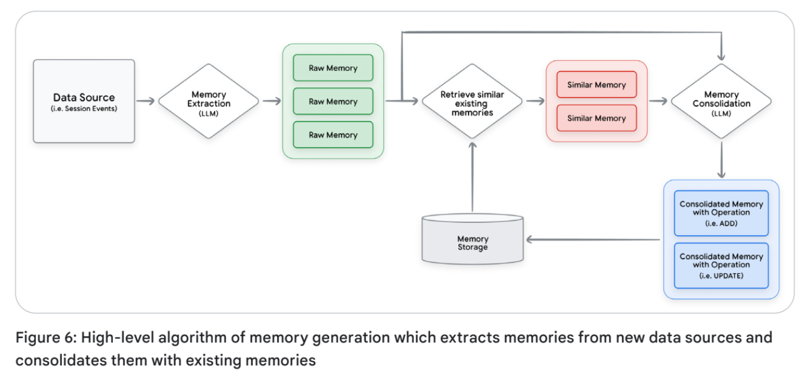
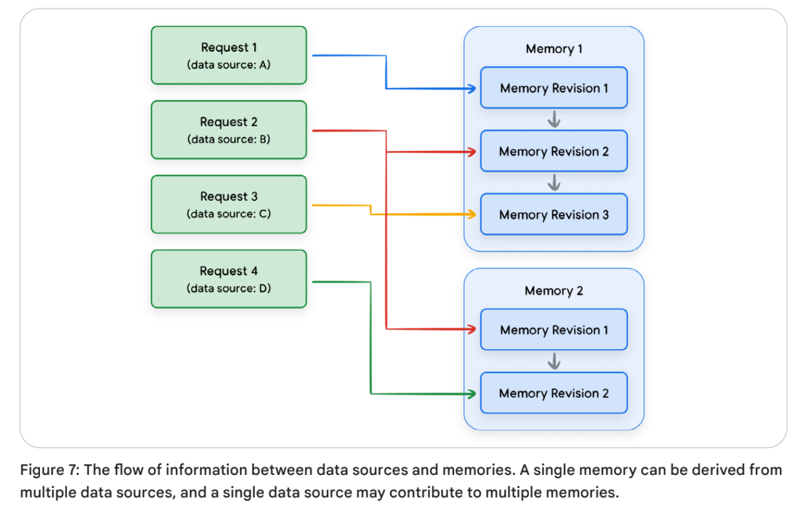

# Context Engineering: Sessions & Memory 白皮书

[Context Enginnering: Sessions, Memory](https://drive.google.com/file/d/1JW6Q_wwvBjMz9xzOtTldFfPiF7BrdEeQ/view)

Stateful and personal AI begins with Context Engineering. // 有状态和个性化的人工智能始于情境工程。

- [1. Introduction](#1-introduction)
- [2. 上下文工程（Context Engineering）](#2-上下文工程context-engineering)
- [3. 会话 (Sessions)](#3-会话-sessions)
  - [3.1. 不同框架和模型之间的差异](#31-不同框架和模型之间的差异)
  - [3.2. 多智能体系统的会话](#32-多智能体系统的会话)
    - [3.2.1. 跨多个智能体框架的互操作性](#321-跨多个智能体框架的互操作性)
  - [3.3. 会话在生产环境中的考虑因素 (Production Considerations for Sessions)](#33-会话在生产环境中的考虑因素-production-considerations-for-sessions)
    - [3.3.1. 安全性与隐私 (Security and Privacy)](#331-安全性与隐私-security-and-privacy)
    - [3.3.2. 数据完整性与生命周期管理 (Data Integrity and Lifecycle Management)](#332-数据完整性与生命周期管理-data-integrity-and-lifecycle-management)
    - [3.3.3. 性能与可扩展性 (Performance and Scalability)](#333-性能与可扩展性-performance-and-scalability)
  - [3.4. 管理长上下文对话：权衡与优化 (Managing long context conversation: tradeoffs and optimizations)](#34-管理长上下文对话权衡与优化-managing-long-context-conversation-tradeoffs-and-optimizations)
- [4. 记忆 (Memory)](#4-记忆-memory)
  - [4.1. 记忆的类型 (Types of memory)](#41-记忆的类型-types-of-memory)
    - [4.1.1. 信息类型 (Types of information)](#411-信息类型-types-of-information)
    - [4.1.2. 组织模式 (Organizational patterns)](#412-组织模式-organizational-patterns)
    - [4.1.3. 存储架构 (Storage architectures)](#413-存储架构-storage-architectures)
    - [4.1.4. 创建机制 (Creation mechanisms)](#414-创建机制-creation-mechanisms)
    - [4.1.5. 记忆范围 (Memory scope)](#415-记忆范围-memory-scope)
    - [4.1.6. 多模态记忆 (Multimodal memory)](#416-多模态记忆-multimodal-memory)
  - [4.2. 记忆生成：提取与整合 (Memory Generation: Extraction and Consolidation)](#42-记忆生成提取与整合-memory-generation-extraction-and-consolidation)
    - [4.2.1. 深入探讨：记忆提取 (Deep-dive: Memory Extraction)](#421-深入探讨记忆提取-deep-dive-memory-extraction)
    - [4.2.2. 深入探讨：记忆整合 (Deep-dive: Memory Consolidation)](#422-深入探讨记忆整合-deep-dive-memory-consolidation)
    - [4.2.3. 记忆溯源 (Memory Provenance)](#423-记忆溯源-memory-provenance)
      - [4.2.3.1. 在记忆管理中考虑记忆血缘 (Accounting for memory lineage during memory management)](#4231-在记忆管理中考虑记忆血缘-accounting-for-memory-lineage-during-memory-management)
      - [4.2.3.2. 在推理过程中考虑记忆血缘 (Accounting for memory lineage during inference)](#4232-在推理过程中考虑记忆血缘-accounting-for-memory-lineage-during-inference)
    - [4.2.4. 触发记忆生成 (Triggering memory generation)](#424-触发记忆生成-triggering-memory-generation)
      - [4.2.4.1. 记忆即工具 (Memory-as-a-Tool)](#4241-记忆即工具-memory-as-a-tool)
      - [4.2.4.2. 后台操作 vs. 阻塞操作 (Background vs. Blocking Operations)](#4242-后台操作-vs-阻塞操作-background-vs-blocking-operations)
    - [4.2.5. 记忆检索 (Memory Retrieval)](#425-记忆检索-memory-retrieval)
    - [4.2.6. 检索时机 (Timing for retrieval)](#426-检索时机-timing-for-retrieval)
  - [4.3. 记忆推理 (Inference with Memories)](#43-记忆推理-inference-with-memories)
    - [4.3.1. 系统指令中的记忆 (Memories in the System Instructions)](#431-系统指令中的记忆-memories-in-the-system-instructions)
    - [4.3.2. 对话历史中的记忆 (Memories in the Conversation History)](#432-对话历史中的记忆-memories-in-the-conversation-history)
  - [4.4. 程序性记忆 (Procedural memories)](#44-程序性记忆-procedural-memories)
  - [4.5. 测试与评估 (Testing and Evaluation)](#45-测试与评估-testing-and-evaluation)
  - [4.6. 记忆的生产注意事项 (Production considerations for Memory)](#46-记忆的生产注意事项-production-considerations-for-memory)
    - [4.6.1. **隐私与安全风险** (Privacy and security risks)](#461-隐私与安全风险-privacy-and-security-risks)
- [5. 结论 (Conclusion)](#5-结论-conclusion)


## 1. Introduction

本白皮书探讨了会话（Sessions）和记忆（Memory）在构建有状态、智能的大语言模型（LLM）代理中的关键作用，旨在赋能开发者创造更强大、个性化且具有持久性的 AI 体验。 为了让大语言模型能够记忆、学习并实现交互的个性化，开发者必须在模型有限的上下文窗口（Context Window）内，动态地组装和管理信息——这一过程被称为上下文工程（Context Engineering）。

以下是本白皮书探讨的核心概念总结：

* 上下文工程（Context Engineering）：在 LLM 的上下文窗口内动态组装和管理信息的过程，以实现有状态的智能代理。
* 会话：与代理进行完整对话的容器，保存对话的按时间顺序排列的历史记录以及代理的工作记忆。
* 记忆：长期持久化的机制，跨多个会话捕获并整合关键信息，为 LLM 代理提供连续且个性化的体验。

## 2. 上下文工程（Context Engineering）

大语言模型（LLMs）本质上是无状态的。除了其训练数据外，它们的推理和意识仅局限于单次 API 调用中“上下文窗口”内提供的信息。这带来了一个根本性问题：AI 代理必须配备操作指令（明确可采取的行动）、用于推理的证据和事实数据，以及定义当前任务的即时对话信息。为了构建能够记忆、学习并实现个性化交互的有状态智能代理，开发者必须为每一轮对话构建这种上下文。这种为 LLM 动态组装和管理信息的过程被称为上下文工程。

上下文工程代表了传统**提示工程（Prompt Engineering）**的演进。提示工程侧重于编写优化的、通常是静态的系统指令。相反，上下文工程处理的是整个数据负载 (entire payload)，根据用户、对话历史和外部数据动态构建一个“状态感知型 (state-aware)”提示。它涉及战略性地选择、摘要和注入不同类型的信息，以在最小化噪声的同时最大化相关性。外部系统（如 RAG 数据库、会话存储和记忆管理器）负责管理大部分此类上下文，而代理框架必须编排这些系统，以检索并组装上下文，形成最终的提示。

你可以将上下文工程想象成代理的 “备菜（mise en place）” —— 这是厨师在烹饪前收集并准备所有食材的关键步骤。如果你只给厨师一份食谱（即提示），他们可能会利用手头仅有的随机食材做出一顿平庸的餐点。然而，如果你先确保他们拥有所有正确、优质的食材、专业的工具，并清晰了解摆盘风格，他们就能稳定地做出卓越且定制化的佳肴。上下文工程的目标是确保模型拥有完成任务所需的最相关信息，不多也不少。

上下文工程管理着复杂负载的组装，其中包含多种组件：

* **引导推理的上下文 (Context to guide reasoning)**：定义智能体的基础推理模式和可用操作，决定其行为：
  
    * **系统指令 (System Instructions)**：定义智能体的人格、能力和约束的高级指令。
    * **工具定义 (Tool Definitions)**：智能体用于与外部世界交互的 API 或函数的架构 (Schemas)。
    * **少样本示例 (Few-Shot Examples)**：通过上下文学习引导模型推理过程的精选示例。

* **证据与事实数据 (Evidential & Factual Data)**：是智能体进行推理的实质性数据，包括预有知识和为特定任务动态检索的信息；它作为智能体回答的“证据”：
  
    * **长期记忆 (Long-Term Memory)**：跨多个会话收集的关于用户或话题的持久化知识。
    * **外部知识 (External Knowledge)**：从数据库或文档中检索的信息，通常使用检索增强生成 (RAG)。
    * **工具输出 (Tool Outputs)**：工具返回的数据或结果。
    * **子智能体输出 (Sub-Agent Outputs)**：被委派特定子任务的专用智能体返回的结论或结果。
    * **人造物 (Artifacts)**：与用户或会话相关的非文本数据（如文件、图像）。

* **即时对话信息 (Immediate conversational information)**：使智能体立足于当前的交互，定义即时任务：
  
    * **对话历史 (Conversation History)**：当前交互的逐轮记录。
    * **状态 / 暂存区 (State / Scratchpad)**：智能体用于即时推理过程的临时、进行中的信息或计算。
    * **用户提示词 (User's Prompt)**：待解决的即时查询。

上下文的动态构建至关重要。例如，记忆并不是静态的；随着用户与智能体交互或新数据的摄入，必须有选择地检索和更新记忆。 此外，有效的推理通常依赖于上下文学习 ([in-context learning](https://arxiv.org/abs/2301.00234))（LLM 从提示词中的示例学习如何执行任务的过程）。 当智能体使用与当前任务相关的少量示例（few-shot examples），而不是依赖硬编码的示例时，上下文学习会更有效。 同样，RAG 工具会根据用户的即时查询检索外部知识。

构建上下文感知智能体最关键的挑战之一是管理不断增长的对话历史。 理论上，拥有大上下文窗口的模型可以处理长篇文字；但在实践中，随着上下文的增长，成本和延迟都会增加。 此外，模型可能会遭遇“上下文腐蚀（context rot）”现象，即随着上下文增加，模型关注关键信息的能力会减弱。 上下文工程通过采用动态更改历史记录的策略（如摘要、选择性剪枝或其他压缩技术）直接解决这一问题，在管理总 Token 数的同时保留重要信息，最终实现更稳健、更个性化的 AI 体验。

**上下文工程的运行循环**
这种实践表现为智能体在对话每一轮操作循环中的持续周期（见图1）：


1.  **获取上下文 (Fetch Context)**：智能体首先检索上下文，如用户记忆、RAG 文档和最近的对话事件。 为了进行动态上下文检索，智能体会使用用户查询和其他元数据来识别需要检索的信息。
2.  **准备上下文 (Prepare Context)**：智能体框架动态构建用于 LLM 调用的完整提示词。 虽然单个 API 调用可能是异步的，但准备上下文是一个阻塞的、“热路径（hot-path）”过程。 在上下文准备好之前，智能体无法继续。
3.  **调用 LLM 和工具 (Invoke LLM and Tools)**：智能体迭代地调用 LLM 和任何必要的工具，直到生成给用户的最终回复。 工具和模型的输出会被追加到上下文中。
4.  **上传上下文 (Upload Context)**：本轮对话中收集的新信息会被上传到持久存储中。 这通常是一个“后台”过程，允许智能体在异步进行记忆巩固或其他后期处理时完成执行。

这一生命周期的核心是两个基本组成部分：**会话 (Sessions)** 和 **记忆 (Memory)**。 会话管理单次对话的逐轮状态。 相比之下，记忆提供了长期持久化的机制，捕获并巩固跨多个会话的关键信息。

你可以将会话想象为你在进行特定项目时使用的**工作台或办公桌**。 当你工作时，桌上摆满了所有必要的工具、笔记和参考资料。一切都是即时可用的，但也是临时性的，且仅针对当前任务。 项目完成后，你不会直接把乱七八糟的桌面塞进仓库。相反，你开始创建记忆的过程，这就像一个**井井有条的文件柜**。 你会检查桌上的资料，丢弃草稿和冗余笔记，只将最关键、已定稿的文件存入贴有标签的文件夹。 这确保了文件柜始终是未来所有项目的简洁、可靠、高效的事实来源，而不会被工作台上的短暂混乱所堆满。 这个类比直接镜像了一个高效智能体的运作方式：会话是单次对话的临时工作台，而记忆是精心组织的文件柜，使其能够在未来的交互中召回关键信息。

在对上下文工程有了这种高层概述之后，我们现在可以深入探讨两个核心组件，首先从会话开始。

## 3. 会话 (Sessions)

上下文工程的一个基础要素是**会话**。它封装了单次连续对话的即时对话历史和工作记忆。每个会话都是与特定用户关联的独立记录。会话允许智能体在单次对话范围内保持上下文并提供连贯的回复。一个用户可以拥有多个会话，但每个会话都作为特定交互的、互不相连的独立日志运行。每个会话包含两个关键组成部分：按时间顺序排列的历史记录（**事件 events**）和智能体的工作记忆（**状态 state**）。

**事件 (Events)** 是对话的基石。常见的事件类型包括：

  * **用户输入**：来自用户的消息（文本、音频、图像等）。
  * **智能体响应**：智能体对用户的回复。
  * **工具调用**：智能体决定使用外部工具或 API。
  * **工具输出**：工具调用返回的数据，智能体利用这些数据继续其推理过程。

除了聊天记录，会话通常还包括一个**状态 (State)** —— 一个结构化的“工作记忆”或暂存区。它保存与当前对话相关的临时结构化数据，例如购物车中的物品。

随着对话的进行，智能体会向会话追加额外的事件，并可能根据其内部逻辑更改状态。

事件的结构类似于传递给 Gemini API 的 `Content` 对象列表，其中每个带有角色 (role) 和内容部分 (parts) 的条目代表对话中的一轮或一个事件。

```python
contents = [
    {
        "role": "user",
        "parts": [ {"text": "What is the capital of France?"} ]
    }, {
        "role": "model",
        "parts": [ {"text": "The capital of France is Paris."} ]
    }
]
response = client.models.generate_content(
    model="gemini-2.5-flash",
    contents=contents
)
```

生产级智能体的执行环境通常是**无状态**的，这意味着在请求完成后不会保留任何信息。因此，必须将其对话历史保存到持久存储中，以维持连续的用户体验。虽然内存存储（in-memory storage）适用于开发阶段，但生产应用程序应利用强大的数据库来可靠地管理会话。

### 3.1. 不同框架和模型之间的差异

虽然核心理念相似，但不同的智能体框架实现会话、事件和状态的方式各不相同。智能体框架负责维护 LLM 的对话历史和状态，利用这些上下文构建 LLM 请求，并解析和存储 LLM 的响应。

智能体框架充当代码与 LLM 之间的“通用翻译器”。开发者在每一轮对话中使用框架一致的内部数据结构，而框架则负责将其转换为 LLM 所需的精确格式。这种抽象非常强大，因为它将智能体逻辑与特定的 LLM 解耦，防止了供应商锁定。

（图 2 展示了智能体框架、模型、会话存储和记忆库之间的信息流）


最终目标是生成 LLM 能够理解的“请求”。对于 Google 的 Gemini 模型，这表现为一个 `List[Content]`。框架会自动处理从其内部对象（如 ADK 的 Event）到 Content 对象中对应角色和部分的映射过程。

不同框架的具体差异：

* **ADK (Agent Development Kit)**：使用显式的 `Session` 对象，包含一个 `Event` 对象列表和一个独立的 `state` 对象。这就像一个文件柜，一个文件夹放历史记录（事件），另一个放工作记忆（状态）。
* **LangGraph**：没有正式的“会话”对象，**状态 (state) 即会话**。这个全包的状态对象保存了对话历史（消息对象列表）和所有其他工作数据。与传统会话的“只增”日志不同，LangGraph 的状态是可变的，可以被转换或通过历史压缩策略进行修改，这对于管理长对话和 Token 限制非常有用。

### 3.2. 多智能体系统的会话

在多智能体系统中，多个智能体协作完成任务，每个智能体专注于较小的专门任务。为了有效协作，它们必须共享信息。系统处理会话历史（所有交互的持久日志）的方式是这种协作架构的核心。

（图 3 展示了单智能体、网络化、主管模式、层级模式等不同的多智能体架构 [Different multi-agent architectural patterns](https://docs.cloud.google.com/architecture/choose-design-pattern-agentic-ai-system?hl=zh-cn)）


在探索管理这些历史记录的架构模式之前，必须将会话历史 (Session History) 与发送给大语言模型（LLM）的上下文 (Context) 区分开来。你可以将会话历史想象成整个对话的永久、未经删节的完整副本。 相比之下，上下文则是为单轮对话精心构建并发送给 LLM 的信息负载。 智能体在构建此上下文时，可能只从历史记录中选择相关的摘录，或者添加特定的格式（例如引导性的前缀/序言），以引导模型的回答。 本节重点关注的是在智能体之间传递的信息，而不一定是指发送给 LLM 的上下文。

智能体框架主要使用以下两种方法之一来处理多智能体系统的会话历史：**共享的统一历史** (Shared, Unified History)，即所有智能体都向同一个日志贡献内容；或者是**独立的个体历史** (Separate, Individual Histories)，即每个智能体维护各自的视角。 选择哪种模式取决于任务的性质以及智能体之间所需的协作风格。

**共享的统一历史模型 (Shared, Unified History Model)**

在这种模型中，系统中的所有智能体都从同一个对话历史中读取数据，并向其写入所有事件。 每个智能体的消息、工具调用和观察结果都会按时间顺序追加到一个中央日志中。 这种方法最适合紧密耦合的协作任务，因为这类任务需要单一的事实来源（Single Source of Truth），例如一个多步骤的解题过程，其中一个智能体的输出直接作为下一个智能体的输入。 即使在共享历史的情况下，子智能体也可能在将日志传递给 LLM 之前对其进行处理。 例如，它可以过滤出相关事件的子集，或者添加标签以识别每个事件是由哪个智能体生成的。

如果你使用 ADK 的“由 LLM 驱动的委派（LLM-driven delegation）”功能将任务移交给子智能体，那么该子智能体的所有中间事件都会被写入与根智能体（Root Agent）相同的会话中：

```python
# Python
from google.adk.agents import LlmAgent

# 子智能体可以访问会话并向其写入事件。
sub_agent_1 = LlmAgent(...)

# 子智能体可以可选地将最终回复文本（或结构化输出）保存到指定的“状态”键中。
sub_agent_2 = LlmAgent(
    ...,
    output_key="..."
)

# 父智能体。
root_agent = LlmAgent(
    ...,
    sub_agents=[sub_agent_1, sub_agent_2]
)
```

**独立的个体历史模型 (Separate, Individual Histories Model)**

在独立的个体历史模型中，每个智能体维护其私有的对话历史，并且对其他智能体表现为一个“黑箱”。所有内部过程——如中间想法、工具使用和推理步骤——都保留在该智能体的私有日志中，对他人不可见。通信仅通过显式消息进行，即智能体只分享其最终输出，而不分享其思考过程。

这种交互通常通过以下两种方式之一实现：将**智能体封装为工具 (Agent-as-a-tool)**，或者使用**智能体对智能体 (A2A) 协议**。在使用“智能体封装为工具”时，一个智能体像调用标准工具一样调用另一个智能体，传递输入并接收一个最终的、自包含的输出。而在使用“智能体对智能体 (A2A) 协议”时，智能体使用结构化的协议进行直接消息传递。

我们将在下一节详细探讨 A2A 协议。

#### 3.2.1. 跨多个智能体框架的互操作性


框架使用内部数据表示方式，这为多智能体系统引入了一个关键的架构权衡：这种让智能体与 LLM 解耦的抽象，同时也让它与使用其他框架的智能体产生了隔阂。这种孤立在持久化层表现得尤为明显。会话的存储模型通常将数据库架构直接与框架的内部对象耦合，从而形成了一份僵化的、相对难以迁移的对话记录。因此，使用 LangGraph 构建的智能体无法原生理解由基于 ADK 的智能体持久化的独特“会话 (Session)”和“事件 (Event)”对象，这使得无缝的任务交接变得不可能。

为了协调这些相互孤立的智能体之间的协作，一种新兴的架构模式是**智能体对智能体 (A2A) 通信**。虽然这种模式允许智能体交换消息，但它未能解决共享丰富的上下文状态的核心问题。每个智能体的对话历史都编码在各自框架的内部架构中。因此，任何包含会话事件的 A2A 消息都需要一个转换层才能发挥作用。

一种更稳健的互操作性架构模式是将会话中共享的知识抽象到一个**与框架无关的数据层**中，例如“**记忆 (Memory)**”。与存储原始、特定框架对象（如事件和消息）的会话存储不同，记忆层旨在保存经过处理的规范信息。关键信息——如**摘要**、**提取的实体和事实**——从对话中提取出来，通常以字符串或字典的形式存储。记忆层的数据结构不与任何单一框架的内部数据表示耦合，这使其能够充当通用的公共数据层。这种模式允许异构智能体通过共享公共的认知资源，实现真正的协作智能，而无需定制转换器。

### 3.3. 会话在生产环境中的考虑因素 (Production Considerations for Sessions)

当将智能体移至生产环境时，其会话管理系统必须从简单的日志记录进化为健壮的、企业级的服务。 关键的考虑因素分为三个核心领域：安全性与隐私、数据完整性以及性能。 像 Agent Engine Sessions 这样的托管式会话存储，正是为了解决这些生产需求而专门设计的。

#### 3.3.1. 安全性与隐私 (Security and Privacy)

保护会话中包含的敏感信息是一项不可逾越的硬性要求。 **严格隔离**是最关键的安全原则。 会话由单一用户所有，系统必须执行严格隔离，以确保一个用户永远无法访问另一个用户的会话数据（例如通过访问控制列表 ACL）。 对会话存储的每一次请求都必须针对会话所有者进行身份验证和授权。

处理个人身份信息 (PII：Personally Identifiable Information) 的一项最佳实践是在将会话数据写入存储之前对其进行脱敏（红线涂黑）。 这是一项基础的安全措施，可大幅降低潜在数据泄露的风险和“波及范围”。 通过使用 Model Armor 等工具确保敏感数据永远不被持久化，可以简化对 GDPR（欧盟通用数据保护条例）和 CCPA（加州消费者隐私法案）等隐私法规的合规性，并建立用户信任。

#### 3.3.2. 数据完整性与生命周期管理 (Data Integrity and Lifecycle Management)

生产系统需要针对会话数据随时间如何存储和维护制定明确的规则。 会话不应永久存在。 您可以实施生存时间 (TTL) 策略来自动删除非活跃会话，从而管理存储成本并减少数据管理开销。 这需要一份明确的数据保留策略，定义会话在被存档或永久删除之前应保留多长时间。

此外，系统必须保证操作是以确定的顺序追加到会话历史记录中的。 保持事件正确的时序逻辑是对话日志完整性的基础。

#### 3.3.3. 性能与可扩展性 (Performance and Scalability)

会话数据处于每次用户交互的“热路径（hot path）”上，因此其性能是首要考虑的问题。读取和写入会话历史必须极其迅速，以确保响应及时的用户体验。由于智能体运行时通常是无状态的，因此在每一轮对话开始时，必须从中央数据库检索完整的会话历史，这会产生网络传输延迟。

为了缓解延迟，减少传输的数据量至关重要。一个关键的优化手段是在将会话历史发送给智能体之前对其进行过滤或压缩。例如，您可以移除对于当前对话状态不再需要的陈旧、无关的函数调用输出。接下来的章节将详细介绍几种压缩历史记录的策略，以有效管理长上下文对话。

### 3.4. 管理长上下文对话：权衡与优化 (Managing long context conversation: tradeoffs and optimizations)

在简单的架构中，会话（Session）是用户与智能体之间不可变的对话日志。然而，随着对话规模的扩大，对话消耗的 Token 数量也会随之增加。虽然现代大语言模型（LLM）可以处理长上下文，但仍存在局限性，特别是对于延迟敏感型应用而言：

1. **上下文窗口限制 (Context Window Limits)**：每个 LLM 都有一次性可以处理的最大文本量（即上下文窗口）。如果对话历史超过了这一限制，API 调用将会失败。
2. **API 成本 (API Costs)**：大多数 LLM 提供商根据发送和接收的 Token 数量计费。较短的历史记录意味着更少的 Token 消耗和更低的单轮对话成本。
3. **延迟/速度 (Latency)**：向模型发送更多文本需要更长的处理时间，这会导致用户感知的响应时间变慢。通过压缩策略（Compaction）可以使智能体保持快速响应。
4. **质量 (Quality)**：随着 Token 数量的增加，由于上下文中噪声的增多以及自回归误差的积累，模型性能可能会下降。

管理与智能体的长对话，可以比作一位精明的旅行者为长途旅行整理行李箱。行李箱代表了智能体有限的上下文窗口，而衣物和物品则是对话中的各类信息片段。如果你只是简单地把所有东西塞进去，行李箱会变得过于沉重且杂乱无章，导致你难以快速找到所需物品——这正如同过载的上下文窗口会增加处理成本并减慢响应速度。

另一方面，如果你带的东西太少，就有可能遗忘护照或厚大衣等必需品，从而影响整个行程——这就像智能体可能会丢失关键上下文，导致给出无关或错误的回答。旅行者和智能体都面临类似的约束：成功的关键不在于你能携带多少，而在于只携带你真正需要的。

压缩策略通过缩小冗长的对话历史，将对话内容浓缩以适应模型的上下文窗口，从而降低 API 成本和延迟。 随着对话变长，每一轮发送给模型的基础历史记录可能会变得过于庞大。 压缩策略通过智能地修剪历史记录，同时努力保留最重要的上下文来解决这一问题。

那么，如何知道在不丢失有价值信息的前提下该丢弃哪些会话内容呢？ 策略从简单的截断到复杂的压缩不等：

* **保留最后 N 轮 (Keep the last N turns)**：这是最简单的策略。 智能体仅保留最近的 N 轮对话（即“滑动窗口”），并丢弃所有更旧的内容。
* **基于 Token 的截断 (Token-Based Truncation)**：在向模型发送历史记录之前，智能体会从最新消息开始向后计算 Token 数量。 它在不超出预设 Token 限制（如 4000 Token）的情况下，包含尽可能多的消息。 超过限制的旧内容会被直接切断。
* **递归摘要 (Recursive Summarization)**：对话中较旧的部分被 AI 生成的摘要所取代。 随着对话增长，智能体定期调用另一个 LLM 来总结最旧的消息。 该摘要随后作为历史记录的浓缩形式，通常作为前缀放在最新的原始消息之前。

比如，你可以通过在 ADK 应用中使用内置插件来保留最后 N 轮对话，以限制发送给模型的上下文。这不会修改存储在会话存储中的历史事件：

```python
from google.adk.apps import App
from google.adk.plugins.context_filter_plugin import ContextFilterPlugin

app = App(
    name='hello_world_app',
    root_agent=agent,
    plugins=[
        # Keep the last 10 turns and the most recent user query.
        ContextFilterPlugin(num_invocations_to_keep=10),
    ],
)
```

鉴于复杂的压缩策略旨在降低成本和延迟，因此将昂贵的操作（如递归摘要）放在**后台异步执行**并持久化结果至关重要。 “在后台”执行确保了客户端无需等待，而“持久化”则确保昂贵的计算不会被重复执行。 通常，智能体的记忆管理器负责生成并持久化这些递归摘要。 智能体还必须记录哪些事件已被包含在压缩摘要中，以防止原始的、冗长的事件被不必要地再次发送给 LLM。

此外，智能体必须决定何时需要进行压缩。 触发机制通常分为以下几类：

* **基于数量的触发 (Count-Based Triggers)**：当对话超过预定义的阈值（如 Token 大小或对话轮数）时，触发压缩。 这种方法对于管理上下文长度通常“足够好”。
* **基于时间的触发 (Time-Based Triggers)**：压缩并非由对话大小触发，而是由非活动状态触发。 如果用户停止交互达到设定时间（如 15 或 30 分钟），系统可以在后台运行压缩任务。
* **基于事件的触发 (Event-Based Triggers)**：当智能体检测到特定的任务、子目标或对话话题已经结束时，决定触发压缩（即语义/任务完成触发）。

比如，你可以使用 ADK 的 `EventsCompactionConfig` 来在配置的轮数后触发基于 LLM 的摘要：

```python
from google.adk.apps import App
from google.adk.apps.app import EventsCompactionConfig
app = App(
    name='hello_world_app',
    root_agent=agent,
    events_compaction_config=EventsCompactionConfig(
        compaction_interval=5,
        overlap_size=1,
    ),
)
```

**记忆生成**是从冗长且嘈杂的数据源中提取持久化知识的广泛能力。 在本节中，我们介绍了一个从对话历史中提取信息的主要示例：会话压缩。 压缩精炼了整个对话的逐字记录，提取关键事实和摘要，同时丢弃对话中的填充内容。

在压缩的基础上，下一节将更广泛地探索记忆的生成与管理。 我们将讨论创建、存储和检索记忆的各种方式，以构建智能体的长期知识库。

## 4. 记忆 (Memory)

记忆与会话共享深度的共生关系：会话是生成记忆的主要数据来源，而记忆是管理会话大小的关键策略。 记忆是从对话或数据源中提取的有意义信息的快照。 它是一种压缩后的表示，保留了重要的上下文，使其在未来的交互中发挥作用。 通常，记忆会跨会话持久化，以提供连续且个性化的体验。

作为一种专门的、解耦的服务，“记忆管理器 (Memory Manager)”为多智能体互操作性提供了基础。 记忆管理器经常使用与框架无关的数据结构，如简单的字符串和字典。 这允许基于不同框架构建的智能体连接到同一个记忆库，从而创建一个任何连接的智能体都能利用的共享知识库。

注意：某些框架可能会将会话或逐字对话称为“短期记忆”。 在本白皮书中，记忆被定义为提取后的信息，而非轮次对话的原始记录。

存储与检索记忆 (Storing and retrieving memories) 对于构建复杂且智能的智能体至关重要。一个强大的记忆系统通过解锁以下几项关键能力，能将基础的聊天机器人转变为真正的智能体：

* **个性化 (Personalization)**：这是最常见的用例，即记住用户的偏好、事实和过去的交互，以定制未来的回复。例如，记住用户喜欢的球队或偏好的飞机座位，可以创造更具帮助性和个性化的体验。
* **上下文窗口管理 (Context Window Management)**：随着对话变长，完整的历史记录可能会超过 LLM 的上下文窗口。记忆系统可以通过创建摘要或提取关键事实来压缩这些历史，在不发送数千个 Token 的情况下保留上下文，从而降低成本和延迟。
* **数据挖掘与洞察 (Data Mining and Insight)**：通过对大量用户的存储记忆进行分析（以聚合且保护隐私的方式），可以从噪声中提取出洞察。例如，零售聊天机器人可能会识别出许多用户都在询问某产品的退货政策，从而提醒潜在的问题。
* **智能体自我提升与适应 (Agent Self-Improvement and Adaptation)**：智能体通过创建关于自身表现的程序性记忆来学习以往的运行经验，记录哪些策略、工具或推理路径带来了成功的产出。这使智能体能够建立一套有效解决方案的“剧本”，使其能够随时间推移不断适应并改进解决问题的能力。

在 AI 系统中创建、存储和利用记忆是一个协作过程。从最终用户到开发者的代码，技术栈中的每个组件都有其独特的作用：

* **用户 (The User)**：提供记忆的原始源数据。在某些系统中，用户也可以直接提供记忆（如通过表单）。
* **智能体/开发者逻辑 (The Agent / Developer Logic)**：配置如何决定“记住什么”和“何时记住”，并编排对记忆管理器的调用。在简单架构中，开发者可以实现“总是检索”和“总是触发生成”的逻辑。在更高级的架构中，开发者可以实现“记忆即工具 (memory-as-a-tool)”，由智能体（通过 LLM）自行决定何时检索或生成记忆。
* **智能体框架 (The Agent Framework，如 ADK, LangGraph)**：提供记忆交互的结构和工具。框架充当“管道”角色，它定义了开发者逻辑如何访问对话历史以及如何与记忆管理器交互，但其本身不管理长期存储。它还定义了如何将检索到的记忆填入上下文窗口。
* **会话存储 (The Session Storage)**：储会话中逐轮的对话内容。这些原始对话将被摄入记忆管理器以生成记忆。
* **记忆管理器 (The Memory Manager，如 Agent Engine Memory Bank)**：负责记忆的存储、检索和压缩。其存储和检索机制取决于所选的服务提供商。这是一个专门的服务或组件，负责**处理由智能体识别出的潜在记忆的完整生命周期**。
  * 提取 (Extraction)：从源数据中提炼关键信息。
  * 整合 (Consolidation)：对记忆进行策划，合并重复的实体。
  * 存储 (Storage)：将记忆持久化到数据库中。
  * 检索 (Retrieval)：获取相关的记忆，为新的交互提供上下文。


图5是sessions, memory, and external knowledge之间的信息流

这种职责划分确保了开发者可以专注于智能体特有的逻辑，而无需构建复杂的记忆持久化和管理底层基础设施。必须认识到，记忆管理器是一个主动系统，而不仅仅是一个被动的向量数据库。虽然它使用相似度搜索进行检索，但其核心价值在于它能够随着时间的推移，智能地提取、整合和策划记忆。托管式记忆服务（如 Agent Engine Memory Bank）可以处理记忆生成和存储的全生命周期。

这种检索能力也是为什么记忆经常被拿来与另一种关键架构模式进行比较的原因：检索增强生成 (RAG)。然而，它们是基于不同的架构原则构建的，因为 RAG 处理的是静态的外部数据，而记忆则策划动态的、用户特有的上下文。它们履行两个截然不同且互补的角色：RAG 使智能体成为事实专家，而记忆使其成为用户专家。下表打破了它们之间的高级差异：

| 项目     | RAG 引擎                                                                               | 记忆管理器                                                                                       |
| -------- | -------------------------------------------------------------------------------------- | ------------------------------------------------------------------------------------------------ |
| 主要目标 | 将外部的、事实性的知识注入到上下文中                                                   | 创建个性化、有状态的体验。代理会记住事实，随着时间适应用户，并维护长期上下文                     |
| 数据来源 | 静态、预索引的外部知识库（如 PDF、Wiki、文档、API 等）                                 | 用户与代理之间的对话                                                                             |
| 隔离级别 | 通常是共享的：知识库通常是全局的、只读资源，所有用户可访问，以确保一致、基于事实的回答 | 高度隔离：记忆几乎总是按用户作用域划分，以防止数据泄露                                           |
| 信息类型 | 静态、事实性、权威性信息。通常包含领域特定数据、产品细节或技术文档                     | 动态（通常是用户特定的）。记忆来源于对话，因此存在一定不确定性                                   |
| 写入模式 | 批处理；由离线的管理操作触发                                                           | 事件驱动处理；按一定节奏触发（如每轮对话或会话结束）；也可作为工具（由代理决定生成记忆）         |
| 读取模式 | RAG 数据几乎总是作为工具按需检索；当代理判断用户查询需要外部信息时才调用               | 两种常见读取方式：<br>• 作为工具：当查询需要用户信息时检索<br>• 静态检索：每轮对话开始时始终检索 |
| 数据格式 | 自然语言“片段（chunk）”                                                                | 自然语言片段或结构化用户档案                                                                     |
| 数据准备 | 分块与索引：将源文档拆分为更小的片段，并转换为向量嵌入以便快速检索                     | 提取与整合：从对话中提取关键信息，确保内容不重复且不矛盾                                         |

理解两者差异的一个有用的方法是，将 RAG 想象成智能体的研究图书馆员，而将记忆管理器想象成它的私人助理。

研究图书馆员 **(RAG)** 工作在一个巨大的公共图书馆里，那里堆满了百科全书、教科书和官方文件。当智能体需要一个确凿的事实时——比如产品的技术规格或某个历史日期——它会咨询这位图书馆员。图书馆员从这个静态的、共享的且权威的知识库中检索信息，以提供一致的、事实性的答案。图书馆员是关于世界事实的专家，但他们对提出问题的用户一无所知，没有任何私人了解。

相比之下，私人助理 **(Memory)** 则一直跟随在智能体身边，随身携带一本私密笔记本，记录下与特定用户交互的每一个细节。这本笔记本是动态的且高度隔离的，里面记录了个人偏好、过去的对话以及不断演变的目标。当智能体需要回想起用户最喜欢的球队，或是上周项目讨论的背景时，它就会求助于这位助理。助理的专长不在于全球性的事实，而在于用户本人。

最终，一个真正智能的智能体两者皆需。RAG 为其提供关于世界的专业知识，而记忆则使其能够深入理解它所服务的用户。

下一节将通过检查记忆的核心组成部分来解构记忆的概念：包括它存储的信息类型、组织模式、存储与创建机制、其作用范围（Scope）的策略性定义，以及它对多模态数据与文本数据的处理方式。

### 4.1. 记忆的类型 (Types of memory)

智能体的记忆可以根据**信息的存储方式**以及**信息的捕获方式**进行分类。这些不同类型的记忆协同工作，构成了对用户及其需求的丰富、情境化的理解。在所有类型的记忆中，有一个通用的原则：记忆是描述性的，而不是预测性的。

一个“记忆”是记忆管理器返回的一个原子化的上下文片段，供智能体作为上下文使用。虽然具体的模式（Schema）可能有所不同，但单个记忆通常由两个主要部分组成：**内容 (Content)** 和 **元数据 (Metadata)**。

* **内容 (Content)** 是从源数据（例如会话的原始对话）中提取出的记忆实质。关键在于，内容被设计为框架无关 (framework-agnostic) 的，使用任何智能体都能轻松摄取的简单数据结构。内容可以是结构化数据，也可以是非结构化数据。**结构化记忆**包含的信息通常以通用格式（如字典或 JSON）存储。其模式通常由开发者定义，而非特定框架。例如：`{"seat_preference": "Window"}`。**非结构化记忆**是自然语言描述，捕捉了较长交互、事件或话题的本质。例如：“用户偏好靠窗的座位”。

* **元数据 (Metadata)**提供关于记忆的上下文，通常存储为简单的字符串。这可以包括记忆的唯一标识符、所有者标识符，以及描述内容或数据源的标签。

#### 4.1.1. 信息类型 (Types of information)

除了基础结构，记忆还可以根据它们所代表的知识类型进行分类。这种区分对于理解智能体如何使用记忆至关重要，它将记忆分为源自认知科学的两个主要功能类别：**陈述性记忆**（“知道是什么”）和**程序性记忆**（“知道如何做”）。

* **陈述性记忆 (Declarative memory)** 是智能体对事实、数据和事件的认知。它是智能体可以明确陈述或“宣告”的所有信息。如果该记忆是回答一个“是什么”的问题，它就属于陈述性记忆。这一类别涵盖了通用世界知识（语义记忆）和特定的用户事实（实体/情景记忆）。
* **程序性记忆 (Procedural memory)** 是智能体对技能和工作流的认知。它通过隐式地演示如何正确执行任务来引导智能体的行动。如果该记忆有助于回答一个“如何做”的问题——例如预订旅行所需的正确工具调用序列——它就是程序性的。

#### 4.1.2. 组织模式 (Organizational patterns)

一旦记忆被创建，接下来的问题是如何组织它。记忆管理器通常采用以下一种或多种模式来组织记忆：**集合 (Collections)**、**结构化用户配置文件**，或 **“滚动摘要”**。这些模式定义了单个记忆之间以及它们与用户之间的关系。

* **集合 (Collections)**模式将内容组织为单个用户的多个自包含的自然语言记忆。每个记忆都是一个独立的事件、摘要或观察结果，尽管对于一个高层话题，集合中可能会有多个记忆。集合允许存储并搜索与特定目标或话题相关的更广泛、结构化程度较低的信息池。
* **结构化用户配置文件 (Structured user profile)** 模式将记忆组织为关于用户的一组核心事实，类似于一张不断更新最新稳定信息的名片。它旨在快速查询基本的事实信息，如姓名、偏好和账户详情。
* **“滚动”摘要 ("rolling" summary)** 模式与结构化用户配置文件不同，它将所有信息整合到一段不断进化的记忆中，代表了整个用户与智能体关系的自然语言摘要。管理器不会创建新的独立记忆，而是持续更新这一份主文档。这种模式常用于压缩长会话，在管理总 Token 数的同时保留关键信息。

#### 4.1.3. 存储架构 (Storage architectures)

此外，**存储架构** (storage architecture) 是一项关键决策，它决定了代理检索记忆的速度和智能化程度。架构的选择定义了代理是擅长发现概念相似的想法、理解结构化关系，还是两者兼而有之。

**记忆** (Memories) 通常存储在**向量数据库** (vector databases) 和/或**知识图谱** (knowledge graphs) 中。向量数据库有助于查找与查询在概念上相似的记忆。知识图谱则将记忆存储为实体及其关系的网络。

**向量数据库** (Vector databases) 是最常见的方法，它能够基于**语义相似性** (semantic similarity) 而非精确关键词进行检索。记忆被转换为**嵌入向量** (embedding vectors)，数据库会寻找与用户查询最接近的概念匹配项。这种方式在检索语境和含义至关重要的**非结构化** (unstructured) 自然语言记忆（即“**原子事实**” \[atomic facts\]）方面表现出色。

**知识图谱** (Knowledge graphs) 用于将记忆存储为**实体** (entities, 节点 \[nodes\]) 和它们的**关系** (relationships, 边 \[edges\]) 构成的网络。检索过程涉及遍历该图以寻找直接和间接的联系，从而允许代理推理不同事实是如何关联的。它非常适合结构化、**关系型查询** (relational queries) 以及理解数据内部复杂的连接（即“**知识三元组**” \[knowledge triples\]）。

您也可以通过用向量嵌入丰富知识图谱的结构化实体，将两种方法结合成**混合模式** (hybrid approach)。这使得系统能够同时执行关系搜索和语义搜索。它既提供了图的结构化推理，又具备向量数据库的细微概念搜索，兼具两者的优势。

#### 4.1.4. 创建机制 (Creation mechanisms)
我们还可以根据记忆的创建方式（包括信息的衍生方式）对其进行分类。**显性记忆** (Explicit memories) 是在用户直接命令代理记住某事时创建的（例如，“记住我的结婚纪念日是10月26日”）。另一方面，**隐性记忆** (implicit memories) 是在代理从对话中推断并提取信息而无需直接命令时创建的（例如，“我的结婚纪念日是下周。你能帮我给伴侣找份礼物吗？”）。

记忆还可以通过记忆提取逻辑位于代理框架的**内部** (internally) 还是**外部** (externally) 来区分。**内部记忆** (Internal memory) 是指直接构建在代理框架中的记忆管理。它便于入门，但通常缺乏高级功能。内部记忆可以使用外部存储，但生成记忆的机制存在于代理内部。

**外部记忆** (External Memory) 涉及使用专门用于记忆管理的独立专业服务（例如：**Agent Engine Memory Bank**、**MemO**、**Zep**）。代理框架向此外部服务发起 **API 调用** (API calls) 以存储、检索和处理记忆。这种方法提供了更复杂的功能，如**语义搜索** (semantic search)、**实体提取** (entity extraction) 和**自动摘要** (automatic summarization)，将繁重的记忆管理任务卸载给专门构建的工具。

#### 4.1.5. 记忆范围 (Memory scope)
您还需要考虑记忆所描述的对象或实体。这对您使用哪个实体（例如：**用户** \[user\]、**会话** \[session\] 或**应用程序** \[application\]）来聚合和检索记忆具有影响。

**用户级范围** (User-Level scope) 是最常见的实现方式，旨在为每个个体创建连续且个性化的体验；例如，“用户喜欢中间座位”。记忆与特定的**用户 ID** (user ID) 绑定，并跨其所有会话持久存在，使代理能够建立对其偏好和历史的长期理解。

**会话级范围** (Session-Level scope) 旨在用于长对话的**压缩** (compaction)；例如，“用户正在购买2025年11月7日至11月14日往返纽约和巴黎的机票。他们更喜欢直飞航班和中间座位”。它创建了从单个会话中提取的见解的持久记录，允许代理用一组简明的关键事实取代冗长、**耗费令牌** (token-heavy) 的转录文本。至关重要的是，这种记忆与原始会话日志不同；它仅包含从对话中处理出的见解，而非对话本身，且其语境被隔离在特定的会话中。

**应用级范围** (Application-level scope) 或称**全局上下文** (global context)，是可由应用程序的所有用户访问的记忆；例如，“代号 XYZ 指的是……项目”。此范围用于提供共享上下文、广播系统范围的信息，或建立共同知识的基准线。应用级记忆的一个常见用例是**程序性记忆** (procedural memories)，它为代理提供“操作指南”指令；这些记忆通常旨在帮助代理处理所有用户的推理。至关重要的是，必须清除这些记忆中所有的敏感内容，以防止用户之间的数据泄露。

#### 4.1.6. 多模态记忆 (Multimodal memory)

“**多模态记忆**” (Multimodal memory) 是一个关键概念，描述了代理如何处理非文本信息，如图像、视频和音频。关键在于区分记忆所衍生自的数据（其**来源** \[source\]）与记忆所存储的数据（其**内容** \[content\]）。

**来自多模态源的记忆** (Memory from a multimodal source) 是最常见的实现方式。代理可以处理各种数据类型——文本、图像、音频——但它创建的记忆是从该源衍生出的文本见解。例如，代理可以处理用户的语音备忘录来创建记忆。它并不存储音频文件本身；相反，它转录音频并创建一个文本记忆，如“用户对最近的运输延迟表示沮丧”。

**具有多模态内容的记忆** (Memory with Multimodal Content) 是一种更高级的方法，记忆本身包含非文本媒体。代理不仅仅描述内容，而是直接存储内容。例如，用户可以上传一张图片并说“记住这个我们的徽标设计”。代理会创建一个直接包含该图像文件的记忆，并链接到用户的请求。

大多数当代的记忆管理器专注于处理多模态源，同时生成文本内容。这是因为为特定记忆生成和检索如图像或音频之类的**非结构化二进制数据** (unstructured binary data) 需要专门的模型、算法和基础设施。将所有输入转换为通用的、可搜索的格式（即文本）要简单得多。

例如，您可以使用 **Agent Engine Memory Bank** 从多模态输入生成记忆。输出的记忆将是从内容中提取的文本见解：

*(注：此处对应文档中的代码片段 Snippet 5，展示了如何调用 API 处理文本、字节数据和文件 URI 以生成记忆)*。

```python
from google.genai
import types

client = vertexai.Client(project = ..., location = ...)
response = client.agent_engines.memories.generate(name = agent_engine_name, direct_contents_source = {
    "events": [
    {
        "content": types.Content(role = "user", parts = [
            types.Part.from_text("This is context about the multimodal input."),
            types.Part.from_bytes(data = CONTENT_AS_BYTES, mime_type = MIME_TYPE),
            types.Part.from_uri(file_uri = "file/path/to/content", mime_type = MIME_TYPE)
        ])
    }]
}, scope = {
    "user_id": user_id
})
```

下一节将研究记忆生成的机制，详细介绍两个核心阶段：从源数据中**提取** (extraction) 新信息，以及随后将该信息与现有记忆库进行**整合** (consolidation)。

### 4.2. 记忆生成：提取与整合 (Memory Generation: Extraction and Consolidation)

**记忆生成** (Memory generation) 能够自动将原始对话数据转化为结构化、有意义的见解。可以将其视为一个旨在提取和压缩**记忆** (memories) 的、由 **LLM 驱动的 ETL**（提取 \[Extract\]、转换 \[Transform\]、加载 \[Load\]）流水线。记忆生成的 **ETL 流水线** (ETL pipeline) 是**记忆管理器** (memory managers) 区别于 **RAG 引擎** (RAG engines) 和传统数据库的关键。

**记忆管理器** (memory manager) 不需要开发人员手动指定数据库操作，而是使用 LLM 智能地决定何时添加、更新或合并**记忆** (memories)。这种自动化是记忆管理器的核心优势；它抽象了管理数据库内容、串联 LLM 调用以及部署后台服务进行数据处理的复杂性。

Figure 6 是 高级记忆生成算法，从新的数据源提取记忆并与现有记忆进行整合的流程图。



虽然不同平台（例如：**Agent Engine Memory Bank**、**MemO**、**Zep**）的具体算法有所不同，但记忆生成的总体过程通常遵循以下四个阶段：

1.  **摄取** (Ingestion)：当客户端向记忆管理器提供原始数据源（通常是对话历史记录）时，过程开始。
2.  **提取与过滤** (Extraction & Filtering)：记忆管理器使用 LLM 从源数据中提取有意义的内容。关键在于这个 LLM 不会提取所有内容；它仅捕获符合预定义**主题定义** (topic definition) 的信息。如果摄取的数据中不包含与这些主题匹配的信息，则不会创建**记忆** (memory)。
3.  **整合** (Consolidation)：这是最复杂的阶段，记忆管理器在此处理冲突解决和**去重** (deduplication)。它执行一个“自我编辑”过程，使用 LLM 将新提取的信息与现有**记忆** (memories) 进行比较。为了确保用户的知识库保持连贯、准确并随着新信息而演进，管理器可以决定：
  - **Merge**: 将新见解**合并** (Merge) 到现有记忆中。
  - **Delete**: 如果现有记忆现已失效，则将其**删除** (Delete)。
  - **Create**: 如果主题是新颖的，则**创建** (Create) 一个全新的记忆。
4.  **存储** (Storage)：最后，新记忆或更新后的记忆被持久化到持久存储层（如向量数据库或知识图谱），以便在未来的交互中检索。

托管记忆管理器（如 **Agent Engine Memory Bank**）完全自动化了这一流水线。它们提供了一个统一的系统，将对话噪音转化为结构化知识，使开发人员能够专注于代理逻辑，而不是自己构建和维护底层数据基础设施。比如，用 Memory Bank 来触发记忆生成只需要一个简单的 API 调用：

Snippet 6: Generate memories with Agent Engine Memory Bank

*(代码片段 Snippet 6 展示了如何使用 Agent Engine Memory Bank 的 API 来生成记忆)*

```python
from google.cloud
import vertexai

client = vertexai.Client(project = ..., location = ...)
client.agent_engines.memories.generate(
    name = "projects/.../locations/...reasoningEngines/...", 
    scope = { "user_id": "123" }, 
    direct_contents_source = {
        "events": [...]
    }, 
    config = {
        #Run memory generation in the background.
        "wait_for_completion": False
    }
)
```

**记忆生成** (Memory generation) 的过程可以类比为一个勤劳的**园丁** (gardener) 在照料花园。**提取** (Extraction) 就像接收新的种子和树苗（来自对话的新信息）。园丁不会将它们随机扔在土地上。相反，他们会通过执行**整合** (Consolidation) 来拔掉杂草（删除多余或冲突的数据），修剪过度生长的枝条以改善现有植物的健康（细化和总结现有记忆），然后小心地将新树苗种在最佳位置。这种持续、周到的策划确保了花园保持健康、有序并随着时间的推移而繁荣，而不是变成一片杂乱无章、无法利用的荒地。这种**异步过程** (asynchronous process) 发生在后台，确保“花园”在下一次访问时始终准备就绪。

现在，让我们深入探讨记忆生成的两个关键步骤：**提取** (extraction) 和**整合** (consolidation)。

#### 4.2.1. 深入探讨：记忆提取 (Deep-dive: Memory Extraction)

**记忆提取** (memory extraction) 的目标是回答一个根本性问题：“这段对话中的哪些信息具有足够的意义，可以转化为记忆？” 这不仅仅是简单的摘要；这是一个有针对性的、智能化的**过滤过程** (filtering process)，旨在从**噪音** (noise)（客套话、填充文本）中分离出**信号** (signal)（重要事实、偏好、目标）。

“有意义”并不是一个通用的概念；它完全由代理的用途和使用场景定义。客户服务代理需要记住的信息（例如：订单号、技术问题）与个人健康教练需要记住的信息（例如：长期目标、情绪状态）有着本质的区别。因此，定制化保留哪些信息是创建真正高效代理的关键。

**记忆管理器** (memory manager) 的 LLM 通过遵循一套精心构建的**程序化护栏** (programmatic guardrails) 和指令来决定提取什么，这些指令通常嵌入在复杂的**系统提示词** (system prompt) 中。该提示词通过向 LLM 提供一组**主题定义** (topic definitions) 来定义什么是“有意义”的。在基于**架构和模板的提取** (schema and template-based extraction) 中，LLM 被赋予一个预定义的 **JSON 架构** (JSON schema) 或模板，并利用 LLM 的**结构化输出** (structured output) 功能被指示使用对话中的相应信息构建 JSON。或者，通过**自然语言主题定义** (natural language topic definitions)，LLM 由对主题的简单自然语言描述来引导。

通过**少样本提示** (few-shot prompting)，**LLM** 可以通过示例被“展示”应提取哪些信息。提示词包括几个输入文本的示例以及应当提取的理想、**高保真记忆** (high-fidelity memory)。**LLM** 从示例中学习所需的**提取模式** (extraction pattern)，这对于难以用架构或简单定义描述的自定义或细微主题非常有效。

大多数**记忆管理器** (memory managers) 开箱即可通过寻找常见主题（如用户偏好、关键事实或目标）来工作。许多平台还允许开发人员定义自己的**自定义主题** (custom topics)，从而针对特定领域量身定制提取过程。例如，您可以通过提供自己的主题定义和少样本示例来定制 **Agent Engine Memory Bank** 认为有意义并需要持久化的信息。

*(代码片段 Snippet 7 展示了如何在 Agent Engine Memory Bank 中自定义反馈相关的主题定义和生成示例)*。

```python
from google.genai.types import Content, Part

# 更多信息请参阅 https://cloud.google.com/agent-builder/agent-engine/memory-bank/set-up。
memory_bank_config = {
    "customization_configs": [{
        "memory_topics": [
            { "managed_memory_topic": {"managed_topic_enum": "USER_PERSONAL_INFO" }},
            {
                "custom_memory_topic": {
                    "label": "business_feedback",
                    "description": """用户关于在咖啡店体验的具体反馈。
                    包括对饮料、食物、糕点、氛围、员工友好度、服务速度、清洁度
                    以及任何改进建议的看法。"""
                }
            }
        ],
        "generate_memories_examples": {
            "conversationSource": {
                "events": [
                    {
                        "content": Content(
                            role="model",
                            parts=[Part(text="欢迎回到 The Daily Grind！我们很想听听您对这次光临的反馈。")])
                    }, 
                    {
                        "content": Content(
                            role="user",
                            parts=[Part(text="嘿。今天的滴滤咖啡有点温，挺让人失望的。另外，音乐声太大了，我几乎听不见朋友说话。")])
                    }
                ]
            },
            "generatedMemories": [
                {"fact": "用户报告滴滤咖啡是温的。"},
                {"fact": "用户觉得店里的音乐声太大。"}
            ]
        }
    }]
}

agent_engine = client.agent_engines.create(
    config={
        "context_spec": {"memory_bank_config": memory_bank_config }
    }
)
```

虽然记忆提取本身不是“摘要”，但算法可能会结合**摘要** (summarization) 来提炼信息。为了提高效率，许多记忆管理器将对话的**滚动摘要** (rolling summary) 直接纳入记忆提取提示词中。这种压缩后的历史记录为从最近的交互中提取关键信息提供了必要的上下文。它消除了每轮对话都需要重复处理完整、冗长的对话以维持上下文的需求。

一旦信息从数据源中被提取出来，就必须通过**整合** (consolidation) 来更新现有的记忆库，以反映这些新信息。

#### 4.2.2. 深入探讨：记忆整合 (Deep-dive: Memory Consolidation)

在从冗长的对话中提取出记忆后，**整合** (consolidation) 应当将新信息整合进一个连贯、准确且不断演进的知识库中。 这是**记忆生命周期** (memory lifecycle) 中可以说最复杂的阶段，它将简单的各种事实转化为经过策划的对用户的理解。 如果没有整合，代理的记忆将很快变成一个嘈杂、矛盾且不可靠的日志，记录着曾经捕获的每一条信息。 这种“**自我策划**” (self-curation) 通常由 **LLM** 管理，正是它将**记忆管理器** (memory manager) 提升到了超越简单数据库的高度。

整合解决了源自对话数据的根本问题，包括：

  * **信息重复** (Information Duplication)：用户可能会在不同对话中以多种方式提到同一个事实（例如，“我需要去纽约的航班”和稍后的“我正在计划去纽约的旅行”）。简单的提取过程会创建两个冗余的记忆。
  * **冲突信息** (Conflicting Information)：用户的状态会随时间改变。如果没有整合，代理的记忆将包含矛盾的事实。
  * **信息演进** (Information Evolution)：一个简单的事实可以变得更加微妙。最初关于“用户对营销感兴趣”的记忆可能会演变为“用户正在领导一个专注于第四季度客户获取的营销项目”。
  * **记忆相关性衰减** (Memory Relevance Decay)：并非所有记忆都能永远保持有用。代理必须进行**遗忘** (forgetting)——主动剪除陈旧、过时或置信度低的记忆，以保持知识库的相关性和效率。 遗忘可以通过指示 LLM 在整合期间优先采用较新的信息，或者通过**生存时间** (time-to-live, TTL) 自动删除来实现。

**整合过程** (consolidation process) 是一个由 **LLM 驱动的工作流** (LLM-driven workflow)，它将新提取的见解与用户现有的记忆进行比较。 首先，该工作流尝试检索与新提取的记忆相似的现有记忆。 这些现有记忆是整合的候选对象。 如果现有记忆被新信息抵触，它可能会被删除。 如果它被扩充了，则可能会被更新。

其次，LLM 会同时面对现有记忆和新信息。它的核心任务是共同分析它们并确定应执行哪些操作。 主要操作包括：

  * **更新** (UPDATE)：使用新的或修正后的信息修改现有记忆。
  * **创建** (CREATE)：如果新见解是完全新颖的且与现有记忆无关，则创建一个新记忆。
  * **删除/失效** (DELETE / INVALIDATE)：如果新信息使旧记忆变得完全无关或错误，则将其删除或置为无效。

最后，**记忆管理器**将 LLM 的决定转化为更新**记忆存储** (memory store) 的事务。

#### 4.2.3. 记忆溯源 (Memory Provenance)

经典机器学习格言“垃圾进，垃圾出” (garbage in, garbage out) 对 **LLM** 尤为关键，在这种情况下，结果往往变成“垃圾进，自信的垃圾出”。为了让代理做出可靠的决策，并让**记忆管理器** (memory manager) 有效地整合记忆，它们必须能够批判性地评估自身记忆的质量。这种可信度直接源自记忆的**溯源** (provenance)——即关于其起源和历史的详细记录。



**记忆整合** (memory consolidation) 的过程——将来自多个来源的信息合并为单一、演进的记忆——产生了追踪其**血缘关系** (lineage) 的需求。如上图所示，一个单一记忆可能是多个数据源的融合，而一个单一数据源也可能被分割成多个记忆。

为了评估可信度，代理必须追踪每个来源的关键细节，例如其**起源** (origin, 来源类型 \[source type\]) 和**时长** (age, “新鲜度” \[freshness\])。 这些细节之所以关键，原因有二：它们决定了在记忆整合期间每个来源所占的权重，并告知代理在**推理** (inference) 期间应在多大程度上依赖该记忆。

**来源类型** (source type) 是决定信任度最重要的因素之一。 数据源主要分为三类：

  * **引导数据** (Bootstrapped Data)：从内部系统（如 **CRM**）预加载的信息。 这种高信任度数据可用于初始化用户的记忆，以解决**冷启动问题** (cold-start problem)，即为代理从未交互过的用户提供个性化体验的挑战。
  * **用户输入** (User Input)：包括显式提供的数据（例如通过表单，属于高信任度）或从对话中隐式提取的信息（通常信任度较低）。
  * **工具输出** (Tool Output)：来自外部工具调用的返回数据。 通常不鼓励从工具输出生成记忆，因为这些记忆往往脆弱且陈旧，使此类来源更适合用于**短期缓存** (short-term caching)。

##### 4.2.3.1. 在记忆管理中考虑记忆血缘 (Accounting for memory lineage during memory management)

这种动态、多来源的记忆方法在管理记忆时带来了两个主要的运营挑战：**冲突解决** (conflict resolution) 和**删除衍生数据** (deleting derived data)。

记忆整合不可避免地会导致一个数据源与另一个数据源发生冲突的情况。记忆的溯源允许记忆管理器为其信息源建立**信任等级** (hierarchy of trust)。 当来自不同来源的记忆相互矛盾时，代理必须在**冲突解决策略** (conflict resolution strategy) 中使用这一等级。常见的策略包括优先考虑最受信任的来源、倾向于最新的信息，或寻找多个数据点之间的**佐证** (corroboration)。

**删除衍生数据** (Deleting derived data)。管理记忆时面临的另一个挑战发生在删除记忆时。一条记忆可能衍生自多个数据源。当用户撤销对某个数据源的访问权限时，衍生自该来源的数据也应当被移除。删除每一个被该来源“触碰”过的记忆可能过于激进。一种更精确但计算成本更高的方法是，仅使用剩余的有效来源从头开始重新生成受影响的记忆。

除了静态的**溯源** (provenance) 详情外，对记忆的**信心** (confidence) 必须不断演进。信心会通过**佐证** (corroboration) 而增加，例如当多个受信任的来源提供一致的信息时。然而，一个高效的记忆系统还必须通过**记忆剪枝** (memory pruning) 主动策划其现有知识——这是一个识别并“遗忘”不再有用的记忆的过程。这种剪枝可以由以下几个因素触发：

  * **基于时间的衰减** (Time-based Decay)：记忆的重要性会随时间降低。两年前的一次会议记忆可能不如上周的记忆相关。
  * **低信心度** (Low Confidence)：由微弱推断创建且从未被其他来源佐证的记忆可能会被剪枝。
  * **无关性** (Irrelevance)：随着代理对用户理解的加深，它可能会判定某些较旧的琐碎记忆已不再与用户的当前目标相关。

通过将反应式的 (reactive) **整合流水线** (consolidation pipeline) 与主动式的**剪枝** (pruning) 相结合，记忆管理器确保代理的知识库不仅仅是一个记录所有言论的增长日志。相反，它是对用户的一种经过策划、准确且相关的理解。

##### 4.2.3.2. 在推理过程中考虑记忆血缘 (Accounting for memory lineage during inference)
 
除了在策划语料库内容时考虑记忆的**血缘** (lineage) 外，在**推理** (inference) 阶段也应考虑记忆的**可信度** (trustworthiness)。代理对某项记忆的**信心** (confidence) 不应是静态的；它必须根据新信息和时间的流逝不断演进。信心会通过**佐证** (corroboration) 而增加，例如当多个受信任的来源提供一致的信息时。相反，随着旧记忆变得陈旧，或者引入了矛盾的信息，信心会降低（或衰减）。最终，系统可以通过归档或删除低信心的记忆来实现“**遗忘**” (forgetting)。这种动态的**信心分数** (confidence score) 在推理阶段至关重要。记忆及其信心分数（如果可用）会被注入到**提示词** (prompt) 中，使 **LLM** 能够评估信息的可靠性并做出更细致的决策，而不是直接展示给用户。

这一完整的**信任框架** (trust framework) 为代理的内部推理过程服务。记忆及其信心分数通常不会直接向用户显示。相反，它们被注入到**系统提示词** (system prompt) 中，允许 **LLM** 权衡证据，考虑信息的可靠性，并最终做出更细致、更值得信赖的决策。

#### 4.2.4. 触发记忆生成 (Triggering memory generation)

尽管**记忆管理器** (memory managers) 在生成被触发后会自动执行记忆的提取和整合，但代理仍必须决定何时尝试进行记忆生成。这是一个关键的架构选择，需要在**数据新鲜度** (data freshness) 与**计算成本** (computational cost) 和**延迟** (latency) 之间取得平衡。这一决策通常由代理的逻辑管理，可以采用多种触发策略。记忆生成可以基于各种事件启动：

  * **会话完成** (Session Completion)：在多轮会话结束时触发生成。
  * **轮次频率** (Turn Cadence)：在特定轮数后运行该过程（例如每 5 轮）。
  * **实时** (Real-Time)：在每一轮对话后都生成记忆。
  * **显式命令** (Explicit Command)：根据用户的直接命令激活过程（例如，“记住这个”）。

触发器的选择涉及成本与**保真度** (fidelity) 之间的直接权衡。频繁生成（如实时）可确保记忆高度详细且新鲜，捕捉对话的每一个细微差别。然而，这会产生最高的 **LLM** 和数据库成本，且如果处理不当可能会引入延迟。不频繁生成（如会话完成时）更具成本效益，但存在创建低保真记忆的风险，因为 **LLM** 必须一次性总结更大块的对话。此外还需注意，应避免让记忆管理器多次处理相同的事件，以免产生不必要的成本。

##### 4.2.4.1. 记忆即工具 (Memory-as-a-Tool)

一种更高级的方法是允许代理自行决定何时创建记忆。在这种模式下，**记忆生成** (memory generation) 被公开为一个工具（例如：`create_memory`）；工具定义应规定哪些类型的信息应被视为有意义的。随后，代理可以分析对话，并在识别出值得持久化的有意义信息时，自主决定调用此工具。这把识别“有意义信息”的责任从外部**记忆管理器** (memory manager) 转移到了代理本身（从而也转移到了作为开发者的你身上）。

例如，你可以使用 **ADK**，将你的记忆生成代码封装进一个**工具** (Tool) 中，当代理认为对话具有值得持久化的意义时，它会决定调用该工具。你可以将**会话** (Session) 发送给 **Memory Bank**，而 Memory Bank 将从对话历史中**提取** (extract) 并**整合** (consolidate) 记忆：

**Snippet 8: ADK agent using a custom tool to trigger memory generation. Memory Bank will extract and consolidate the memories.**

```python
# Python
from google.adk.agents import LlmAgent
from google.adk.memory import VertexAiMemoryBankService
from google.adk.runners import Runner
from google.adk.tools import ToolContext

def generate_memories (tool_context: ToolContext):
    """触发记忆生成以记住该会话。"""
    # 选项 1：使用 ADK 记忆服务从完整的对话历史中提取记忆。
    tool_context._invocation_context.memory_service.add_session_to_memory(
        session)
    
    # 选项 2：从最后一轮对话中提取记忆。
    client.agent_engines.memories.generate(
        name="projects/.../locations/.../reasoningEngines/...", 
        direct_contents_source={
            "events": [
                {"content": tool_context._invocation_context.user_content}
            ]
        },
        scope={
            "user_id": tool_context._invocation_context.user_id,
            "app_name": tool_context._invocation_context.app_name
        },
        # 在后台生成记忆
        config={"wait_for_completion": False}
    )
    return {"status": "success"}

agent = LlmAgent(
    tools=[generate_memories]
)

runner = Runner (
    agent=agent,
    app_name=APP_NAME,
    session_service=session_service,
    memory_service=VertexAiMemoryBankService(
        agent_engine_id=AGENT_ENGINE_ID,
        project=PROJECT,
        location=LOCATION
    )
)

```

另一种方法是利用**内部记忆** (internal memory)，由代理主动决定从对话中记住什么。在这种工作流中，代理负责提取关键信息。可选地，这些提取出的记忆随后会被发送到 **Agent Engine Memory Bank**，以便与用户现有的记忆进行整合：

**Snippet 9: ADK agent using a custom tool to extract memories from the conversation and trigger consolidation with Agent Engine Memory Bank. Unlike Snippet 8, the agent is responsible for extracting memories, not Memory Bank.**

```python
# Python
def extract_memories(query: str, tool_context: ToolContext):
    """触发记忆生成以记住信息。
    参数:
    query: 关于用户的、应当持久化的有意义信息。
    """
    client.agent_engines.memories.generate(
        name="projects/.../locations/.../reasoningEngines/...",
        # 有意义的信息已经从对话中提取出来，所以我们
        # 只是想将其与该用户的现有记忆进行整合。
        direct_memories_source={
            "direct_memories": [{"fact": query}]
        },
        scope={
            "user_id": tool_context._invocation_context.user_id,
            "app_name": tool_context._invocation_context.app_name
        },
        config={"wait_for_completion": False}
    )
    return {"status": "success"}

agent = LlmAgent(
    tools=[extract_memories]
)

```

##### 4.2.4.2. 后台操作 vs. 阻塞操作 (Background vs. Blocking Operations)

**记忆生成** (Memory generation) 是一项昂贵的操作，需要 **LLM** 调用和数据库写入。对于生产环境中的代理，记忆生成几乎应始终作为**后台进程** (background process) 异步处理。

在代理向用户发送响应后，记忆生成流水线可以并行运行，而不会**阻塞** (blocking) 用户体验。这种解耦对于保持代理的快速响应感至关重要。阻塞式（或同步）方法会让用户在收到响应前必须等待记忆写入完成，这会造成难以接受的缓慢和令人沮丧的用户体验。这要求记忆生成必须在架构上与代理的核心运行时分离的服务中进行。

#### 4.2.5. 记忆检索 (Memory Retrieval)

在建立了记忆生成机制后，您的重点可以转移到**检索** (retrieval) 这一关键任务上。 一个智能的检索策略对于代理的性能至关重要，它包括了关于应当检索哪些记忆以及何时检索它们的决策。

检索记忆的策略在很大程度上取决于记忆是如何组织的。 对于**结构化用户档案** (structured user profile)，检索通常是直接查找完整档案或特定属性。 然而，对于**记忆集合** (collection of memories)，检索则是一个复杂得多的搜索问题。 其目标是从大量非结构化或半结构化数据中发现最相关、概念上相关的联信息。 本节讨论的策略旨在解决记忆集合面临的这一复杂检索挑战。

**记忆检索** (Memory retrieval) 旨在搜索与当前对话最相关的记忆。 有效的检索策略至关重要；提供无关的记忆可能会混淆模型并降低其响应质量，而找到完美的上下文片段则可以引导出极其智能的交互。 核心挑战是在严格的**延迟预算** (latency budget) 内平衡记忆的“有用性” (usefulness)。

高级记忆系统超越了简单的搜索，会从多个维度对潜在记忆进行评分，以找到最佳匹配：

  * **相关性** (Relevance, **语义相似度** \[Semantic Similarity\])：该记忆与当前对话在概念上的关联度如何？
  * **新鲜度** (Recency, **基于时间** \[Time-based\])：该记忆是多久前创建的？
  * **重要性** (Importance, **显著性** \[Significance\])：该记忆整体上的关键程度如何？与相关性不同，记忆的“重要性”可能在生成时就被定义。

仅依赖基于向量的相关性是一个常见的陷阱。相似度分数可能会挖掘出概念相似但陈旧或琐碎的记忆。 最有效的策略是结合来自所有三个维度的分数的**混合方法** (blended approach)。

对于准确性至关重要的应用，可以使用**查询重写** (query rewriting)、**重排序** (reranking) 或专门的**检索器** (retrievers) 等方法来细化检索。 然而，这些技术计算成本高昂且会增加明显的延迟，因此不适用于大多数实时应用。 对于必须使用这些复杂算法且记忆不会迅速失效的场景，**缓存层** (caching layer) 是一种有效的缓解手段。 缓存允许暂时存储昂贵的检索查询结果，从而跳过后续相同请求的高延迟成本。

通过**查询重写** (query rewriting)，可以使用 **LLM** 来改进搜索查询本身。这可能涉及将用户模糊的输入重写为更精确的查询，或者将单个查询扩展为多个相关的查询，以捕捉主题的不同方面。虽然这能显著提高初始搜索结果的质量，但它在过程开始时增加了额外一次 **LLM** 调用的延迟。

通过**重排序** (reranking)，初始检索会使用**相似度搜索** (similarity search) 获取一组广泛的候选记忆（例如，前 50 个结果）。然后，**LLM** 可以重新评估并对这个较小的集合进行重新排序，从而产生更准确的最终列表。

最后，您可以通过**微调** (fine-tuning) 来训练专门的**检索器** (retriever)。然而，这需要访问标注数据，并且会显著增加成本。

归根结底，实现检索的最佳途径始于更好的**记忆生成** (memory generation)。确保**记忆语料库** (memory corpus) 高质量且不含无关信息，是保证任何检索到的记忆集都有所帮助的最有效方法。

#### 4.2.6. 检索时机 (Timing for retrieval)

检索记忆的最后一个架构决策是什么时候检索它们。一种方法是**主动检索** (proactive retrieval)，即在每一轮对话开始时自动加载记忆。这确保了上下文始终可用，但会为不需要访问记忆的对话轮次引入不必要的延迟。由于记忆在单次轮次中保持不变，因此可以有效地对其进行**缓存** (cached) 以减轻这种性能开销。

例如，您可以在 **ADK** 中使用内置的 `PreloadMemoryTool` 或自定义**回调** (callback) 来实现主动检索：

**Snippet 10: Retrieve memories at the start of every turn with ADK using a built-in tool or custom callback**

```python
# Python
# 选项 1：使用内置的 PreloadMemoryTool，它会在每一轮通过相似度搜索检索记忆。
agent = LlmAgent(
    tools=[adk.tools.preload_memory_tool.PreloadMemoryTool()]
)

# 选项 2：使用自定义回调，以更精细地控制记忆的检索方式。
def retrieve_memories_callback(callback_context, llm_request):
    user_id = callback_context._invocation_context.user_id
    app_name = callback_context._invocation_context.app_name
    
    response = client.agent_engines.memories.retrieve(
        name="projects/.../locations/.../reasoningEngines/...",
        scope={
            "user_id": user_id,
            "app_name": app_name
        }
    )
    
    memories = [f"* {memory.memory.fact}" for memory in list(response)]
    
    if not memories:
        # 没有记忆可以添加到系统指令中。
        return
        
    # 将格式化后的记忆追加到系统指令中
    llm_request.config.system_instruction += "\nHere is information that you have about the user:\n"
    llm_request.config.system_instruction += "\n".join(memories)

agent = LlmAgent(
    before_model_callback=retrieve_memories_callback,
) 
```

或者，您可以使用**响应式检索** (reactive retrieval)，即“**记忆即工具**” (Memory-as-a-Tool)，代理被赋予一个查询其记忆的工具，并自行决定何时检索上下文。这种方式更高效且健壮，但需要额外的 **LLM** 调用，从而增加了延迟和成本；然而，由于记忆仅在必要时才被检索，因此产生延迟成本的频率较低。此外，代理可能不知道是否存在相关的可检索信息，但这可以通过让代理了解可用的记忆类型来缓解（例如，在自定义工具的描述中注明），从而使决策更明智。

**Snippet 11: Configure your ADK agent to decide when memories should be retrieved using a built-in or custom tool**

```python
# Python
# 选项 1：使用内置的 LoadMemory。
agent = LlmAgent(
    tools=[adk.tools.load_memory_tool.LoadMemoryTool()],
)

# 选项 2：使用自定义工具，您可以在其中描述可能提供的详细信息类型。
def load_memory (query: str, tool_context: ToolContext):
    """为用户检索记忆。
    可能为用户存储以下类型的信息：
    * 用户偏好，例如用户最喜欢的食物。
    ...
    """
    # 使用相似度搜索检索记忆。
    response = tool_context.search_memory (query)
    return response.memories

agent = LlmAgent(
    tools=[load_memory],
) 
```

### 4.3. 记忆推理 (Inference with Memories)

一旦检索到相关的记忆，最后一步就是有策略地将它们放入模型的**上下文窗口** (context window) 中。这是一个至关重要的过程；记忆的放置位置会显著影响 **LLM** 的推理，影响运营成本，并最终决定最终答案的质量。

记忆主要通过附加到**系统指令** (system instructions) 或注入到**对话历史** (conversation history) 中来呈现。 在实践中，**混合策略** (hybrid strategy) 通常是最有效的。 使用系统提示词来放置稳定的**全局记忆** (global memories)（如用户档案），这些记忆应当始终存在。 否则，对于仅与当前对话语境相关的瞬时、**情理性记忆** (episodic memories)，请使用对话注入或**记忆即工具** (memory-as-a-tool) 模式。 这平衡了对持久上下文的需求与即时信息检索的灵活性。

#### 4.3.1. 系统指令中的记忆 (Memories in the System Instructions)

在推理中使用记忆的一个简单选项是将记忆附加到系统指令中。 这种方法通过将检索到的记忆直接附加到系统提示词中（连同前导说明），将其框定为整个交互的基础上下文，从而保持对话历史的整洁。 例如，您可以使用 **Jinja** 模板动态地将记忆添加到您的系统指令中：

**Snippet 12: Build your system instruction using retrieved memories**

```python
# Python
from jinja2 import Template

template = Template("""
{{ system_instructions }}}
<MEMORIES>
Here is some information about the user:
* {{ retrieved_memory.memory.fact }} </MEMORIES>
""")

prompt = template.render(
    system_instructions=system_instructions,
    data=retrieved_memories
)

```

将记忆包含在系统指令中赋予了记忆高度的权威性，清晰地将上下文与对话分离，并且非常适合像用户档案这样稳定的“全局”信息。 然而，这存在**过度影响** (over-influence) 的风险，即代理可能会尝试将每个话题都关联回核心指令中的记忆，即使在不恰当的情况下也是如此。

这种架构模式引入了一些约束。 首先，它要求代理框架支持在每次 **LLM** 调用前动态构建系统提示词；这种功能并不总是能得到现成支持。 此外，该模式与“**记忆即工具**” (Memory-as-a-Tool) 不兼容，因为系统提示词必须在 **LLM** 决定调用记忆检索工具之前就确定下来。 最后，它很难处理**非文本记忆** (non-textual memories)。 大多数 **LLM** 的系统指令仅接受文本，这使得直接将图像或音频等多模态内容嵌入提示词变得具有挑战性。

#### 4.3.2. 对话历史中的记忆 (Memories in the Conversation History)

在这种方法中，检索到的记忆直接被注入到轮次复轮次的对话中。 记忆可以被放置在完整对话历史之前，或者紧挨着最新的用户查询之前。

然而，这种方法可能会产生噪音，增加**令牌** (token) 成本，如果检索到的记忆无关，还可能误导模型。 其主要风险是**对话注入** (dialogue injection)，即模型可能会错误地将一段记忆视作对话中实际说过的话。 您还需要更加小心注入对话中的记忆的视角；例如，如果您使用“用户”角色和用户级记忆，则记忆应当以第一人称视角编写。

将记忆注入对话历史的一个特例是通过**工具调用** (tool calls) 检索记忆。 记忆将作为工具输出的一部分直接包含在对话中。

**Snippet 13: Retrieve memories as a tool, which directly inserts memories into the conversation**

```python
# Python
def load_memory (query: str, tool_context: ToolContext):
    """将记忆加载到对话历史中...""" 
    response = tool_context.search_memory(query)
    return response.memories

agent = LlmAgent(
    tools=[load_memory],
)

```

### 4.4. 程序性记忆 (Procedural memories)

本白皮书主要关注**陈述性记忆** (declarative memories)，这一侧重点反映了当前商业记忆领域的现状。 大多数记忆管理平台也针对这种陈述性方法进行了架构设计，擅长提取、存储和检索“是什么”——即事实、历史和用户数据。

然而，这些系统并非为管理**程序性记忆** (procedural memories) 而设计，程序性记忆是改进代理工作流和推理的机制。 存储“如何做”不是一个信息检索问题，而是一个**推理增强** (reasoning augmentation) 问题。 管理这种“知道如何做”需要一套完全独立且专门的算法生命周期，尽管其高级结构与前者相似：

1.  **提取** (Extraction)：程序性提取需要专门设计的提示词，旨在从成功的交互中提炼出可重复使用的策略或“剧本” (playbook)，而不仅仅是捕获事实或有意义的信息。
2.  **整合** (Consolidation)：陈述性整合合并相关事实（“是什么”），而程序性整合则策划工作流本身（“如何做”）。 这是一个主动的逻辑管理过程，侧重于将新的成功方法与现有的“最佳实践”集成，修补已知计划中的缺陷步骤，并剪除过时或无效的程序。
3.  **检索** (Retrieval)：目标不是检索数据来回答问题，而是检索一个引导代理如何执行复杂任务的计划。 因此，程序性记忆可能拥有与陈述性记忆不同的数据架构 (data schema)。

这种代理对其逻辑进行“自我演进”的能力，自然会引发与一种常用适配方法——**微调** (fine-tuning) 的比较，微调通常通过**来自人类反馈 Reinforcement Learning from Human Feedback** (RLHF) 实现。 虽然这两个过程都旨在改进代理行为，但其机制和应用有着本质的区别。 微调是一个相对缓慢的离线训练过程，会改变模型权重。 程序性记忆则通过将正确的“剧本”动态注入提示词中，提供快速的**在线适配**，通过**上下文学习** (in-context learning) 引导代理，而无需任何微调。

### 4.5. 测试与评估 (Testing and Evaluation)

一旦您拥有了具备记忆能力的代理，就应当通过全面的质量和评估测试来验证其行为。 评估代理的记忆是一个多层次的过程。 评估需要验证代理是否记住了正确的事情（**质量** \[quality\]）、在需要时能否找到这些记忆（**检索** \[retrieval\]），以及使用这些记忆是否真正帮助其完成了目标（**任务成功率** \[task success\]）。 虽然学术界侧重于可重复的基准测试，但工业界的评估中心在于记忆如何直接影响生产环境下代理的性能和可用性。

**记忆生成质量指标**(Memory generation quality metrics)用于评估记忆内容本身，回答：“代理记住了正确的事情吗？” 这通常通过将代理生成的记忆与人工创建的理想记忆“**黄金集**” (golden set) 进行比较来衡量。

  * **精确率** (Precision)：在代理创建的所有记忆中，准确且相关的百分比是多少？ 高精确率可以防止“过度积极”的记忆系统用无关噪音污染知识库。
  * **召回率** (Recall)：在它应该从源数据中记住的所有相关事实中，捕获到的百分比是多少？ 高召回率确保代理不会错过关键信息。
  * **F1 分数** (F1-Score)：精确率和召回率的调和平均数，提供了一个平衡的质量衡量标准。

**记忆检索性能指标** (Memory retrieval performance metrics) 用于评估代理在正确的时间找到正确记忆的能力。

  * **Recall@K**：当需要某条记忆时，正确的记忆是否出现在检索结果的前 'K' 位中？ 这是衡量检索系统准确性的首要标准。
  * **延迟** (Latency)：检索处于代理响应的“**关键路径**” (hot-path) 上。 整个检索过程必须在严格的**延迟预算** (latency budget) 内执行（例如，低于 200 毫秒），以避免降低用户体验。

**端到端任务成功率指标** (End-to-End task success metrics) 是终极测试，回答了以下问题：“记忆是否真正帮助代理更好地完成其工作？” 这通过评估代理在使用记忆执行下游任务时的表现来衡量，通常由一个 **LLM** “裁判” (judge) 将代理的最终输出与**黄金答案** (golden answer) 进行比较。 裁判决定代理的回答是否准确，从而有效衡量记忆系统对最终结果的贡献程度。

评估不是一次性的事件，它是持续改进的引擎。 上述指标提供了识别弱点并随时间系统地增强记忆系统所需的数据。 这一迭代过程包括建立基准、分析失败案例、调优系统（例如：优化提示词、调整检索算法），以及重新评估以衡量更改带来的影响。

虽然上述指标侧重于质量，但**生产就绪性** (production-readiness) 还取决于性能。 对于每个评估领域，衡量底层算法的延迟及其在负载下的扩展能力至关重要。 在“关键路径”上检索记忆可能面临严格的亚秒级延迟预算。 **生成** (Generation) 和**整合** (consolidation) 虽然通常是异步的，但必须具备足够的吞吐量以满足用户需求。 最终，一个成功的记忆系统必须智能、高效且在现实世界的使用中足够健壮。

### 4.6. 记忆的生产注意事项 (Production considerations for Memory)

除了性能之外，将支持记忆的代理从原型转入生产环境还需要关注企业级的架构问题。 这一转变引入了对**可扩展性** (scalability)、**弹性** (resilience) 和**安全性** (security) 的关键要求。 生产级系统不仅必须为智能化而设计，还必须具备企业级的稳健性。

为了确保用户体验永远不会被计算密集型的记忆生成过程所阻塞，健壮的架构必须将记忆处理与主应用程序逻辑**解耦** (decouple)。 虽然这是一种**事件驱动模式** (event-driven pattern)，但它通常通过向专用记忆服务发起直接、**非阻塞的 API 调用** (non-blocking API calls) 来实现，而不是通过自管理的邮件队列。 其流程如下：

1.  **代理推送数据** (Agent pushes data)：在发生相关事件（如会话结束）后，代理应用程序发起非阻塞 API 调用，将原始源数据（如对话记录）“推送”给记忆管理器进行处理。
2.  **记忆管理器在后台处理** (Memory manager processes in the background)：记忆管理器服务立即确认请求，并将生成任务放入其内部管理的队列中。 然后它全权负责异步执行繁重的工作：发起必要的 **LLM** 调用以提取、整合和格式化记忆。 管理器可能会延迟处理事件，直到经过一段不活动时间。
3.  **记忆被持久化** (Memories are persisted)：服务将最终的记忆（可能是新条目或对现有条目的更新）写入专用的持久数据库。 对于托管型记忆管理器，存储是内置的。
4.  **代理检索记忆** (Agent retrieves memories)：主代理应用程序可以在需要为新的用户交互获取上下文时，直接查询该记忆库。

这种基于服务的、**非阻塞方法** (non-blocking approach) 确保了记忆流水线中的故障或延迟不会直接影响面向用户的应用程序，使系统更加稳健。它还为在**在线（实时）生成** (online \[real-time\] generation) 与**离线（批处理）处理** (offline \[batch\] processing) 之间做出选择提供了参考，前者非常适合保持对话的新鲜感，而后者对于从历史数据中填充系统非常有用。

随着应用程序的增长，记忆系统必须在不发生故障的情况下处理高频事件。鉴于存在并发请求，系统必须防止多个事件尝试修改同一条记忆时出现**死锁** (deadlocks) 或**竞态条件** (race conditions)。您可以使用**事务性数据库操作** (transactional database operations) 或**乐观锁** (optimistic locking) 来缓解竞态条件；然而，当多个请求试图修改相同的记忆时，这可能会引入排队或**节流** (throttling)。一个稳健的**消息队列** (message queue) 对于缓冲大量事件并防止记忆生成服务过载至关重要。

记忆服务还必须对**瞬时错误** (transient errors) 具有弹性（即**故障处理** \[failure handling\]）。如果 **LLM** 调用失败，系统应当使用带有**指数退避** (exponential backoff) 的重试机制，并将持续的失败路由到**死信队列** (dead-letter queue) 进行分析。

对于全球化应用，记忆管理器必须使用具有内置**多区域复制** (multi-region replication) 功能的数据库，以确保低延迟和高可用性。**客户端复制** (Client-side replication) 是不可行的，因为整合需要对数据有一个单一的、事务一致的视图，以防止冲突。因此，记忆系统必须在内部处理复制，向开发人员呈现一个单一的逻辑数据存储，同时确保底层知识库在全局范围内是一致的。

托管记忆系统（如 **Agent Engine Memory Bank**）应当帮助您解决这些生产注意事项，以便您可以专注于核心代理逻辑。

#### 4.6.1. **隐私与安全风险** (Privacy and security risks)

**记忆** (Memories) 衍生自并包含用户数据，因此需要严格的隐私和安全控制。一个有用的类比是将系统的记忆想象成由专业档案保管员管理的、受保护的企业档案，其职责是在保护公司的同时保留有价值的知识。

该档案的首要规则是**数据隔离** (data isolation)。正如档案保管员绝不会混淆来自不同部门的机密文件一样，记忆必须在用户或**租户级别** (tenant level) 进行严格隔离。服务于一个用户的代理绝不能访问另一个用户的记忆，这必须通过限制性的**访问控制列表** (ACLs) 来强制执行。此外，用户必须能够对其数据进行程序化控制，拥有明确的选项来退出记忆生成或请求从档案中删除其所有文件。

在归档任何文件之前，档案保管员会执行关键的安全步骤。首先，他们会仔细检查每一页以**脱敏** (redact) 敏感的**个人身份信息** (PII)，确保在保存知识的同时不产生法律责任。其次，档案保管员经过培训，能够识别并丢弃伪造或故意误导的文件——这是针对**记忆中毒** (memory poisoning) 的一种防护措施。同样地，系统必须在提交至长期记忆之前验证并清理信息，以防止恶意用户通过**提示词注入** (prompt injection) 破坏代理的持久知识。系统必须包含像 **Model Armor** 这样的防御措施，以便在将信息存入长期记忆之前对其进行验证和清理。

此外，如果多个用户共享同一套记忆，例如**程序性记忆** (procedural memories)（教导代理如何做某事），则存在**泄露风险** (exfiltration risk)。例如，如果一个用户的程序性记忆被用作另一个用户的示例——就像在全公司范围内分享备忘录一样——档案保管员必须首先进行严谨的**匿名化处理** (anonymization)，以防止敏感信息跨越用户边界泄露。

## 5. 结论 (Conclusion)

本白皮书探讨了**上下文工程** (Context Engineering) 这一学科，重点关注其两个核心组件：**会话** (Sessions) 和**记忆** (Memory)。从简单的对话轮次到持久、可操作的智能片段，这一旅程由该实践管理，它涉及将所有必要信息——包括对话历史、记忆和外部知识——动态地组装到 **LLM** 的**上下文窗口** (context window) 中。这整个过程依赖于两个截然不同但又相互关联的系统之间的协作：即时的**会话** (Session) 和长期的**记忆** (Memory)。

**会话** (Session) 掌管“当下”，充当单次对话的低延迟、按时间顺序排列的容器。其面临的主要挑战是性能和安全性，需要低延迟的访问和严格的隔离。为了防止上下文窗口溢出和延迟，您必须使用**令牌截断** (token-based truncation) 或**递归摘要** (recursive summarization) 等提取技术，来压缩会话历史或单个请求有效负载中的内容。此外，安全性至关重要，要求在会话数据持久化之前进行 **PII**（个人身份信息）脱敏。

**记忆** (Memory) 是长期个性化的引擎，也是跨多个会话实现持久化的核心机制。它超越了 **RAG**（使代理成为事实专家），使代理成为服务于用户的专家。记忆是一个主动的、**LLM 驱动的 ETL**（提取、转换、加载）流水线——负责**提取** (extraction)、**整合** (consolidation) 和**检索** (retrieval)——从对话历史中提炼出最重要的信息。通过提取，系统将最关键的信息提炼为关键记忆点。随后，整合过程会策划并将这些新信息与现有语料库结合，通过解决冲突和删除冗余数据来确保知识库的连贯性。为了保持流畅的用户体验，**记忆生成** (memory generation) 必须在代理响应后作为异步后台进程运行。通过追踪**溯源** (provenance) 并采用针对**记忆中毒** (memory poisoning) 等风险的防护措施，开发人员可以构建出值得信赖、具有适应性的助手，使其真正与用户共同学习和成长。

