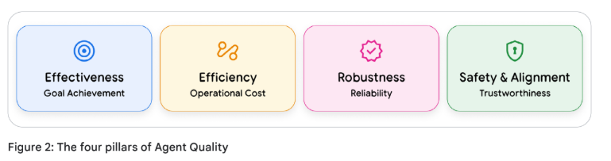

# Agent Quality 白皮书

[Agent Quality](https://drive.google.com/file/d/1EnTSGztSrjooYMLaDe8EnoATfsSoe3xv/view)

**The future of AI is agentic. Its success is determined by quality.**

**AI 的未来是智能体化的。其成功取决于质量。**

## 引言 (Introduction)

我们正处于智能体时代的黎明。从可预测的、基于指令的工具向自主的、目标导向的 AI 智能体的转变，代表了数十年来软件工程领域最深刻的变革之一。虽然这些智能体解锁了惊人的能力，但它们固有的非确定性使其变得不可预测，并粉碎了我们传统的质量保证模型。

本白皮书旨在作为应对这一新现实的实用指南，其基础是一个简单但激进的原则：

**智能体质量是一个架构支柱，而非最终测试阶段。**

本指南建立在三个核心信息之上：

  * **轨迹即真相 (The Trajectory is the Truth)**：我们必须进化，不再仅仅评估最终输出。衡量智能体质量和安全性的真实标准在于其整个决策过程。
  * **可观测性是基础 (Observability is the Foundation)**：你无法评判一个你看不见的过程。我们详细介绍了可观测性的“三大支柱”——日志 (Logging)、追踪 (Tracing) 和指标 (Metrics)，作为捕捉智能体“思考过程”的基本技术基础。
  * **评估是一个持续的闭环 (Evaluation is a Continuous Loop)**：我们将这些概念整合为“智能体质量飞轮 (Agent Quality Flywheel)”，这是一套将数据转化为可操作见解的运营方案。该系统采用可扩展的 AI 驱动评估器与不可或缺的人机回环 (HITL) 判断相结合的混合模式，以推动不断的改进。

本白皮书面向构建这一未来的架构师、工程师和产品负责人。它提供了一个框架，帮助您从构建“有能力的”智能体转向构建“可靠且值得信赖的”智能体。

## 如何阅读本白皮书 (How to Read This Whitepaper)

本指南的结构从“为什么 (Why)”开始，到“是什么 (What)”，最后到“怎么做 (How)”。请根据您的角色参考相关章节：

  * **面向所有读者**：从**第 1 章：非确定性世界中的智能体质量**开始。该章节确立了核心问题，解释了为什么传统 QA 对 AI 智能体失效，并介绍了定义我们目标的智能体质量四大支柱（有效性、效率、稳健性和安全性）。
  * **面向产品经理、数据科学家和 QA 负责人**：如果您负责衡量什么以及如何判断质量，请重点关注**第 2 章：智能体评估的艺术**。这一章是您的战略指南，详细介绍了“由外而内”的评估层级，解释了可扩展的“LLM 充当裁判 (LLM-as-a-Judge)”范式，并明确了人机回环 (HITL) 评估的关键作用。
  * **面向工程师、架构师和 SRE**：如果您负责构建系统，**第 3 章：可观测性**是您的技术蓝图。本章从理论转向实现，通过“厨房类比”（短线厨师 vs. 美食名厨）解释监控与可观测性的区别，并详述了构建“可评估”智能体所需的三大支柱：日志、追踪和指标。
  * **面向团队负责人和战略家**：若要了解这些环节如何构建一个自我完善的系统，请阅读**第 4 章：结论**。该章节统一了所有概念，引入“智能体质量飞轮”作为持续改进模型，并总结了构建值得信赖的 AI 的三大核心原则。

## 非确定性世界中的智能体质量 (Agent Quality in a Non-Deterministic World)

人工智能的世界正在全速转型。我们正从构建执行指令的可预测工具，转向设计能够理解意图、制定计划并执行复杂多步动作的自主智能体。对于在最前沿进行构建、竞争和部署的数据科学家及工程师而言，这一转变带来了深刻挑战。赋予 AI 智能体强大能力的机制，同时也使其变得不可预测。

为了理解这一转变，我们可以将传统软件比作货运卡车，而将 AI 智能体比作一级方程式 (F1) 赛车。卡车仅需基础检查（“引擎启动了吗？是否遵循固定路线？”）。而赛车则像 AI 智能体一样，是一个复杂的自主系统，其成功取决于动态判断。对它的评估不能只是简单的清单，而是需要持续的遥测，以判断每一个决策的质量——从燃料消耗到制动策略。

这种演进从根本上改变了我们对待软件质量的方式。传统的质量保证 (QA) 实践虽然对确定性系统非常稳健，但对于现代 AI 细微且涌现的行为却显得力不从心。一个智能体可能通过 100 项单元测试，但在生产环境中仍可能发生灾难性失败，因为其失败并非代码漏洞，而是判断上的缺陷。

传统软件验证询问的是：“我们是否正确地构建了产品？”它根据固定规范验证逻辑。现代 AI 评估必须询问一个复杂得多的问题：“我们是否构建了正确的产品？”这是一个在动态且不确定的世界中，评估质量、稳健性和可靠性的验证过程。

本章将考察这一新范式。我们将探索为何智能体质量需要新方法，分析使旧方法失效的技术转变，并确立评估“思考”系统的战略性“由外而内”框架。

### 为什么智能体质量需要新方法 (Why Agent Quality Demands a New Approach)

对于工程师而言，风险是需要被识别和缓解的。在传统软件中，失败是显性的：系统崩溃、抛出空指针异常 (NullPointerException) 或返回明显的错误计算。这些失败是显而易见的、确定性的，且可以追溯到特定的逻辑错误。

AI 智能体的失败方式则不同。它们的失败往往不是系统崩溃，而是质量的微妙退化，这源于模型权重、训练数据和环境交互之间复杂的相互作用。这些失败具有隐蔽性：系统继续运行，API 调用返回 200 OK，输出看起来也似乎合理。但它在本质上是错误的、在操作上是危险的，并正在悄然侵蚀信任。

未能掌握这一转变的组织将面临重大失败、运营效率低下和声誉受损。虽然算法偏见和概念漂移等失败模式在被动模型中也存在，但智能体的自主性和复杂性加剧了这些风险，使其更难追踪和缓解。请参考表 1 中列出的真实失败模式：

**表 1：智能体失败模式 (Agent Failure Modes)**

| 失败模式                                           | 描述                                                                                 | 示例                                                                           |
| :------------------------------------------------- | :----------------------------------------------------------------------------------- | :----------------------------------------------------------------------------- |
| **算法偏见 (Algorithmic Bias)**                    | 智能体在操作中应用并可能放大训练数据中存在的系统性偏见，导致不公平或歧视性的结果。   | 一个负责风险汇总的金融智能体，根据偏见训练数据中的邮政编码过度惩罚贷款申请。   |
| **事实幻觉 (Factual Hallucination)**               | 智能体以高度自信产生听起来合理但事实错误或虚构的信息，通常发生在无法找到有效来源时。 | 研究工具在学术报告中生成极其具体但完全错误的历史日期或地理位置，损害学术诚信。 |
| **性能与概念漂移 (Performance & Concept Drift)**   | 随着现实世界交互数据（“概念”）的变化，智能体性能随时间退化，使其原始训练变得过时。   | 欺诈检测智能体无法识别新的攻击模式。                                           |
| **涌现的意外行为 (Emergent Unintended Behaviors)** | 智能体开发出新颖或未预料到的策略来实现目标，这些策略可能是低效、无益或剥削性的。     | 发现并利用系统规则漏洞；与其他机器人进行“代理战争”（例如反复覆盖编辑内容）。   |

这些失败使得传统的调试和测试范式失效。你无法使用断点来调试幻觉，也无法编写单元测试来防止涌现的偏见。根因分析需要深度数据分析、模型重训练和系统性评估——这是一门全新的学科。

### 范式转变：从可预测的代码到不可预测的智能体 (The Paradigm Shift: From Predictable Code to Unpredictable Agents)

核心技术挑战源于从**以模型为中心**的 AI 向**以系统为中心**的 AI 的演进。评估 AI 智能体与评估算法有着本质区别，因为智能体是一个系统。这种演进经历了多个叠加阶段，每一阶段都增加了评估的复杂性：

*(图片描述：展示了从传统 ML -\> 被动 LLM -\> LLM+RAG -\> 主动 AI 智能体 -\> 多智能体系统的发展路径)*

1.  **传统机器学习 (Traditional Machine Learning)**：评估回归或分类模型虽然并非易事，但问题定义明确。我们依靠准确率 (Precision)、召回率 (Recall)、F1 分数和 RMSE 等统计指标，针对保留的测试集进行评估。问题虽复杂，但“正确”的定义是清晰的。
2.  **被动大语言模型 (The Passive LLM)**：随着生成式模型的兴起，我们失去了简单的指标。如何衡量生成段落的“准确性”？输出是概率性的，即使输入相同，输出也可能不同。评估变得更加复杂，依赖于人类评分员和模型间的基准测试。尽管如此，这些系统在很大程度上仍是被动的、文本进文本出的工具。
3.  **LLM+RAG (检索增强生成)**：下一次飞跃引入了多组件流水线。现在，失败可能发生在 LLM 中，也可能发生在检索系统中。智能体给出错误答案是因为 LLM 推理能力差，还是因为向量数据库检索到了无关片段？评估范围扩大到包括分块策略、嵌入模型和检索器的性能。
4.  **主动 AI 智能体 (The Active AI Agent)**：今天，我们面临着深刻的架构转变。LLM 不再仅仅是文本生成器，它是复杂系统中的推理“大脑”，集成在具备自主行动能力的闭环中。这种智能体化系统引入了三种打破传统评估模型的核心技术能力：
      * **规划与多步推理(Planning and Multi-Step Reasoning)**：智能体将复杂目标拆解为多个子任务，形成轨迹（思考 -\> 行动 -\> 观察 -\> 思考...）。LLM 的非确定性在每一步都会累积。第一步中一个微小的随机词语选择，可能导致智能体在第四步进入完全不同且无法恢复的推理路径。
      * **工具使用与函数调用(Tool Use and Function Calling)**：智能体通过 API 和外部工具与现实世界交互。这引入了动态环境交互，智能体的下一步行动完全取决于外部不可控世界的状态。
      * **记忆 (Memory)**：智能体维持状态。短期记忆追踪当前任务，长期记忆允许智能体从以往交互中学习。这意味着行为会随之演化，今天输入相同的内容可能因智能体已“学习”到的内容而产生不同结果。
5.  **多智能体系统 (Multi-Agent Systems)**：当多个主动智能体被整合进共享环境时，架构复杂性达到巅峰。评估不再针对单一轨迹，而是系统级的涌现现象，带来了新挑战：
      * **涌现的系统失败(Emergent System Failures)**：系统的成功取决于智能体间未编写脚本的交互（如资源竞争、通信瓶颈等），失败无法归因于单一智能体。
      * **协作 vs 竞争评估(Cooperative vs. Competitive Evaluation)**：目标函数本身可能变得模糊。在协作系统中，成功是全局指标；在竞争系统中，则需追踪个体表现及环境稳定性。

这种能力的组合意味着，评估的主要单元不再是模型 (Model)，而是整个系统的轨迹 (Trajectory)。智能体的涌现行为 (Emergent Behavior) 源于其规划模块 (Planning Module)、工具 (Tools)、记忆 (Memory) 以及动态环境 (Dynamic Environment) 之间复杂的相互作用。

### 智能体质量支柱：评估框架 (The Pillars of Agent Quality: A Framework for Evaluation)

如果我们不能再依赖简单的准确性 (Accuracy) 指标，且必须评估整个系统，我们该从何处着手？答案是采用一种被称为“由外而内 (Outside-In)”的战略转变。

这种方法将 AI 评估锚定在以用户为中心的指标 (User-Centric Metrics) 和首要业务目标 (Business Goals) 上，不再仅仅依赖于内部的、组件级的技术评分。我们必须停止只问“模型的 F1 分数是多少？”，而是开始问：“这个智能体是否交付了可衡量的价值并符合用户的意图 (Intent)？”。

这一战略需要一个将高层业务目标与技术性能相连接的整体框架。我们将智能体质量定义为四个相互关联的支柱：

  * **有效性 (Effectiveness)**：目标达成度 (Goal Achievement)。
  * **效率 (Efficiency)**：运营成本 (Operational Cost)。
  * **稳健性 (Robustness)**：可靠性 (Reliability)。
  * **安全性与对齐 (Safety & Alignment)**：值得信赖 (Trustworthiness)。

  * **有效性 (Effectiveness)（目标达成度）**：这是终极的“黑盒 (Black-Box)”问题：智能体是否成功且准确地达成了用户的实际意图？。这一支柱直接关联到以用户为中心的指标和业务关键绩效指标 (KPIs)。对于零售智能体，这不仅是“它找到产品了吗？”，而是“它促成转化 (Conversion) 了吗？”。
  * **效率 (Efficiency)（运营成本）**：智能体解决问题的效果如何？一个需要 25 个步骤、5 次失败的工具调用和 3 次自我纠正循环才能预订简单航班的智能体，即使最终成功，也被视为低质量智能体。效率通过消耗的资源来衡量：总 Token 数（成本）、墙钟时间 (Wall-Clock Time)（延迟）以及轨迹复杂度 (Trajectory Complexity)（总步骤数）。
  * **稳健性 (Robustness)（可靠性）**：智能体如何处理逆境和现实世界的混乱？当 API 超时、网页布局改变、数据缺失或用户提供模糊提示词 (Prompt) 时，智能体能否优雅地处理失败？。稳健的智能体会重试失败的调用，在需要时请求用户澄清，并报告无法执行的任务及其原因，而不是直接崩溃或产生幻觉 (Hallucinate)。
  * **安全性与对齐 (Safety & Alignment)（值得信赖）**：这是不可逾越的关卡。智能体是否在定义的伦理边界和约束内运行？。这一支柱涵盖了从负责任的 AI (Responsible AI) 指标（公平性、偏见）到针对提示词注入 (Prompt Injection) 和数据泄露的安全防护。

这一框架明确了一点：如果你只看最终答案，就无法衡量这些支柱中的任何一个。不数步数就无法衡量效率；不知道哪个 API 调用失败就无法诊断稳健性故障；不检查内部推理过程就无法验证安全性。

### 总结与后续 (Summary & What's Next)

智能体固有的非确定性 (Non-Deterministic) 特质打破了传统的质量保证。风险现在包括偏见 (Bias)、幻觉和漂移 (Drift) 等微妙问题。我们必须将关注点从验证 (Verification)（检查规范）转向校验 (Validation)（评判价值）。

这需要一个衡量四大支柱的“由外而内”框架。衡量这些支柱需要深度的可见性 (Visibility)——洞察智能体的决策轨迹 (Trajectory)。

Before building the how (observability architecture), we must define the what: What does good evaluation look like?
在构建“how”（可观测性架构）之前，我们必须定义“what”：**什么样的评估才算好**？

第 2 章将定义评估复杂智能体行为的策略和裁判 (Judges)。

第 3 章将构建捕获数据所需的技术基础（**日志 Logging、追踪 Tracing 和指标 Metrics**）。
