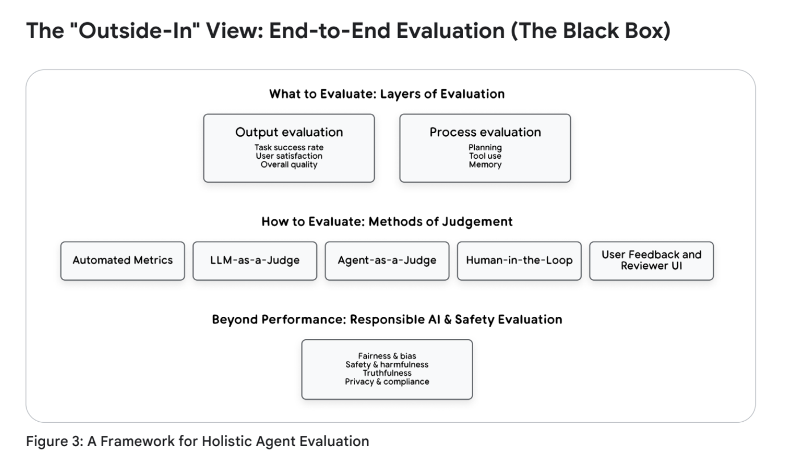

# Agent Quality 白皮书

[Agent Quality](https://drive.google.com/file/d/1EnTSGztSrjooYMLaDe8EnoATfsSoe3xv/view)

**The future of AI is agentic. Its success is determined by quality.**

**AI 的未来是智能体化的。其成功取决于质量。**

- [引言 (Introduction)](#引言-introduction)
- [如何阅读本白皮书 (How to Read This Whitepaper)](#如何阅读本白皮书-how-to-read-this-whitepaper)
- [第 1 章：非确定性世界中的智能体质量 (Agent Quality in a Non-Deterministic World)](#第-1-章非确定性世界中的智能体质量-agent-quality-in-a-non-deterministic-world)
  - [为什么智能体质量需要新方法 (Why Agent Quality Demands a New Approach)](#为什么智能体质量需要新方法-why-agent-quality-demands-a-new-approach)
  - [范式转变：从可预测的代码到不可预测的智能体 (The Paradigm Shift: From Predictable Code to Unpredictable Agents)](#范式转变从可预测的代码到不可预测的智能体-the-paradigm-shift-from-predictable-code-to-unpredictable-agents)
  - [智能体质量支柱：评估框架 (The Pillars of Agent Quality: A Framework for Evaluation)](#智能体质量支柱评估框架-the-pillars-of-agent-quality-a-framework-for-evaluation)
  - [总结与后续 (Summary \& What's Next)](#总结与后续-summary--whats-next)
- [第 2 章：智能体评估的艺术：评判过程 (The Art of Agent Evaluation: Judging the Process)](#第-2-章智能体评估的艺术评判过程-the-art-of-agent-evaluation-judging-the-process)
  - [战略框架：“由外而内”评估层级 (A Strategic Framework: The "Outside-In" Evaluation Hierarchy)](#战略框架由外而内评估层级-a-strategic-framework-the-outside-in-evaluation-hierarchy)
    - [“由外而内”视角：端到端评估（黑盒）(The "Outside-In" View: End-to-End Evaluation (The Black Box))](#由外而内视角端到端评估黑盒the-outside-in-view-end-to-end-evaluation-the-black-box)
    - [“由内而外”视角：轨迹评估（玻璃盒） (The "Inside-Out" View: Trajectory Evaluation (The Glass Box))](#由内而外视角轨迹评估玻璃盒-the-inside-out-view-trajectory-evaluation-the-glass-box)
  - [评估者：智能体评判的主体与内容 (The Evaluators: The Who and What of Agent Judgment)](#评估者智能体评判的主体与内容-the-evaluators-the-who-and-what-of-agent-judgment)
    - [自动化指标 (Automated Metrics)](#自动化指标-automated-metrics)
    - [大语言模型充当裁判范式 (The LLM-as-a-Judge Paradigm)](#大语言模型充当裁判范式-the-llm-as-a-judge-paradigm)
    - [智能体充当裁判 (Agent-as-a-Judge)](#智能体充当裁判-agent-as-a-judge)


## 引言 (Introduction)

我们正处于智能体时代的黎明。从可预测的、基于指令的工具向自主的、目标导向的 AI 智能体的转变，代表了数十年来软件工程领域最深刻的变革之一。虽然这些智能体解锁了惊人的能力，但它们固有的非确定性使其变得不可预测，并粉碎了我们传统的质量保证模型。

本白皮书旨在作为应对这一新现实的实用指南，其基础是一个简单但激进的原则：

**智能体质量是一个架构支柱，而非最终测试阶段。**

本指南建立在三个核心信息之上：

  * **轨迹即真相 (The Trajectory is the Truth)**：我们必须进化，不再仅仅评估最终输出。衡量智能体质量和安全性的真实标准在于其整个决策过程。
  * **可观测性是基础 (Observability is the Foundation)**：你无法评判一个你看不见的过程。我们详细介绍了可观测性的“三大支柱”——日志 (Logging)、追踪 (Tracing) 和指标 (Metrics)，作为捕捉智能体“思考过程”的基本技术基础。
  * **评估是一个持续的闭环 (Evaluation is a Continuous Loop)**：我们将这些概念整合为“智能体质量飞轮 (Agent Quality Flywheel)”，这是一套将数据转化为可操作见解的运营方案。该系统采用可扩展的 AI 驱动评估器与不可或缺的人机回环 (HITL) 判断相结合的混合模式，以推动不断的改进。

本白皮书面向构建这一未来的架构师、工程师和产品负责人。它提供了一个框架，帮助您从构建“有能力的”智能体转向构建“可靠且值得信赖的”智能体。

## 如何阅读本白皮书 (How to Read This Whitepaper)

本指南的结构从“为什么 (Why)”开始，到“是什么 (What)”，最后到“怎么做 (How)”。请根据您的角色参考相关章节：

  * **面向所有读者**：从**第 1 章：非确定性世界中的智能体质量**开始。该章节确立了核心问题，解释了为什么传统 QA 对 AI 智能体失效，并介绍了定义我们目标的智能体质量四大支柱（有效性、效率、稳健性和安全性）。
  * **面向产品经理、数据科学家和 QA 负责人**：如果您负责衡量什么以及如何判断质量，请重点关注**第 2 章：智能体评估的艺术**。这一章是您的战略指南，详细介绍了“由外而内”的评估层级，解释了可扩展的“LLM 充当裁判 (LLM-as-a-Judge)”范式，并明确了人机回环 (HITL) 评估的关键作用。
  * **面向工程师、架构师和 SRE**：如果您负责构建系统，**第 3 章：可观测性**是您的技术蓝图。本章从理论转向实现，通过“厨房类比”（短线厨师 vs. 美食名厨）解释监控与可观测性的区别，并详述了构建“可评估”智能体所需的三大支柱：日志、追踪和指标。
  * **面向团队负责人和战略家**：若要了解这些环节如何构建一个自我完善的系统，请阅读**第 4 章：结论**。该章节统一了所有概念，引入“智能体质量飞轮”作为持续改进模型，并总结了构建值得信赖的 AI 的三大核心原则。

## 第 1 章：非确定性世界中的智能体质量 (Agent Quality in a Non-Deterministic World)

人工智能的世界正在全速转型。我们正从构建执行指令的可预测工具，转向设计能够理解意图、制定计划并执行复杂多步动作的自主智能体。对于在最前沿进行构建、竞争和部署的数据科学家及工程师而言，这一转变带来了深刻挑战。赋予 AI 智能体强大能力的机制，同时也使其变得不可预测。

为了理解这一转变，我们可以将传统软件比作货运卡车，而将 AI 智能体比作一级方程式 (F1) 赛车。卡车仅需基础检查（“引擎启动了吗？是否遵循固定路线？”）。而赛车则像 AI 智能体一样，是一个复杂的自主系统，其成功取决于动态判断。对它的评估不能只是简单的清单，而是需要持续的遥测，以判断每一个决策的质量——从燃料消耗到制动策略。

这种演进从根本上改变了我们对待软件质量的方式。传统的质量保证 (QA) 实践虽然对确定性系统非常稳健，但对于现代 AI 细微且涌现的行为却显得力不从心。一个智能体可能通过 100 项单元测试，但在生产环境中仍可能发生灾难性失败，因为其失败并非代码漏洞，而是判断上的缺陷。

传统软件验证询问的是：“我们是否正确地构建了产品？”它根据固定规范验证逻辑。现代 AI 评估必须询问一个复杂得多的问题：“我们是否构建了正确的产品？”这是一个在动态且不确定的世界中，评估质量、稳健性和可靠性的验证过程。

本章将考察这一新范式。我们将探索为何智能体质量需要新方法，分析使旧方法失效的技术转变，并确立评估“思考”系统的战略性“由外而内”框架。

### 为什么智能体质量需要新方法 (Why Agent Quality Demands a New Approach)

对于工程师而言，风险是需要被识别和缓解的。在传统软件中，失败是显性的：系统崩溃、抛出空指针异常 (NullPointerException) 或返回明显的错误计算。这些失败是显而易见的、确定性的，且可以追溯到特定的逻辑错误。

AI 智能体的失败方式则不同。它们的失败往往不是系统崩溃，而是质量的微妙退化，这源于模型权重、训练数据和环境交互之间复杂的相互作用。这些失败具有隐蔽性：系统继续运行，API 调用返回 200 OK，输出看起来也似乎合理。但它在本质上是错误的、在操作上是危险的，并正在悄然侵蚀信任。

未能掌握这一转变的组织将面临重大失败、运营效率低下和声誉受损。虽然算法偏见和概念漂移等失败模式在被动模型中也存在，但智能体的自主性和复杂性加剧了这些风险，使其更难追踪和缓解。请参考表 1 中列出的真实失败模式：

**表 1：智能体失败模式 (Agent Failure Modes)**

| 失败模式                                           | 描述                                                                                 | 示例                                                                           |
| :------------------------------------------------- | :----------------------------------------------------------------------------------- | :----------------------------------------------------------------------------- |
| **算法偏见 (Algorithmic Bias)**                    | 智能体在操作中应用并可能放大训练数据中存在的系统性偏见，导致不公平或歧视性的结果。   | 一个负责风险汇总的金融智能体，根据偏见训练数据中的邮政编码过度惩罚贷款申请。   |
| **事实幻觉 (Factual Hallucination)**               | 智能体以高度自信产生听起来合理但事实错误或虚构的信息，通常发生在无法找到有效来源时。 | 研究工具在学术报告中生成极其具体但完全错误的历史日期或地理位置，损害学术诚信。 |
| **性能与概念漂移 (Performance & Concept Drift)**   | 随着现实世界交互数据（“概念”）的变化，智能体性能随时间退化，使其原始训练变得过时。   | 欺诈检测智能体无法识别新的攻击模式。                                           |
| **涌现的意外行为 (Emergent Unintended Behaviors)** | 智能体开发出新颖或未预料到的策略来实现目标，这些策略可能是低效、无益或剥削性的。     | 发现并利用系统规则漏洞；与其他机器人进行“代理战争”（例如反复覆盖编辑内容）。   |

这些失败使得传统的调试和测试范式失效。你无法使用断点来调试幻觉，也无法编写单元测试来防止涌现的偏见。根因分析需要深度数据分析、模型重训练和系统性评估——这是一门全新的学科。


### 范式转变：从可预测的代码到不可预测的智能体 (The Paradigm Shift: From Predictable Code to Unpredictable Agents)

核心技术挑战源于从**以模型为中心**的 AI 向**以系统为中心**的 AI 的演进。评估 AI 智能体与评估算法有着本质区别，因为智能体是一个系统。这种演进经历了多个叠加阶段，每一阶段都增加了评估的复杂性：


*(图片描述：展示了从传统 ML -\> 被动 LLM -\> LLM+RAG -\> 主动 AI 智能体 -\> 多智能体系统的发展路径)*

1.  **传统机器学习 (Traditional Machine Learning)**：评估回归或分类模型虽然并非易事，但问题定义明确。我们依靠准确率 (Precision)、召回率 (Recall)、F1 分数和 RMSE 等统计指标，针对保留的测试集进行评估。问题虽复杂，但“正确”的定义是清晰的。
2.  **被动大语言模型 (The Passive LLM)**：随着生成式模型的兴起，我们失去了简单的指标。如何衡量生成段落的“准确性”？输出是概率性的，即使输入相同，输出也可能不同。评估变得更加复杂，依赖于人类评分员和模型间的基准测试。尽管如此，这些系统在很大程度上仍是被动的、文本进文本出的工具。
3.  **LLM+RAG (检索增强生成)**：下一次飞跃引入了多组件流水线。现在，失败可能发生在 LLM 中，也可能发生在检索系统中。智能体给出错误答案是因为 LLM 推理能力差，还是因为向量数据库检索到了无关片段？评估范围扩大到包括分块策略、嵌入模型和检索器的性能。
4.  **主动 AI 智能体 (The Active AI Agent)**：今天，我们面临着深刻的架构转变。LLM 不再仅仅是文本生成器，它是复杂系统中的推理“大脑”，集成在具备自主行动能力的闭环中。这种智能体化系统引入了三种打破传统评估模型的核心技术能力：
      * **规划与多步推理(Planning and Multi-Step Reasoning)**：智能体将复杂目标拆解为多个子任务，形成轨迹（思考 -\> 行动 -\> 观察 -\> 思考...）。LLM 的非确定性在每一步都会累积。第一步中一个微小的随机词语选择，可能导致智能体在第四步进入完全不同且无法恢复的推理路径。
      * **工具使用与函数调用(Tool Use and Function Calling)**：智能体通过 API 和外部工具与现实世界交互。这引入了动态环境交互，智能体的下一步行动完全取决于外部不可控世界的状态。
      * **记忆 (Memory)**：智能体维持状态。短期记忆追踪当前任务，长期记忆允许智能体从以往交互中学习。这意味着行为会随之演化，今天输入相同的内容可能因智能体已“学习”到的内容而产生不同结果。
5.  **多智能体系统 (Multi-Agent Systems)**：当多个主动智能体被整合进共享环境时，架构复杂性达到巅峰。评估不再针对单一轨迹，而是系统级的涌现现象，带来了新挑战：
      * **涌现的系统失败(Emergent System Failures)**：系统的成功取决于智能体间未编写脚本的交互（如资源竞争、通信瓶颈等），失败无法归因于单一智能体。
      * **协作 vs 竞争评估(Cooperative vs. Competitive Evaluation)**：目标函数本身可能变得模糊。在协作系统中，成功是全局指标；在竞争系统中，则需追踪个体表现及环境稳定性。

这种能力的组合意味着，评估的主要单元不再是模型 (Model)，而是整个系统的轨迹 (Trajectory)。智能体的涌现行为 (Emergent Behavior) 源于其规划模块 (Planning Module)、工具 (Tools)、记忆 (Memory) 以及动态环境 (Dynamic Environment) 之间复杂的相互作用。

### 智能体质量支柱：评估框架 (The Pillars of Agent Quality: A Framework for Evaluation)

如果我们不能再依赖简单的准确性 (Accuracy) 指标，且必须评估整个系统，我们该从何处着手？答案是采用一种被称为“由外而内 (Outside-In)”的战略转变。

这种方法将 AI 评估锚定在以用户为中心的指标 (User-Centric Metrics) 和首要业务目标 (Business Goals) 上，不再仅仅依赖于内部的、组件级的技术评分。我们必须停止只问“模型的 F1 分数是多少？”，而是开始问：“这个智能体是否交付了可衡量的价值并符合用户的意图 (Intent)？”。

这一战略需要一个将高层业务目标与技术性能相连接的整体框架。我们将智能体质量定义为四个相互关联的支柱：

  * **有效性 (Effectiveness)**：目标达成度 (Goal Achievement)。
  * **效率 (Efficiency)**：运营成本 (Operational Cost)。
  * **稳健性 (Robustness)**：可靠性 (Reliability)。
  * **安全性与对齐 (Safety & Alignment)**：值得信赖 (Trustworthiness)。


  * **有效性 (Effectiveness)（目标达成度）**：这是终极的“黑盒 (Black-Box)”问题：智能体是否成功且准确地达成了用户的实际意图？。这一支柱直接关联到以用户为中心的指标和业务关键绩效指标 (KPIs)。对于零售智能体，这不仅是“它找到产品了吗？”，而是“它促成转化 (Conversion) 了吗？”。
  * **效率 (Efficiency)（运营成本）**：智能体解决问题的效果如何？一个需要 25 个步骤、5 次失败的工具调用和 3 次自我纠正循环才能预订简单航班的智能体，即使最终成功，也被视为低质量智能体。效率通过消耗的资源来衡量：总 Token 数（成本）、墙钟时间 (Wall-Clock Time)（延迟）以及轨迹复杂度 (Trajectory Complexity)（总步骤数）。
  * **稳健性 (Robustness)（可靠性）**：智能体如何处理逆境和现实世界的混乱？当 API 超时、网页布局改变、数据缺失或用户提供模糊提示词 (Prompt) 时，智能体能否优雅地处理失败？。稳健的智能体会重试失败的调用，在需要时请求用户澄清，并报告无法执行的任务及其原因，而不是直接崩溃或产生幻觉 (Hallucinate)。
  * **安全性与对齐 (Safety & Alignment)（值得信赖）**：这是不可逾越的关卡。智能体是否在定义的伦理边界和约束内运行？。这一支柱涵盖了从负责任的 AI (Responsible AI) 指标（公平性、偏见）到针对提示词注入 (Prompt Injection) 和数据泄露的安全防护。

这一框架明确了一点：如果你只看最终答案，就无法衡量这些支柱中的任何一个。不数步数就无法衡量效率；不知道哪个 API 调用失败就无法诊断稳健性故障；不检查内部推理过程就无法验证安全性。

### 总结与后续 (Summary & What's Next)

智能体固有的非确定性 (Non-Deterministic) 特质打破了传统的质量保证。风险现在包括偏见 (Bias)、幻觉和漂移 (Drift) 等微妙问题。我们必须将关注点从验证 (Verification)（检查规范）转向校验 (Validation)（评判价值）。

这需要一个衡量四大支柱的“由外而内”框架。衡量这些支柱需要深度的可见性 (Visibility)——洞察智能体的决策轨迹 (Trajectory)。

Before building the how (observability architecture), we must define the what: What does good evaluation look like?
在构建“how”（可观测性架构）之前，我们必须定义“what”：**什么样的评估才算好**？

第 2 章将定义评估复杂智能体行为的策略和裁判 (Judges)。

第 3 章将构建捕获数据所需的技术基础（**日志 Logging、追踪 Tracing 和指标 Metrics**）。

## 第 2 章：智能体评估的艺术：评判过程 (The Art of Agent Evaluation: Judging the Process)

在第 1 章中，我们确立了从传统软件测试向现代 AI 评估的根本转变。传统测试是一个确定性的验证 (Verification) 过程——它根据固定规范询问“我们是否正确地构建了产品？”。当系统的核心逻辑是概率性的 (Probabilistic) 时，这种方法就会失效，因为非确定性的输出更有可能引入微妙的质量退化，这些退化不会导致显式崩溃，且可能无法重现。

相比之下，智能体评估是一个整体的校验 (Validation) 过程。它提出了一个更复杂且至关重要的战略性问题：“我们是否构建了正确的产品？”。这个问题是“由外而内 (Outside-In)”评估框架的战略支点，代表了从内部合规性向评判系统外部价值以及与用户意图 (User Intent) 对齐度的必要转变。这要求我们在动态世界中评估智能体的整体质量、稳健性 (Robustness) 和用户价值。

具备规划、工具使用和复杂环境交互能力的 AI 智能体的兴起，显著增加了评估的复杂性。我们必须超越对单一输出的“测试”，学习“评估”整个过程的艺术。本章提供了实现这一目标的战略框架：评判智能体从初始意图到最终结果的整个决策轨迹 (Decision-Making Trajectory)。

### 战略框架：“由外而内”评估层级 (A Strategic Framework: The "Outside-In" Evaluation Hierarchy)

为了避免迷失在组件级指标的海洋中，评估必须是一个自顶向下的战略过程。我们称之为“由外而内”层级。这种方法优先考虑唯一最终重要的指标——现实世界的成功——然后再深入研究该成功（或失败）发生的技术细节。该模型是一个两阶段过程：先观察黑盒 (Black Box)，再将其打开。

#### “由外而内”视角：端到端评估（黑盒）(The "Outside-In" View: End-to-End Evaluation (The Black Box))


*(图片描述：展示了评估的维度与方法层级)*

  * **评估维度**：输出评估（用户满意度、任务成功率、整体质量）；过程评估（规划、工具使用、记忆）。
  * **评判方法**：自动指标、LLM 充当裁判、智能体充当裁判、人机回环、用户反馈与审核 UI。
  * **超越性能**：负责任 AI 与安全评估（公平性与偏见、安全与危害、真实性、隐私与合规）。

第一个也是最重要的问题是：“智能体是否有效地达成了用户的目标？”。

这就是“由外而内”视角。在分析任何单一的内部想法或工具调用之前，我们必须根据定义的指标评估智能体的最终表现。此阶段的指标侧重于整体任务的完成情况。我们衡量：

  * **任务成功率 (Task Success Rate)**：关于最终输出是否正确、完整并解决了用户实际问题的二进制（或分级）评分。例如：代码智能体的 PR 采纳率、金融智能体的数据库交易成功率，或客服机器人的会话完成率。
  * **用户满意度 (User Satisfaction)**：对于交互式智能体，这可以是直接的用户反馈评分（如点赞/点踩）或客户满意度分数 (CSAT)。
  * **整体质量 (Overall Quality)**：如果智能体的目标是定量的（如“总结这 10 篇文章”），指标可能是准确性或完整性（如“它总结了全部 10 篇吗？”）。

如果智能体在此阶段获得 100 分，我们的工作可能就完成了。但在复杂系统中，情况很少如此。当智能体产生有缺陷的最终输出、放弃任务或无法收敛到解决方案时，“由外而内”视角仅能告诉我们“哪里”出了错。现在我们必须打开盒子看看“为什么”。

-----

**应用小贴士 (Applied Tip)：**
要使用智能体开发工具包 (ADK) 构建输出回归测试 (Regression Test)，请启动 ADK Web UI 并与智能体交互。当你收到想要设为基准的理想响应时，导航至 Eval 标签页并点击“Add current session”。这将整个交互保存为一个评估案例 (Eval Case)，并将智能体当前的文本锁定为标准答案 (Ground Truth)。随后你可以通过命令行或 pytest 运行此评估集，自动检查未来版本的智能体，捕获输出质量的任何退化。

-----

#### “由内而外”视角：轨迹评估（玻璃盒） (The "Inside-Out" View: Trajectory Evaluation (The Glass Box))

一旦识别出失败，我们就转向“由内而外 (Inside-Out)”视角。我们通过系统地评估智能体执行轨迹 (Execution Trajectory) 的每一个组件来分析其方法：

1.  **大语言模型规划（“想法”） (LLM Planning (The "Thought"))**：我们首先检查核心推理 (Core Reasoning)。大语言模型 (LLM) 本身是否是问题所在？此处的失败包括幻觉 (Hallucinations)、荒谬或离题的响应、上下文污染 (Context Pollution) 或重复的输出循环。
2.  **工具使用（选择与参数化） (Tool Usage (Selection & Parameterization))**：智能体的能力取决于其工具。我们必须分析智能体是否调用了错误的工具、未能调用必要的工具、幻觉出工具名称或参数名称/类型，或者进行了不必要的调用。即使选择了正确的工具，它也可能因提供缺失的参数、错误的数据类型或为 API 调用生成了格式错误的 JSON 而导致失败。
3.  **工具响应解释（“观察”） (Tool Response Interpretation (The "Observation"))**：在工具正确执行后，智能体必须理解结果。智能体经常在此处失败，表现为误解数值数据、未能从响应中提取关键实体，或者关键性地未能识别出工具返回的错误状态（例如 API 的 404 错误）并像调用成功一样继续操作。
4.  **检索增强生成 (RAG) 性能 (RAG Performance)**：如果智能体使用检索增强生成 (RAG)，其轨迹取决于所检索信息的质量。失败包括检索到不相关的文档、获取过时或错误的信息，或者大语言模型完全忽略检索到的上下文并仍然幻觉出一个答案。
5.  **轨迹效率与稳健性 (Trajectory Efficiency and Robustness)**：除了正确性，我们还必须评估过程本身：揭示低效的资源分配，例如过多的 API 调用、高延迟 (Latency) 或重复的劳动。这也能揭露稳健性失败，例如未处理的异常 (Unhandled Exceptions)。
6.  **多智能体动态 (Multi-Agent Dynamics)**：在高级系统中，轨迹涉及多个智能体。此时评估还必须包括智能体间的通信日志 (Communication Logs)，以检查是否存在误解或通信循环，并确保智能体在履行定义的角色时互不冲突。

通过分析追踪 (Trace)，我们可以从“最终答案是错误的”（黑盒 Black Box）转向“最终答案之所以错误是因为……”（玻璃盒 Glass Box）。这种诊断能力 (Diagnostic Power) 是智能体评估的全部目标。

-----

**应用小贴士 (Applied Tip)：**

当你在智能体开发工具包 (ADK) 中保存一个评估案例 (Eval Case) 时，它还会将整个工具调用序列保存为标准答案轨迹 (Ground Truth Trajectory)。之后，你的自动化 pytest 或 `adk eval` 运行将默认检查该轨迹是否完美匹配。

若要手动执行过程评估（即调试失败），请使用 ADK Web UI 中的 **Trace（追踪）** 标签页。这提供了一个智能体执行的可交互图表，允许你直观地检查智能体的计划，查看它调用的每一个工具及其确切参数，并将其实际路径与预期路径进行对比，从而精准定位其逻辑失效的确切步骤。

-----

### 评估者：智能体评判的主体与内容 (The Evaluators: The Who and What of Agent Judgment)

了解评估什么（轨迹）只是成功了一半，另一半是如何评判它。对于质量 (Quality)、安全性 (Safety) 和可解释性 (Interpretability) 等细微方面，这种评判需要一种复杂的混合方法。自动化系统提供规模化能力，但人类判断 (Human Judgment) 仍然是质量的关键仲裁者。

#### 自动化指标 (Automated Metrics)

自动化指标提供速度和可重现性 (Reproducibility)。它们对于回归测试 (Regression Testing) 和基准测试输出非常有用。示例包括：

  * **基于字符串的相似度 (String-based similarity)**（如 ROUGE、BLEU），将生成的文本与参考文本进行比较。
  * **基于嵌入的相似度 (Embedding-based similarity)**（如 BERTScore、余弦相似度），衡量语义接近度。
  * **特定任务的基准测试 (Task-specific benchmarks)**，例如 TruthfulQA。

这些指标虽高效但流于表面：它们捕获的是表面相似性，而非深层的推理或用户价值。

-----

**应用小贴士 (Applied Tip)：**

将自动化指标作为持续集成/持续交付 (CI/CD) 流水线中的第一道质量关卡 (Quality Gate)。关键在于将其视为趋势指标 (Trend Indicators)，而非质量的绝对衡量标准。例如，0.8 的 BERTScore 并不明确意味着答案是“好的”。

它们的真实价值在于追踪变化：如果你的主分支在“黄金集 (Golden Set)”上的 BERTScore 始终保持在 0.8 左右，而一次新的代码提交使该平均值降至 0.6，你就自动检测到了一次重大回归 (Regression)。这使得这些指标成为完美的、低成本的“第一道过滤器”，以便在升级到更昂贵的“大语言模型充当裁判 (LLM-as-a-Judge)”或人工评估之前，大规模捕获明显的失败。

-----

#### 大语言模型充当裁判范式 (The LLM-as-a-Judge Paradigm)

我们如何自动化评估诸如“这个摘要好吗？”或“这个计划逻辑合理吗？”之类的定性输出？答案是使用与我们试图评估的对象相同的技术。**大语言模型充当裁判 (LLM-as-a-Judge)** 范式涉及使用一个强大的、最先进的模型（如 Google 的 Gemini Advanced）来评估另一个智能体 (Agent) 的输出。

我们向“裁判”LLM 提供智能体的输出、原始提示词 (Prompt)、“黄金 (Golden)”答案或参考资料（如果存在），以及详细的评估量表 (Rubric)（例如：“按 1-5 分的标准评估此回答的帮助性、正确性和安全性，并说明理由。”）。这种方法提供了可扩展、快速且具有惊人细微差别的反馈，特别是对于中间步骤，如智能体“想法 (Thought)”的质量或其对工具响应的解释。虽然它不能取代人类判断 (Human Judgment)，但它允许数据科学团队在成千上万个场景中快速评估性能，使迭代评估过程变得可行。

-----

**应用小贴士 (Applied Tip)：**

为了实现这一点，请优先考虑**两两比较 (Pairwise Comparison)** 而非单一评分，以减轻上述提到的偏见。首先，针对两组不同的智能体版本（例如，旧的生产版智能体 vs 新的实验版智能体）运行您的评估提示词集，为每个提示词生成“答案 A”和“答案 B”。

然后，通过给一个强大的 LLM（如 Gemini Pro）提供清晰的评估量表和强制做出选择的提示词来创建 LLM 裁判：“给定此用户查询，哪种回答更有帮助：A 还是 B？请说明理由。”。通过自动化此过程，您可以按比例计算新智能体的胜/负/平率。高“胜率 (Win Rate)”是衡量改进的远比绝对（且通常充满噪声）的 1-5 分小幅变化更可靠的信号。一个用于 LLM 充当裁判的提示词，特别是针对稳健的两两比较，可能如下所示：

```markdown
> 您是客户支持聊天机器人的专家评估员。您的目标是评估两个回答中哪一个更有帮助、更有礼貌且更正确。
> 
> # \[用户查询 (User Query)\]
> 
> “你好，我的订单 \#12345 还没到。”
> 
> # \[答案 A (Answer A)\]
> 
> “我可以看到订单 \#12345 目前正在派送中，预计今天下午 5 点前送达。”
> 
> # \[答案 B (Answer B)\]
> 
> “订单 \#12345 在卡车上。5 点前会到。”
> 
> 请评估哪个回答更好。在正确性、帮助性和语气方面进行比较。提供您的理由，然后以 JSON 对象的形式输出最终决定，包含 "winner" 键（“A”、“B”或“tie”）和 "rationale" 键。
```

-----

#### 智能体充当裁判 (Agent-as-a-Judge)

虽然 LLM 可以为最终响应评分，但智能体需要对其推理和行动进行更深入的评估。新兴的 **智能体充当裁判 (Agent-as-a-Judge)** 范式使用一个智能体来评估另一个智能体的完整**执行轨迹 (Execution Trace)**。它不只是为输出评分，而是评估过程本身。关键评估维度包括：

  * **计划质量 (Plan quality)**：计划的结构是否逻辑清晰且可行？
  * **工具使用 (Tool use)**：是否选择了正确的工具并正确应用？
  * **上下文处理 (Context handling)**：智能体是否有效地利用了先前的息？

这种方法对于**过程评估 (Process Evaluation)** 特别有价值，因为失败往往源于有缺陷的中间步骤，而非最终输出。

-----

**应用小贴士 (Applied Tip)：**

要实现“智能体充当裁判”，可以考虑将执行轨迹对象的各种相关部分输入给您的裁判。首先，配置您的智能体框架以记录并导出轨迹 (Trace)，包括内部计划、选择的工具列表以及传递的确切参数。

然后，创建一个专门的“批判智能体 (Critic Agent)”，并配以要求其直接评估此轨迹对象的提示词（量表(rubric)）。您的提示词应询问具体的过程问题：“1. 根据轨迹，初始计划是否逻辑合理？2. {tool\_A} 工具是正确的首选吗，还是应该使用其他工具？3. 参数是否正确且格式规范？”。这允许您自动检测**过程失败 (Process Failures)**（如低效的计划），即使智能体产生的最终答案看起来是正确的。

-----

