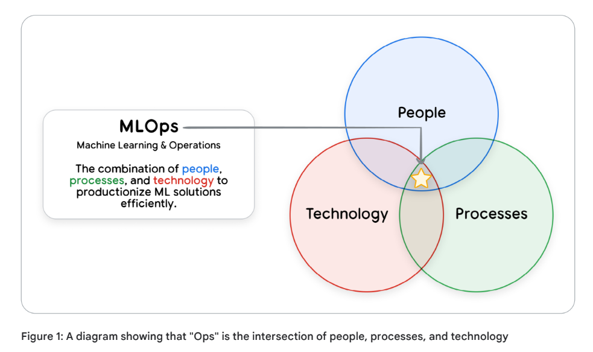
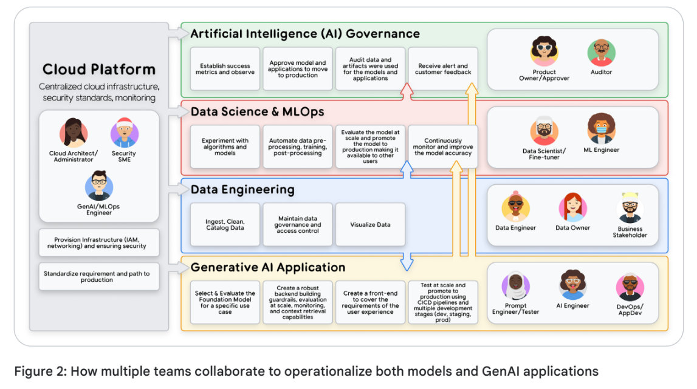
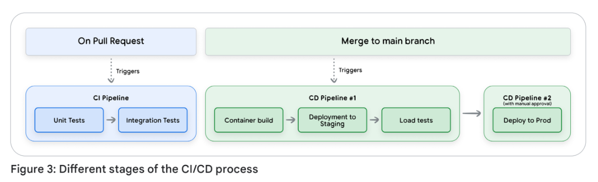
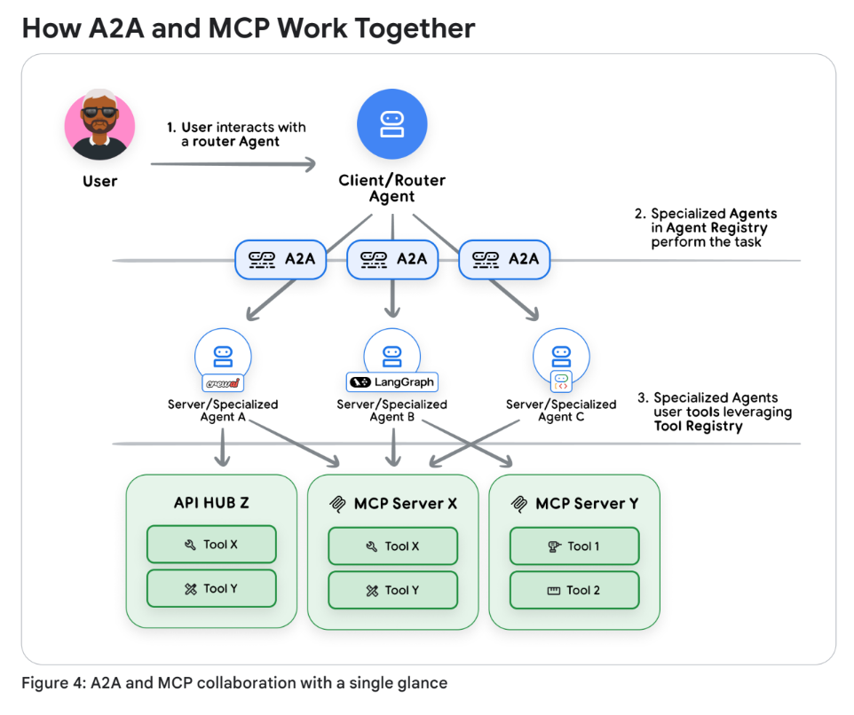
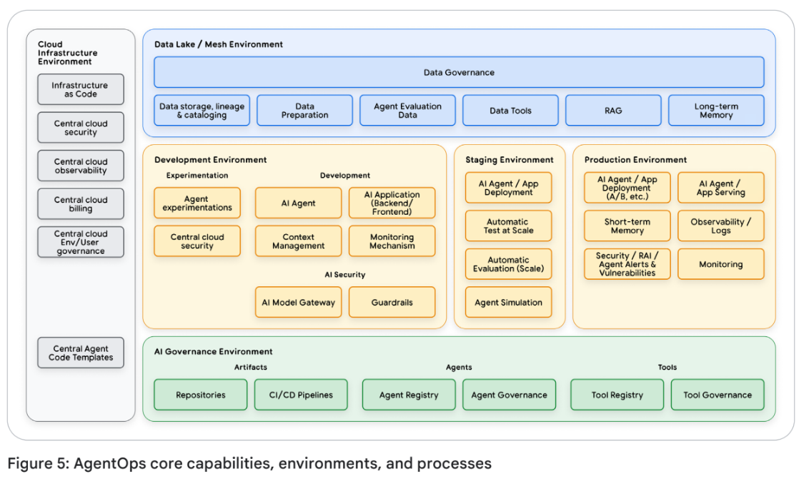

# Prototype to Production 白皮书

[Prototype to Production](https://drive.google.com/file/d/1s00Cr_C8LXtrsGrlRG4WUJx4GmAtdzrQ/view)

**Building an agent is easy. Trusting it is hard.**

建造一个智能体很容易，但要信任它却很难。

- [摘要 (Abstract)](#摘要-abstract)


## 摘要 (Abstract)

本白皮书为人工智能代理 (AI Agents) 的运维生命周期提供了全面的技术指南，重点关注部署、扩展和生产化。本指南建立在“第四天 (Day 4)”关于评估和可观测性 (Observability) 的内容基础之上，强调了如何通过健壮的 CI/CD 流水线 (Pipelines) 和可扩展的基础设施，建立将代理推向生产环境所需的必要信任。它探讨了将基于代理的系统从原型 (Prototypes) 转化为企业级解决方案的挑战，并特别关注了代理与代理 (Agent2Agent, A2A) 之间的互操作性 (Interoperability)。本指南为 AI/ML 工程师、开发运维 (DevOps) 专业人员和系统架构师提供了实用的见解。

## 引言：从原型到生产 (Introduction: From Prototype to Production)

您可以在几分钟甚至几秒钟内快速搭建一个人工智能代理 (AI Agent) 原型。但是，要将那个聪明的演示版本转化为您的业务可以依赖的、值得信赖的生产级系统吗？那才是真正工作的开始。 欢迎来到“最后一公里”的生产差距，在与客户的实践中我们一致观察到，大约 80% 的精力并不是花在代理的核心智能上，而是花在使其可靠且安全所需的架构、安全和验证上。

跳过这些最终步骤可能会导致几个问题。例如：

  * **客户服务代理被诱导免费赠送产品**，因为您忘记设置正确的护栏 (Guardrails)。
  * **用户发现他们可以通过您的代理访问机密的内部数据库**，因为身份验证 (Authentication) 配置不当。
  * **代理在周末产生了大额消耗账单**，但没人知道原因，因为您没有设置任何监控 (Monitoring)。
  * **昨天运行完美的关键代理突然停止工作**，由于没有持续评估 (Continuous Evaluation) 机制，您的团队正陷入混乱。

这些不仅仅是技术问题；它们是重大的业务失败。 虽然来自开发运维 (DevOps) 和机器学习运维 (MLOps) 的原则提供了关键基础，但仅靠它们是不够的。 部署代理系统引入了一类新的挑战，需要我们在运维规范上进行演进。 与传统的机器学习 (ML) 模型不同，代理具有自主交互性、有状态性，并遵循动态执行路径。

这造成了独特的运维难题，需要专门的策略：

  * **动态工具编排 (Dynamic Tool Orchestration)**：代理的“轨迹 (Trajectory)”是在它挑选和选择工具时飞速组装的。这对于一个每次行为都不同的系统，需要健壮的版本控制、访问控制和可观测性 (Observability)。
  * **可扩展的状态管理 (Scalable State Management)**：代理可以跨交互记忆事物。在大规模环境下安全且一致地管理会话和内存 (Memory) 是一个复杂的系统设计问题。
  * **不可预测的成本与延迟 (Unpredictable Cost & Latency)**：代理可以采取许多不同的路径来寻找答案，如果没有智能预算和缓存 (Caching)，其成本和响应时间将极其难以预测和控制。

为了成功应对这些挑战，您需要建立在三个关键支柱之上的基础：**自动化评估 (Automated Evaluation)**、**自动化部署 (Automated Deployment - CI/CD)** 和 **全面可观测性 (Comprehensive Observability)**。

本白皮书是您构建该基础并引导通往生产之路的分步指南！ 我们将从预生产要点开始，向您展示如何设置自动化 CI/CD 流水线，并将严谨的评估作为关键质量门禁 (Quality Gate)。 从那里开始，我们将深入探讨在野外运行代理的挑战，涵盖扩展、性能调优和实时监控策略。 最后，我们将展望具有代理对代理协议 (Agent-to-Agent protocol) 的多代理系统这一令人兴奋的世界，并探索让它们安全有效地通信需要什么。

-----

**实际实施指南 (Practical Implementation Guide)**

在本白皮书中，实际示例均参考了[Google Cloud Platform Agent Starter Pack](https://github.com/GoogleCloudPlatform/agent-starter-pack)——这是一个提供适用于 Google Cloud 的生产就绪型生成式 AI 代理模板的 Python 软件包。 它包括预构建的代理、自动化 CI/CD 设置、Terraform 部署、Vertex AI 评估集成以及内置的 Google Cloud 可观测性。 该入门包通过您可以在几分钟内部署的运行代码演示了此处讨论的概念。

-----

## 人员与流程 (People and Process)

在谈论了这么多 CI/CD、可观测性和动态流水线之后，为什么还要关注人员和流程？ 因为如果没有合适的团队来构建、管理和治理，世界上最好的技术也是徒劳的。

那个客户服务代理并不是魔法般地被阻止赠送免费产品；而是由 **AI 工程师 (AI Engineer)** 和 **提示词工程师 (Prompt Engineer)** 设计并实施了护栏。 机密数据库也不是由一个抽象概念保护的；而是由 **云平台团队 (Cloud Platform team)** 配置了身份验证。 每一个成功的、生产级的代理背后都有一个协调良好的专家团队，在本节中，我们将介绍其中的关键角色。



> **图片内容描述**：图 1 展示了一个文氏图，说明了“运维 (Ops)”是**人员 (People)**、**流程 (Processes)** 和 **技术 (Technology)** 三者的交集。

在传统的 MLOps 景观中，这涉及几个关键团队：

  * **云平台团队 (Cloud Platform Team)**：由云架构师、管理员和安全专家组成，该团队管理基础云基础设施、安全和访问控制。 该团队向工程师和服务账号授予最小权限角色，确保仅访问必要资源。
  * **数据工程团队 (Data Engineering Team)**：数据工程师和数据所有者构建并维护数据流水线，处理摄取、准备和质量标准。
  * **数据科学与 MLOps 团队 (Data Science and MLOps Team)**：包括实验和训练模型的数据科学家，以及使用 CI/CD 大规模自动化端到端机器学习流水线（如预处理、训练、后处理）的机器学习工程师。 MLOps 工程师通过构建和维护标准化的流水线基础设施来支持这一点。
  * **机器学习治理 (Machine Learning Governance)**：这一职能集中化，包括产品负责人和审计员，负责监督机器学习生命周期，作为工件和指标的存储库，以确保合规性、透明度和问责制。

生成式 AI (Generative AI) 为这一景观引入了新的复杂层级和专门角色：

  * **提示词工程师 (Prompt Engineers)**：虽然这个角色头衔在行业中仍在演变，但这些人将制作提示词的技术技能与深厚的领域专业知识相结合。 他们定义了模型的正确问题和预期答案，但在实践中，这项工作可能由 AI 工程师、领域专家或专门的专家完成，具体取决于组织的成熟度。
  * **AI 工程师 (AI Engineers)**：他们负责将生成式 AI 解决方案扩展到生产环境，构建整合了大规模评估、护栏以及 RAG/工具集成的健壮后端系统。
  * **DevOps/应用开发人员 (DevOps/App Developers)**：这些开发人员构建前端组件和用户友好界面，并与生成式 AI 后端集成。

组织的规模和结构将影响这些角色；在较小的公司中，个人可能会兼任多职，而成熟的组织则会有更专门的团队。 有效协调所有这些不同的角色对于建立健壮的运维基础并成功将传统机器学习和生成式 AI 计划投入生产至关重要。



> **图片内容描述**：图 2 是一张复杂的流程图，详细描述了多个团队如何协作以实现模型和生成式 AI 应用的运维化。图中展示了**人工智能治理 (AI Governance)**、**云平台 (Cloud Platform)**、**数据科学与 MLOps (Data Science & MLOps)**、**数据工程 (Data Engineering)** 以及 **生成式 AI 应用 (Generative AI Application)** 团队之间的互动。流程涵盖了从基础设施准备、数据清理、模型实验到前端创建以及通过 CI/CD 流水线进行大规模测试与推广的完整周期。

## 通往生产之路 (The Journey to Production)

既然我们已经建立了团队，现在我们将转向流程。 我们该如何将所有这些专家的工作转化为一个值得信赖、可靠且能够交付给用户的系统呢？

答案在于一个建立在单一核心原则之上的严谨预生产流程：**以评估为门禁的部署 (Evaluation-Gated Deployment)**。 这个想法简单而强大：在没有首先通过能够证明其质量和安全的全面评估之前，任何代理版本都不应触达用户。 这个预生产阶段是我们用自动化的信心取代人工不确定性的地方，它由三个支柱组成：作为质量门禁的严谨评估流程、强制执行该流程的自动化 CI/CD 流水线 (Pipeline)，以及降低进入生产环境最后一步风险的安全发布策略。

### 评估作为质量门禁 (Evaluation as a Quality Gate)

为什么我们需要为代理设置专门的质量门禁？ 传统的软件测试对于能够推理和适应的系统来说是不够的。 此外，评估一个代理与评估一个大语言模型 (LLM) 是不同的；它需要评估的不只是最终答案，还有为了完成任务所采取的整个推理轨迹 (Trajectory) 和行动。 一个代理可以通其工具的 100 个单元测试，但仍可能因为选择了错误的工具或幻觉化 (Hallucinating) 响应而表现得非常糟糕。 我们需要评估的是它的行为质量，而不仅仅是它的功能正确性。 这种门禁可以通过两种主要方式实施：

1.  **手动“预 PR”评估 (The Manual "Pre-PR" Evaluation)**：对于寻求灵活性或刚开始评估之旅的团队，质量门禁是通过团队流程强制执行的。 在提交拉取请求 (PR) 之前，AI 工程师或提示词工程师（或您组织中负责代理行为的人员）在本地运行评估套件。 生成的性能报告——将新代理与生产基准进行对比——随后被链接在 PR 描述中。 这使得评估结果成为人工审查的必备产出物。 审查者（通常是另一名 AI 工程师或机器学习治理人员）现在不仅负责评估代码，还负责评估代理针对护栏违规和提示词注入 (Prompt Injection) 漏洞的行为变化。
2.  **自动化流水线内门禁 (The Automated In-Pipeline Gate)**：对于成熟的团队，评估工具链——由数据科学和 MLOps 团队构建和维护——被直接集成到 CI/CD 流水线中。 评估失败会自动拦截部署，从而对机器学习治理团队定义的质量标准进行刚性的、程序化的强制执行。 这种方法用自动化的致性取代了人工审查的灵活性。 CI/CD 流水线可以配置为自动触发评估任务，将新代理的响应与黄金数据集 (Golden Dataset) 进行对比。 如果关键指标（如“工具调用成功率”或“帮助程度”）低于预定义阈值，部署将在程序上被拦截。

无论采用哪种方法，原则都是相同的：没有经过质量检查，任何代理都不能进入生产。 我们在第 4 天的深度探讨中涵盖了衡量什么以及如何构建这种评估工具链的具体细节：*代理质量：可观测性、日志、追踪、评估、指标*，其中探讨了从制作“黄金数据集”（一个精选的、具有代表性的测试案例集，旨在评估代理的预期行为和护栏合规性）到实施 LLM 作为评委 (LLM-as-a-judge) 技术，再到最终使用 Vertex AI Evaluation 等服务来驱动评估的一切内容。

### 自动化 CI/CD 流水线 (The Automated CI/CD Pipeline)

人工智能代理是一个复合系统，不仅包含源代码，还包含提示词 (Prompts)、工具定义和配置文件。 这种复杂性引入了重大的挑战：我们如何确保对提示词的更改不会降低工具的性能？ 我们如何在这些产物到达用户手中之前测试它们之间的相互作用？

解决方案是 **CI/CD（持续集成/持续部署）流水线**。 它不仅仅是一个自动化脚本；它是一个结构化的流程，帮助团队中的不同人员协作管理复杂性并确保质量。 它的工作原理是分阶段测试更改，在代理发布给用户之前逐步建立信心。

一个健壮的流水线被设计成一个漏斗。 它尽可能早且廉价地捕获错误，这种做法通常被称为“左移 (Shifting Left)”。 它将快速的合并前检查与更全面、资源密集型的合并后部署分开。 这种递进式工作流通常结构化为三个不同的阶段：

1.  **阶段 1：合并前集成 (Phase 1: Pre-Merge Integration - CI)**。流水线的首要职责是为开启 PR 的 AI 工程师或提示词工程师提供快速反馈。 该 CI 阶段被自动触发，充当主分支 (Main Branch) 的守门员。 它运行单元测试、代码规范检查 (Linting) 和依赖项扫描等快速检查。 至关重要的是，这是运行由提示词工程师设计的代理质量评估套件的理想阶段。 这可以在更改被合并之前，就该更改在关键场景下提升或降低了代理性能提供即时反馈。 通过在这里捕获问题，我们防止了污染主分支。 使用 Agent Starter Pack (ASP) 生成的 PR 检查配置模板是使用 Cloud Build 实施此阶段的一个实际示例。
2.  **阶段 2：预发布环境中的合并后验证 (Phase 2: Post-Merge Validation in Staging - CD)**。一旦更改通过了所有 CI 检查（包括性能评估）并被合并，重点就从代码和性能的正确性转向了集成系统的运维就绪性。 持续部署 (CD) 流程通常由 MLOps 团队管理，它将代理打包并部署到预发布 (Staging) 环境——一个生产环境的高保真副本。 在这里，会运行更全面、资源密集型的测试，例如负载测试和针对远程服务的集成测试。 这也是内部用户测试（通常称为“吃自家狗粮 (Dogfooding)”）的关键阶段，公司内部的人员可以在代理到达最终用户之前与其交互并提供定性反馈。 这确保了作为一个集成系统的代理在被考虑发布之前，在类似生产的条件下能够可靠且高效地运行。 来自 ASP 的预发布部署模板展示了这种部署的一个示例。
3.  **阶段 3：受控部署到生产环境 (Phase 3: Gated Deployment to Production)**。在代理在预发布环境中经过彻底验证后，最后一步是部署到生产环境。 这几乎从不是完全自动化的，通常需要产品负责人 (Product Owner) 给予最终签署，确保人在回路 (Human-in-the-loop)。 经批准后，在预发布环境中测试和验证过的精确部署产物会被推送到生产环境。 使用 ASP 生成的此生产部署模板展示了这最后阶段如何检索验证过的产物并在适当的保护措施下将其部署到生产环境。



**图 3：CI/CD 流程的不同阶段 (Figure 3: Different stages of the CI/CD process)**

  * **图片内容描述**：该流程图描绘了从开发到生产的自动化路径。
      * **触发条件**：发起“拉取请求 (Pull Request)”时触发 CI 流水线。
      * **CI 流水线**：执行单元测试和集成测试。
      * **CD 流水线 \#1**：当代码“合并至主分支 (Merge to main branch)”时触发，执行容器构建、部署到预发布环境 (Staging) 并进行负载测试。
      * **CD 流水线 \#2**：在“人工审批 (Manual approval)”后触发，最终将代理部署到生产环境 (Prod)。

使这种三阶段 CI/CD 工作流成为可能需要健壮的自动化基础设施和妥善的秘密管理 (Secrets Management)。 这种自动化由两项关键技术驱动：

  * **基础设施即代码 (IaC)**：Terraform 等工具以编程方式定义环境，确保它们是相同的、可重复的且受版本控制的。 例如，使用 Agent Starter Pack 生成的此模板为包括 Vertex AI、Cloud Run 和 BigQuery 资源在内的完整代理基础设施提供了 Terraform 配置。
  * **自动化测试框架**：Pytest 等框架在每个阶段执行测试和评估，处理代理特定的产物，如对话历史、工具调用日志和动态推理轨迹。

此外，工具的 API 密钥等敏感信息应使用 Secret Manager 等服务进行安全管理，并在运行时注入到代理的环境中，而不是硬编码在代码库中。

根据您的执行规范，以下是对文档后续章节的详细逐段翻译：

### 安全发布策略 (Safe Rollout Strategies)

虽然全面的预生产检查必不可少，但现实世界的应用不可避免地会揭示预料之外的问题。与其一次性切换 100% 的用户，不如考虑通过带有细致监控的渐进式发布来降低风险。

这里有四种经过验证的模式，可以帮助团队在部署中建立信心：

  * **金丝雀发布 (Canary)**：从 1% 的用户开始，监控提示词注入 (Prompt Injections) 和意外的工具使用情况。逐步扩大规模或立即回滚。
  * **蓝绿部署 (Blue-Green)**：运行两个相同的生产环境。在向“绿色”环境部署时，将流量路由到“蓝色”环境，然后瞬时切换。如果出现问题，立即切回——实现零停机时间和瞬时恢复。
  * **A/B 测试 (A/B Testing)**：基于真实的业务指标对比代理版本，以做出数据驱动的决策。这可以针对内部或外部用户进行。
  * **功能开关 (Feature Flags)**：部署代码但动态控制发布，先对选定用户测试新功能。

所有这些策略都有一个共同的基础：严格的版本控制 (Versioning)。每个组件——代码、提示词、模型终点、工具架构 (Tool Schemas)、记忆结构，甚至评估数据集——都必须进行版本化。当尽管有保护措施但仍出现问题时，这能够实现瞬时回滚到已知良好的状态。将其视为您的生产“撤销”按钮！

您可以使用 Agent Engine 或 Cloud Run 部署代理，然后利用 Cloud Load Balancing 进行跨版本的流量管理或连接到其他微服务。 **Agent Starter Pack (ASP)** 提供了现成的、带有 GitOps 工作流的模板——其中每一次部署都是一次 git 提交 (Commit)，每一次回滚都是一次 git 还原 (Revert)，您的代码库成为了当前状态和完整部署历史的唯一事实来源。

### 从一开始就构建安全性 (Building Security from the Start)

安全的发布策略可以保护您免受漏洞和停机的影响，但代理面临着独特的挑战：它们可以自主地进行推理和行动。如果一个完美部署的代理没有建立适当的安全和责任措施，它仍然可能造成伤害。这需要从第一天起就嵌入全面的治理策略，而不是事后才添加。

与遵循预定路径的传统软件不同，代理会做出决策。它们解释模糊的请求、访问多个工具并跨会话维护记忆。这种自主性创造了独特的风险：

  * **提示词注入与违规操作 (Prompt Injection & Rogue Actions)**：恶意用户可以诱导代理执行非预期的操作或绕过限制。
  * **数据泄露 (Data Leakage)**：代理可能在响应或工具使用中无意中暴露敏感信息。
  * **记忆投毒 (Memory Poisoning)**：存储在代理记忆中的错误信息可能会损坏所有未来的交互。

幸运的是，像 Google 的安全 AI 代理方法 (Secure AI Agents approach) 和 Google 安全 AI 框架 (SAIF) 这样的框架通过三层防御解决了这些挑战：

1.  **政策定义与系统指令（代理的宪法）(Policy Definition and System Instructions)**：流程始于为期望和非期望的代理行为定义政策。这些政策被工程化为系统指令 (SIs)，作为代理的核心宪法。
2.  **护栏、保障措施与过滤（执行层）(Guardrails, Safeguards, and Filtering)**：这一层作为强制停止的执行机制。
      * **输入过滤 (Input Filtering)**：使用分类器和服务（如 Perspective API）来分析提示词，并在恶意输入到达代理之前将其拦截。
      * **输出过滤 (Output Filtering)**：在代理生成响应后，Vertex AI 内置的安全过滤器提供最终检查，防止有害内容、个人身份信息 (PII) 或政策违规。例如，在响应发送给用户之前，它会通过 Vertex AI 的内置安全过滤器，这些过滤器可以配置为拦截包含特定 PII、毒性语言或其他有害内容的输出。
      * **人在回路 (HITL) 升级 (Human-in-the-Loop Escalation)**：对于高风险或模糊的操作，系统必须暂停并升级给人工进行审查和批准。
3.  **持续保障与测试 (Continuous Assurance and Testing)**：安全性不是一次性的设置。它需要不断的评估和适应。
      * **严格评估 (Rigorous Evaluation)**：对模型或其安全系统的任何更改都必须触发使用 Vertex AI Evaluation 运行完整的、综合的评估流水线。
      * **专门的 RAI 测试 (Dedicated RAI Testing)**：通过创建专用数据集或使用模拟代理（包括中立观点 (NPOV) 评估和对等评估 (Parity evaluations)），严格测试特定风险。(RAI: Responsible AI, NPOV: Neutral Point of View)
      * **主动红队测试 (Proactive Red Teaming)**：通过创造性的人工测试和 AI 驱动的基于角色的模拟，主动尝试打破安全系统。

## 生产中的运维 (Operations in-Production)

您的代理上线了。现在，焦点从开发转向了一个根本不同的挑战：在与成千上万的用户交互时，保持系统的可靠性、成本效益和安全性。传统的服务运行在可预测的逻辑上。相比之下，代理是一个自主的行为体 (Autonomous actor)。它遵循意外推理路径的能力意味着它可以表现出涌现行为，并在没有直接监督的情况下产生累积成本。

管理这种自主性需要一种不同的运维模型。有效的团队不采用静态监控，而是采用一个持续的循环：**观察 (Observe)** 系统的实时行为，**采取行动 (Act)** 以维持性能和安全，并根据生产环境的学习成果进行 **演进 (Evolve)**。这个集成循环是在生产中成功运行代理的核心规范。

### 观察：您的代理感官系统 (Observe: Your Agent's Sensory System)

要信任并管理一个自主代理，您必须首先了解它的过程。可观测性 (Observability) 提供了这种至关重要的洞察力，作为后续“采取行动”和“演进”阶段的感官系统。健壮的可观测性实践建立在三个支柱之上，它们共同提供了代理行为的完整图景：

  * **日志 (Logs)**：颗粒化的、事实性的记录，记录了每一次工具调用、错误和决策。
  * **追踪 (Traces)**：连接各个日志的叙述，揭示了代理采取特定行动的因果路径。
  * **指标 (Metrics)**：汇总的成绩单，在大规模环境下总结性能、成本和运维健康状况，显示系统的运行表现。

例如，在 Google Cloud 中，这是通过操作套件 (Operations suite) 实现的：用户的请求在 Cloud Trace 中生成一个唯一的 ID，该 ID 将 Vertex AI Agent Engine 的调用、模型调用和工具执行及其可见的持续时间关联起来。详细日志流向 Cloud Logging，而 Cloud Monitoring 仪表板会在延迟超过阈值时发出警报。代理开发工具包 (ADK) 为代理操作的自动插桩提供了内置的 Cloud Trace 集成。

通过实施这些支柱，我们从在黑暗中运行转变为对代理行为拥有清晰的数据驱动视图，为在生产中有效管理代理提供了基础。（有关这些概念的完整讨论，请参见《代理质量：可观测性、日志、追踪、评估、指标》）。

### 行动：运维控制的杠杆 (Act: The Levers of Operational Control)

没有行动的观察仅仅是昂贵的仪表板。 “行动 (Act)” 阶段关乎实时干预——即您根据观察到的情况，为了管理代理的性能、成本和安全而拉动的杠杆。

可以将 “行动” 视为系统旨在实时维持稳定性的自动化反射。 相比之下，稍后将介绍的 “演进 (Evolve)” 是一个从行为中学习以创建一个从根本上更好的系统的战略过程。

由于代理是自主的，您无法预先编写每种可能的结果。 相反，您必须构建强大的机制来影响其在生产环境中的行为。 这些运维杠杆分为两个主要类别：管理系统的健康状况和管理其风险。

#### 管理系统健康：性能、成本与规模 (Managing System Health: Performance, Cost, and Scale)

与传统的微服务不同，代理的工作负载是动态且有状态的。 管理其健康状况需要一套处理这种不可预测性的策略。

* **为规模而设计 (Designing for Scale)**：其基础是将代理的逻辑与其状态分离。

  * **水平扩展 (Horizontal Scaling)**：将代理设计为无状态的容器化服务。 通过外部状态，任何实例都可以处理任何请求，从而使 Cloud Run 等无服务器平台或托管的 Vertex AI Agent Engine 运行时能够自动扩展。
  * **异步处理 (Asynchronous Processing)**：对于耗时较长的任务，使用事件驱动模式卸载工作。 这能保持代理的响应能力，同时在后台处理复杂作业。 例如，在 Google Cloud 上，服务可以将任务发布到 Pub/Sub，进而触发 Cloud Run 服务进行异步处理。

* **外部化状态管理 (Externalized State Management)**：由于大语言模型 (LLM) 是无状态的，将记忆持久化到外部是不可商榷的。 这凸显了一个关键的架构选择：Vertex AI Agent Engine 提供内置的持久会话 (Session) 和记忆服务，而 Cloud Run 则提供了直接与 AlloyDB 或 Cloud SQL 等数据库集成的灵活性。

* **平衡竞争目标 (Balancing Competing Goals)**：扩展始终涉及平衡三个竞争目标：速度、可靠性和成本。

  * **速度（延迟）(Speed (Latency))**：通过将代理设计为并行工作、积极缓存结果以及对常规任务使用小型高效模型，来保持代理的快速响应。
  * **可靠性（处理故障）(Reliability (Handling Glitches))**：代理必须能够处理临时失败。 当调用失败时，应自动重试，理想情况下带有指数退避 (Exponential Backoff)，以给服务恢复时间。 这需要设计“可安全重试”（幂等 (Idempotent)）的工具，以防止诸如重复收费之类的漏洞。
  * **成本 (Cost)**：通过缩短提示词、对简单任务使用更便宜的模型以及分组发送请求（批处理 (Batching)），使代理保持在可负担的成本内。

#### 管理风险：安全响应手册 (Managing Risk: The Security Response Playbook)

由于代理可以自主行动，您需要一本用于快速遏制的响应手册。 当检测到威胁时，响应应遵循清晰的序列：遏制 (Contain)、分拣 (Triage) 和解决 (Resolve)。

第一步是**立即遏制 (Immediate Containment)**。 优先级是停止伤害，通常使用“断路器 (Circuit Breaker)”——即一个能立即禁用受影响工具的功能开关。

接下来是**分拣 (Triage)**。 在威胁得到遏制后，可疑请求会被路由到“人在回路 (HITL)”审查队列中，以调查漏洞利用的范围和影响。

最后，焦点转向**永久解决 (Permanent Resolution)**。 团队开发补丁——例如更新的输入过滤器或系统提示词——并通过自动化 CI/CD 流水线进行部署，确保修复方案在彻底阻断漏洞利用之前经过完整测试。

### 演进：从生产中学习 (Evolve: Learning from Production)

虽然 “行动” 阶段提供了系统的即时战术反射，但 “演进 (Evolve)” 阶段关乎长期战略改进。 它始于查看可观测性数据中收集到的模式和趋势，并提出一个至关重要的问题：“我们如何修复根本原因，让这个问题不再发生？”

这是您从被动应对生产事故转向主动使您的代理更聪明、更高效且更安全的地方。 您将来自 “观察” 阶段的原始数据转化为对代理架构、逻辑和行为的持久改进。

#### 演进引擎：通往生产的自动化路径 (The Engine of Evolution: An Automated Path to Production)

只有当您可以迅速采取行动时，来自生产环境的洞察才有价值。 观察到 30% 的用户在特定任务上失败，如果您的团队需要六个月才能部署修复程序，那么这种观察就是无用的。

这就是您在预生产阶段（第 3 节）构建的自动化 CI/CD 流水线成为运维循环中最关键组件的地方。 它是驱动快速演进的引擎。 一条快速、可靠的生产路径允许您在数小时或数天（而非数周或数月）内完成从观察到改进的闭环。

当您识别出一个潜在的改进点——无论是精炼的提示词、新工具还是更新的安全护栏——其流程应该是：

1.  **提交更改 (Commit the Change)**：将建议的改进提交到您的版本控制仓库中。
2.  **触发自动化 (Trigger Automation)**：提交操作会自动触发您的 CI/CD 流水线。
3.  **严谨验证 (Validate Rigorously)**：流水线针对更新的数据集运行全套单元测试、安全扫描和代理质量评估套件。
4.  **安全部署 (Deploy Safely)**：一旦通过验证，更改将使用安全发布策略部署到生产环境。

这种自动化工作流将演进从一个缓慢、高风险的手动项目转变为一个快速、可重复且数据驱动的过程。

根据您的执行规范，以下是对文档后续章节的详细逐段翻译：

#### 演进工作流：从洞察到部署后的改进 (The Evolution Workflow: From Insight to Deployed Improvement)

1.  **分析生产数据 (Analyze Production Data)**：从生产日志中识别用户行为趋势、任务成功率和安全事件。
2.  **更新评估数据集 (Update Evaluation Datasets)**：将生产环境中的失败案例转化为明天的测试案例，从而扩充您的黄金数据集 (Golden Dataset)。
3.  **完善并部署 (Refine and Deploy)**：提交改进——无论是完善提示词、添加工具还是更新护栏——以触发自动化流水线。

这创造了一个良性循环，使您的代理在每一次用户交互中不断进步。

-----

**运行中的演进循环 (An Evolve Loop in Action)**

一个零售代理的日志（观察 Observe）显示，15% 的用户在询问“相似产品”时收到错误。产品团队采取行动 (Act)，创建了一个高优先级工单。随后演进 (Evolve) 阶段开始：生产日志被用来为评估数据集创建一个新的失败测试案例。AI 工程师完善了代理的提示词，并添加了一个新的、更强大的相似性搜索工具。更改被提交，通过了 CI/CD 流水线中更新后的评估套件，并利用金丝雀发布 (Canary Deployment) 安全地推出，在 48 小时内解决了用户问题。

-----

### 演进安全性：生产反馈循环 (Evolving Security: The Production Feedback Loop)

虽然基础的安全与责任框架在预生产阶段（第 3.4 节）已经建立，但这项工作从未真正完成。安全性不是一个静态的清单，而是一个动态的、持续的适应过程。生产环境是终极测试场，那里收集的洞察对于巩固您的代理以应对现实世界的威胁至关重要。

这就是“观察 (Observe) → 行动 (Act) → 演进 (Evolve)”循环对安全性变得至关重要的原因。该过程是演进工作流的直接延伸：

1.  **观察 (Observe)**：您的监控和日志系统检测到一种新的威胁向量。这可能是一种绕过您当前过滤器的创新提示词注入技术，或者是一种导致轻微数据泄露的意外交互。
2.  **行动 (Act)**：即时安全响应团队控制威胁（如第 4.2 节所述）。
3.  **演进 (Evolve)**：这是长期韧性的关键步骤。安全洞察被反馈到您的开发生命周期中：
      * **更新评估数据集 (Update Evaluation Datasets)**：将新的提示词注入攻击作为永久测试案例添加到您的评估套件中。
      * **完善护栏 (Refine Guardrails)**：提示词工程师或 AI 工程师完善代理的系统提示词、输入过滤器或工具使用策略，以阻断新的攻击向量。
      * **自动化与部署 (Automate and Deploy)**：工程师提交更改，触发完整的 CI/CD 流水线。更新后的代理针对新扩展的评估集进行严格验证，并部署到生产环境，从而修补漏洞。

这创造了一个强大的反馈循环，使每一次生产事故都让您的代理变得更强大、更有韧性，将您的安全姿态从防御转变为持续、主动的改进。

若要了解更多关于负责任 AI (Responsible AI) 和保障代理系统安全的信息，请参阅白皮书《Google 的安全 AI 代理方法》(Google's Approach for Secure AI Agents) 和《Google 安全 AI 框架》(SAIF)。

### 超越单代理运营 (Beyond Single-Agent Operations)

您已经掌握了在生产中运行单个代理并能高速交付。但随着组织扩展到数十个专业代理——每个都由不同团队使用不同框架构建——一个新的挑战出现了：这些代理无法协作。下一节将探讨标准化协议如何将这些孤立的代理转化为一个互操作的生态系统，通过代理协作解锁指数级的价值。

## A2A - 可重用性与标准化 (A2A - Reusability and Standardization)

您在整个组织中构建了数十个专业代理。客户服务团队有他们的支持代理，分析团队构建了预测系统，风险管理团队创建了欺诈检测。但问题在于：这些代理无法相互交流——无论是因为它们是在不同的框架、项目还是不同的云端创建的。

这种孤立导致了巨大的低效。每个团队都在重复构建相同的能力，关键洞察被困在孤岛中。您需要的是互操作性 (Interoperability)——即任何代理都能利用任何其他代理的能力，无论它是谁构建的或使用了什么框架。

为了解决这个问题，需要一种基于两个不同但互补协议的原则性标准化方法。虽然我们在《代理工具与 MCP 互操作性》中详细介绍的模型上下文协议 (Model Context Protocol, MCP) 为工具集成提供了通用标准，但对于智能代理之间所需的复杂、有状态的协作，它是不够的。这就是目前由 Linux 基金会管理的 **Agent2Agent (A2A)** 协议旨在解决的问题。

这种区别至关重要。当您需要一个简单的、无状态的功能（如获取天气数据或查询数据库）时，您需要一个支持 MCP 的工具。但当您需要委托一个复杂的目标时，例如“分析上季度的客户流失并推荐三种干预策略”，您需要一个能够通过 A2A 进行推理、规划和自主行动的智能合作伙伴。简而言之，MCP 允许您说“做这件具体的事”，而 A2A 允许您说“实现这个复杂的目标”。

### A2A 协议：从概念到实施 (A2A Protocol: From Concept to Implementation)

A2A 协议旨在打破组织孤岛并实现代理间的无缝协作。考虑一个场景：欺诈检测代理发现了可疑活动。为了了解完整背景，它需要来自另一个独立的交易分析代理的数据。如果没有 A2A，人类分析师必须手动弥合这一差距，这个过程可能需要数小时。有了 A2A，代理会自动协作，在几分钟内解决问题。

协作的第一步是发现要委托的正确代理——这通过 **代理卡 (Agent Cards)** 实现，代理卡是作为每个代理的“名片”的标准化 JSON 规范。代理卡描述了代理的功能、安全要求、技能以及如何联系它 (url)，允许生态系统中的任何其他代理动态发现其对等节点。请参见下面的代理卡示例：

**代码片段 1：check\_prime\_agent 的代理卡示例 (Snippet 1: A sample agent card for the check\_prime\_agent)**

``` json
{
  "name": "check_prime_agent",
  "version": "1.0.0",
  "description": "An agent specialized in checking whether numbers are prime",
  "capabilities": {},
  "securitySchemes": {
    "agent_oauth_2_0": {
      "type": "oauth2"
    }
  },
  "defaultInputModes": ["text/plain"],
  "defaultOutputModes": ["application/json"],
  "skills": [
    {
      "id": "prime_checking",
      "name": "Prime Number Checking",
      "description": "Check if numbers are prime using efficient algorithms",
      "tags": ["mathematical", "computation", "prime"]
    }
  ],
  "url": "http://localhost:8001/a2a/check_prime_agent"
}
```

采用这一协议并不需要对架构进行彻底改造。 像 ADK 这样的框架显著简化了这一过程。 您只需通过一个函数调用，就能使现有代理兼容 A2A，该函数会自动生成其代理卡 (Agent Card) 并使其在网络上可用。

**代码片段 2：使用 ADK 的 to\_a2a 工具包装现有代理并公开进行 A2A 通信 (Snippet 2: Using the ADK's to\_a2a utility to wrap an existing agent and expose it for A2A communication)**

``` python
# Python
# 使用 ADK 的示例：通过 A2A 公开代理
from google.adk.a2a.utils.agent_to_a2a import to_a2a

# 您现有的代理
root_agent = Agent(
    name='hello_world_agent',
    # 您的代理代码
)

# 使其兼容 A2A
a2a_app = to_a2a(root_agent, port=8001)

# 使用 uvicorn 提供服务
# uvicorn agent: a2a_app --host localhost --port 8001

# 或者使用 Agent Engine 提供服务
# from vertexai.preview.reasoning_engines import A2aAgent
# from google.adk.a2a.executor.a2a_agent_executor import A2aAgentExecutor 
# a2a_agent = A2aAgent(
#     agent_executor_builder=lambda: A2aAgentExecutor(agent=root_agent)
# )
```

一旦代理被公开，任何其他代理都可以通过引用其代理卡来消费它。 例如，客服代理现在可以查询远程产品目录代理，而无需了解其内部运作方式。

**代码片段 3：使用 ADK 的 RemoteA2aAgent 类连接并消费远程代理 (Snippet 3: Using the ADK's RemoteA2aAgent class to connect to and consume a remote agent)**

``` python
# Python
# 使用 ADK 的示例：通过 A2A 消费远程代理
from google.adk.agents.remote_a2a_agent import RemoteA2aAgent

prime_agent = RemoteA2aAgent(
    name="prime_agent",
    description="处理检查数字是否为质数的代理。",
    agent_card="http://localhost:8001/a2a/check_prime_agent/.well-known/agent-card.json"
)
```

这开启了强大的层级化组合能力。 根代理 (Root agent) 可以配置为同时编排用于简单任务的本地子代理和通过 A2A 协作的远程专业代理，从而创建一个功能更强大的系统。

**代码片段 4：在 ADK 的层级代理结构中将远程 A2A 代理 (prime\_agent) 用作子代理 (Snippet 4: Using a remote A2A agent (prime\_agent) as a sub-agent within a hierarchical agent structure in the ADK)**

``` python
# Python
# 使用 ADK 的示例：层级代理组合
# 用于掷骰子的 ADK 本地子代理
roll_agent = Agent(
    name="roll_agent",
    instruction="你是掷骰子专家。"
)

# 用于质数检查的 ADK 远程 A2A 代理
prime_agent = RemoteA2aAgent(
    name="prime_agent",
    agent_card="http://localhost:8001/.well-known/agent-card.json"
)

# 结合两者的 ADK 根编排器
root_agent = Agent(
    name="root_agent",
    instruction="""将掷骰子委托给 roll_agent，将质数检查
    委托给 prime_agent。""",
    sub_agents=[roll_agent, prime_agent]
)

```

然而，实现这种水平的自主协作引入了两个不可逾越的技术要求。 首先是**分布式追踪 (Distributed Tracing)**，每个请求都携带唯一的追踪 ID，这对于跨多个代理进行调试和维护连贯的审计追踪至关重要。 第二是**健壮的状态管理 (Robust State Management)**。 A2A 交互本质上是有状态的，需要一个复杂的持久层来跟踪进度并确保事务完整性。

A2A 最适合需要持久服务契约的正式跨团队集成。 对于单个应用程序中紧密耦合的任务，轻量级的本地子代理通常仍是更高效的选择。 随着生态系统的成熟，新代理在构建时应具备对这两种协议的原生支持，确保每个新组件都能够立即被发现、互操作和重用，从而产生系统整体价值的复利效应。

### A2A 与 MCP 如何协同工作 (How A2A and MCP Work Together)



**图 4：A2A 与 MCP 协作一览 (Figure 4: A2A and MCP collaboration with a single glance)**

  * **图片内容描述**：该图展示了一个三层协作架构。
      * **第一层 (A2A)**：用户与客户端/路由代理交互，该代理通过 A2A 协议与多个专业代理（如 CrewAI 服务器、LangGraph 服务器等）通信。
      * **第二层 (注册表)**：专业代理在代理注册表中执行任务。
      * **第三层 (MCP)**：专业代理利用工具注册表，通过 MCP 协议调用各种工具（工具 X, Y 和工具 1, 2）。

A2A 和 MCP 并非竞争标准；它们是旨在不同抽象层级运行的互补协议。 区别取决于代理与之交互的对象。 **MCP 属于工具和资源领域**——具有定义明确、结构化输入输出的原始单元，如计算器或数据库 API。 **A2A 属于其他代理领域**——能够推理、规划、使用多种工具并维护状态以实现复杂目标的自主系统。

最强大的代理系统在分层架构中同时使用这两种协议。 一个应用程序可能主要使用 A2A 来编排多个智能代理之间的高层协作，而这些代理中的每一个在内部使用 MCP 与其特定的工具和资源集进行交互。

一个实际的比喻是配备了自主 AI 代理的汽车修理厂：

1.  **用户到代理 (A2A)**：客户使用 A2A 与“店面经理”代理沟通，描述高层问题：“我的车发出咔哒声。”
2.  **代理到代理 (A2A)**：店面经理进行多轮诊断对话，然后通过 A2A 将任务委托给专业的“技师”代理。
3.  **代理到工具 (MCP)**：技师代理现在需要执行具体操作。 它使用 MCP 调用其专业工具：在诊断扫描仪上运行 `scan_vehicle_for_error_codes()`，通过 `get_repair_procedure()` 查询维修手册数据库，并操作平台升降机。
4.  **代理到代理 (A2A)**：诊断出问题后，技师代理确定需要一个零件。 它使用 A2A 与外部“零件供应商”代理联系，查询库存并下单。

在这个工作流中，A2A 促进了客户、车间代理和外部供应商之间更高层、对话式且面向任务的交互。 与此同时，MCP 提供了标准化的管道，使技师代理能够可靠地使用其特定的、结构化的工具来完成工作。

### 注册表架构：何时以及如何构建它们 (Registry Architectures: When and How to Build Them)

为什么有些组织构建注册表，而另一些组织则不需要？ 答案在于规模和复杂度。 当您只有五十个工具时，手动配置运行良好。 但当您拥有分布在不同团队和环境中的五千个工具时，您将面临一个需要系统化解决方案的发现问题。

**工具注册表 (Tool Registry)** 使用类似于 MCP 的协议来编目所有资产，从函数到 API。 与其让代理访问数千个工具，不如创建精选列表，这引出了三种常见的模式：

  * **通用型代理 (Generalist agents)**：访问完整目录，以速度和准确性换取覆盖范围。
  * **专家型代理 (Specialist agents)**：使用预定义的子集以获得更高的性能。
  * **动态型代理 (Dynamic agents)**：在运行时查询注册表以适应新工具。

其主要益处在于**人工发现 (Human discovery)**——开发人员可以在构建重复工具之前搜索现有工具，安全团队可以审计工具访问权限，产品负责人可以了解其代理的能力。

**代理注册表 (Agent Registry)** 将相同的概念应用于代理，使用诸如 A2A 的代理卡 (Agent Cards) 等格式。 它帮助团队发现并重用现有代理，减少冗余工作。 这也为自动化的代理间委派奠定了基础，尽管这仍是一种新兴模式。

注册表以维护成本为代价换取了发现能力和治理能力。 您可以考虑在开始时不构建注册表，仅当您的生态系统规模需要集中管理时再进行构建！

-----
**注册表决策框架 (Decision Framework for Registries)**

  * **工具注册表 (Tool Registry)**：当工具发现成为瓶颈或安全性需要集中审计时构建。
  * **代理注册表 (Agent Registry)**：当多个团队需要发现并重用专业代理且无需紧密耦合时构建。

-----

## 整合：AgentOps 生命周期 (Putting It All Together: The AgentOps Lifecycle)

我们现在可以将这些支柱组装成一个统一、衔接的参考架构！ 该生命周期始于开发者的**内环 (Inner loop)**——这是一个快速本地测试和原型设计阶段，用于塑造代理的核心逻辑。 一旦更改就绪，它就会进入正式的**预生产引擎 (Pre-production engine)**，在那里，自动化的评估门禁将根据黄金数据集验证其质量和安全性。 从那里开始，通过**安全发布 (Safe rollouts)** 将其发布到生产环境，在那里的**全面可观测性 (Comprehensive observability)** 会捕获现实世界的数据，以驱动持续的**演进循环 (Evolution loop)**，将每一项洞察转化为下一次改进。

欲了解运维 AI 代理的全面演练，包括评估、工具管理、 CI/CD 标准化和有效的架构设计，请观看官方 Google Cloud YouTube 频道上的 **AgentOps: Operationalize AI Agents** 视频。



**图 5：AgentOps 核心能力、环境和流程 (Figure 5: AgentOps core capabilities, environments, and processes)**

  * **图片内容描述**：该图展示了支撑 AgentOps 的复杂生态系统，分为多个专用环境：
      * **云基础设施环境**：包含 IaC、安全、可观测性、计费和治理。
      * **数据湖/网格环境**：负责数据存储、编目、谱系和治理。
      * **开发环境 (实验)**：涵盖代理实验、数据准备（评估数据、RAG、长期记忆）、安全过滤和模型网关。
      * **预发布环境 (Staging)**：进行代理/应用部署、大规模自动化测试、自动化评估和代理模拟。
      * **生产环境**：执行 A/B 测试部署、服务、短期记忆管理、监控以及安全/RAI 警报。
      * **AI 治理环境**：作为核心，管理代码模板、代码库、产物、代理/工具注册表及相应的治理流程和 CI/CD 流水线。

## 结论：利用 AgentOps 跨越“最后一公里” (Conclusion: Bridging the Last Mile with AgentOps)

将 AI 原型转化为生产系统是一项组织转型，需要一种新的运维规范：**AgentOps**。

大多数代理项目在“最后一公里”失败并非由于技术原因，而是因为低估了自主系统的运维复杂性。 本指南描绘了跨越这一差距的路径。 它首先以**人员和流程 (People and Process)** 作为治理的基础。 接着，建立在**以评估为门禁的部署 (Evaluation-gated deployment)** 之上的预生产策略实现了高风险发布的自动化。 一旦上线，持续的**观察 (Observe) → 行动 (Act) → 演进 (Evolve)** 循环将每一次用户交互转化为潜在的洞察。 最后，**互操作性协议 (Interoperability protocols)** 通过将孤立的代理转变为协作的智能生态系统来扩展系统规模。

诸如防止安全泄露或实现快速回滚等直接收益，证明了这项投资的意义。 但其核心价值在于**速度 (Velocity)**。 成熟的 AgentOps 实践允许团队在数小时而非数周内部署改进，将静态部署转化为持续演进的产品。

**您的前行之路 (Your Path Forward)**

  * 如果您刚刚开始，请专注于基础：构建您的第一个评估数据集，实施 CI/CD 流水线，并建立全面监控。 **Agent Starter Pack** 是一个很好的起点——它能在几分钟内创建一个内置这些基础功能的生产就绪型代理项目。
  * 如果您正在扩展规模，请提升您的实践：自动化从生产洞察到部署改进的反馈循环，并标准化互操作协议以构建衔接的生态系统，而不仅仅是零散的解决方案。

下一个前沿领域不仅是构建更好的个体代理，而是编排能够学习和协作的复杂多代理系统。 AgentOps 的运维规范是使这一切成为可能的基础。

我们希望这份指南能助力您构建下一代智能、可靠且值得信赖的 AI。 因此，跨越最后一公里并不是项目的终点，而是创造价值的第一步！
