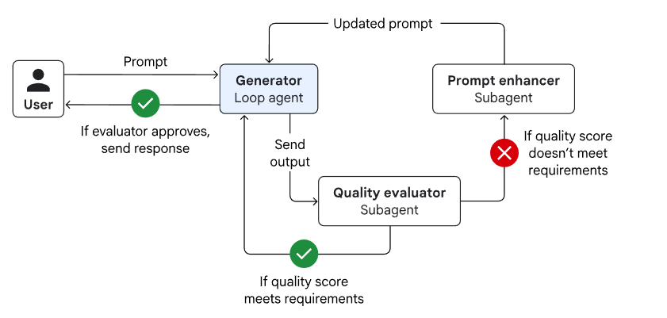
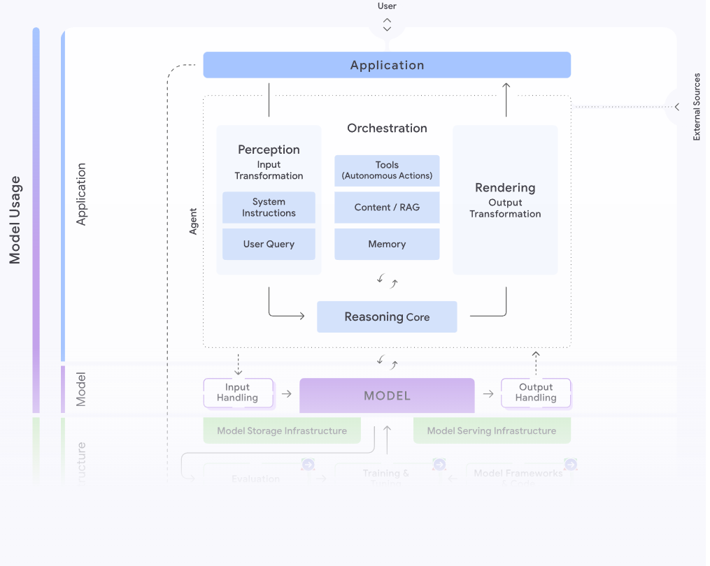
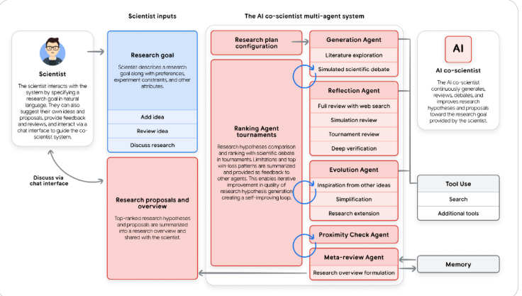

# Introduction to Agents 白皮书

[Introduction to Agents](https://drive.google.com/file/d/1C-HvqgxM7dj4G2kCQLnuMXi1fTpXRdpx/view)

- [Introduction to AI Agents](#introduction-to-ai-agents)
  - [The Agentic Problem-Solving Process](#the-agentic-problem-solving-process)
- [A Taxonomy of Agentic Systems](#a-taxonomy-of-agentic-systems)
  - [Level 0: 核心推理系统](#level-0-核心推理系统)
  - [Level 1: 连接式问题解决者](#level-1-连接式问题解决者)
  - [Level 2: 战略性问题解决者](#level-2-战略性问题解决者)
  - [Level 3: 协作多智能体系统](#level-3-协作多智能体系统)
  - [Level 4: 自我演化系统](#level-4-自我演化系统)
- [Core Agent Architecture: Model, Tools, and Orchestration](#core-agent-architecture-model-tools-and-orchestration)
  - [模型：你的AI智能体的“大脑”](#模型你的ai智能体的大脑)
  - [工具：你的AI智能体的“双手”](#工具你的ai智能体的双手)
    - [Retrieving Information: 根植于现实](#retrieving-information-根植于现实)
    - [Executing Actions: 改变世界](#executing-actions-改变世界)
    - [Function Calling: 将工具连接到你的智能体](#function-calling-将工具连接到你的智能体)
  - [编排层](#编排层)
    - [Core Design Choices](#core-design-choices)
    - [Instruct with Domain Knowledge and Persona](#instruct-with-domain-knowledge-and-persona)
    - [Augment with Context](#augment-with-context)
    - [Multi-Agent Systems and Design Patterns](#multi-agent-systems-and-design-patterns)
  - [Agent Deployment and Services](#agent-deployment-and-services)
  - [AgentOps: A Structured Apporach to the Unpredictable](#agentops-a-structured-apporach-to-the-unpredictable)
    - [Measure What Matters: Instrumenting Success Like an A/B Experiment](#measure-what-matters-instrumenting-success-like-an-ab-experiment)
    - [Quality Instead of Pass/Fail: Using a LM Judge](#quality-instead-of-passfail-using-a-lm-judge)
    - [Metrics-Driven Development: Your Go/No-Go for Deployment](#metrics-driven-development-your-gono-go-for-deployment)
    - [Debug with OpenTelemetry Traces: Answering "Why?"](#debug-with-opentelemetry-traces-answering-why)
    - [Cherish Human Feedback: Guiding Your Automation](#cherish-human-feedback-guiding-your-automation)
  - [Agent Interoperability](#agent-interoperability)
    - [Agents and Humans](#agents-and-humans)
    - [Agents and Agents](#agents-and-agents)
    - [Agents and Money](#agents-and-money)
  - [Securing a Single Agent: The Trust Trade-off](#securing-a-single-agent-the-trust-trade-off)
    - [Agent Identity: A New Class of Principal](#agent-identity-a-new-class-of-principal)
    - [Policies to Constrain Access](#policies-to-constrain-access)
    - [Securing an ADK Agent](#securing-an-adk-agent)
  - [Scaling Up from a Single Agent to an Enterprise Fleet](#scaling-up-from-a-single-agent-to-an-enterprise-fleet)
    - [Security and Privacy: Hardening the Agentic Frontier](#security-and-privacy-hardening-the-agentic-frontier)
    - [Agent Governance: A Control Plane instead of Sprawl](#agent-governance-a-control-plane-instead-of-sprawl)
    - [Cost and Reliability: The Infrastructure Foundation](#cost-and-reliability-the-infrastructure-foundation)
  - [How agents evolve and learn](#how-agents-evolve-and-learn)
    - [How agents learn and self evolve](#how-agents-learn-and-self-evolve)
      - [示例：学习新的合规指南](#示例学习新的合规指南)
    - [Simulation and Agent Gym - the next frontier](#simulation-and-agent-gym---the-next-frontier)
- [Examples of advanced agents](#examples-of-advanced-agents)
  - [Google 协同科学家 (Google Co-Scientist)](#google-协同科学家-google-co-scientist)
  - [AlphaEvolve 智能体](#alphaevolve-智能体)
- [Conclusion](#conclusion)

## Introduction to AI Agents

1. 模型（“大脑”）
2. 工具（“双手”）
3. 编排层（“神经系统”）
   1. e.g. [思维链](https://arxiv.org/pdf/2201.11903) 和[ReAct](https://arxiv.org/abs/2210.03629)
4. 部署（“身体与腿”）

### The Agentic Problem-Solving Process

1. Get the Mission
2. Scan the Scene
   1. 例如：“用户的请求说了什么？”、“我的短期记忆里有什么？”、“我可以访问哪些工具，如日历或数据库？”
3. Think It Through
4. Take Action
5. Observe and Iterate

## A Taxonomy of Agentic Systems

### Level 0: 核心推理系统

The Core Reasoning System.

“大脑”——推理引擎本身。语言模型（LM）是孤立运作的，仅根据其庞大的预训练知识库进行响应，不使用任何工具、记忆或与实时环境的互动。

### Level 1: 连接式问题解决者

The Connected Problem-Solver.

利用外部工具——我们架构中的“双手”组件——成为一个功能性智能体。

无论是使用搜索工具查询比分、使用金融API获取实时股价，还是通过检索增强生成（RAG）查询数据库——都是级别1智能体的核心能力。

### Level 2: 战略性问题解决者

The Strategic Problem-Solver.

从执行简单的任务转变为战略性规划复杂的、多部分的任务目标。

关键技能是**上下文工程（context engineering）**：智能体能够主动选择、封装和管理对其计划的每一步最相关的信息的能力。

### Level 3: 协作多智能体系统

The Collaborative Multi-Agent System.

智能体将其他智能体视为工具。

### Level 4: 自我演化系统

The Self-Evolving System.

一个智能体系统能够识别自身能力的差距，并动态地创建新的工具，甚至新的新智能体来弥补这些差距。它从使用一套固定的资源转变为主动扩展这些资源。

比如：
1. 思考（元推理）：“我必须跟踪‘Solaris’的社交媒体热度，但我缺乏这个能力。”
2. 行动（自主创建）：它没有失败，而是调用一个高层级的智能体创建工具（AgentCreator tool），并赋予一个新的任务：“构建一个新的智能体，用于监控关键词‘Solaris headphones’的社交媒体，执行情绪分析，并报告每日摘要。”
3. 观察：一个新的、专业的**情绪分析智能体（SentimentAnalysisAgent）**被创建、测试，并即时添加到团队中，准备为最初的任务做出贡献。

## Core Agent Architecture: Model, Tools, and Orchestration

### 模型：你的AI智能体的“大脑”

将这种选择视为简单地挑选具有最高基准得分的模型是常见的失败之路。一个智能体在生产环境中的成功，很少由通用的学术基准来决定。

成功要求模型擅长智能体基础功能：卓越的推理能力以应对复杂的、多步骤的问题，以及可靠的工具使用能力以与世界互动。

要做好这一点，首先要定义业务问题，然后根据直接映射到该结果的指标来测试模型。如果你的智能体需要编写代码，就在你的私有代码库上进行测试。如果它处理保险索赔，就评估其从你的特定文档格式中提取信息的能力。然后，必须将此分析与成本和延迟的实际考量进行交叉比对。“最佳”模型是在你的特定任务中，质量、速度和价格的最佳交集处的那个模型。

你可以选择不止一个模型，即一个**“专家团队”**。你不会用大锤去砸核桃。一个健壮的智能体架构可能会使用像 Gemini 2.5 Pro 这样的前沿模型来进行初始规划和复杂推理的“重体力活”，但随后会智能地将更简单、高容量的任务——例如对用户意图进行分类或总结文本——路由到一个更快、更具成本效益的模型，例如 Gemini 2.5 Flash。模型路由可以是自动的或硬编码的，但它是优化性能和成本的关键策略。

同样的原则适用于处理不同的数据类型。虽然像 Gemini live mode 这样的原生多模态模型提供了一条简化的路径来处理图像和音频，但另一种选择是使用专门的工具，如 Cloud Vision API 或 Speech-to-Text API。在这种模式中，世界首先被转换成文本，然后传递给一个纯语言模型进行推理。这增加了灵活性，并允许使用“最佳组件”，但同时也引入了显著的复杂性。
最后，人工智能领域处于持续、快速演变的状态。你今天选择的模型将在六个月内被取代。

最后，人工智能领域处于持续、快速演变的状态。你今天选择的模型将在六个月内被取代。“一劳永逸”的心态是不可持续的。着眼于这个现实进行构建意味着投资于一个灵活的操作框架——一个“智能体运维（Agent Ops）”实践。通过一个强大的 CI/CD（持续集成/持续部署）流水线，持续根据你的关键业务指标评估新模型，你可以降低升级风险并加速升级，确保你的智能体始终由可用的最佳“大脑”提供动力，而无需进行彻底的架构大修。

### 工具：你的AI智能体的“双手”

它们使智能体能够超越其静态训练数据，检索实时信息并对世界采取行动。一个健壮的工具接口是一个三部分循环：定义工具能做什么、调用它，以及观察结果。

几种主要工具类型（有关更完整的深入探讨，请参阅本系列中以智能体工具为重点的白皮书。）：

#### Retrieving Information: 根植于现实

最基础的工具是访问最新信息的能力。检索增强生成（Retrieval-Augmented Generation, RAG）赋予智能体一张“借书卡”，使其能够查询外部知识，这些知识通常存储在向量数据库或知识图谱中，范围从公司内部文档到通过Google搜索获取的网络知识。对于结构化数据，自然语言到 SQL (NL2SQL) 工具允许智能体查询数据库，以回答分析性问题，例如“上个季度我们最畅销的产品是什么？”。通过在发言前查找信息——无论是在文档中还是在数据库中——智能体将自身根植于事实，从而极大地减少了幻觉。

#### Executing Actions: 改变世界

智能体的真正力量在于它们从阅读信息转向**主动做事**时得到释放。通过将现有的 API 和代码函数封装为工具，智能体可以发送电子邮件、安排会议或更新 ServiceNow 中的客户记录。对于更动态的任务，智能体可以**即时(on the fly)编写和执行代码**。在一个安全的沙箱中，它可以生成 SQL 查询或 Python 脚本来解决复杂问题或执行计算，从而将其从一个知识渊博的助手转变为一个自主的行动者。

这也包括用于人机互动的工具。智能体可以使用**人工干预（Human in the Loop, HITL）**工具来暂停其工作流程，并请求确认（例如，ask_for_confirmation()）或请求用户界面中的特定信息（例如，ask_for_date_input()），从而确保在关键决策中有人参与。HITL 可以通过短信或数据库中的任务来实现。

#### Function Calling: 将工具连接到你的智能体

对于一个智能体要可靠地进行“函数调用”并使用工具，它需要清晰的指令、安全的连接和编排。像 OpenAPI 规范这样的长期标准提供了这一点，它为智能体提供了一个结构化的“契约”，描述了工具的用途、其所需的参数以及预期的响应。这个架构让模型能够每次都生成正确的函数调用并解释 API 响应。对于更简单的工具发现和连接，像 Model Context Protocol (MCP) 这样的开放标准已经变得流行，因为它们更方便。此外，一些模型拥有原生工具，例如 Gemini 拥有原生的 Google 搜索，其中函数调用作为语言模型调用本身的一部分发生。

### 编排层

连接大脑(模型)，双手(工具)的中枢神经系统

它是运行“思考、行动、观察”循环的引擎，是控制智能体行为的状态机，也是开发人员精心设计的逻辑得以实现的地方。这一层不仅仅是“管道”；它是整个智能体交响乐的指挥家，决定模型**何时应该推理，哪个工具应该行动，以及该行动的结果应如何为下一步行动提供信息**。

#### Core Design Choices

核心设计选择

第一个架构决策是确定智能体的自主程度。选择存在于一个光谱上。一端是确定性的、可预测的工作流程，它将语言模型作为一个工具来调用以完成特定任务——在现有流程中洒入一点人工智能进行增强。另一端是语言模型处于驾驶座，动态地适应、规划和执行任务以实现目标。

一个并行(意思是同样属于第一个架构决策)的选择是实现方法。**无代码构建器（No-code builders）**提供了速度和可访问性，使业务用户能够快速自动化结构化任务并构建简单的智能体。对于更复杂、任务关键的系统，**代码优先框架（code-first frameworks）**，例如 Google 的 智能体开发工具包（Agent Development Kit, ADK），提供了工程师所需的深度控制、可定制性和集成能力。

无论采用何种方法，一个生产级框架都是必不可少的。它必须是开放的，允许你插入任何模型或工具以防止供应商锁定。它必须提供精确的控制，实现一种混合方法，即语言模型的非确定性推理由硬编码的业务规则来管理。最重要的是，该框架必须为可观察性而构建。当智能体行为出乎意料时，你不能简单地在模型的“思想”中设置断点。一个健壮的框架会生成详细的追踪（traces）和日志（logs），暴露整个推理轨迹：模型的内部独白、它选择的工具、它生成的参数以及它观察到的结果。

#### Instruct with Domain Knowledge and Persona

用领域知识和人设进行指导

在这个框架内，开发人员最有力的杠杆是用领域知识和独特的人设来指导智能体。这通过系统提示或一套核心指令来实现。这不仅仅是一个简单的命令；它是智能体的宪法。

在这里，你告诉它：“你是一家 Acme 公司乐于助人的客户支持智能体”，并提供限制条件、所需的输出模式、交互规则、特定的语气，以及关于何时和为何应该使用其工具的明确指导。在指令中加入一些示例场景通常非常有效。

#### Augment with Context

用上下文增强

智能体的“记忆”在运行时被编排到语言模型的上下文窗口中。有关更完整的深入探讨，请参阅本系列中以智能体记忆为重点的白皮书。

短期记忆是智能体的活动“暂存区”，维护着当前对话的运行历史。它追踪正在进行的循环中的（行动，观察）对序列，为模型决定下一步要做什么提供即时上下文。这可以作为状态、工件、会话或线程等抽象来实现。

长期记忆提供跨会话的持久性。在架构上，这几乎总是作为另一个专业工具来实现——一个连接到向量数据库或搜索引擎的 RAG 系统。编排器赋予智能体预取和主动查询自身历史的能力，使其能够“记住”用户的偏好或数周前类似任务的结果，以实现真正个性化和连续的体验。

#### Multi-Agent Systems and Design Patterns

多智能体系统和设计模式

这是多智能体系统的核心：一个复杂的流程被分割成离散的子任务，并且每个子任务都被分配给一个专用、专业化的人工智能智能体。这种分工使得每个智能体都更简单、更聚焦、更容易构建、测试和维护，这对于动态或长期运行的业务流程来说是理想的选择。

架构师可以依赖于成熟的智能体设计模式，尽管智能体的能力以及随之而来的模式正在迅速发展。对于动态或非线性任务，**协调器模式（Coordinator pattern）**至关重要。它引入了一个“管理器”智能体，用于分析复杂的请求，分割主要任务，并智能地将每个子任务路由到适当的专业智能体（如研究员、撰稿人或编码员）。然后，协调器聚合来自每个专业智能体的响应，以形成一个最终的、全面的答案。

[为您的智能体 AI 系统选择设计模式](https://docs.cloud.google.com/architecture/choose-design-pattern-agentic-ai-system?hl=zh-cn)

对于更线性工作流，**顺序模式（Sequential pattern）**更适用，它就像一条数字装配线，其中一个智能体的输出成为下一个智能体的直接输入。其他关键模式侧重于质量和安全性。**迭代优化模式（Iterative Refinement pattern）**创建了一个反馈循环，使用一个“生成器”智能体来创建内容，并使用一个“批评家”智能体来根据质量标准对其进行评估。对于高风险任务，人工干预（Human-in-the-Loop, HITL）模式至关重要，它在工作流中创造了一个刻意的暂停，以便在智能体采取重大行动之前获得人类的批准。

### Agent Deployment and Services

个智能体需要多项服务才能有效运行，包括会话历史和内存持久化等。作为一名智能体构建者，你还需要负责决定记录什么日志，以及为数据隐私、数据驻留和法规遵从采取哪些安全措施。在将智能体部署到生产环境时，所有这些服务都在考虑范围之内。

幸运的是，智能体构建者可以依赖数十年的应用托管基础设施。毕竟，智能体是一种新的软件形式，许多相同的原则仍然适用。构建者可以依赖专用的、以智能体为中心的部署选项，例如 Vertex AI Agent Engine，它在一个平台上支持运行时和所有其他功能。对于希望更直接地控制其应用堆栈，或将其智能体部署到现有 DevOps 基础设施内的软件开发人员，任何智能体和大多数智能体服务都可以添加到 Docker 容器中，并部署到 Cloud Run 或 GKE 等行业标准运行时上。

### AgentOps: A Structured Apporach to the Unpredictable

传统的软件单元测试可以简单地断言 输出 == 预期；但这在智能体响应本质上是概率性设计的情况下行不通。此外，由于语言的复杂性，通常需要一个语言模型（LM）来评估“质量”——即智能体的回复是否完成了它应该做的一切、没有做它不应该做的，并且语气恰当。

智能体运维（Agent Ops）是管理这一新现实的有纪律、结构化的方法。将不可预测性从一个负面因素转化为一个可管理、可衡量且可靠的特性。有关更完整的深入探讨，请参阅本系列中以智能体质量为重点的白皮书。

#### Measure What Matters: Instrumenting Success Like an A/B Experiment

衡量重要指标：像 A/B 实验一样进行测量

像 A/B 测试一样构建你的可观察性策略，并问自己：哪些 关键绩效指标（KPI）能够证明智能体正在创造价值？这些指标应该超越技术正确性，衡量真实世界的影响：目标完成率、用户满意度评分、任务延迟、每次交互的运营成本，以及——最重要的是——对收入、转化或客户保留等业务目标的影响。这种自上而下的视角将指导你后续的测试，让你走上指标驱动开发的道路，并让你能够计算投资回报。

#### Quality Instead of Pass/Fail: Using a LM Judge

质量而非通过/失败：使用 LM 评判员

业务指标并不能告诉你智能体的行为是否正确。由于简单的通过/失败是不可能的，我们转向使用“LM 作为评判员”来评估质量。这涉及到使用一个强大的模型，根据预定义的标准来评估智能体的输出：它给出了正确的答案吗？回复是否基于事实？它遵循指令了吗？这种针对黄金数据集（golden dataset）提示运行的自动化评估，提供了对质量的一致衡量。

创建评估数据集——包括理想（或“黄金”）问题和正确回复——可能是一个繁琐的过程。为了构建这些数据集，你应该从智能体的现有生产或开发交互中采样场景。该数据集必须涵盖你期望用户参与的全部用例，以及一些意料之外的用例。虽然对评估的投入会很快得到回报，但评估结果在被接受为有效之前，应始终由领域专家进行审查。评估的策划和维护正日益成为产品经理的关键职责，并得到领域专家的支持。

#### Metrics-Driven Development: Your Go/No-Go for Deployment

指标驱动的开发：部署的“可行/不可行”决定

一旦你自动化了数十个评估场景并建立了可信的质量分数，你就可以自信地测试对开发中智能体的更改。过程很简单：用新版本运行整个评估数据集，并直接将其分数与现有的生产版本进行比较。虽然自动化评估至关重要，但不要忘记其他重要因素，如延迟、成本和任务成功率。为了最大限度的安全，使用 A/B 部署来缓慢推出新版本，并将其真实世界的生产指标与你的模拟分数进行比较。

#### Debug with OpenTelemetry Traces: Answering "Why?"

使用 OpenTelemetry 追踪进行调试：回答“为什么？”

当你的指标下降或用户报告了一个错误时，你需要了解**“为什么”。一个 OpenTelemetry 追踪（trace）是智能体整个执行路径（轨迹）的高保真、分步记录，允许你调试智能体的步骤。通过追踪，你可以看到发送给模型的精确提示**、模型的内部推理（如果可用）、它选择调用的特定工具、它为该工具生成的精确参数，以及作为观察结果返回的原始数据。追踪在你第一次查看时可能会很复杂，但它们提供了诊断和修复任何问题的根本原因所需的细节。重要的追踪细节可以转化为指标，但审查追踪主要用于调试，而非性能概述。追踪数据可以无缝地收集在像 Google Cloud Trace 这样的平台中，这些平台可以可视化和搜索大量的追踪，从而简化根本原因分析。

#### Cherish Human Feedback: Guiding Your Automation

珍视人工反馈：指导您的自动化

人工反馈不是一个需要应付的烦恼；它是您改进智能体拥有的最有价值、数据最丰富的资源。当用户提交错误报告或点击“不喜欢”按钮时，他们是送给您一份礼物：一个您的自动化评估场景遗漏的新的、真实的边缘案例。收集和汇总这些数据至关重要；当您看到大量类似的报告或指标下降时，您必须将这些情况与您的分析平台关联起来，以生成洞察并触发操作问题的警报。一个有效的智能体运营（Agent Ops）流程通过捕获此反馈、重现问题，并将其转化为评估数据集中的一个新的永久测试用例，从而“闭合循环”。这确保了您不仅修复了错误，而且使系统对同类错误具有了免疫力。

### Agent Interoperability

智能体互操作性

连接智能体与连接智能体和数据及 API 是有区别的；智能体不是工具。

#### Agents and Humans

智能体与人类最常见的交互形式是通过用户界面（UI）。人工在环（Human in the Loop, HITL）的交互模式包括意图细化、目标扩展、确认和澄清请求。

计算机使用（Computer use）是一种工具类别，其中语言模型（LM）接管用户界面，通常在人类的交互和监督下进行。一个启用计算机使用的智能体可以决定下一个最佳行动是导航到一个新页面、突出显示一个特定按钮，或用相关信息预填充一个表单。

智能体也可以改变用户界面以满足当前的需求，而不是代表用户使用界面。这可以通过控制 UI 的工具（MCP UI）或可以与智能体同步客户端状态的专用 UI 消息系统（AG UI），甚至生成定制的界面（A2UI）来实现。

当然，人类交互不限于屏幕和键盘。先进的智能体正在打破文本障碍，进入实时、多模态通信的“实时模式”（live mode），从而建立更自然、更像人类的连接。Gemini Live API 等技术支持双向流式传输，允许用户与智能体交谈并打断它，就像在自然对话中一样。

这种能力从根本上改变了智能体与人类协作的性质。由于可以访问设备的摄像头和麦克风，智能体可以看到用户所见，听到用户所言，并以模仿人类对话的延迟生成语音进行回应。这开辟了广泛的用例，这些用例是文本无法实现的，例如技术人员在维修设备时获得免提指导，或购物者获得实时着装建议。它使智能体成为一个更直观、更易于接触的合作伙伴。

#### Agents and Agents

正如智能体必须与人类连接一样，它们也必须相互连接。核心挑战是双重的：发现（我的智能体如何找到其他智能体并知道它们能做什么？）和通信（我们如何确保它们说同一种语言？）。

Agent2Agent (A2A) 协议是旨在解决此问题的开放标准。它充当智能体经济的通用握手。A2A 允许任何智能体发布一个数字“名片”，称为 Agent Card。这个简单的 JSON 文件宣传了智能体的能力、其网络端点以及与之交互所需的安全凭证。这使得发现过程简单且标准化。与专注于解决事务性请求的 MCP 不同，Agent 2 Agent 通信通常用于额外的解决问题。

一旦被发现，智能体使用面向任务的架构进行通信。交互不是简单的请求-响应，而是被框架化为异步“任务”。客户端智能体向服务器智能体发送任务请求，后者随后可以在处理问题的长时间连接过程中提供流式更新。这种健壮、标准化的通信协议是解谜的最后一步，它实现了代表自动化前沿的协作式、L3 级多智能体系统。A2A 将孤立的智能体集合转变为一个真正的、可互操作的生态系统。

#### Agents and Money

其中一些任务涉及买卖、谈判或促成交易。如果一个自主智能体点击“购买”，就会产生信任危机——如果出现问题，谁来承担责任？要解锁一个真正的智能体经济，我们需要新的标准，允许智能体代表用户安全可靠地进行交易。

这个新兴领域远未成熟，但有两个关键协议正在铺平道路。Agent Payments Protocol (AP2) 是一个开放协议，旨在成为智能体商务的权威语言。它通过引入加密签名的数字“授权书”（mandates）来扩展 A2A 等协议。这些授权书作为用户意图的可验证证明，为每笔交易创建了一个不可否认的审计追踪。这使得智能体能够根据用户委托的权限在全球范围内安全地浏览、谈判和交易。与此相辅相成的是 x402，这是一个开放的互联网支付协议，使用标准的 HTTP 402 “Payment Required” 状态码。它实现了无摩擦的机器对机器小额支付，允许智能体以按使用付费的方式支付 API 访问或数字内容，而无需复杂的账户或订阅。这些协议共同为智能体网络构建了基础信任层。

### Securing a Single Agent: The Trust Trade-off

保护单个智能体：信任的权衡

效用与安全之间的权衡。给予agent权限伴随着风险。

不能仅仅依赖人工智能模型的判断，因为它可能被像提示注入（prompt injection）这样的技术所操纵。相反，最佳实践是采用混合的、深度防御方法。

* 第一层包括传统的、确定性的安全护栏——一套硬编码的规则，作为模型推理之外的安全瓶颈。这可以是一个策略引擎，用于阻止任何超过 100 美元的购买，或者在智能体与外部 API 交互之前要求明确的用户确认。这一层为智能体的权力提供了可预测、可审计的硬性限制。
* 第二层利用基于推理的防御，用人工智能来帮助保护人工智能。这涉及训练模型以使其对攻击更具弹性（对抗性训练），并采用更小的、专业的“守卫模型”充当安全分析师。这些模型可以在智能体执行其拟议计划之前对其进行检查，标记出潜在的风险或违反策略的步骤进行审查。这种混合模型将代码的严格确定性与人工智能的上下文感知相结合，为即使是单个智能体也创建了一个强大的安全态势，确保其权力始终与其目的保持一致。
  
#### Agent Identity: A New Class of Principal

智能体身份：一种新型主体

在传统的安全模型中，存在可能使用 OAuth 或 SSO 的人类用户，以及使用 IAM 或服务账户的服务。智能体增加了第三类主体。智能体不仅仅是一段代码；它是一个自主的行动者，是一种需要拥有其可验证身份的新型主体。就像员工被发放身份证一样，平台上的每个智能体都必须被发放一个安全、可验证的“数字护照”。

智能体身份区别于调用它的用户身份和构建它的开发人员身份。这是我们必须处理企业级身份和访问管理（IAM）方式的根本性转变。

让每个身份都经过验证并对其拥有访问控制，是智能体安全的基石。一旦智能体拥有了加密可验证的身份（通常使用像 SPIFFE 这样的标准），就可以授予其自身的特定、最小权限。例如，SalesAgent 被授予对 CRM 的读/写访问权限，而 HRonboardingAgent 则被明确拒绝。这种精细控制至关重要。它确保即使单个智能体被入侵或行为异常，潜在的影响范围也会被限制。如果没有智能体身份结构，智能体就不能代表具有有限委托权限的人类工作。

主体实体             | 认证 / 验证            | 备注
---------------------|------------------------|-----------------------------------------
用户                 | 使用 OAuth 或 SSO 认证 | 拥有完全自主权和对其行为负责的人类行动者
智能体（新型主体类别） | 使用 SPIFFE 验证       | 智能体拥有委托权限，代表用户采取行动
服务账户             | 集成到 IAM 中          | 应用程序和容器，完全确定性，不对行动负责

#### Policies to Constrain Access

限制访问的策略

策略是一种授权authorization（AuthZ）形式，有别于认证authentication（AuthN）。通常，策略限制主体的能力；例如，“营销部的用户只能访问这 27 个 API 端点，并且不能执行 DELETE 命令”。在开发智能体时，我们需要对智能体、它们的工具、其他内部智能体、它们可以共享的上下文以及远程智能体应用权限。可以这样想：如果您将所有 API、数据、工具和智能体添加到您的系统中，那么您必须将访问权限限制为仅完成其工作所需的那些能力子集。这是推荐的方法：在保持上下文相关性的同时，应用最小权限原则。

#### Securing an ADK Agent

保护 ADK 智能体

确立了身份和策略的核心原则后，保护使用 Agent Development Kit (ADK) 构建的智能体就成为了通过代码和配置应用这些概念的实际操作。

如上所述，该过程需要明确定义身份：用户账户（例如 OAuth）、服务账户（用于运行代码）、智能体身份（用于使用委托权限）。一旦处理了认证，下一层防御就涉及建立策略来限制对服务的访问。这通常在 API 治理层完成，并辅以支持 MCP 和 A2A 服务的治理。

下一层是在您的工具、模型和子智能体中构建安全护栏以执行策略。这确保了无论 LM 如何推理或恶意提示可能建议什么，工具自身的逻辑都会拒绝执行不安全或超出策略的操作。这种方法提供了一个可预测和可审计的安全基线，将抽象的安全策略转化为具体的、可靠的代码。

为了实现更具动态性、能适应智能体运行时行为的安全防护，ADK 提供了回调 (Callbacks) 和插件 (Plugins)。一个 before_tool_callback 允许您在工具调用运行之前检查其参数，根据智能体当前状态进行验证，以防止不当行为。对于更可复用的策略，您可以构建插件。一个常见模式是“Gemini 作为法官”，它使用像 Gemini Flash-Lite 或您自己微调的 Gemma 模型等快速、低成本的模型，实时筛选用户输入和智能体输出，以防范提示注入或有害内容。

对于那些倾向于使用完全托管、企业级解决方案来处理这些动态检查的组织，可以集成 **Model Armor** 作为可选服务。Model Armor 作为一个专业的安全层，筛选提示和响应，以应对包括提示注入、越狱尝试、敏感数据（PII）泄露和恶意 URL 在内的各种威胁。通过将这些复杂的安全任务外包给专用服务，开发人员可以确保一致、强大的保护，而无需自行构建和维护这些安全护栏。ADK 中的这种混合方法——结合强大的身份、确定性的工具内置逻辑、动态的 AI 驱动安全护栏，以及像 Model Armor 这样的可选托管服务——是构建一个既强大又值得信赖的单个智能体的方式。

### Scaling Up from a Single Agent to an Enterprise Fleet

从单个智能体扩展到企业智能体群

单个 AI 智能体的生产成功是一个胜利。扩展到数百个智能体群则是一个架构挑战。如果您正在构建一两个智能体，您的顾虑主要在于安全。如果您正在构建许多智能体，您必须设计系统来处理更多事务。就像 API 蔓延一样，当智能体和工具在整个组织中激增时，它们会创建一个由交互、数据流和潜在安全漏洞组成的新复杂网络。管理这种复杂性需要一个将您所有的身份和策略集成到一个中央控制平面中的更高阶的治理层。

#### Security and Privacy: Hardening the Agentic Frontier

安全与隐私：强化智能体领域的前沿

企业级平台必须解决生成式 AI 固有的独特安全和隐私挑战，即使只有一个智能体在运行。智能体本身成为一个新的攻击载体。恶意行为者可能会尝试提示注入来劫持智能体的指令，或进行数据投毒来破坏它用于训练或 RAG 的信息。此外，一个约束不佳的智能体可能会在其响应中不经意地泄露敏感客户数据或专有信息。

一个强大的平台提供深度防御策略来减轻这些风险。它从数据开始，确保企业的专有信息绝不用于训练基础模型，并通过 VPC Service Controls 等控制措施进行保护。它需要对输入和输出进行过滤，就像为提示和响应设置防火墙。最后，平台必须为训练数据和生成输出提供合同保护，例如知识产权赔偿，使企业具备在生产环境中部署智能体所需的法律和技术信心。

#### Agent Governance: A Control Plane instead of Sprawl

智能体治理：控制平面而非蔓延

随着智能体及其工具在组织内激增，它们创建了一个新的复杂交互网络和潜在漏洞，这个挑战通常被称为“智能体蔓延”。管理这需要超越保护单个智能体，转而实施一种更高阶的架构方法：一个充当所有智能体活动控制平面的中央网关。

想象一个拥有数千辆自动驾驶汽车——用户、智能体和工具——都在有目的地移动的繁华大都市。如果没有红绿灯、牌照和中央控制系统，就会一片混乱。网关方法创建了这个控制系统，为所有智能体流量建立了一个强制性的入口点，包括用户到智能体的提示或 UI 交互、智能体到工具的调用（通过 MCP）、智能体到智能体的协作（通过 A2A），以及直接对大型语言模型（LMs）的推理请求。通过位于这个关键的交汇点，组织可以检查、路由、监控和管理每一次交互。

这个控制平面服务于两个主要的、相互关联的功能：
1. **运行时策略执行**：它充当实施安全的架构瓶颈。它处理认证（“我认识这个行为者吗？”）和授权（“他们有权限做这件事吗？”）。集中执行为可观察性提供了一个“单一视图”，为每笔交易创建了通用的日志、指标和追踪。这将分散的智能体和工作流的“意大利面条式”网络转变为一个透明且可审计的系统。
2. **集中式治理**：为了有效地执行策略，网关需要一个事实来源。这由一个中央注册表提供——一个用于智能体和工具的企业应用商店。该注册表允许开发人员发现和重用现有资产，防止重复工作，同时为管理员提供完整的库存清单。更重要的是，它为智能体和工具提供了一个正式的生命周期，允许在发布前进行安全审查、版本控制以及创建细粒度策略，以规定哪些业务部门可以访问哪些智能体。
通过将运行时网关与中央治理注册表相结合，组织将混乱蔓延的风险转变为一个可管理、安全和高效的生态系统。

#### Cost and Reliability: The Infrastructure Foundation

成本与可靠性：基础设施基础

归根结底，企业级智能体必须既可靠又具有成本效益。一个经常失败或提供缓慢结果的智能体投资回报率（ROI）是负面的。反之，一个成本过高的智能体无法扩展以满足业务需求。底层基础设施必须被设计来管理这种权衡，确保安全，并符合监管和数据主权的要求。

在某些情况下，您需要的功能是规模缩减到零 (scale-to-zero)，即当某个特定智能体或子功能流量不规律时。对于任务关键型、对延迟敏感的工作负载，平台必须提供专用、有保障的容量，例如针对 LM 服务提供的预置吞吐量 (Provisioned Throughput) 或针对 Cloud Run 等运行时提供的 99.9% 服务级别协议 (SLAs)。这提供了可预测的性能，确保您最重要的智能体即使在重负载下也始终保持响应。通过提供这一系列的基础设施选项，并结合对成本和性能的全面监控，您为将 AI 智能体从一个有前景的创新扩展为企业核心、可靠的组件，奠定了最终且必不可少的基础。

### How agents evolve and learn

部署在现实世界中的智能体在政策、技术和数据格式不断变化的动态环境中运行。如果缺乏适应能力，智能体的性能会随着时间的推移而下降——这个过程通常被称为“老化”——从而导致效用和信任的丧失。手动更新大量的智能体群以跟上这些变化既不经济又缓慢。一个更具可扩展性的解决方案是设计能够自主学习和演进的智能体，以最小的工程投入在工作中提高其质量。

#### How agents learn and self evolve

就像人类一样，智能体通过经验和外部信号进行学习。这种学习过程由几个信息来源推动：

* 运行时经验：智能体从会话日志、追踪和内存等运行时产物中学习，这些产物记录了成功、失败、工具交互和决策轨迹。至关重要的是，这包括人工在环（HITL）反馈，它提供了权威的纠正和指导。
* 外部信号：学习也受到新的外部文档驱动，例如更新的企业政策、公共监管指南或来自其他智能体的批评。

然后，这些信息被用于优化智能体未来的行为。先进的系统不会仅仅总结过去的交互，而是创建可泛化的产物来指导未来的任务。最成功的适应技术分为两类：
* **增强的上下文工程**：系统不断完善其提示、少样本示例以及从内存中检索的信息。通过为每个任务优化提供给 LM 的上下文，它增加了成功的可能性。
* **工具优化和创建**：智能体的推理可以识别其能力中的差距并采取行动来填补它们。这可能涉及获得一个新工具的访问权限、即时创建一个新工具（例如，一个 Python 脚本），或修改一个现有工具（例如，更新一个 API 模式）。

其他优化技术，例如动态重新配置多智能体设计模式或使用来自人类反馈的强化学习（Reinforcement Learning from Human Feedback RLHF），都是活跃的研究领域。

##### 示例：学习新的合规指南

考虑一个在金融或生命科学等受到严格监管的行业中运作的企业智能体。它的任务是生成必须遵守隐私和监管规则（例如 GDPR）的报告。

这可以通过一个多智能体工作流来实现：
1. 查询智能体 (Querying Agent) 检索响应用户请求的原始数据。
2. 报告智能体 (Reporting Agent) 将这些数据合成为一份报告草稿。
3. 批评智能体 (Critiquing Agent)，掌握已知的合规指南，审查报告。如果遇到歧义或需要最终签署，它会升级给人类领域专家。
4. 学习智能体 (Learning Agent) 观察整个交互过程，特别关注人类专家提供的纠正性反馈。然后，它将此反馈泛化为一个新的、可重用的指南（例如，为批评智能体更新规则或为报告智能体提炼上下文）。
例如，如果一位人类专家标记出某些家庭统计数据必须匿名化，学习智能体就会记录这个更正。下次生成类似报告时，批评智能体将自动应用这条新规则，从而减少对人工干预的需求。这种批评、人类反馈和泛化的循环允许系统自主适应不断变化的合规要求。

#### Simulation and Agent Gym - the next frontier

模拟与智能体训练场——下一个前沿

我们提出的设计模式可以归类为内联学习（in-line learning），即智能体需要利用它们被设计时的资源和设计模式进行学习。目前正在研究更先进的方法，即有一个专门的平台，设计用于在离线过程中优化多智能体系统，该平台拥有高级工具和能力，而这些工具和能力不属于多智能体运行时环境的一部分。这种 智能体训练场 (Agent Gym) 的关键属性是：

1. 它不在执行路径中。它是一个独立于生产的离线平台，因此可以得到任何 LM 模型、离线工具、云应用等的协助。
2. 它提供一个模拟环境，因此智能体可以在新数据上“锻炼”和学习。这个模拟环境非常适合进行“试错”以及许多优化途径。
3. 它可以调用先进的合成数据生成器，这些生成器指导模拟尽可能真实，并对智能体进行压力测试（这可以包括先进技术，如红队测试、动态评估和一系列批评智能体）。
4. 优化工具的“武器库”并非固定，它可以采用新工具（无论是通过 MCP 或 A2A 等开放协议），或者在更高级的设置中——学习新概念并围绕它们设计工具。
5. 最后，即使是像智能体训练场这样的结构，也可能无法克服某些边缘案例（由于企业中众所周知的“部落知识”问题）。在这些情况下，我们看到智能体训练场能够连接到人类领域专家的结构，并与他们协商正确的成果集，以指导下一组优化。

## Examples of advanced agents

### Google 协同科学家 (Google Co-Scientist)

为了实现这一点，协同科学家会催生一个相互协作的智能体生态系统。
* 科学家：科学家通过自然语言指定研究目标与系统交互。他们还可以提出自己的想法和建议，提供反馈和审查，并通过聊天界面进行交互来指导协同科学家系统。
* 研究提案和概述：排名靠前的研究假设和提案被总结成研究概述，并与科学家共享。
* AI 协同科学家多智能体系统：AI 协同科学家不断地生成、审查、辩论和改进研究假设和提案，以实现科学家提供的研究目标。
  * 生成智能体：进行文献探索和模拟科学辩论。
  * 排名智能体：进行研究假设比较和排名，将科学辩论纳入其中。
  * 反思智能体：进行全面审查、模拟审查、锦标赛审查和深度验证。

该系统首先接受一个广泛的研究目标，并创建一个详细的项目计划。然后，一个“主管”智能体充当经理，将任务委托给一个由专业智能体组成的团队，并分配计算能力等资源。这种结构确保了项目可以轻松扩展，并且团队的方法会随着朝着最终目标努力而改进。

各种代理工作数小时甚至数天，不断改进生成的假设，运行循环和元循环，不仅改进生成的想法，而且改进我们判断和创造新想法的方式。

### AlphaEvolve 智能体

另一个高级智能体系统示例是 AlphaEvolve，这是一个发现和优化数学和计算机科学中复杂问题算法的 AI 智能体。

AlphaEvolve 的工作原理是将 Gemini 语言模型的创意代码生成与自动化评估系统相结合。它使用一个进化过程：AI 生成潜在解决方案，评估器对其进行评分，然后将最有前途的想法用作下一代代码的灵感。

这种方法已经带来了重大突破，包括：
* 提高了 Google 数据中心、芯片设计和 AI 训练的效率。
* 发现了更快的矩阵乘法算法。
* 找到了开放数学问题的新解决方案。

AlphaEvolve 擅长解决那些验证解决方案质量比找到解决方案本身容易得多的问题。

AlphaEvolve 旨在实现人类和 AI 之间深入、迭代的伙伴关系。这种协作主要通过两种方式进行：

* 透明的解决方案：AI 以人类可读的代码形式生成解决方案。这种透明性允许用户理解逻辑、获得洞察、信任结果，并直接修改代码以满足他们的需求。
* 专家指导：人类专业知识对于定义问题至关重要。用户通过完善评估指标和指导探索来指导 AI，这可以防止系统利用问题定义中意外的漏洞。

## Conclusion

生成式 AI 智能体标志着一个关键的演进，将人工智能从一个被动的内容创作工具转变为一个主动、自主的问题解决伙伴。本文档提供了一个正式的框架，用于理解和构建这些系统，超越原型，建立一个可靠、生产级的架构。

我们已经将智能体解构为其三个基本组成部分：推理模型（“大脑”）、可操作的工具（“双手”）和管理编排层（“神经系统”）。正是这些部分的无缝集成，在持续的“思考、行动、观察”循环中运行，才释放了智能体的真正潜力。通过对智能体系统进行分类——从 L1 级连接问题解决者到 L3 级协作多智能体系统——架构师和产品负责人现在可以战略性地规划他们的目标，以匹配手头任务的复杂性。

核心的挑战和机遇在于一种新的开发者范式。我们不再仅仅是定义明确逻辑的“砌砖工”；我们是必须指导、约束和调试自主实体的“架构师”和“导演”。大型语言模型（LMs）的强大灵活性也是它们不可靠的根源。因此，成功并非仅在于最初的提示，而在于应用于整个系统的工程严谨性：在稳健的工具契约、有弹性的错误处理、复杂的上下文管理和全面的评估中。

此处概述的原则和架构模式构成了基础蓝图。它们是驾驭这个软件新领域、使我们能够构建的不仅是“工作流自动化”，而是真正协作、有能力和适应性强的新团队成员的指南。随着这项技术的成熟，这种规范的、架构化的方法将是利用智能体 AI 全部力量的决定性因素。
