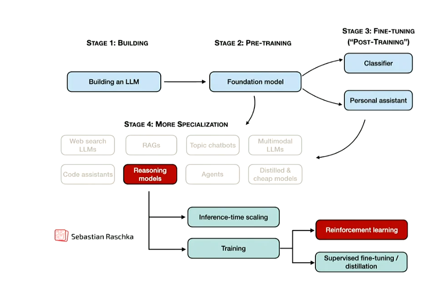

# Fine-tuning

## 随记
### PEFT
1. 用数据集进行参数fine-tuning比prompt-based fine-tuning更好。下面所谓的prompt search和prompt tuning其实不是prompt-based fine-tuning,是PEFT(Parameter-Efficient Fine-Tuning)。所以这里全部都是PEFT。
2. promp search和prompt tuning，search是从此表里找个词填到prompt的`MASK`里，tuning是在向量级别的embedding里加个没有任何真实词意义的向量，相当于一组参数，然后训练它
3. AutoPrompt（prompt search的例子）: gradient-guided search，不意味着是能求导来地图下降，只是用loss计算trigger token的embedding梯度来指引用哪个词来试。利用语言模型（如 BERT）的 **Masked Language Modeling（MLM）能力**，通过自动构造 prompt，让模型自己在 `[MASK]` 处输出“正面”或“负面”类词，从而完成分类。
   * 原始输入：例如 “a real joy.”
   * 本身不能直接被用于 `[MASK]` 预测分类，需要构造一个 prompt。
   * 这些是经过一些操作（见下面的讲解）得出的**触发词**，比如：
    ```
    atmosphere, alot, dialogue, Clone, totally
    ```
   * 它们不一定有语义意义，但组合起来能引导模型预测正确的 `[MASK]` 词。
   * 模板结构将输入与 trigger 拼接，形成如下句子：
    ```
    a real joy. atmosphere alot dialogue Clone totally [MASK]
    ```
   * 这样构造的句子会送入语言模型（如 BERT）。
   * 利用 Masked Language Model（如 BERT），预测 `[MASK]` 位置最可能出现的词；
   * 比如模型可能输出：
    ```
    "Cris", "marvelous", "philanthropic"...
    ```
   * 将预测出的 `[MASK]` 候选词映射到某个标签集（如情感分类的正面/负面）：
     * 正面词：marvelous, amazing, great...
     * 负面词：worse, incompetent...
   * 通过这些词的总概率，来判断最终分类属于哪一类。
   * 怎么获得这个trigger词：把词变成向量，去和$log p(y|x_prompt)$的梯度做内积，判断方向是否差不多，选择最接近的k个词，所以公式就是$top-k[w_{in}^T\nabla log p(y|x_prompt)]$，$w_{in}$是trigger备选词向量，$x_prompt$是prompt的embedding。
   * Trigger word 是你插入句子里引导模型预测的“激发词”。
   * Label token 是你用来表示分类目标的“答案词”。
   * 怎么获得label token: 
     * 先用带trigger的prompt的embedding的分类器去正向训练这个分类器 h
     * 再反向看每个词的分数，哪个更合适，取top-k个（注意不是前面的trigger公式的top-k，这里是label token的训练函数）
4. BitFit 只训练偏置参数
5. Adapters 加一两层新的网络
   * 你可以把 Adapter 理解成一种类似于自动编码器（autoencoder）的小结构：
      * 它有一个“瓶颈”（bottleneck）；
      * 包含一个降维（down-projection）和升维（up-projection）结构；
      * 像是把信息压缩进低维潜空间，然后再恢复出来。
   * 你强迫模型通过一个更小的潜空间去表达所学任务，而不是靠大模型“死记硬背”；
   * 比如传统全参数微调中，可能涉及几万个参数（如 feed-forward 层的所有权重），而 Adapter 把表达压缩进少量参数，让模型不能靠“记住细节”，而是要“提炼抽象表示”。
6. LoRA 低秩分解 - low-rank adaption
   * 单独添加两个小矩阵（A 和 B）**来“模拟”要训练的变化，原矩阵保持冻结。
   * 目标是让rank越低越好，达到压缩的效果。
7. $IA^3$
   1. Infused Adapter by Inhibiting and Amplifying Inner Activations
   2. 就是搞一些激活函数训练一些gates
   3. 本质上它做的是Hadamard 乘积（也叫逐元素乘法）
   4. 每一层中的关键激活（比如 attention 的 key 或 value）都会被一个可学习向量逐元素缩放。
   5. 它可以作用于 任何 attention 机制，比如：自注意力（self-attention）里的 key 和 value；编码器-解码器的交叉注意力（cross-attention）中的对应项。
   6.  类似 LSTM 中的门控机制，你可以控制激活值是否流通、存储或抑制。这被类比为大脑中的情绪、冲动被“理智”调控的过程。
8. 比较：总的来说，Adapter, LoRA，FISH MASK三者准确率最高

### Human Preferences Tuning & RL

#### 模型强度


web, rag, agents, etc. 为了More Specialization（进一步专业化）

重点：Reasoning Models
* Chain of Thought (CoT)
* Tree of Thought (ToT)
* 基于 Prompt 提示模型学会多步推理，但问题是：往往“像是补全，而不是真正的创造性思考”

Reasoning Models尝试新方法引入
* Reinforcement Learning（强化学习）：例如 RLHF，用人类偏好引导模型“走更深的推理路径”
* Supervised Fine-tuning / Distillation（有监督微调或蒸馏）：
  * 蒸馏：把大型 teacher 模型的行为压缩到更小模型中，保留能力、减少参数

#### 人类喜好

* SFT（Supervised Fine-tuning）不一定不让模型说脏话。
* human preference不能求导，所以用RL.
* RLHF(Reinforcement Learning from Human Feedback)是用人类的偏好来训练模型。
  * Policy = our LLM
  * Reward Model = (smaller) LLM with extra layers for regression
  * Label = human score / preference (就是gpt每次回复后的点赞)
* DPO(Direct Preference Optimization)
  * 一种替代 RLHF 的方法
  * 直接优化人类偏好，而不需要使用reward based强化学习，如RLHF和PPO(Proximal Policy Optimization)
  * 我们已经有了人类比较数据（喜欢 A 不喜欢 B），为什么还要建个奖励模型，再用 RL 优化？所以直接从比较数据中学！不用 reward model
  * 论文表示DPO 方法在无需训练奖励模型或进行强化学习的情况下，能够直接优化语言模型以符合人类偏好，具有更高的稳定性和计算效率。