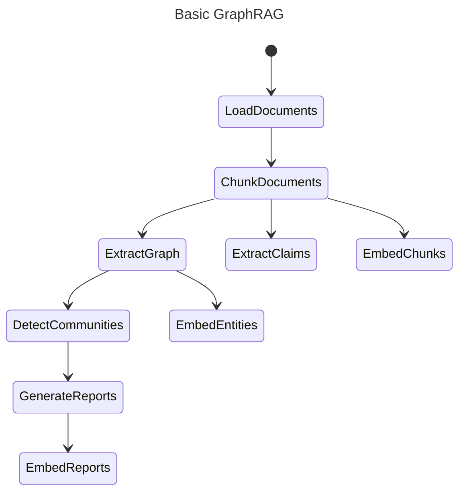
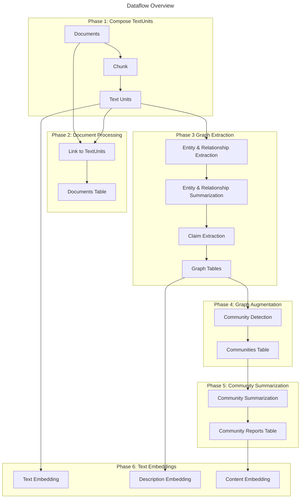

# GraphRAG

[MS GraphRAG](https://microsoft.github.io/graphrag/)

[MS GraphRAG DataFlow](https://microsoft.github.io/graphrag/index/default_dataflow/)

[Github doc of MS GraphRAG](https://github.com/microsoft/graphrag/tree/main/docs)


## 个人理解

### 前提

1. GraphRAG**不是**真的用graph db存储数据，而是用graph的形式组织数据，方便后续的retrieval和reasoning

### 流程理解

1. 使用LLM将文本拆成chunk，设置为textunit，并embedding，保存为一个vector database。同时一个Document Table保存文档的metadata和textunit的link。
2. 使用LLM将textunit保存为图的格式，即实体和关系。
   1. 合并相同的实体或关系。
   2. 使用一个表存储实体（实体，描述summry，要embedding）
   3. 使用一个表存储关系（关系，源和目的，描述summry，要embedding）
   4. （可选）并claim一种高级的格式化的形式的内容，保存到一个地方。 
3. 将图数据库进行augment
   1. 聚类为社区(MS的用的是Leiden technique聚类)
   2. 并将社区概括一个summry(要embedding)，统一保存一个表
   3. 创建一个表保存社区和每个实体或关系的包含表。






### 参考知识

#### claim是什么？

[Claim](https://microsoft.github.io/graphrag/prompt_tuning/manual_prompt_tuning/#claim-extraction)

```json
{
  "covariate_type": "claim",
  "subject": "Company A",
  "object": "Company B",
  "type": "acquisition",
  "description": "Company A acquired Company B for $2.5 billion",
  "status": "true",
  "start_date": "2021-01-01",
  "end_date": "2022-01-01",
  "source_text": "In 2021, Company A acquired Company B for $2.5 billion.",
  "text_unit_id": "tu_123"
}
```

再比如后面这个事件有新的claim

```json
{
  "covariate_type": "claim",
  "subject": "Company A",
  "object": "Company B",
  "type": "acquisition",
  "description": "The acquisition was blocked by regulators",
  "status": "false",
  "start_date": "2023-01-01",
  "end_date": null,
  "source_text": "ultimately blocked in early 2023",
  "text_unit_id": "tu_123"
}
```

同一“事实”在不同时间段，状态不同，然后可以比如通过日期筛选。