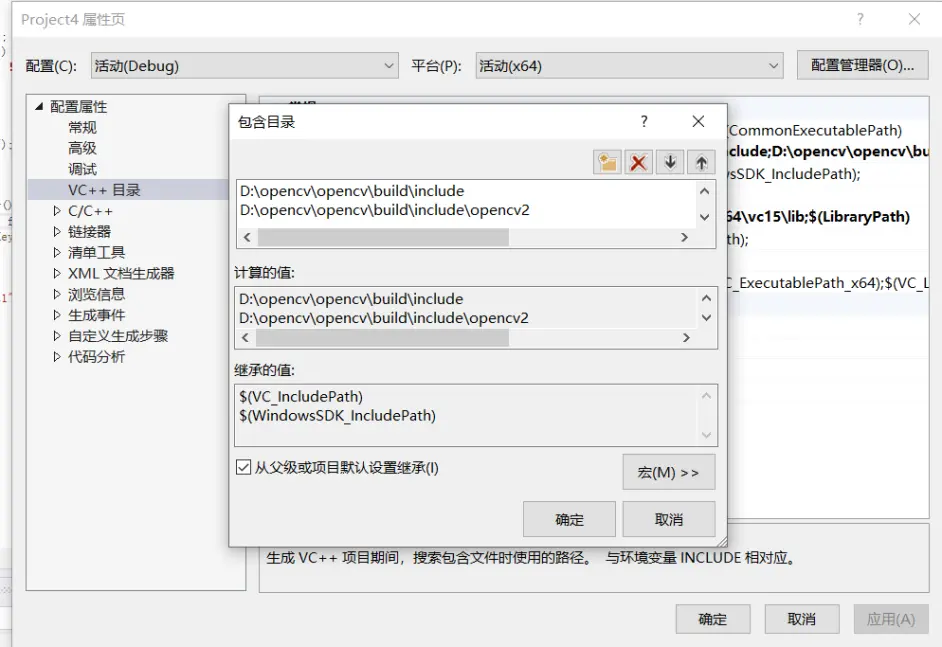
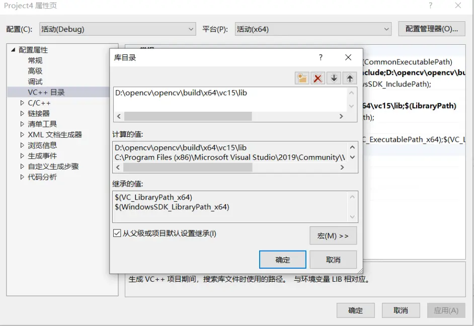

# c++中添加opencv

1. C++ 项目 -> 属性 -> vc++目录
2. 包含目录 -> 新增
   
3. 库目录 -> 新增
   
4. 链接器 -> 输入 -> 附加依赖项 -> 编辑
   

   有d的lib文件是Debug版本的文件库，填入即可

5. 添加 `C:\OpenCV\opencv\build\x64\vc15\bin` 到环境变量
6. 重启
7. vc项目选择x64
   
```cpp
/*
1. 将.dll文件复制到C:\Windows\System32 **这步我暂时没做，在robomaster风车能量靶识别中**
在CV15 -> bin 中找到所有.dll文件复制到C:\Windows\System32中即可
*/
```
