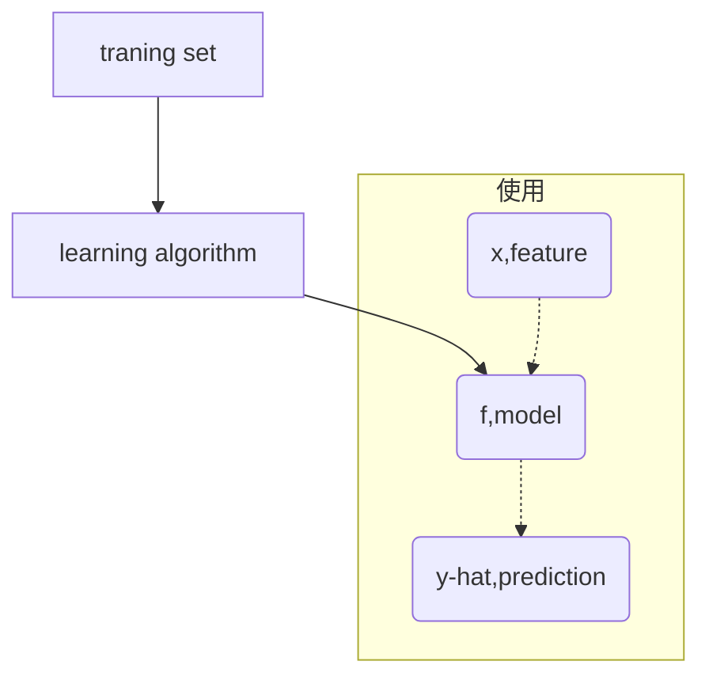

# 3.1-3.2 线性回归模型
## 1. 标记
$(x^{(i)},y^{(i)})$ = ith training example, (input, output) or (feature, target)
## 2. 流程

$f_{wb}(x)=wx+b$
1. linear regression
	1. univariate linear regression 只有一个自变量的线性回归

