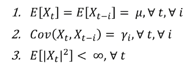
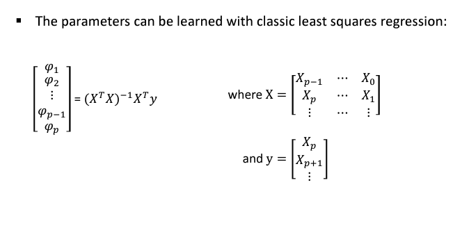
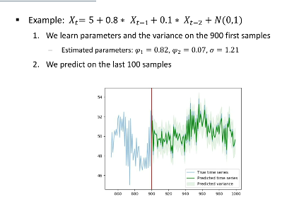
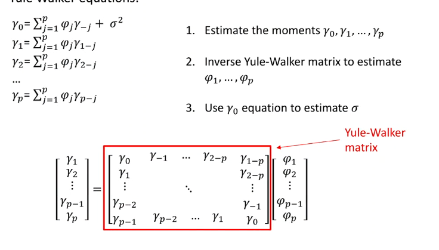

# Autoregressive Models

自回归模型

1. [Autoregressive Models](#autoregressive-models)
   1. [Motivation](#motivation)
   2. [Definition](#definition)
      1. [公式](#公式)
      2. [统计变量和阶数](#统计变量和阶数)
   3. [Data split](#data-split)
   4. [Stationary](#stationary)
   5. [Parameter Learning](#parameter-learning)
      1. [Maximum Likelihood Estimation (MLE)](#maximum-likelihood-estimation-mle)
      2. [平稳时Yule-Walker方程](#平稳时yule-walker方程)

## Motivation

**continous observation** occuring at **discrete time-steps**. e.g. Time-series forecasting.

## Definition

### 公式
Classic AR model:
$$X_t = c + \sum_{i=1}^{p} \phi_i X_{t-i} + \epsilon_t$$

1. $\epsilon_t$ - white noise。满足独立同分布（i.i.d independent and identically distribution）的高斯分布。
2. c - bias term(偏置项)。

* 直观理解：$X_t$ 由过去的 $p$ 个时间步长的值线性组合而成。$([X_{t-1}, X_{t-2}, ..., X_{t-p}])_t$是输入，$(X_t)_t$是输出。这里的括号外面的t表示整个序列中的每一个时间点t，表达是随时间t变化的一系列值，而不仅仅是某一个特定的时刻。

* 所以每个$X_t$的修改（modification）或外部干扰（shock）都会影响到后续。
  * Modification：通常指的是一个有意为之的变化，比如政策制定者介入经济以改变经济指标的方向。
  * Shock：多指一个外部的、非计划的、意料之外的事件或变化，它对时间序列产生影响。例如，一个经济体突然面临战争、重大政治事件、或突发的供应链危机等。
  * 这段话强调的是，在自回归模型中，时间序列中的值不是独立的，因为每个值可能会受到前面值的影响（**滞后效应**）。
* 由于$\epsilon_t$是高斯分布的，所以$X_t$是高斯分布的。这意味着我们可以通过最大似然估计（MLE）来估计模型参数。
  * $$P(X_t | X_{t-1}, \ldots, X_{t-p}) \sim \mathcal{N}\left(c + \sum_{i=1}^{p} \phi_i X_{t-i}, \sigma^2\right)$$
  * $\phi$和c都是shared through time的。 

Note:传统ML，是不在乎x的，x是后续人为输入，而这里x不需要生成或输入，它是自动预测下一步。

### 统计变量和阶数
- mean function of an AR model is $(\mu(t)=E[X_t])$. By default, it depends on t.
- The autocovariance $\gamma(t, i)=\text{Cov}(X_t, X_{t-i})$. By default, it depends on t and i.
- The autocovariance function can be normalized to give the **Pearson autocorrelation function(自相关函数)**: $\rho(t, i)=\frac{\text{Cov}(X_t, X_{t-i})}{\sqrt{\text{Var}(X_t)\text{Var}(X_{t-i})}}$. It lies in [-1, 1].
- The autocorrelation and autocovariance are indicators of the dependence of the variable $X_t$ with respect to the past variables $X_{t-i}$.

对以上的理解：
1. 均值函数：了解时间序列的均值函数对于建模非常重要，因为它提供了时间序列的长期趋势。在一个平稳的AR模型中，均值函数是常数；而在非平稳时间序列中，均值可能随时间变化，这需要在模型中加以考虑。
2. 自协方差函数：自协方差函数衡量的是时间序列中不同时点的值之间的相互依赖性。在AR模型中，我们假设当前的值可以通过过去若干期的值加权和来预测。这些权重（AR系数）是通过自协方差函数来估计的，因此自协方差是建立AR模型的基础。
3. 自相关函数：自相关函数是自协方差函数的标准化版本，它描述了序列值之间的线性关系的强度和方向。在AR模型中，自相关函数用于帮助确定模型的阶数，即需要多少个滞后期才能有效地预测未来的值。一个显著的自相关指示了过去的值对当前值有影响。
   1. 阶数就是有多少个前面的自变量。

## Data split

- Training set: 用来训练模型的数据集。
- Validation set: 用来调整模型超参数的数据集。
- Test set: 用来评估模型性能的数据集。

但是在AR模型中，这三个必须有时间顺序，因为我们是预测下一个时间点的值。

## Stationary

稳态性。在时间序列分析中，一个时间序列是稳态的：

1. 均值是常数。
2. 自协方差只依赖于时间间隔，而不是时间点。
   1. i.e. $\gamma(t, i)=\gamma(t+k, i+k)$

**如果一个时间序列是非平稳的，通常需要通过一些变换来使其平稳化，然后再对其建模。**

* 单位根检验：如ADF（Augmented Dickey-Fuller）检验，以确定时间序列是否是平稳的。
* 差分：这是使非平稳序列平稳的一种常见方法，尤其是对于存在趋势的序列。
* 季节调整：如果序列有季节性变化，可能需要对其进行季节性差分。
* 变换：如对数变换、平方根变换等，可以帮助稳定方差。
* 分解：将序列分解为趋势、季节性和随机成分，然后建模这些分解后的成分。

最终目标是使模型的残差序列成为一个平稳的白噪声序列，这表明模型已经捕捉到了时间序列中的所有信息。

## Parameter Learning

### Maximum Likelihood Estimation (MLE)

$\phi$参考[线性回归数学](../机器学习和数学/线性回归_梯度下降_矩阵求导.md)

example:

例子是先给一个用来生成下面图左边的函数，然后用ML生成估计的参数和原本的比较。

方差计算的公式是：
[方差计算公式](../机器学习和数学/模型方差.md)

当然，对于自回归模型，我们可以直接拿拟合的函数对前面的值产生预测值，并和前面部分的数据来做方差计算。

### 平稳时Yule-Walker方程

1. estimate the moments $\gamma_0, \gamma_1,\ldots, \gamma_p$
2. Inverse(逆) Yule-Walker matrix to estimate the AR coefficients $\phi_1, \phi_2, \ldots, \phi_p$
3. Use $\gamma_0$ and $\phi_1, \phi_2, \ldots, \phi_p$ to estimate the variance $\sigma^2$

理解：
1. 就是通过改变时间间隔i，来计算
2. [Yuler-Walker方程推导](https://blog.csdn.net/yuanzhoulvpi/article/details/120591284)
3. 平稳序列，自相关系数（ACF autocorrelation function）对于负值下标和正值下标是对称的，即$\rho(i) = \rho(-i)$。