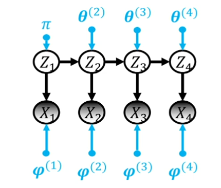
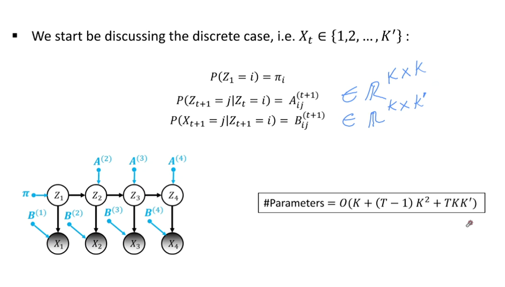
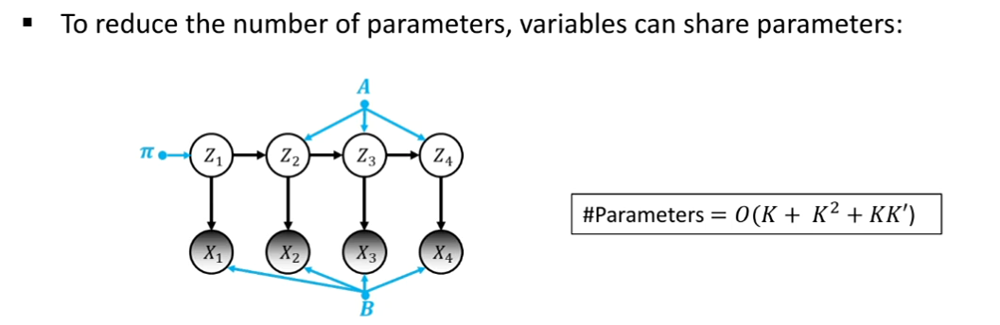
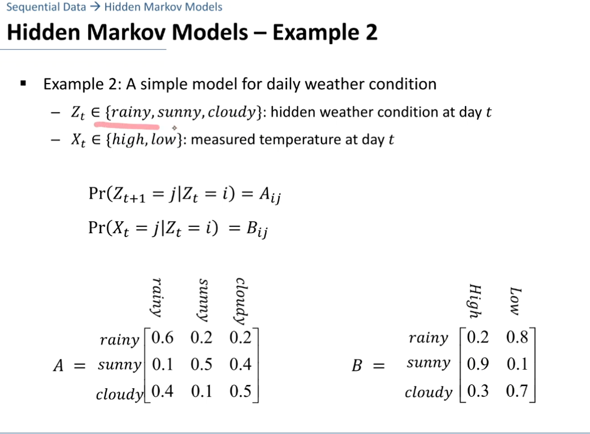
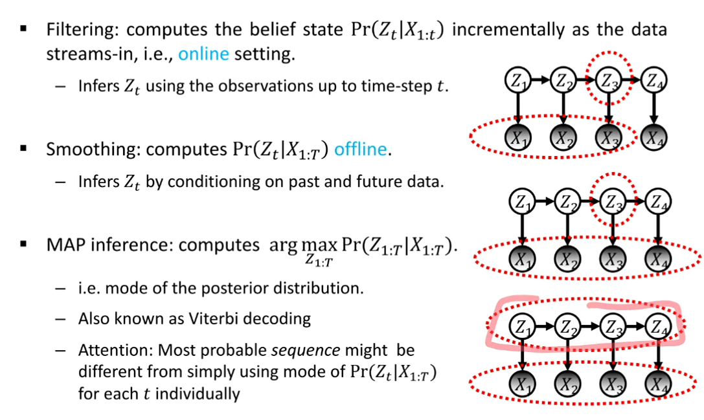

# Hidden Markov Models

- [Motivation](#motivation)
- [General case](#general-case)
- [discrete case](#discrete-case)
- [Parameter Tying (参数绑定)](#parameter-tying-参数绑定)
- [案例](#案例)
- [HMMs相关任务](#hmms相关任务)
  - [Inference (推断潜在变量)](#inference-推断潜在变量)
  - [Forward Algorithm - Filtering](#forward-algorithm---filtering)

## Motivation

Probabilistic latent variable models for sequences of observations X1, X2, ..., XT.

翻译：用于观测序列 X1, X2, ..., XT 的概率潜变量模型。意思就是能看到观测到的，但是变量是隐藏的。

假设推测的变量是 Z1, Z2, ..., ZT，这些变量是隐藏的，我们不能直接观测到。

1. 需要满足马尔可夫性质的是隐藏变量，即 Zt 的分布只依赖于 Zt-1。
2. X_t 的分布只依赖于 Z_t。
3. time 是离散的。
4. 隐藏变量是离散的。
5. 但是观测量可以是连续的也可以是离散的。

e.g.:
* Object-tracking
  * X_t: 物体在time-step t的位置
* Time-series forecasting
  * X_t: 时间t的温度
* NLP
  * X_t: t-th word in a sentence

其实就是比如，你能观测到一个人出门了还是没出门，但是你的目标是天气状况，你不能直接观测到天气，只能通过人的行为来推测天气。

## General case

联合分布：

$$P(Z_1=z_1, Z_2=z_2, ..., Z_T=z_T, X_1=x_1, X_2=x_2, ..., X_T=x_T) \\= P(Z_1=z_1; \pi) \prod_{t=1}^{T-1} P(Z_{t+1}=z_{t+1} | Z_t=z_t; \theta^{(t+1)}) \prod_{t=1}^{T} P(X_t=x_t | Z_t=z_t; \phi^{(t)})$$

## discrete case

注意：
A: transition matrix，形状是 (K, K)，K 是隐藏变量的个数。(转移概率矩阵)
B: emission matrix，形状是 $(K, K^\prime)$，$K^\prime$ 是观测变量的个数。（发射概率矩阵）

$$\#parameters=(K +(T-1)K^2 + TKK^\prime)$$

## Parameter Tying (参数绑定)

减少参数：

即将变量共享参数。

$\#parameters=(K + K^2 + KK^\prime)$$

然后就可以直接把参数绑定当作马尔科夫链来看待。联合分布函数：

$$P(Z_1=z_1, Z_2=z_2, ..., Z_T=z_T, X_1=x_1, X_2=x_2, ..., X_T=x_T) \\= P(Z_1=z_1; \pi) \prod_{t=1}^{T-1} P(Z_{t+1}=z_{t+1} | Z_t=z_t; A) \prod_{t=1}^{T} P(X_t=x_t | Z_t=z_t; B)\\=P(Z_1=z_1; \pi) \prod_{t=1}^{T-1} A_{z_t, z_{t+1}} \prod_{t=1}^{T} B_{z_t, x_t}$$

公式看起来一样，区别就在于共享参数。

## 案例

注意温度和天气的AB矩阵。

**关键是注意B是实际为什么时候观测发生的概率**

[贝叶斯定理](../../../其他学科知识积累/Maths/贝叶斯定理.md)

## HMMs相关任务

1. inference (推断潜在变量)
   1. 我们让模型参数固定（例如由专家调整）。
   2. 我们试图从后验分布$P(Z_{1:T}|X_{1:T})$中找到一些信息。
2. learning (学习参数)
   1. learn model parameters
   2. X 是观测到的数据，Z 是隐藏的变量。

### Inference (推断潜在变量)

1. Filtering
   1. 用前面的所有来计算
   2. Filtering（过滤或滤波）:
      1. Filtering是实时地估计当前时刻的隐状态，基于过去和当前的观测数据。在HMM中，这通常是通过使用前向算法（Forward Algorithm）实现的，该算法计算直到当前时刻为止的隐状态的概率分布。
      2. 例如，在语音识别中，随着语音流的进行，你想实时估计说话者最有可能说出的词或音素。
      3. Filtering的结果是在给定到当前时间点的所有观测后，隐状态的条件概率分布。
      4. online - 数据到达时，实时更新（stream-in）
2. Smoothing
   1. 用所有的来计算
   2. Smoothing是在序列结束后，使用全部观测数据来估计序列中某一时刻的隐状态。与Filtering相比，Smoothing有考虑到未来的观测数据。
      1. 在HMM中，这可以使用前向-后向算法（Forward-Backward Algorithm）来实现，其中后向部分从序列的末尾回溯以获取更完整的信息。
      2. 比如，在完成一个语音录音后，使用全部的录音数据来改进对说话内容的估计。
      3. Smoothing的结果是考虑了整个观测序列的情况下，隐状态的条件概率分布。
3. MAP inference (MAP:Maximum A Posteriori)
   1. 用所有X的来计算所有Z
   2. MAP Estimation（最大后验估计）:
      1. MAP是估计最有可能产生观测数据的整个隐状态序列。与单个状态的概率分布不同，MAP试图找到整个状态序列的单一估计，这个估计最大化了后验概率。
      2. 维特比算法（Viterbi Algorithm）是一种常用的方法来找到最有可能的状态序列，即最大化联合概率 𝑃(𝑍,𝑋)
      3. 在解码问题中，例如在给定一段加密文本的情况下，你可能想找到最有可能的原始文本序列。

### Forward Algorithm - Filtering

