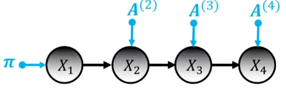
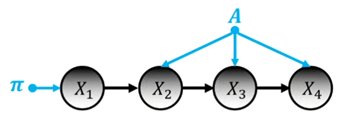
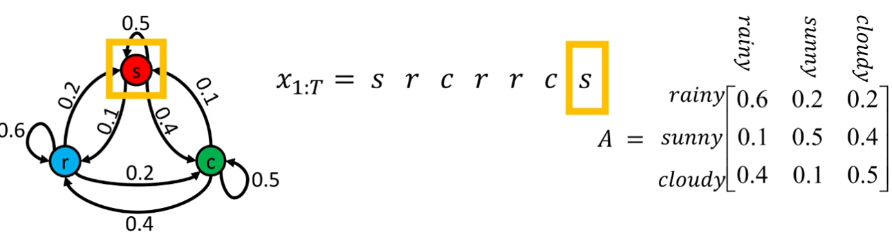
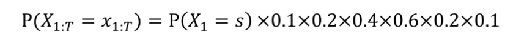
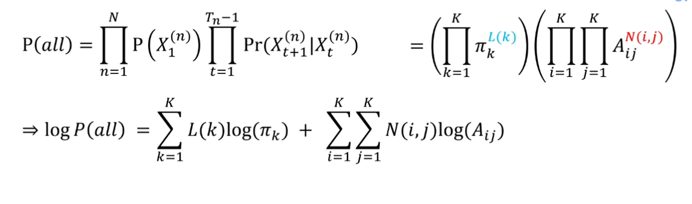
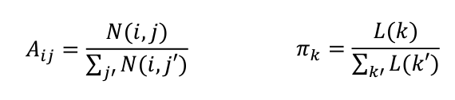
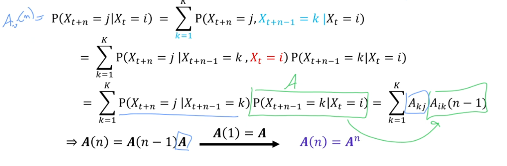
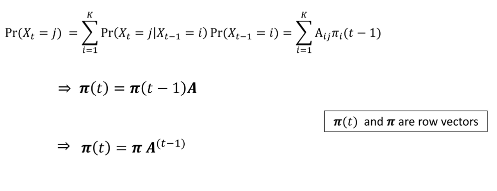

# Markov Chains

## Definition

Markov Chain 是一系列随机变量的序列，其中每个变量的取值**仅**依赖于前一个变量的取值。这种性质称为**马尔可夫性质**。即：

$$P(X_{t+1} | X_t, X_{t-1}, \cdots, X_1) = P(X_{t+1} | X_t)$$

**注意虽然是取值仅取决于前一个，但是算概率在非时间齐次情况下，是取决于所有的前一个状态的连乘。**

X_t 和 t 都是离散的。

Joint distribution(联合分布) of a Markov chain:

$$P(X_1=i_1, X_2=i_2, \cdots, X_n=i_n) = P(X_1=i_1) \prod_{t=1}^{T-1}P(X_{t+1}=i_{t+1} | X_t=i_t)$$

## General case

$$P(X_1=i) = \pi_i and P(X_{t+1}=j | X_t=i) = A_{ij}^{(t+1)}$$

* 其中 $\pi\in R^K$ 是初始状态时的 prior probability (先验概率)
* $A^{(t)} \in R^{K \times K}$ 是状态转移矩阵。

联合分布：

$$P(X_1=i_1, X_2=i_2, \cdots, X_n=i_n) = \pi_{i_1} \prod_{t=2}^{T} A_{i_{t-1},i_t}^{(t)}\\= \pi_{i_1} A_{i_1,i_2}^{(2)} A_{i_2,i_3}^{(3)} \cdots A_{i_{T-1},i_T}^{(T)}$$

参数量:
1. $\pi$ 有 K 个参数，但是和为 1，所以只有 K-1 个自由参数。
2. $A$ 有 $K^2$ 个参数，但是每一行和为 1，所以只有 $K(K-1)$ 个自由参数。
3. 共有T-1个转移矩阵，所以有 $K(K-1)(T-1)$ 个参数。

note: $A_{ij}^{(t)}$ 表示在 t 时刻从状态 i 转移到状态 j 的概率。

$$\#parameters=K-1+K(K-1)(T-1)$$

## Stationary case

time-homogeneous(时间齐次) or stationary Markov chain:

$$P(X_{t+1}=j | X_t=i) = P(X_{t+1}=j | X_t=i) = A_{ij}$$

note: $A_{ij}$ 表示在任意时刻从状态 i 转移到状态 j 的概率不受t的影响，所有的随机变量X_t 都服从相同的conditional distribution(条件分布)。

联合分布：
$$P(X_1=i_1, X_2=i_2, \cdots, X_T=i_T) = \pi_{i_1} A_{i_1,i_2} A_{i_2,i_3} \cdots A_{i_{T-1},i_T}$$

参数量:
$$\#parameters=(K-1)+K(K-1)$$

## 案例
stationary case

矩阵表示行到列的概率转移。

联合概率：

## Learning of Model Parameters

前言：
* N个独立的观测序列
* n表示第n个观测序列
* T表示第n个观测序列的长度
* set: ${X^{(n)}_{1:T_n}}$
* 要学习的参数：$\pi$ 和 $A$
* 使用maximum likelihood estimation(最大似然估计)来估计参数。
* $L(k)=\#(X1=k)$ 表示第一个状态为 k 的次数。
* $N(i,j)=\#(X_t=i, X_{t+1}=j)$ 表示从状态 i 转移到状态 j 的次数。
* 比如：
  * ABBA
  * ABC
  * BA
  * CCCBA
  * L(A)=2
  * N(A,B)=2
  * $\pi_A=\frac{2}{4}$
  * $\pi_B=\frac{1}{4}$
  * $\pi_C=\frac{1}{4}$
  * $A_{AA}=\frac{0}{3}$
  * $A_{AB}=\frac{2}{3}$
  * $A_{AC}=\frac{1}{3}$

使得log P(all) subject to(受限于) $\sum_{k=1}^{K} \pi_k=1$ 和 $\sum_{j=1}^{K} A_{ij}=1$

很好理解，其实就是拿个数除以总个数就是概率。看上面"比如"的例子。

## More insight

### 计算从状态 i 转移到状态 j 花费n步的概率

* $A_{ij}^{(n)}$ 意味着从状态 i 转移到状态 j 花费n步的概率

先前知识：
P(X,Y)=P(X|Y)P(Y)

* Champon-Kolmogorov equation(香农-科尔莫哥洛夫方程)
  * $A^{(m+n)_ij}=\sum_{k=1}^{K} A^{(m)}_{ik}A^{(n)}_{kj}$
  * $A^{(m+n)}=A^{(m)}A^{(n)}$
  * 这个方程是递归的，可以用来计算从状态 i 转移到状态 j 花费n步的概率。

### 计算在时刻t到达状态 j 的概率

* $\pi^{(t)}_j$ 意味着在时刻t到达状态 j 的概率

