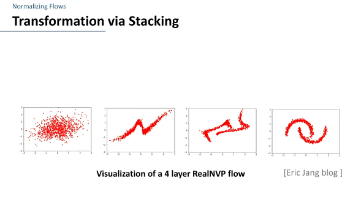
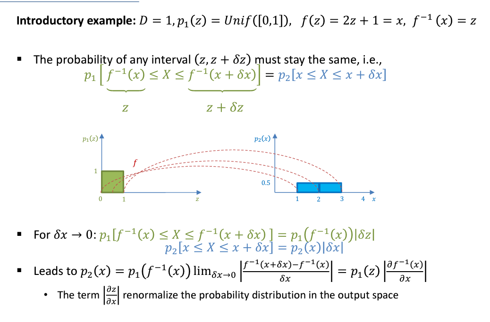
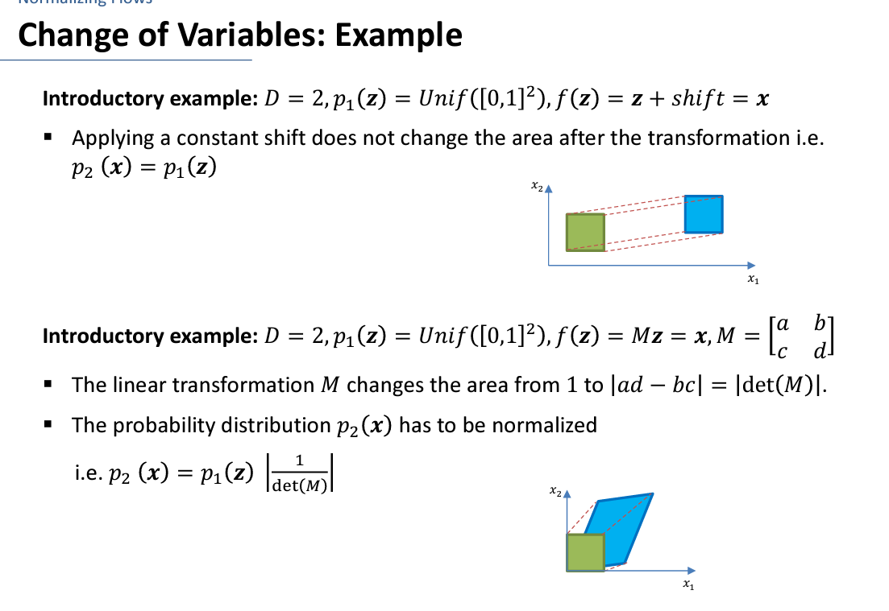
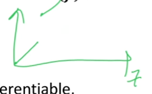
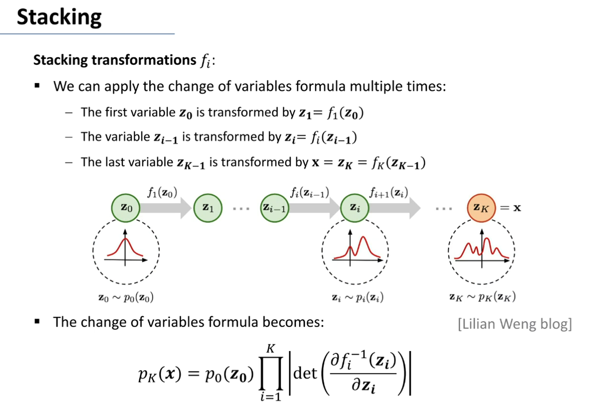
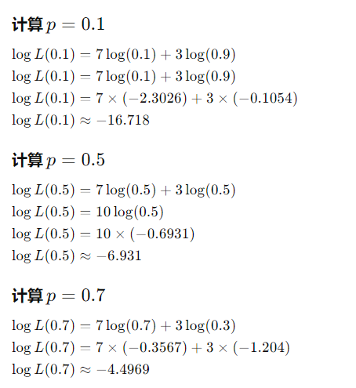
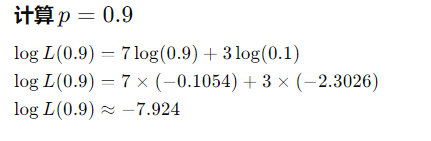
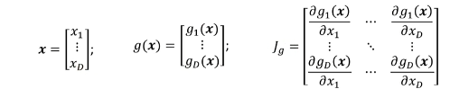
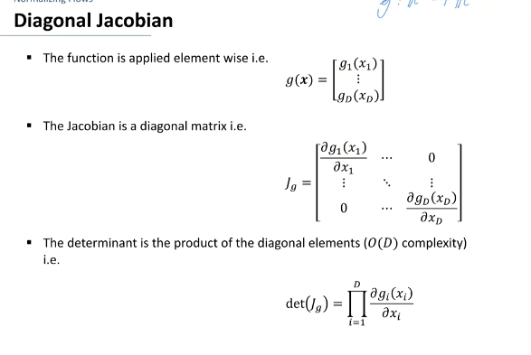
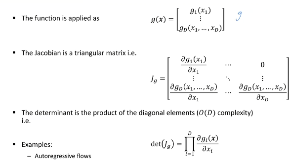

# Normalizing Flows

1. [Normalizing Flows](#normalizing-flows)
   1. [理解](#理解)
   2. [Change of Variables Formula (变量变换公式)](#change-of-variables-formula-变量变换公式)
      1. [条件](#条件)
      2. [Stacking (叠加)](#stacking-叠加)
      3. [Log-Likelihood (对数似然)](#log-likelihood-对数似然)
   3. [Forward and Reverse Parameterizations (正向和反向参数化)](#forward-and-reverse-parameterizations-正向和反向参数化)
      1. [介绍](#介绍)
      2. [Reverse Parametrization (反向参数化)](#reverse-parametrization-反向参数化)
         1. [stacking](#stacking)
      3. [Normalizing Flows in Machine Learning](#normalizing-flows-in-machine-learning)
         1. [举个例子](#举个例子)
      4. [Forward Parametrization (正向参数化)](#forward-parametrization-正向参数化)
         1. [stacking](#stacking-1)
         2. [variational inference (变分推断)](#variational-inference-变分推断)
   4. [Jacobian Determinant Computation (雅可比行列式计算)](#jacobian-determinant-computation-雅可比行列式计算)
      1. [行列式属性](#行列式属性)
      2. [Diagonal Jacobian (对角雅可比)](#diagonal-jacobian-对角雅可比)
      3. [Triangular Jacobian (三角雅可比)](#triangular-jacobian-三角雅可比)
      4. [Full Jacobian (完整雅可比)](#full-jacobian-完整雅可比)
   5. [补充：continuous-time flows](#补充continuous-time-flows)

## 理解
Normalizing Flows（NF）的核心思想是利用可逆变换（flows）将一个复杂的分布变形（变换）为一个简单的分布，通常是高斯分布。

flows的由来是把一个值flow从开始到另一个位置

normalizing是指把一个分布normalize输出空间的概率分布。（归一化）

举一个例子:

## Change of Variables Formula (变量变换公式)

补充:
$$det(M^{-1})=det(M)^{-1}$$

1. 对于一维,z属于均值分布[0,1]
   1. 
   2. $$p_2(x)=p_1(z)|f^{-1(1)}(x)|=p_1(z)|f^{(1)}(z)|^{-1}$$
2. 对于2维,向量z属于均值分布$[0,1]^2$
   1. shift
      1. f(z) = z + shift = x
      2. $p_2(x)=p_1(z)
   2. 变形
      1. f(z) = Mz = x, $M=\begin{bmatrix}a & b\\c & d\end{bmatrix}$
         1. 因为对于可逆矩阵有$det(M^{-1})=\frac{1}{det(M)}$
      2. $p_2(x)=p_1(z)|\frac{1}{det(M)}|$ 归一化面积是的概率分布的面积为1
      3. 
3. 对于N维
   1. $p_2(x)=p_1(f^{-1}(x))|det(\frac{\partial f^{-1}(x)}{\partial x})|$
   2. 理解：其实就是在每个微点上看成一个linear transformation，然后计算这个linear transformation的雅可比行列式，然后乘以原来的概率密度，得到新的概率密度。之所以是雅可比行列式，是因为雅可比行列式是一个线性变换的distortion rate(畸变率)， 也就是说，如果雅可比行列式大于1，那么这个变换会把原来的空间拉伸，如果小于1，那么这个变换会把原来的空间压缩。也可以说是面积缩放因子，因为雅可比行列式是一个线性变换的面积缩放因子。
   3. $\frac{\partial g(x)}{\partial x}$ 成为Jacobian of g，对于D x D的矩阵:$\frac{\partial f^{-1}(x)}{\partial x}=(\frac{\partial f(z)}{\partial z})^{-1}$
   4. The transformation f should be valid (invertible and differentiable).

### 条件
1. invertible:
   1. 输入和输出必须是一样的dimension
   2. 如果是一维数据，那么f必须是单调的（因为如果不是单调的，那么返回来的数字就不唯一了）
   3. 如果变换是linear的，那么invertible就是det(M) != 0，即M是一个full rank的矩阵或者说可逆矩阵。
2. differentiable:
   1. $f$和$f^{-1}$都是连续可导的，即Jacobian $\frac{\partial f^{-1}(x)}{\partial x}$ 存在于任何点x
   2. 可导是充分条件;理论上来说，f不需要处处可导，比如它是分段函数的时候，范围中间点可以是断开的不可导。
      1. 

### Stacking (叠加)

叠加的公式很简单就是连续乘起来就行了，就跟矩阵乘法一样。
$$p_k(x)=p_0(z_0)\prod_{i=1}^{k}|det(\frac{\partial f_i^{-1}(z_i)}{\partial z_i})|=p_0(z)\prod_{i=0}^{k-1}|det((\frac{\partial f_{i}(z_{i})}{\partial z_{i}})^{-1})|$$

### Log-Likelihood (对数似然)

1. 对数似然是一个概率分布的似然函数的对数
2. 使用对数似然是因为概率密度函数的值通常很小，而对数似然可以将这些小的概率密度函数值转换为更大的值，方便计算。

$$log(p_2(x))=log(p_1(z))+log(|det((\frac{\partial f(z)}{\partial z})^{-1})|$$
 
$$log(p_k(x))=log(p_0(z))+\sum_{i=0}^{k-1}log(|det((\frac{\partial f_{i}(z_{i})}{\partial z_{i}})^{-1})|$$

## Forward and Reverse Parameterizations (正向和反向参数化)

### 介绍
有已经存在的一些NF:
1. Planar/Radial flows
2. RealNVP
3. Autoregressive flows
   1. IAF
   2. MAF
4. Spline

### Reverse Parametrization (反向参数化)

inverse存在但是不一定容易计算。

$$p_2(x)=p_1(g_\phi(x))|det(\frac{\partial g_\phi(x)}{\partial x})|$$

#### stacking

$$g_\phi=g_{\phi_0}\circ g_{\phi_1}\circ...\circ g_{\phi_k}$$

### Normalizing Flows in Machine Learning

1. 为什么我们在一计算概率密度 $P_K(x^{(j)})$
   1. 我们目标是学习 $g_\phi$,即变换没有给要学习获得

2. 如何学习
   1. 给定数据集 $D=\{x^{(j)}\}_{j=1}^N$(通常iid samples)，找到参数$\phi$使得最好地匹配数据集的概率密度
   2. 比如最大化对数似然
      1. $$max log\space P_\phi(D)=max\space \frac{1}{N}\sum_{j=1}^N log\space P_\phi(x^{(j)})$$

#### 举个例子
质地不均匀硬币正反面，是伯努利分布

D={正,正,正,正,正,正,正,反,反,反}

logp(D∣p)=∑x∈D log p(x∣p)

其中，如果 𝑥 是“正”，log 𝑝(𝑥∣𝑝) 就是 log(𝑝)，如果 𝑥 是“反”，log 𝑝(𝑥∣𝑝) 就是 log (1−𝑝)

计算p=0.1,0.5,0.7,0.9的对数似然

p=0.7时，对数似然最大，说明更好的匹配数据集

### Forward Parametrization (正向参数化)

和反向同理

$$p_2(x)=p_1(z)|det(\frac{\partial f_\theta(z)}{\partial z})|^{-1}$$

#### stacking

$$f_\theta=f_{\theta_K}\circ f_{\theta_{K-1}}\circ...\circ f_{\theta_0}$$

#### variational inference (变分推断)

[变分推断](./Variational_Inference.md)

向前参数化的一个应用是变分推断，变分推断是一种用于近似推断的技术，其中我们试图找到一个简单的分布来近似一个复杂的分布。

## Jacobian Determinant Computation (雅可比行列式计算)

### 行列式属性

1. determinant of inverse: $det(A^{-1})=det(A)^{-1}$
2. determinant and eigenvalues (特征值): 
   1. $det(A)=\prod_{i=1}^n\lambda_i$
   2. $eigenvalues(A)=\{\lambda_1,...,\lambda_n\}$
   3. [特征值和特征向量](../../../其他学科知识积累/Maths/特征值和特征向量.md)
3. determinant and block matrices: 
   1. $det\begin{bmatrix}A & 0\\C & D\end{bmatrix}=det(A)det(D)$
   2. $det\begin{bmatrix}A & B\\0 & D\end{bmatrix}=det(A)det(D)$
   3. etc. [分块矩阵的行列式知乎](https://zhuanlan.zhihu.com/p/26285415)

### Diagonal Jacobian (对角雅可比)

### Triangular Jacobian (三角雅可比)

### Full Jacobian (完整雅可比)

可以用LU分解来计算 复杂的是O(D^3)的复杂度.D是维度.

LU分解是将一个矩阵分解为一个下三角矩阵(L)和一个上三角矩阵(U)的乘积。

完整雅可比的替代：continuous-time flows (连续时间flows)

## 补充：continuous-time flows

代替雅可比做NF的一种方法。

在连续时间flows中，系统的状态 x(t) 随时间 t 的变化由一个微分方程控制，通常形式为：

$$\frac{dx(t)}{dt}=f(x(t),t)$$

其中，𝑓 是一个函数，描述了每个时刻系统状态如何随着时间演变。