# Variational Inference

1. [Variational Inference](#variational-inference)
   1. [Latent Variable Models - LVMs (潜变量模型)](#latent-variable-models---lvms-潜变量模型)
      1. [介绍](#介绍)
      2. [公式](#公式)
      3. [Tasks in LVMs](#tasks-in-lvms)
         1. [Maximum Likelihood Estimation (MLE) in LVMs](#maximum-likelihood-estimation-mle-in-lvms)
         2. [Maximization using Lower Bound](#maximization-using-lower-bound)
            1. [Multiple Lower Bounds](#multiple-lower-bounds)
            2. [小结](#小结)
            3. [Lower Bound for the Marginal Log-Likelihood](#lower-bound-for-the-marginal-log-likelihood)
               1. [Kullback-Leibler Divergence (KL 发散)](#kullback-leibler-divergence-kl-发散)
         3. [ELBO (Evidence Lower Bound)](#elbo-evidence-lower-bound)
         4. [Intuitive Meaning of ELBO (ELBO的直观意义)](#intuitive-meaning-of-elbo-elbo的直观意义)
      4. [EM Algorithm and Variational Inference (EM算法和变分推断)](#em-algorithm-and-variational-inference-em算法和变分推断)
         1. [2 steps:](#2-steps)

## Latent Variable Models - LVMs (潜变量模型)

### 介绍
1. model a probability distribution $p_\theta(x)$
2. x 是高维的，但是用几个潜变量 z 来描述
3. 比如图片：
   1. object in the scene, their location & colors
   2. Lighting
   3. Viewing angle
   4. ...
4. 利用潜变量来构建概率模型

### 公式

1. two steps:
   1. $$z~p_\theta(z)$$
   2. $$x~p_\theta(x|z)$$
      1. 在HMM里也叫Emisson probability或者output probability (发射概率)
2. joint distribution:
   1. $$p_\theta(x,z) = p_\theta(x|z)p_\theta(z)$$
3. Marginal likelihood (边缘似然):
   1. $$p_\theta(x) = \int p_\theta(x,z)dz = \int p_\theta(z)p_\theta(x|z)dz=E_{z\sim p_\theta(z)}[p_\theta(x|z)]$$
   2. 上面的E表示期望，其实就是对所有z下发生某个x的概率求和

- conditional distribution p(x|z) is 'simple'
- the marginal distribution p(x) is 'complex'
- 即用用潜变量z表示复杂的x

### Tasks in LVMs

1. Inference (推断)：给一些观测值x，求潜变量z的后验分布
   1. 可以理解为“提出”潜在特征：
   2. $$p_\theta(z|x) = \frac{p_\theta(x|z)p_\theta(z)}{p_\theta(x)}$$
2. Learning (学习)：给定一些观测值x，求能最好表示数据的参数θ
   1. $X=\{x_i\}^N_{i=1}$ usually iid，下面公式就是假设iid的情况
   2. $$max\space logP_\theta(X) = \max\frac{1}{N}\sum_{i=1}^N logP_\theta(x_i)$$

#### Maximum Likelihood Estimation (MLE) in LVMs

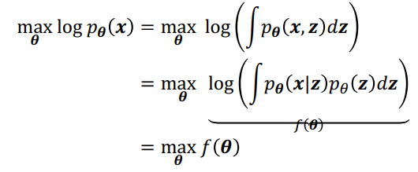

MLE和梯度都不好算，和NF对比，NF好算：

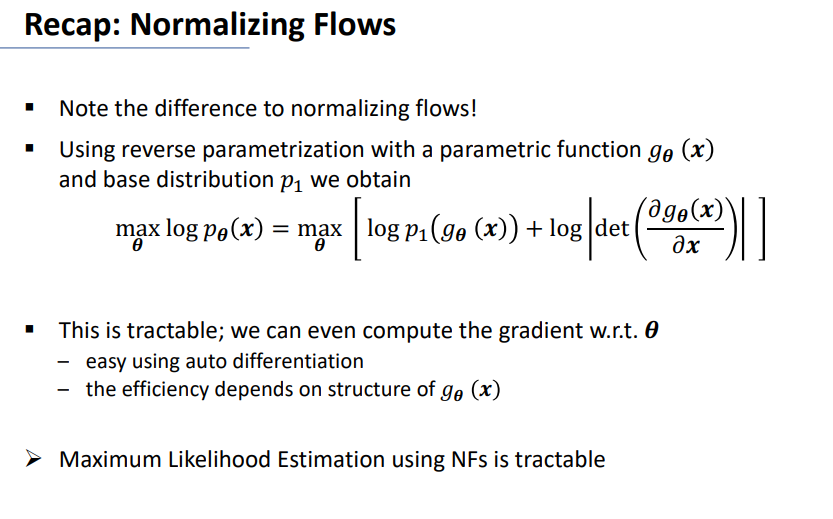

#### Maximization using Lower Bound

1. 我们是想解决$max\space f(\theta)$的
   1. both f and $\nabla f$ are intractable(棘手的)（比如上面的MLE）
2. 找到一个“nice”的$g(\theta)$，它是$f(\theta)$的下界
   1. $f(\theta) \geq g(\theta)$
3. $max\space f(\theta) \geq max\space g(\theta)$

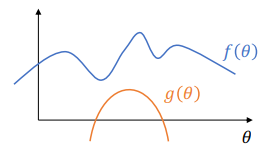

##### Multiple Lower Bounds

使用多个g组成的集合$\mathcal{G}$，找到一个最好的g：

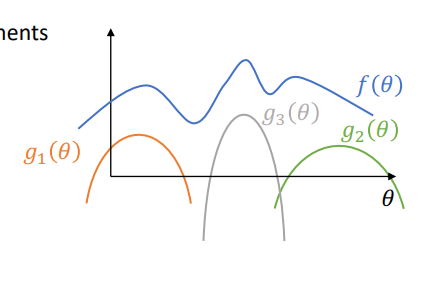

找到$\mathcal{G}$中最好的g，就是找到一个最好的下界。

##### 小结

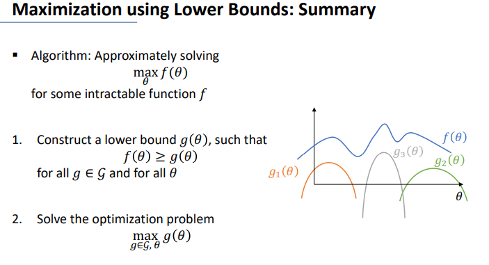

##### Lower Bound for the Marginal Log-Likelihood

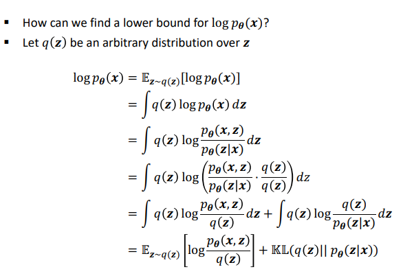

结合下面KL发散的属性，可以知道上面最后一行的右式第一项必然是lower bound，因为KL发散是非负的。并且该项是好求的。

###### Kullback-Leibler Divergence (KL 发散)

1. 定义：从q(z)到p(z)的KL发散：
   1. $$KL(q(z)||p(z)) = \int q(z)log\frac{q(z)}{p(z)}dz$$
   2. 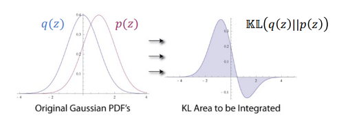
2. 属性
   1. 非对称性：$KL(q(z)||p(z)) \neq KL(p(z)||q(z))$ （in general）
   2. 非负性：$KL(q(z)||p(z)) \geq 0$
      1. 上面图2有负数只是积分项是负数，积分后仍然是非负的
   3. KL=0时，q=p 几乎处处相等

#### ELBO (Evidence Lower Bound)

Evidence是指在贝叶斯推断中，给定观测数据的情况下，对模型参数的后验分布的边缘似然的估计。即在给定参数后模型生成观测数据 𝑥 的概率。

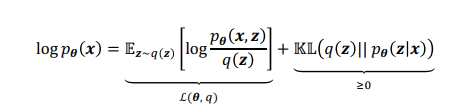

注意横轴是$\theta$，这是关于$\theta$的函数。

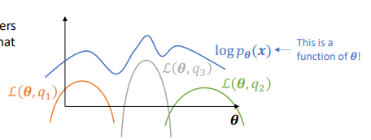

ELBO:
1. $$\mathcal{L}(q) = E_{z\sim q(z)}[\frac{p_\theta(x,z)}{q(z)}] $$
2. 这个表达式本质上是在尝试通过选择适当的 q(z) （z的一个近似后验分布）和参数 𝜃 来最大化，从而最大限度地逼近 log 𝑝(𝑥) 的真实值。

所以最好的q(z)，其实是KL发散为0的q(z)，即q(z)=p(z|x)。而且p(z|x)是可以求的。

$$p_\theta(x|z) = \frac{p_\theta(x|z)p_\theta(z)}{p_\theta(z|x)}$$

[Tasks in LVMs](#tasks-in-lvms)中的Inference就是求p(z|x)。当然常常并不好求，所以有下面的变分推断算法，对于这一模型有一个特有名字，即EM算法。

#### Intuitive Meaning of ELBO (ELBO的直观意义)
当q(z)和p(z|x)越接近，KL散度越小，因此ELBO越大。

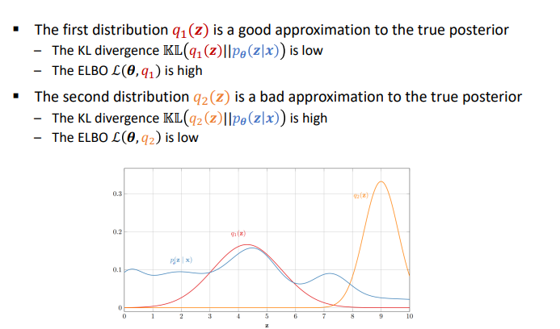

### EM Algorithm and Variational Inference (EM算法和变分推断)

[[5分钟学算法] #06 EM算法 你到底是哪个班级的](https://www.bilibili.com/video/BV1RT411G7jJ)

p(z|x)当然常常并不好求，所以有变分推断算法，对于当前这一模型有一个特有名字，即EM算法。

EM - Expectation-Maximization

#### 2 steps:
ELBO变形：
$$\mathcal{L}(\theta,q) = E_{z\sim q(z)}[logp_\theta(x,z) - logq(z)]\\=-KL(q(z)||p(z|x)) + logp_\theta(x,z)$$

1. E-step: 评估潜在变量的期望
   1. $$Set\space q(z) = p(z|x)= argmin_q\space KL(q(z)||p(z|x)) = argmax_q \space\mathcal{L}(\theta,q)$$
2. M-step: 最大化边界似然的下界
   1. 理论$Set\space \theta^{new} = argmax_\theta \mathcal{L}(\theta,q)$
   2. 上式子有一个小问题，就是$\mathcal{L}(q)$分子的下半部分$q(z)$在E-step中已经固定了，所以：
   3. 实际
      1. $$Set\space \theta^{new} = argmax_\theta E_{z\sim q(z)}[logp_\theta(x,z)]$$

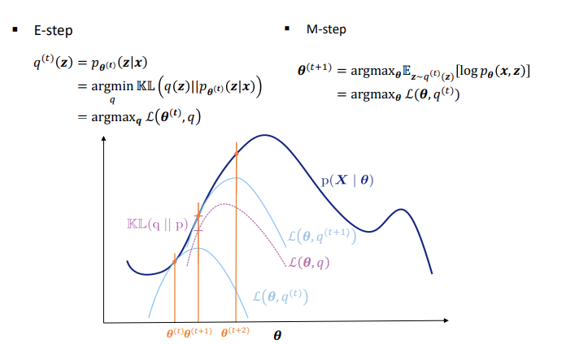

反复循环就会让他逐渐收敛。
