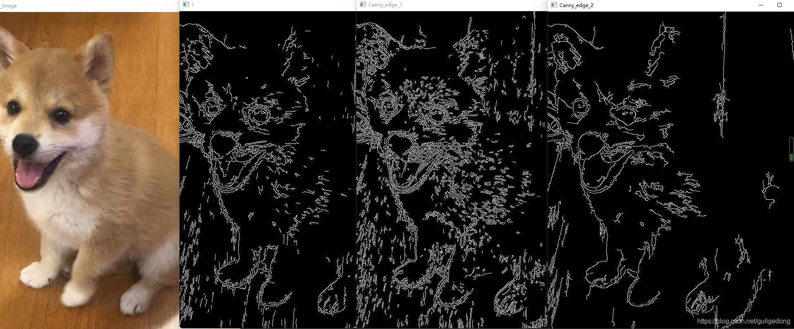

# Canny边缘算子

## 原理
[图像边缘Canny算子提取_AnimateX的博客-CSDN博客_canny算子阈值怎么取](https://blog.csdn.net/animatex/article/details/79983020)

## Canny函数
```python
import cv2
 
path = r'./miemie4.jpg'
ori_image = cv2.imread(path)
cv2.imshow('ori_image',ori_image)
 
canny = cv2.Canny(ori_image,50,100)
cv2.imshow('Canny_edge_0',canny)
 
blurred = cv2.GaussianBlur(ori_image, (3,3), 0)
gray = cv2.cvtColor(blurred, cv2.COLOR_BGR2GRAY)
# 求X方向上的梯度
grad_x = cv2.Sobel(gray, cv2.CV_16SC1, 1, 0)
# 求y方向上的梯度
grad_y = cv2.Sobel(gray, cv2.CV_16SC1, 0, 1)
# 将梯度值转化到8位上来
x_grad = cv2.convertScaleAbs(grad_x)
y_grad = cv2.convertScaleAbs(grad_y)
# 将两个梯度组合起来
src1 = cv2.addWeighted(x_grad, 0.5, y_grad, 0.5, 0)
# 组合梯度用canny算法，其中50和100为阈值
edge = cv2.Canny(src1, 50, 100)
cv2.imshow("Canny_edge_1", edge)
edge1 = cv2.Canny(grad_x, grad_y, 10, 100)
cv2.imshow("Canny_edge_2", edge1)
```
