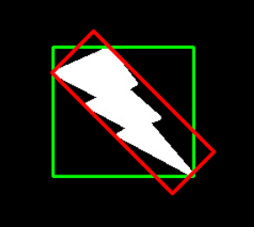
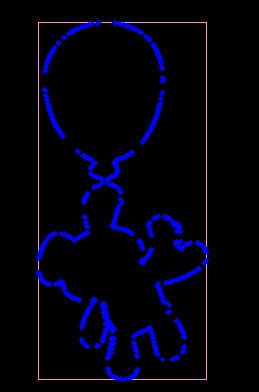
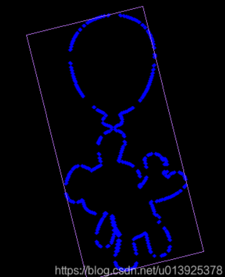

# minAreaRect和boundingRect的区别

[minAreaRect](minAreaRect_最小外接矩形.md)和[boundingRect](boundingRect_外接矩形.md)都是用于计算轮廓的外接矩形，但是它们之间有一些区别。

boundingRect的结果是一个轴对齐的矩形，而minAreaRect的结果是一个旋转的矩形。

轴对齐就是说矩形的边和图片坐标轴平行，旋转的矩形则不一定。

图片两张高度一样style

    
    

