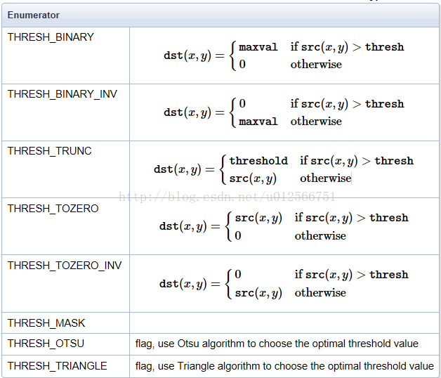
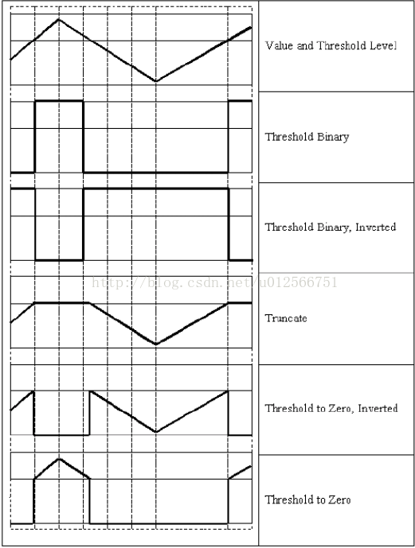
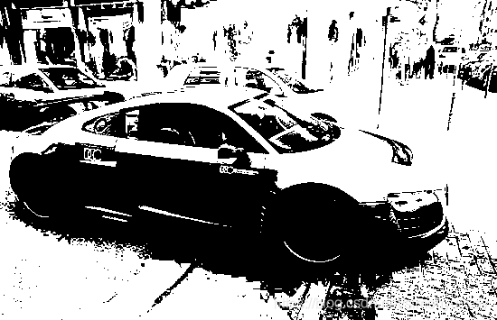
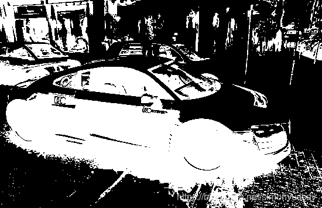
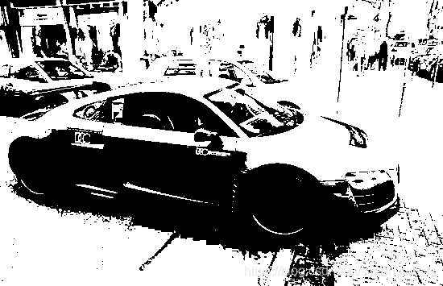

# threshold_二值化

[【opencv】阈值处理函数threshold()详解\_ingy的博客-CSDN博客\_opencv threshold](https://blog.csdn.net/simonyucsdy/article/details/106525717)

```cpp
double cv::threshold(InputArray src, OutputArray dst, double thres, double maxval, int type)
```

* src：源图像，可以为8位的灰度图，也可以为32位的彩色图像；

* dst：输出图像；

* thresh：阈值；

* maxval：二值图像中灰度最大值；

* type：阈值操作类型，具体的阈值操作实现如下图所示：
  



## 测试

```cpp
	//全局二值化
	int th = 100;
	cv::Mat threshold1, threshold2, threshold3, threshold4, threshold5, threshold6, threshold7, threshold8;
	cv::threshold(gray, threshold1, th, 255, cv::THRESH_BINARY);
	cv::threshold(gray, threshold2, th, 255, cv::THRESH_BINARY_INV);
	cv::threshold(gray, threshold3, th, 255, cv::THRESH_TRUNC);
	cv::threshold(gray, threshold4, th, 255, cv::THRESH_TOZERO);
	cv::threshold(gray, threshold5, th, 255, cv::THRESH_TOZERO_INV);
	cv::threshold(gray, threshold7, th, 255, cv::THRESH_OTSU);
	cv::threshold(gray, threshold8, th, 255, cv::THRESH_TRIANGLE);
	cv::imshow("gray", gray);
	cv::imshow("THRESH_BINARY", threshold1);
	cv::imshow("THRESH_BINARY_INV", threshold2);
	cv::imshow("THRESH_TRUNC", threshold3);
	cv::imshow("THRESH_TOZERO", threshold4);
	cv::imshow("THRESH_TOZERO_INV", threshold5);
	cv::imshow("THRESH_OTSU", threshold7);
	cv::imshow("THRESH_TRIANGLE", threshold8);
```

|类型|图片|
|-|-|
|原灰度图||
|THRESH_BINARY||
|THRESH_BINARY_INV||
|THRESH_TRUNC||
|THRESH_TOZERO||
|THRESH_TOZERO_INV||
|THRESH_OTSU||
|THRESH_TRIANGLE||

注意：
如果采用彩色图像进行计算会得到彩色效果，而不是预期的二值化结
