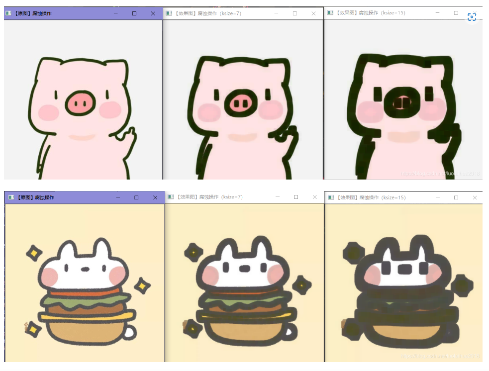

# 形态学运算_腐蚀(erode)和膨胀(dilate)

形态学操作就是基于形状的一系列图像处理操作。OpenCV为进行图像的形态学变换提供了快捷、方便的函数。最基本的形态学操作有二种，他们是：膨胀与腐蚀(Dilation与Erosion)。

膨胀与腐蚀能实现多种多样的功能，主要如下：

消除噪声
分割(isolate)出独立的图像元素，在图像中连接(join)相邻的元素。
寻找图像中的明显的极大值区域或极小值区域
求出图像的梯度
腐蚀和膨胀是针对白色部分（高亮部分）而言的。

膨胀就是对图像高亮部分进行“领域扩张”，效果图拥有比原图更大的高亮区域；
腐蚀是原图中的高亮区域被蚕食，效果图拥有比原图更小的高亮区域。
————————————————
版权声明：本文为CSDN博主「SOC罗三炮」的原创文章，遵循CC 4.0 BY-SA版权协议，转载请附上原文出处链接及本声明。
原文链接：https://blog.csdn.net/luolaihua2018/article/details/111712087

## 膨胀


## 腐蚀


## 高级运算
[形态学运算_morphologyEx](形态学运算_morphologyEx.md)

```cpp
//膨胀
int structElementSize=2;
Mat element=getStructuringElement(MORPH_RECT,Size(2*structElementSize+1,2*structElementSize+1),Point(structElementSize,structElementSize));
dilate(midImage2,midImage2,element);
```